## 第三章 图形和图像数据表示

* 数据类型和图像格式
  * 数据类型：1bit图像，8bit灰度图，24bit彩色图等
  * 图像格式：`jpeg, gif, bmp`
* 1bit 图像（二值图像binary ， 单色monochrome图像）
  * 1 bit 表示1个像素 （0黑1白）
  * 用于表示简单的图形和文字
  * 计算分辨率resolution的字节数
* 8bit 灰度图像
  * 8bit 表示0~255的灰度值（0黑 255白）
  * 像素值的二维数组，位图
  * 8位图像可视作1位位平面的集合
  * 计算分辨率字节数，不用再除以8
* 打印机是二元输出设备，只能打印黑白点。
  * 将亮度分辨率intensity resolution转换成空间分辨率spatial resolution
  * 将灰度图像转化成较大的二值图像（100*100 -> 200\*200），多个二值像素表示一个灰度像素
  * DPI( Dot per inch)，每英寸可以打的点的数量
  * 抖动 Dithering，抖动矩阵（N*N 的抖动矩阵可以表示N\*N+1个灰度等级）

* 一种抖动方法

  * 例如N=2，将图像像素重新进行映射0~255  到0~4（256/5）  
  * 抖动矩阵元素是0~3的特殊排布
  * 如果像素亮度比抖动矩阵的某个元素的编号大，则在该元素点填涂，即用一个N*N的点矩阵替代每个像素。

  * 这种方法增大了输出图像的大小，降低了图像的局部分辨率。、

* 有序抖动

  * 存储一个固定的抖动矩阵（不一定按照规格严格编号，也可以0~255编号？）
  * 对于每个原图像素，和抖动矩阵元素对比，而后在打印机对应位置输出
  * 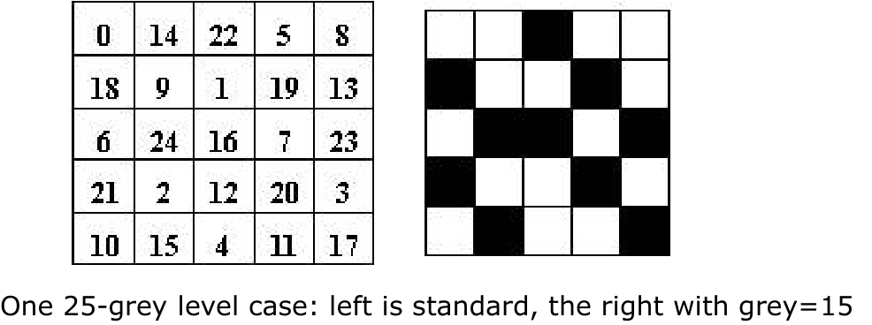
  * 对于每个厂商，固定的抖动矩阵不同

* 打印机相关计算

  * 根据分辨率和纸张的规格可以计算出总共的打印点数
  * 水平竖直分别计算每个像素值可以使用的点数即可计算
  * 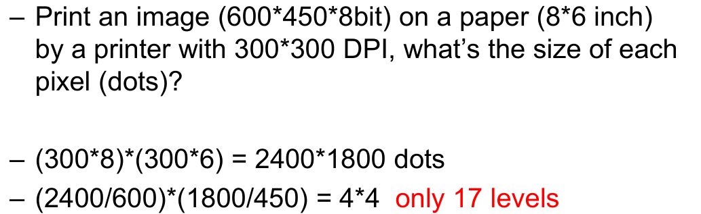

  * 要想打印
    * 将图像的分辨率减小到 150(2400/16) * 113(1800/16)
    * 或者将灰度等级从16*16减小至4\*4，该方法会造成图像失真，即丢失细节

* 24位彩色图像

  * 3个字节（RGB）表示一个像素，都分别用0~255的值表示，共计255\*255\*255种颜色

  * 许多实际上按32位进行存储，新增字节（$\alpha$值）表示特殊效果的信息（透明度）

  * Semi-transparency image color = Source image color×（100\% - transparency)+Background image color×transparency

* 8位彩色图像，也叫256色图像
  * 颜色查找表（bmp1024字节，4字节表示一个像素，一个字节为保留位，不一定）存储颜色，给每个颜色一个索引值，在图像中存储的不是颜色而是该颜色在查找表中的索引值
  * 大部分图像的颜色数大于256，因此我们需要选择最重要的颜色存储在表中
* 颜色查找表
  * 快速改变图像颜色，仅需要操作查找表中的颜色
  * 用于医疗图像，快速将灰度图转化成彩色图
* 颜色直方图，统计图像像素颜色空间的分布
* 颜色选择（聚类，clustering,缓慢，代价昂贵）
  * 人类对R和G比对B更加敏感将一个字节分为(R:G:B = 3:3:2)
  * 等间隔划分:R，G: 16, 48, 80, 112, 144, 176, 208, 240；B: 32, 96, 160, 224
  * Median-cut Algorithm：
    * 按照RGBR...顺序依次均分像素
    * 按照R均分将像素丢尽0，1两个桶；再对两个桶中的像素按G均分分别丢尽了00,01,10,11四个桶，再按B均分……
  * 更精确的中值区分算法，p45

* GIF：8位彩色图像；现在也可能支持真彩色；使用了压缩算法
* jpeg,bmp

## 第四章 color in image and video 图像和视频的色彩

* lens 透镜  retina 视网膜

* 人眼：Rods柱（杆）状细胞对明暗响应，cones锥体细胞对颜色响应（红绿蓝三种，数量不一40：20：1）

* 反射和吸收：反射进入人眼的是看见的颜色，吸收的颜色无法进入人眼
* CRT显示器，传统阴极射线管`Cathode Ray Tube`，通过电子元器件发光，但是电路会产生信号衰减，导致显示层次不鲜明。

* 伽马校正：（$R' = R^{\gamma}$,光线和电压成正比，都是小于1的数，将原信号也指数改变一下，$R' = R = (R^{1/ \gamma})^{\gamma}$ ）
  * 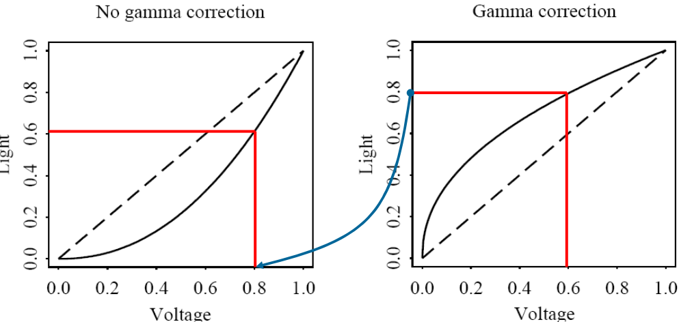
  * 系数值通常2.2，但是也会由于人眼环境不同（如电影院黑暗环境）而变化

* 颜色匹配函数
  * 看不懂，仅了解……

* Weber’s Law：
  * 人对明暗的变化（变化率）敏感，对其绝对值不敏感
  * 人脑对明暗变化敏感度大于对颜色变化敏感度
* CIELAB(`L*a*b*`)颜色模型;Luminance, Colorfulness and Hue  亮度，色彩，色调

* 不同颜色模型，实际上就是在进行线性变换
  * HSL(HSB)－Hue, Saturation,  Lightness/Brightness.
  * HSV --Hue Saturation Value色相 ，饱和度，值
  * HIS -- Hue，Saturation and Intensity
  * HCI -- C= Chroma
  * HVC -- V＝value
  * HSD -- D=Darkness
  * CMY

* 减色模型  Subtractive Color: CMY（ CMYK，black，由于打印机是化学颜料混合，无法混合完美黑色而且昂贵，因此纯黑颜料需要使用黑色墨盒）

  * 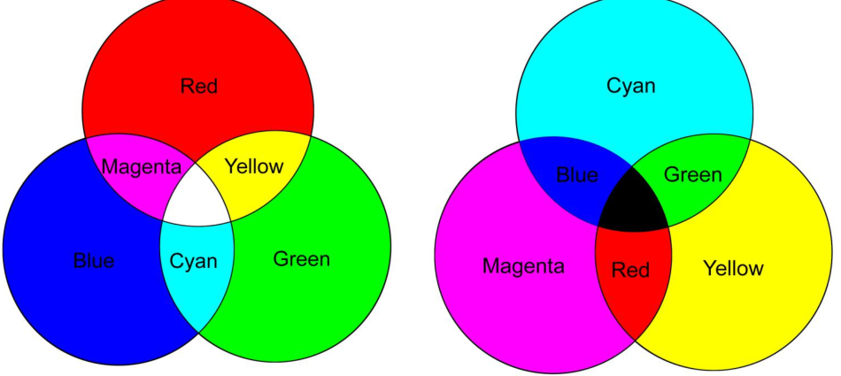

  * 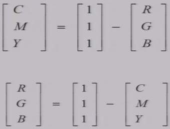
  * 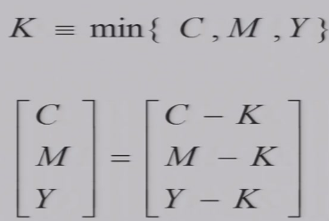
  * CMY和RGB互补

* YUV颜色模型：将亮度的信息提取出来

## 第五章 fundamental concepts in video

* 视频类型
  * 分量视频Component video：即三根视频信号线，不同颜色通道无干扰，需要高带宽，除了RGB使用其余颜色模型也可
  * 复合视频Composite Video：即单根信号线，用于广播彩电，也可兼容黑白电视，不同信号有干扰
  * S-video，分离亮度和颜色信号，两根线

* 模拟信号连续，计算机的信号只能是离散的
* 逐行扫描（progressive scanning），隔行扫描(inter-laced scanning)较多使用

* 水平回扫（horizontal retrace），垂直回扫( vertical retrace )，计算时间
* 典型模拟信号制式
  * NTSC正交平衡调幅, PAL逐行倒相正交平衡调幅, SECAM顺序传送彩色与存储
  * 一定都兼容黑白电视

* NTSC 参数 p 77
  * 525行实际有效信息只有485行；一行耗时实际只有5/6显示有效信息；因为垂直回扫和水平回扫把时间消耗了。
  * 分离YIQ
  * 一开始低频Y和高频C(I Q )混合，经过低通滤波器将Y分离出来
  * 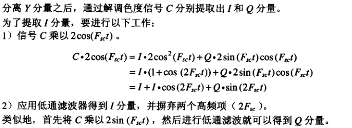

* PAL和SECAM的参数

* 数字视频：
  * 模拟视频信号衰减会导致图像质量下降；加密和噪声处理
* 颜色下采样
  * 4:4:4 indicates no subsampling
  * 4:2:2 indicates horizontal subsampling of Cb and Cr with factor 2
  * 4:1:1 indicates horizontal subsampling of Cb and Cr with factor 4
  * 4:2:0 indicates horizontal and vertical subsampling of Cb and Cr
    with factor 2 respectively
  * 4:2:0 scheme generally used in **JPEG and MPEG**

视频标准，了解……

* CIF -- Common Intermediate Format     QCIF -- Quartar-CIF，more lower bitrate
* HDTV (High Definition TV)高清

## 第六章 Basics of Digital Audio

### 声音数字化

* 声音是一种压力波，可以将压力转化成电压进行度量
* 把模拟信号转成数字信号：
  1. 确定时间上怎么样采样，确定采样率，即水平方向上要采多少个点，采点的密度
  2. 如何对采到的点进行量化表示，在垂直方向上怎么做等级划分，一般会近似到某个整数，向下，向
  上，向最近
* 对连续信号采样转化成离散信号，模拟信号转化成数字信号
  * 时间维度上进行均匀间隔采样（sampling at evenly spaced intervals）典型范围8kHz to 48kHz；人耳听到的范围 20~20kHz
  * 量化，在幅度amplitude维度上进行采样。取整，向下，向上，向最近。
  * 
    * 均匀采样Uniform sampling：等间隔；Typical uniform quantization rates:*  8-bit，256 levels  * 16-bit，65,536 levels
    * 非均匀采样Nonuniform sampling：like u-law rule（p98）

* Nyquist rate奈奎斯特采样频率（奈奎斯特速率）：对模拟信号进行采样时，采样率至少是原始信号最大频率(其实是最大频率-最小频率，一般默认最小频率为0)的两倍，才能保证不失真
* Nyquist frequency：（因为我们不能恢复高于采样频率一半的频率，most systems have an antialiasing filter that restricts the frequency content in the input to the sampler to a range at or below Nyquist frequency. ），习惯上将带奎斯特采样频率的一半称为奈奎斯特频率，

* 信噪比SNR 
  * 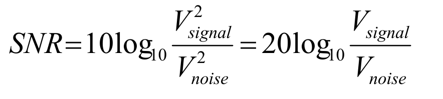
  * 信号**能量**和**电压平方**成正比

* 人耳听到的最小声音定为0dB，人说话频率 50Hz ~ 10kHz

* 量化过程由于取整会导致人为引入误差，噪声

* 量化质量使用信号量化噪声比描述（p96），N取量化精度的位数，每个位增加精度6.02dB

* 非线性量化（在高频部分量化间距可以大一些，低频部分精细一些）

各种音频采样系统p100

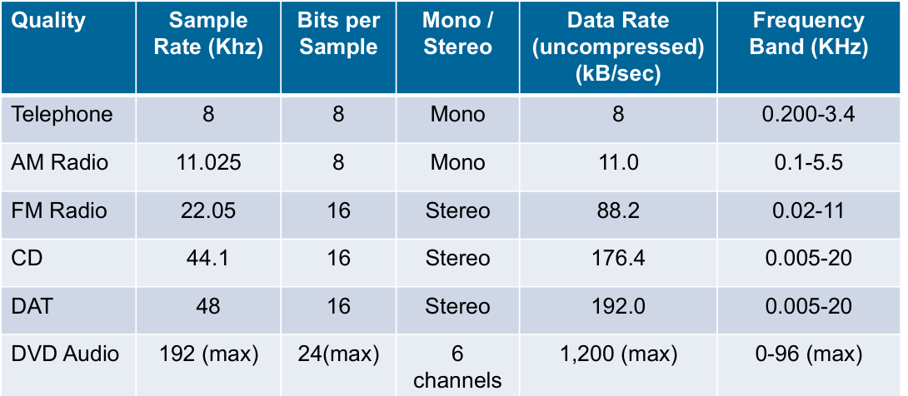

* Steteo立体声双声道

* MIDI 操作文件，存储声音操作指令
* MP3存储真实声音

* 声音的编码，利用时间上的冗余性对声音的信号进行压缩
  * PCM，Pulse Code Modulation脉冲调制编码
  * DPCM，Difference version of PCM
  * ADPCM，Adaptive DPCM

* PCM:即采样和量化
  * 量化等级decision boundaries，即表示每个采样点使用的位数
  * 量化是信息丢失的主要步骤。
  *  计算数据量，即采样频率*量化等级

* 压缩扩展p 111 

* PCM的编码和解码步骤p111
  * 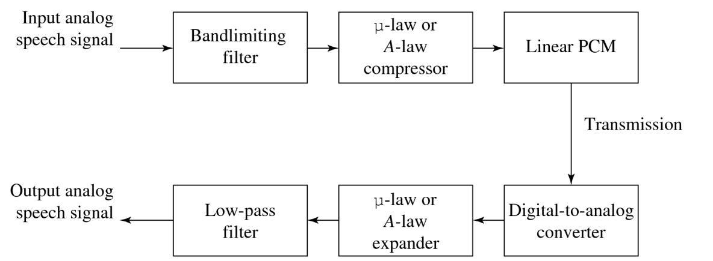
* 差分形式的PCM，差分预测编码

* 信号表达分布范围越广，越难进行压缩

* 预测编码：传输第一个值，后面传输实际值和预测值的差值

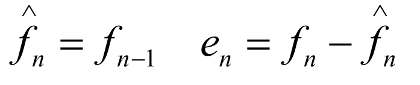

* 预测解码：通过预测值和传输的差分值进行重构

* DPCM  P114  例子p116
* 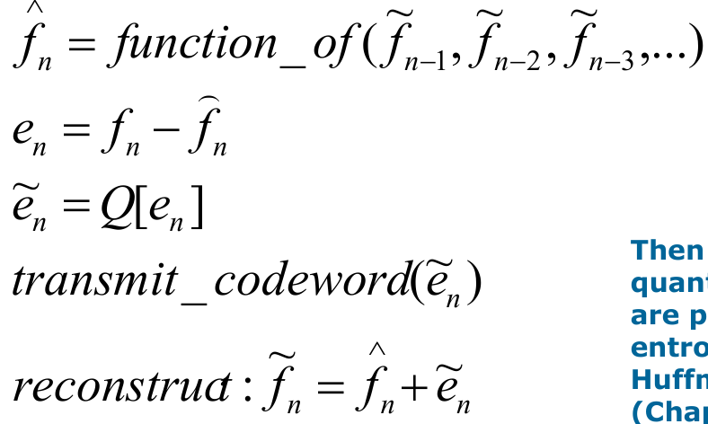
* 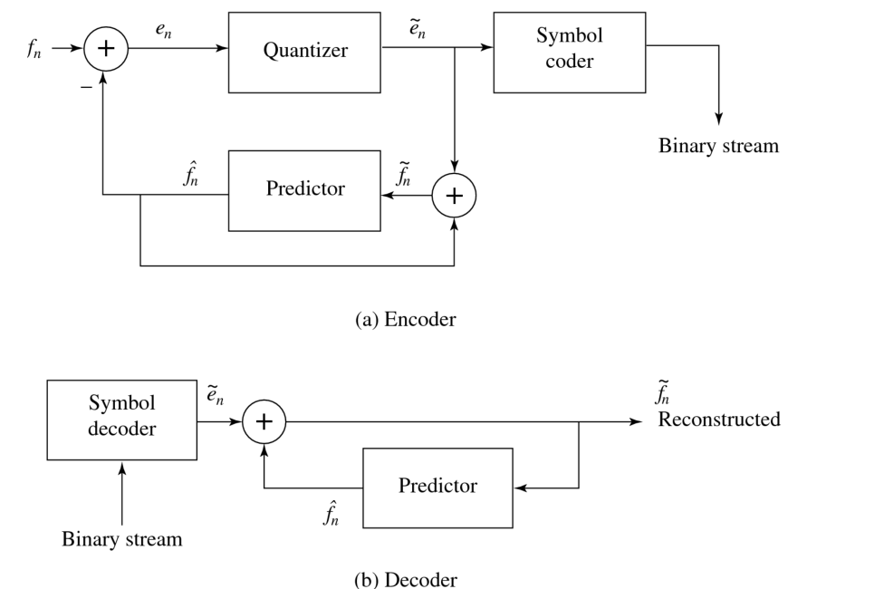
* 注意对en的量化
* 用重建值做预测，而不能用原始值做预测，因为解码器永远拿不到原始值，信息已经被损失，如果
  还用原始值做预测，编解码器的信息不同步，误差会被积累

* 编码器的预测值也是通过重构值进行构建的！！！

## 无损压缩算法

* Compression ratio ＝ B0 / B1 压缩率，可能会小于1，即压缩后的数据量反而变大，

* 信源，文档本身是信源
  所有可能出现的符号组成，码表
  同一个码表生成不同信源

* 信息熵的计算 p123

* 某个字符在信源熵为5bit，
  这意味着使用熵编码的方法进行压缩表达的数据(即编码长度)不可能小于5bit
* 我们对信源编码的平均码长一定大于熵（熵编码无法突破，有其余办法？

**游程编码 RLC**

* 一维编码，对0编码

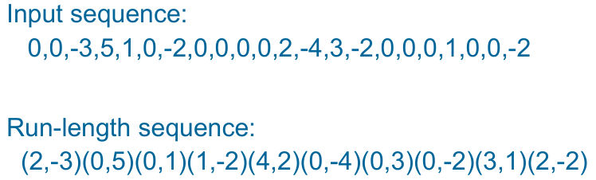

* 变长编码（Variable-Length Coding）

* 霍夫曼编码，自底向上的描述方式

* 可以将重复次数较多的一组符号编码在一起，对向量的编码效率一定大于对标量的处理效率

* 基于字典的编码Dictionary-Based Coding

* Lempel-Ziv-Welch algorithm (called LZW compression)    **p133**

* 算术编码
  * 将所有字符按比例划分区间，每个输入字符即选中对应区间，再将该区间继续划分，根据字符选择区间……
  * 解码即将得到的小数对应到区间上，即可得到字符；计算数据和区间上下限的比例，即可得到另一区间

## 第七章 有损编码

* 失真度量方法  **p151**
  * MSE, SNR, PSNR

* 压缩率越高会导致图像形变越大

* 比率失真理论：0编码长度，丢失所有数据；越接近熵，信息丢失越少
* 量化是导致有损压缩信息损失的主要（唯一？）来源。
* 对向量进行编码比对标量进行编码更加高效。

* 相邻数据有相关性，导致数据冗余。
  去除冗余性，相关性弱的数据进行编码的效率高。

* DCT 离散余弦变换
* 不同基函数相乘一定是0，只有自己相乘为1；正交线性变换

* 一些特殊性质：
  * DC信号，全常量DC系数为平均值的8倍；AC系数为0；
  * 和某一基函数频率相同，相位吻合或者差几个半周期

## 第九章 视频压缩介绍

* 空间冗余，降分辨率；颜色信息，丢弃多余颜色信息；时间冗余

* 纯粹静态压缩，不断对单帧进行压缩，效果不好

  * 差分，传和前一帧的像素差（只适合图像整体无运动）

* 基于运动补偿的压缩算法1

  * 将视频的每一帧图像分成一个个宏块（micro block），
  * 在前一个帧中寻找域某一块相似的宏块，运动估计
  * 对相似宏块做差，对残差图像进行压缩，运动补偿
  * 运动向量，即将两帧叠在一起，两个相似宏块之间的位移，我们传输图像时不仅要传输残差图像编码的结果，还要记录位移以重构帧

  * 本质上还是作差分，只是更加精细，对图像的小块差分

* 基于运动补偿的压缩算法2

  * 不同的帧类型
    * Intra-Frame: similar as JPEG，只去除空间冗余性，作为参考帧，不考虑运动补偿
    * Inter-Frame: based on motion prediction and compensation
      * P frame 前向参考，参考帧永远在前、B frame既参考前面的帧，也参考后面的帧
      * Multi-frame references（H.264）

  * 计算机速度不足，需要有一个搜索范围，在一定时间内找不到，不找了

  * 步骤
    * 运动估计
    * 基于运动补偿的预测：做减法
    * derivation of the prediction error，对得到的残差进行编码
  * 16*16大小的宏块 4：2：0  8\*8的色宏块

  * 如何寻找相似的块
    * 做差，计算像素差的绝对值的和
  * 顺序搜索
    * 按当前帧宏块位置在参考帧划定搜索范围，然后从左上依次做差，一个像素一个像素向右向下进行挪移并计算，最终得到一个最优解，但是时间效率不高
  * 对数搜索，2D-Logarithmic-search 二维对数查找，有点像一维数据的二分查找
    * 在搜索区域划定9个位置，计算9个位置的残差，找到最小的位置，将搜索中心移动到那个位置，搜索范围减小，再次划定9个位置，作残差，找到最小的位置……
  * 分层搜索，
    * Hierarchical search 层次化查找，对图像进行分辨率的缩放，图像金字塔，先在低分辨率图像大
      致定位和哪一块比较像，然后逐渐提升精度，最终得到匹配的块
    * 可以和其余的搜索混用

## H.261

* 为了避免误差的传播，我们需要间隔插入几个I帧进入视频中，而不是全部P帧
* 即使P帧也不一定每个宏块都找得到
* 仅对Y分量作运动估计，但是颜色分量也都要作运动补偿
* GOB

**H.263**

* GOB大小不一
* 可以对运动向量信息作进一步要压缩，不可能有损

* 允许半像素级精度，半个像素挪移宏块
* 所谓最像，就是残差最小，最适合压缩数据量，不考虑视觉

* 可选模式  p227

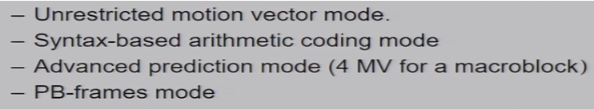

* 

## MPEG 视频编码

* Moving Pictures Experts Group,

#### MPEG1标准

* 支持音视频，CD也使用该标准
* 不支持隔行扫描
* 运动补偿

* 支持双向预测，会乱序传输帧，每个帧有编号（一般是前后寻找最佳匹配，求平均后做减法，有两个运动向量）
* 可以跳跃式参考？

* 对比H.261和MPEG1  p233

  * H.261Supports only CIF(352×288), QCIF (176×144)；MPEG-1 Supports SIF(352×240 for NTSC ,352×288 for PAL), Allows specification of other formats
  * Instead of GOBs as in H.261, an MPEG-1 picture can be
    divided into one or more slices 

  * 允许半精度像素移动

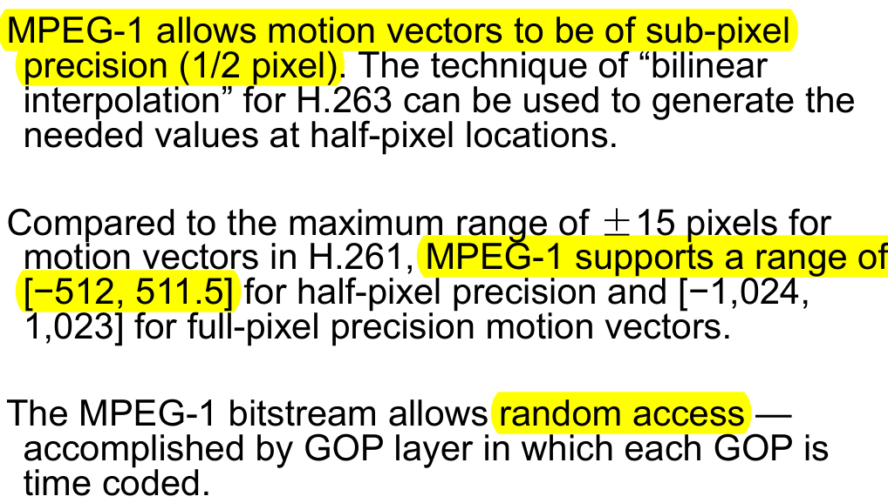

* GOP将多个帧打包，支持拉动进度条
* Slice可视作GOB

#### MPEG 2

* 处理高质量视频4M带宽

* MPEG-2 defined 7 profiles（中文翻译规格？）, aimed at different applications, up to 4 levels defined in each profile.

* 支持隔行扫描：每个帧被分为两个域，top-field and the bottom-field；field picture图像一半的大小

* 五种预测模式P238
  * Frame prediction for frame-pictures
  * Field prediction for field-pictures
  * Field prediction for frame-pictures
  * 16× 8 MC for field-pictures
  * Dual-prime for P-pictures
* ZIGZAG展开的格式不太一样

* MPEG 2的可伸缩编码
  * 先传一些低品质的信号，再传高品质的部分
  * 不是数据压缩方式，而是传输方式
  * SNR
  * Spatial
  * Temporal
  * Data
  * Hybrid Scalability 

* MPEG2 和 1 p243

#### Mpeg 4

* 基于对象编码
* 交互性

* 更大的压缩比，适合编辑和操作（交互）

* 全新的标准：基于对象，和音视频场景进行交互，将媒体对象进行任意合成，得到用户想要的因视屏场景；进行不同层级的控制
* 

* MPEG7 满足信息检索需求

