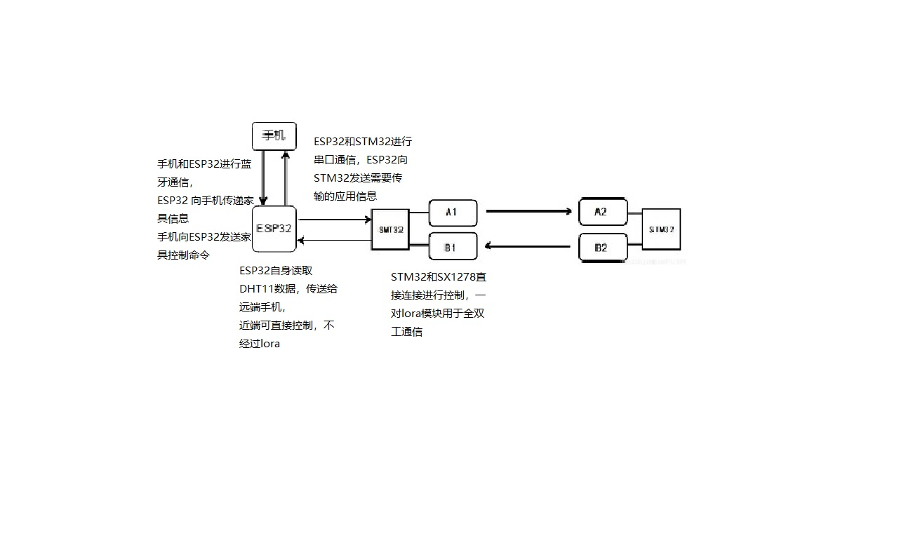
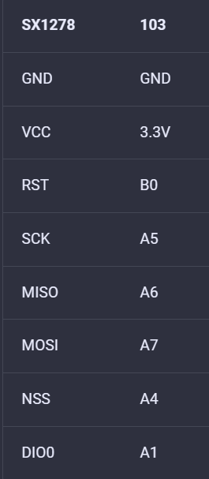

## 整体模块

* 初步方案为使用两个`SX1278`模块进行全双工通信，一个作为发送，一个作为接收。需要开启`SPI2`并连接第二个模块
  * ~~备选方案：鉴于`ESP32`有三个串口，两个空闲串口，我们可以使用两个103板分别作为发送和接收~~(主方案已成功)
* 可将手机端和ESP32视为应用层黑盒，只有纯`DHT11`格式化数据的传入和传出。
  * 手机端仅实现一个按钮（更新）和`DHT11`信息表。使用按钮，主动从连接的ESP32拉取本地信息表并更新。
  * ESP32维护一个网络内所有节点`DHT11`的信息，多线程（`_thread`）
    * ~~本地`DHT11`隔若干秒更新一次并向外广播。（可通过定时器`Timer`实现）~~
      * 不互通的节点无法收到信息
      * 一：`DHT11`的广播信息会多次转发，即收到广播信息后会将信息再次广播出去，如果一个节点重复收到该包则丢弃，不再转发。
        * 新问题：如何判断重复？
        * 给更新次数设置变量int，每次广播也携带这个变量，而在`STM32`再维护一个节点的更新次数表，获取包后对比对应表项，如果获取包的数值大于表项数值，说明是新获得的包（更新表项，将数据解析出来并发送给ESP32），否则就是老包（需要丢弃）
      * 二：同路由表一样，发送`DHT11`表给邻居，不再次转发
        * 还是有问题：多个相邻节点发送的表如何判断对应数据的时效性，即哪个数据更加新？
        * 同样的解决方案，只能添加更新次数变量并发送来判断表项时效性。
      * 方案一发送数据量比较小。（虽然不知道有什么用），当然方案二也省略了多次发送的时间。
      * 另外，对于方案一，可能多次接收到信息，也就需要多次广播，而且还有本地从`ESP32`传来的发送需求，可能有冲突，因此需要实现任务队列，即将所有发送任务添加到队列中，然后由发送线程依次取出执行。
    * 从STM32获取其余远端节点广播的信息并更新对应数据表。
    * 维护`DHT11`表的时效性，例如，设置`count`计数变量，再设置一个定时器或者复用本地更新用的定时器，每次触发将所有表项计数+1，而本地更新或远端更新时将对应表项置0.触发定时器+1时同时检查计数值，如果达到较大值，说明节点脱离网络或者节点出现故障。
* `STM32`和`ESP32`串口连接。
  * `STM32`实现所有的远端数据传送
    * 将本地`ESP32`得到的数据添加报头打包发送出去。将所有从远端获取的数据解包获取数据通过串口传输给`ESP32`。
    * 更新路由表。
  * `ESP32`在获取本地数据后除了更新自己的`DHT11`还需要发送给STM32广播出去。

* 连接规范：约定好各个部件引脚连接的编号。
* `ESP32`，`STM32`串口连接：TODO;

* SX1278__Tx发送模块，使用课程样例连接方式不变。

| SX1278______RX 接收模块 | 103  |
| ----------------------- | ---- |
| GND                     | GND  |
| VCC                     | 3.3V |
| RST                     | PB12 |
| SCK                     | PB13 |
| MISO                    | PB14 |
| MOSI                    | PB15 |
| NSS                     | PB3  |
| DIO0                    | PB4  |

# ESP32

1. 定时器监督本地DHT11
2. 定时器向远端发送数据
3. 多线程开启蓝牙监控
4. 多线程开启STM32数据监控

1. 人和模块缺乏（模块目前最多只有两块在工作）
2. 链路层和传输层
   1. 路由表目前尚未工作
   2. 多线程模型未建立好：远端数据接收，本地串口数据接收，路由表发送，如果实现ACK，确认重发又是几个线程
3. 应用层：目前App尚未和ESP32实现互通
4. ESP32:多线程：DHT11数据表维护：接收手机蓝牙命令并发送数据；接收STM32数据并更新

* 手机客户端请求：ESP32判断是否是本地节点，如果是直接将数据发给手机

* ESP32 发送 “getDHT11” 给STM32
* STM32 发送给远端STM32
* STM32收到消息，串口发送给服务器ESP
* 服务器ESP获取DHT，发送给STM32
* STM32发送回去，客户端处STM32将数据给ESP
* ESP获取数据，发给手机

