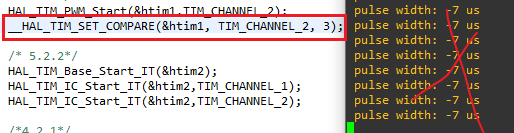

# 实验2指南

请跟随实验指南完成实验，完成文档中所有的`TASK`。`BONUS`部分的内容完成可作为加分，但报告的总分不应超过100分。请下载此指南作为实验报告模版，将填充完成的实验报告导出为PDF格式，并命名为“学号_姓名_lab2.pdf”，上传至学在浙大平台。下载请点击 **<u>[这里](../download.md)</u>** 。

## 1 串口

### 1.1 驱动

由于现在的电脑已经不再标配串口，我们需要使用USB转串口的方式来进行串口通信。在本实验中，我们使用的是CP2102，其驱动程序可以在 **<u>[Silicon Labs官网](https://cn.silabs.com/developers/usb-to-uart-bridge-vcp-drivers?tab=downloads)</u>** 上选择适合自己操作系统的版本进行下载。

在驱动安装完成后，将CP2102插到电脑的USB口，我们可以在设备管理器中看到相应设备，如下图所示：

记住这里的COM编号，就是上图中的`COM7`，我们将在后面的实验中使用。

对于Linux或者MacOS，我们可以使用`ls /dev/tty*`命令来查看串口设备，如下图所示：

上图中的`/dev/tty.usbserial-0001`就是我们需要的串口设备。

`TASK1` ==请在此处放置你所查找到的USB转串口设备的截图==（5分）

> 

!!! info "由于这之后的实验大多需要同时连接ST-Link和CP2102，因此建议准备一个小的USB Hub用来同时连接这两个设备，以避免插拔USB线带来的不便。"

### 1.2 串口调试助手

在实验中，我们需要使用串口调试助手来进行串口通信，实现和单片机的信息交互。下面将提供三种常用的串口调试助手，供大家选择。

#### 1.2.1 PuTTY

适用平台：Windows

PuTTY是一款开源的串口调试助手，其下载地址为 **<u>[PuTTY官网](https://www.chiark.greenend.org.uk/~sgtatham/putty/latest.html)</u>** 。选择对应架构的Windows Installer进行下载。

进行串口通信的配置如下图所示，选择Serial，根据硬件管理器里的COM编号在Serial Line输入`COM7`，在Speed输入`115200`，然后Open就可以了：

#### 1.2.2 PicoCom

适用平台：Linux，MacOS

PicoCom是一款开源的串口调试助手，其Release地址为 **<u>[PicoCom](https://github.com/npat-efault/picocom/releases)</u>** 。可以下载源码自行编译安装，也可以通过相应平台的包管理器进行安装，如Ubuntu可以使用`sudo apt install picocom`进行安装，MacOS可以使用`brew install picocom`进行安装。

这是一个典型的Linux开源软件。启动picocom时，用以下的命令行参数：

```bash
picocom -b 115200 /dev/tty.usbserial-0001
```

其中`115200`是波特率，`/dev/tty.usbserial-0001`是串口设备。

picocom启动时会显示所有的配置参数：

```
picocom v3.2a

port is        : /dev/tty.usbserial-0001
flowcontrol    : none
baudrate is    : 115200
parity is      : none
databits are   : 8
stopbits are   : 1
escape is      : C-a
local echo is  : no
noinit is      : no
noreset is     : no
hangup is      : no
nolock is      : no
send_cmd is    : sz -vv
receive_cmd is : rz -vv -E
imap is        : 
omap is        : 
emap is        : crcrlf,delbs,
logfile is     : none
initstring     : none
exit_after is  : not set
exit is        : no

Type [C-a] [C-h] to see available commands
Terminal ready
```

以上所有的参数都可以通过命令行参数来设置。暂时我们不需要做任何的特殊配置。

退出picocom时，按下`Ctrl+A`，然后按下`Ctrl+X`即可。

#### 1.2.3 CoolTerm

适用平台：Windows，Linux，MacOS

CoolTerm是一款开源的串口调试助手，其下载地址为 **<u>[CoolTerm官网](https://freeware.the-meiers.org/)</u>** 。选择对应系统及架构的版本进行下载。

点击软件左下角，选择对应的串口和波特率（此处使用`115200`），点击Connect即可连接。

`TASK2` ==请给出使用串口调试助手成功连接串口后的截图，软件可任意选择==（5分）

> 
>
> 
>
> 

## 2 工程配置

和Lab 1一样配置SYS、GPIO等，注意时钟一定要使用外部晶体。

这次要多配置的是Connectivity里的USART。

- 点击Connectivity-->USATR1；

- 设置MODE为`Asynchronous`（异步通信）；

- Parameter Setting：Basic Parameters：均采用默认不修改：波特率为115200 Bits/s。传输数据长度为8 Bit，奇偶检验无，停止位1。

- GPIO Settings：看到PA9为USART1_TX，PA10为USART1_RX；

- NVIC Settings：使能UASRT1 global interrupt。

另外，在Project Manager的Code Generator，勾选“Generate peripheral initiallization as a pair of '.c/.h' files per peripheral”（每个功能生成独立的.c和.h文件）。勾选后再生成代码，可以将所有的功能分别生成独立的.c和.h文件，方便我们后面的实验。本实验中会生成usart.c/h和gpio.c/h。

`TASK3` ==请给出工程配置完成后自动生成代码后的层次结构截图，要求展开Core文件夹中的Inc、Src和Startup三个文件夹==（5分）

> **后面添加TIMER时还会生成tim.c/h**
>
> 

## 3 连线

连线之前将USB-Hub从电脑上拔掉，在断电状态下进行操作。本实验中其余器件的连接方式参考Lab 1。需要额外进行连线的是CP2102和103板。

CP2102板的末端有6根插针，它们的标字在背面，顺着字的方向，依次是DTR、RXD、TXD、VCC、CTS和GND。

CP2102和103板的连线方式如下表所示：

| 103  | CP2102 | 颜色 | 意义             |
| ---- | ------ | ---- | --------------- |
| A9   | RXD    |      | 103发送数据给PC   |
| A10  | TXD    |      | PC发送数据给103   |
| GND  | GND    | 黑色  | 地              |

`TASK4` ==请在下方放上完整连接的实物图，包括CP2102、103板、开关和ST-Link==（5分）

> 

`TASK5` ==我们可以观察到，CP2102板子上也有VCC，已知此VCC输出电压为3.3V。请问在 **不改变当前其他连线** 情况下，可以将此VCC和103板的3.3V连接起来为其供电吗？如果不行，请说明原因。==（5分）

> 不能，会出现错误，具体原因不详；另外，有烧坏板子的风险。
>
> 
>
> 探究发现，`micro usb`可与`ST-Link`的3.3V同时供电，且单独断掉`ST-Link`的VCC供电不会出错。
>
> 但是CP2102无法在`ST-Link`存在情况下供电，无论`ST-Link`是否为103板供电。

### 4.1 轮询输出

请使用轮询的方式，每隔1s在串口输出一次`Hello World!`。

`TASK6` ==请在下方给出实现轮询输出的代码，并给出上板运行后使用串口调试软件观察的截图。==（10分）

> ```
> uint8_t str[] = "Hello World!\r\n";
> ...
> HAL_UART_Transmit(&huart1,str, sizeof(str), 100 );
> HAL_Delay(1000);
> ```
>
> 


### 4.2 测量按钮按下时间

此处要求使用时钟中断的方式，测量按钮按下的时间，并从串口输出。此处同样要求进行按键消抖。

#### 4.2.1 使用 SysTick 测量时间

> SysTick 为24bit的系统定时器（又称嘀嗒定时器）。只要是 ARM Cotex-M 系列内核的MCU都包含这个定时器。使用内核的 SysTick 定时器来实现延时，可以不占用系统定时器，节约资源。在操作系统执行多任务管理时，SysTick 定时产生的中断能确保单个任务不会锁定整个系统。SysTick还可用于闹钟定时、时间测量等。

`TASK7` ==请在下方给出使用SysTick测量按钮按下时间的 **关键代码** ，并给出上板运行后使用串口调试软件 **观察的截图** 。==（5分）

> ```c
> 	  if(HAL_GPIO_ReadPin(BTN_GPIO_Port, BTN_Pin) == GPIO_PIN_RESET){
> 		  int time = 0; // 记录systick溢出次数
> 		  HAL_Delay(10);
> 		  if(HAL_GPIO_ReadPin(BTN_GPIO_Port, BTN_Pin) == GPIO_PIN_RESET){
> 			  while(HAL_GPIO_ReadPin(BTN_GPIO_Port, BTN_Pin) ==  GPIO_PIN_RESET){
> 				  if(SysTick->CTRL & 1UL <<16){//按下期间不断读取Counterflag,记录是否溢出。
> 					  time++;
> 				  }
> 			  }
> 			  time += 10;//增加去抖动的10ms
> 			  printf("BTN time: %dms\r\n",time);
> 		  }
> 	  }
> ```
>
> 

`BONUS1` ==尝试更改 SysTick 时钟中断周期，以改变按键按下时间的测量精度。==（5分bonus）

> 通过HAL_SetTickFreq()可以修改嘀嗒定时器的频率，但是其精度只会比1ms低，且选项较少即100Hz,10Hz。
>
> 
>
> ps. 100Hz下测量
>
> 
>
> 
>
> 所以，通过HAL_SYSTICK_Config()我们就可以设置理论上的任意可行精度。不过该函数的参数为每次中断时的嘀嗒数，而且要注意它的基准SystemCoreClock为16000000，而非72000000。默认参数`SystemCoreClock/1000U`为1ms计数，通过增大1000为10000即可实现100us精度的计时。其余情况同理推断即可。
>
> 注意，如果设置的精度过高(例如1000 000Hz)会导致中断频繁，程序难以进行下去。

!!! tip "参考资料"
    - [SysTick 定时器](https://cloud.tencent.com/developer/article/1991855)
        - [SysTick-系统滴答定时器详解](https://blog.csdn.net/qq_16519885/article/details/117756815?csdn_share_tail=%7B%22type%22%3A%22blog%22%2C%22rType%22%3A%22article%22%2C%22rId%22%3A%22117756815%22%2C%22source%22%3A%22m0_56869604%22%7D&fromshare=blogdetail)

`TASK8` ==请解释 HAL_Delay() 函数的工作原理。在 TASK7 完成后，你的工程是否还可以正常使用 HAL_Delay() ？请简述原因。==（5分）

> ```c
> // HAL_Delay()函数原型
> __weak void HAL_Delay(uint32_t Delay)
> {
>   uint32_t tickstart = HAL_GetTick();
>   uint32_t wait = Delay;
> 
>   /* Add a freq to guarantee minimum wait */
>   if (wait < HAL_MAX_DELAY)
>   {
>     wait += (uint32_t)(uwTickFreq);
>   }
> 
>   while ((HAL_GetTick() - tickstart) < wait)
>   {
>   }
> }
> ```
>
> 通过源代码我们可以看出，时延的主要原理是一个空的while循环，判断条件是不断将当前的systick计数和调用函数时的计数进行对比，看其差值是否大于我们需要的时延。由于systick默认为1KHz，即1ms一计数，所以`HAL_Delay()`可以实现毫秒级的时延。
>
> 在 TASK7 完成后，我的工程依旧可以正常使用 `HAL_Delay()`， 因为我并未改变`systick`的时钟基准，只是相当于自己实现了`HAL_GetTick() - tickstart`去记录按钮按下的时间。因为不熟悉HAL库，写代码时没有使用`HAL_GetTick()`。
>
> 

`BONUS2` ==在 BONUS1 完成后，你的工程是否还可以正常使用 HAL_Delay() ？请简述原因。==（5分bonus）

> 更改时钟中断周期后，` HAL_Delay() `肯定就无法正常使用了，因为它的时延基准变了，要继续使用必须修改这个函数或者按照更改的时延基准自己调整参数。

#### 4.2.2 使用 TIM 测量时间

> TIM（Timer）是定时器，是一种用于产生定时中断的硬件设备。Timer作为定时使用时信号来源通常使用内部时钟

STM32单片机中有很多个Timer，通常TIM6和TIM7为基础定时器、TIM1和TIM8为高级定时器，其余为通用定时器。基础定时器仅有定时功能；通用定时器在定时基础上，还支持外部输入补货、比较、PWM输出等功能；高级定时器则在通用定时器的基础上增加了互补输出、死区、编码器等功能。

以下为有关TIM的几项常见参数：

- `Prescaler` 预分频系数

    <math xmlns="http://www.w3.org/1998/Math/MathML" display="block"><mo>输入给</mo><mi>T</mi><mi>I</mi><mi>M</mi><mo>的信号频率=</mo><mfrac><mrow><mo>输入到预分频器的信号频率</mo></mrow><mrow><mo>预分频系数</mo><mo>+</mo><mn>1</mn></mrow></mfrac></math>

    在STM32中常见取值为`0~65535`。

- `CounterMode` 计数模式

    - 向上计数模式（Up）

        计数器从0计数到自动加载值（TIMx_ARR），然后重新从0开始计数并且产生一个计数器溢出事件。

    - 向下计数模式（Down）

        计数器从自动加载值（TIMx_ARR）开始向下计数到0，然后从自动装入的值重新开始，并产生一个计数器向下溢出事件。

    - 中央对齐模式（向上/向下计数）

        计数器从0开始计数到自动装入的值-1，产生一个计数器溢出事件，然后向下计数到1并且产生一个计数器溢出事件；然后再从0开始重新计数。

- `Period` 计数周期

    即为上方所述的自动加载值。

    在STM32中常见取值为`0~65535`。

- `AutoReloadPreload` 自动重装载预装载使能

    计数器再计满一个周期之后会自动重新计数，也就是默认会连续运行。在计数中途对Period进行更改可能会产生预想不到的结果。使能AutoReloadPreload后，Period的修改将会在完成当前计数周期后才更新；

定时时间的计算公式如下：

<math xmlns="http://www.w3.org/1998/Math/MathML" display="block"><mo>定时时间=</mo><mfrac><mrow><mo stretchy="false">(</mo><mi>P</mi><mi>r</mi><mi>e</mi><mi>s</mi><mi>c</mi><mi>a</mi><mi>l</mi><mi>e</mi><mi>r</mi><mo>+</mo><mn>1</mn><mo stretchy="false">)</mo><mo>×</mo><mo stretchy="false">(</mo><mi>P</mi><mi>e</mi><mi>r</mi><mi>i</mi><mi>o</mi><mi>d</mi><mo>+</mo><mn>1</mn><mo stretchy="false">)</mo></mrow><mrow><mo>时钟频率</mo></mrow></mfrac></math>

`TASK9` ==在下方给出使用TIM测量按钮按下时间的 **关键代码** 以及定时器的相应 **配置截图** ，并给出上板运行后使用串口调试软件 **观察的截图** 。==（10分）

> ```c
> if(HAL_GPIO_ReadPin(BTN_GPIO_Port, BTN_Pin) == GPIO_PIN_RESET){
> 	HAL_Delay(10);
> 	if(HAL_GPIO_ReadPin(BTN_GPIO_Port, BTN_Pin) == GPIO_PIN_RESET){
> 		while(HAL_GPIO_ReadPin(BTN_GPIO_Port, BTN_Pin) ==  GPIO_PIN_RESET);
> 		printf("BTN time: %dms\r\n",time/100);
> 		time = 0;
> 	}
> }
> 
> //时钟溢出中断回调
> void HAL_TIM_PeriodElapsedCallback(TIM_HandleTypeDef *htim)
> {
> 	if(htim == &htim2){
> 		/* 4.2.2*/
> 		if(HAL_GPIO_ReadPin(BTN_GPIO_Port, BTN_Pin) == GPIO_PIN_RESET)
> 			time++;//全局变量，记录按下时的溢出次数
> 	}
> }
> ```
>
> ps.定时器频率 $72000000/(72*10) = 100000Hz$，即一次中断周期为10us。
>
> 

!!! tip "提示"
    TIM的中定时器溢出中断回调函数为`HAL_TIM_PeriodElapsedCallback(TIM_HandleTypeDef *htim)`，你可能需要重写该函数。
    请注意需要在ioc文件中启用TIM，并按照上述定时时间的计算公式配置合理时间的中断。

#### 4.2.3 使用引脚中断来处理按钮和测量时间（Bonus）

`BONUS3` ==请在下方给出使用引脚中断来处理按钮和测量时间的 **关键代码** ，并给出上板运行后使用串口调试软件 **观察的截图** 。==（5分bonus）

!!! tip "提示"
    请将相应的引脚配置成`GPIO_EXIT`模式，并在NVIC中使能相应的中断。
    你可能需要重写`HAL_GPIO_EXTI_Callback(uint16_t GPIO_Pin)`函数。注意引脚中断和时钟中断优先级的配置。

### 4.3 使用中断和DMA输出串口数据（Bonus）

请查询相应资料并参考 **<u><a href="https://www.st.com/content/ccc/resource/technical/document/user_manual/2f/71/ba/b8/75/54/47/cf/DM00105879.pdf/files/DM00105879.pdf/jcr:content/translations/en.DM00105879.pdf" target="_blank">HAL手册</a></u>** 中有关`UART_Transmit`和`UART_Recevie`的部分，找到处理中断和DMA相关任务的函数，完成下面的任务。

`BONUS4` ==自行设计适合中断方式传输串口数据的情境，并给出具体代码和结果截图==（5分bonus）

`BONUS5` ==自行设计适合DMA方式传输串口数据的情境，并给出具体代码和结果截图==（5分bonus）

!!! tip "参考资料"
    如果你没有学习过计算机组成和计算机体系结构，不了解中断和DMA的概念，可以参考以下链接：

    [中断 - 维基百科](https://zh.wikipedia.org/zh-cn/%E4%B8%AD%E6%96%B7)
    
    [DMA - 维基百科](https://zh.wikipedia.org/wiki/%E7%9B%B4%E6%8E%A5%E8%A8%98%E6%86%B6%E9%AB%94%E5%AD%98%E5%8F%96)
    
    [Direct Memory Access (DMA) and Interrupt Handling](https://www.eventhelix.com/fault-handling/dma-interrupt-handling/)


## 5 方波

### 5.1 使用PWM输出方波

使用PWM输出方波的方法有很多种，这里我们使用TIM的PWM模式来实现。

在配置TIM时，需要将Clock Source设置为`Internal Clock`，并选择一个可用的通道生成PWM信号。如下图所示，在TIM1中的通道2生成了PWM信号。

在配置完成后，可以在右边的芯片示意图上看到默认输出的引脚。

在下方的 Parameter Settings 中，可以看到TIM的配置参数，在此处我们需要关心 Counter Settings 中的内容：

其中有如下公式：

其中freq为目的定时器频率（在这里即为PWM输出频率），SysClock为时钟源频率，PSC为预分频寄存器的值，ARR为自动重载寄存器的值。我们可以通过调整自动重载值和预分配系数，来调整PWM的输出频率。

`TASK10` ==请在下方给出你所配置的 Tim Mode 以及 Counter Settings 截图，并根据公式计算出理论上的方波频率==（5分）

> 
>
> $freq = 72000000/(144*1000) = 500Hz$ ，

!!! tip "参考资料"
    [STM32Cube的PWM控制基础篇](https://blog.csdn.net/ASWaterbenben/article/details/93364476)

PWM的占空比指的是高电平所占的时间比例，占空比越大，方波的高电平时间越长，低电平时间越短。占空比（duty）的计算方法如下：

其中CCR为捕获/选择寄存器的值。

`TASK11` ==在下方给出使用TIM产生方波的 **关键代码** ，并要求对CCR进行修改以指定占空比，并计算出按照你的设置，占空比应当为多少。==（10分）

> ```
>   /* USER CODE BEGIN 2 */
> 	HAL_TIM_PWM_Start(&htim1,TIM_CHANNEL_2);
> 	__HAL_TIM_SET_COMPARE(&htim1, TIM_CHANNEL_2, 700);
>   /* USER CODE END 2 */
> ```
>
> 设置`PSC = 144-1, ARR = 1000-1, CCR = 700`。
>
> 占空比duty rate = $700 / (1000) = 70\%$ 

!!! tip "提示"
    可能用到的函数：`HAL_TIM_PwM_Start`、`HAL_TIM_PWM_Stop`、`__HAL_TIM_SET_COMPARE`。

### 5.2 测量方波

#### 5.2.1 交叉连线测量

此步骤需要两人合作完成，一人负责输出方波，一人负责测量方波。

[输出方波](#51-使用pwm输出方波)的内容参考前一小节的内容，另一人需要和输出方波的同学进行交叉连线，测量方波脉冲的宽度，并将每次测量的结果通过串口输出到PC。

`TASK12` ==在下方给出测量方波脉冲宽度的 **关键代码** ，并将测量结果（即串口输出的结果）进行截图。==（10分）

> ```c
> // main() 开启tim2的时钟更新回调和捕获回调
> 	HAL_TIM_Base_Start_IT(&htim2);
> 	HAL_TIM_IC_Start_IT(&htim2,TIM_CHANNEL_1);
> 	HAL_TIM_IC_Start_IT(&htim2,TIM_CHANNEL_2);
> 	
> // 两个回调函数
> void HAL_TIM_PeriodElapsedCallback(TIM_HandleTypeDef *htim) //时钟更新回调
> {
> 	if(htim == &htim2){
> 		/* 5.2.1*/
> 		Capture_mid_time++; //记录脉冲阶段定时器中间共溢出多少次
> 	}
> }
> void HAL_TIM_IC_CaptureCallback(TIM_HandleTypeDef *htim) //捕获回调
> {
> 	static int PWM_RisingCount=0,PWM_FallingCount=0; //静态变量记录一次测量的上升沿和下降沿的捕获寄存器值
> 	if(htim == &htim2)
> 	{
> 		if(htim2.Channel == HAL_TIM_ACTIVE_CHANNEL_1)
> 		{
> 			PWM_RisingCount = HAL_TIM_ReadCapturedValue(&htim2,TIM_CHANNEL_1); //记录上升沿的捕获寄存器值
>             Capture_mid_time = 0;//将中间的时间溢出计数重置，重新计数
> 		}
> 		else if(htim2.Channel == HAL_TIM_ACTIVE_CHANNEL_2)
> 		{
> 			PWM_FallingCount = HAL_TIM_ReadCapturedValue(&htim2,TIM_CHANNEL_2);//记录下降沿的捕获寄存器值。
> 			if(PWM_RisingCount != 0 && PWM_FallingCount!= 0)//获取两个值即可计算一次脉冲宽度
> 			{
> 				PWM_width      = (10-PWM_RisingCount+PWM_FallingCount)*1+(Capture_mid_time-1)*10; // 一个计数为1us,10次触发一次中断。分别计算两端的时间和中间的完整时间。
>                 
> 				Capture_mid_time = 0;//重置所有变量
> 				PWM_RisingCount = 0;
> 				PWM_FallingCount = 0;
> 			}
> 		}
> 	}
> }
> ```
>
> 

`TASK13` ==请画出小组交叉连线进行测量时 **实验的完整电路连接示意图** ，包括两组的103板、CP2102、ST-Link等。需要标识清楚参与连线的引脚。==（5分）

> 没有小组连线，通过单个板子的TIM1  PWM输入到 TIM2_CH1的PWM捕获通道中进行测试。
>
> 

`BONUS6` ==试探能够测量的最小脉冲宽度==（5分bonus）

> 设置TIM1如下
>
> 
>
> 同过 `__HAL_TIM_SET_COMPARE(&htim1, TIM_CHANNEL_2, x);`我们可以将脉冲宽度调节至x us.
>
> 经过测试可测出的最小脉冲宽度为4us
>
> 
>
> 
>
> 

#### 5.2.2 逻辑分析仪/示波器测量

逻辑分析仪的使用方法请参考[逻辑分析仪使用方法](../warm_up.md#2-逻辑分析仪-nanodla-教程)。

`TASK14` ==使用逻辑分析仪或示波器测量方波的频率以及空占比，并给出相应软件测量到的截图。请将此处测量出的脉冲宽度和交叉连线中测量到的进行比较。==（10分）

> 
>
> 
>
> 方波频率$freq = 500Hz$；占空比$duty = 1400/2000 = 70\%$. 
>
> 从task12中我们可以看到通过交叉连线测量的脉冲宽度和软件测量的脉冲宽度都是 1400us。结果相同。

`TASK15` ==请画出使用逻辑分析仪/示波器测量时 **实验的完整电路连接示意图** ，包括103板、逻辑分析仪/示波器、CP2102、ST-Link、开关等。需要标识清楚参与连线的引脚。==（5分）

> 

## 6 讨论和心得

> 请认真填写本模块，若不填写或胡乱填写将酌情扣分，写明白真实情况即可。

本次实验我们尝试了STM32的串口通信功能，并且还利用嘀嗒定时器和Timer分别进行了时间测量，还尝试了Timer的产生方波以及输入捕获功能，可以说是内容非常丰富了。

实验过程比较崎岖，主要是对于Timer的配置总是不得其法，特别是测量方波脉冲宽度时配置输入捕获模式，资料大都混乱……另外，后续实验也需要注意的是，Timer的计时，产生方波，捕获模式等功能中断的开启是需要不同的函数的，并不是开启捕获后计时也会同时开启。
