# 实验3指南

???+ note "4-17 更新内容"

    - 增加 STM32F103C8T6 **<u>[存储器布局](#update1)</u>** 的说明
    
    - 增加 **<u>[官方 IAP 使用提示](#update2)</u>** 
    
    - 增加 **<u>[Windows 下支持X/Y/ZModem协议的串口调试工具](#update3)</u>**
    
    - 增加 **<u>[生成 bin 文件的方法](#update4)</u>**

请跟随实验指南完成实验，完成文档中所有的`TASK`。`BONUS`部分的内容完成可作为加分，但报告的总分不应超过100分。请下载此指南作为实验报告模版，将填充完成的实验报告导出为PDF格式，并命名为“学号_姓名_lab3.pdf”，上传至学在浙大平台。下载请点击 **<u>[这里](../download.md)</u>** 。

此实验要求实现一个简易的 boot loader ，能够通过串口执行四条最简单的指令：`peek`、`poke`、`load`和`run`。

## 1 硬件连线

本实验中不需要用到开关，只需将103板连接下载器（ST-Link）和串口即可。

`TASK1` ==请拍摄实际的硬件连接图==（5分）


## 2 指令解析

本实验中，boot loader 通过串口接收指令，指令的格式以及简介如下表所示：

| 指令 | 格式 | 说明 |
| :--: | :--: | :--: |
| peek | `peek <addr>` | 读取 addr 位置的数据 |
| poke | `poke <addr> <data>` | 修改 addr 位置的数据为 data |
| load | `load <addr>` | 从PC接收一段二进制数据，保存在 addr 开始的地址中 |
| run | `run <addr>` | 运行 addr 开始的程序 |

请你编写程序，能够解析串口接收到的指令，并将指令分离出命令字和参数，将分离的结果返回，在串口输出。要求仅返回上述四种指令，若输入为其他指令，则返回非法提示信息。

???+ example "示例"
    串口接收到的指令为 `peek 00008000` ，则返回 `INS: peek` 和 `PARA: 00008000` 。

    串口接收到的指令为 `poke 00008000 00000000` ，则返回 `INS: poke` ， `PARA1: 00008000` 和 `PARA2: 00000000` 。

`TASK2` ==请给出实现指令解析的代码==（10分）

> ```c
> // main while(1)
> /*在串口将完整的指令接收下来后（判断是否接收到0x0d回车符，UART1_Rx_flg置位），通过两次sscanf 进行指令的解析，
>  *第一次只将指令类型解析出来
>  * 第二次根据指令类型解析对应参数，主要是poke指令和其余指令不同，有两个参数。
> */
> 	if(UART1_Rx_flg){// 处理传输的命令
> 		  printf(">>> %s\r\n",UART1_Rx_Buf);
> 
> 		  char cmd[10];
> 		  uint32 arg0,arg1;
> 		  sscanf((const char*)UART1_Rx_Buf,"%s",cmd);
> 		  if( !strcmp(PEEK, cmd) ){
> 			  sscanf((const char*)UART1_Rx_Buf,"%s %08x",cmd,&arg0);
> 			  printf("INS: peek  PARA: %x -> DATA: %08x\r\n",arg0,*(int*)arg0);
> 		  }
> 		  else if(!strcmp(POKE, cmd)){
> 			  sscanf((const char*)UART1_Rx_Buf,"%s %08x %08x",cmd,&arg0,&arg1);
> 			  *(int*)arg0 = arg1;
> 			  printf("INS: poke  PARA1: %x  PARA2: %08x\r\n",arg0,*(int*)arg0);
> 		  }
> 		  else if(!strcmp(LOAD, cmd)){
> 			  sscanf((const char*)UART1_Rx_Buf,"%s %08x",cmd,&arg0);
> 			  printf("INS: load  PARA: %x\r\n", arg0);
> 				...
> 		  }
> 		  else if(!strcmp(RUN, cmd)){
> 			  sscanf((const char*)UART1_Rx_Buf,"%s %08x",cmd,&arg0);
> 			  printf("INS: run  PARA: %08X \r\n",arg0);
> 				...
> 		  }
> 		  else if(!strcmp(PRINT, cmd)){
> 			  sscanf((const char*)UART1_Rx_Buf,"%s %08x",cmd,&arg0);
> 			  printf("INS:print  PARA: %08X \r\n",arg0);
> 				....
> 		  }
> 		  else {
> 			  printf("Invalid CMD!!!\r\n");
> 		  }
>     }
> ```
>
> 

`TASK3` ==请自己设计若干测试，烧录上板后运行测试，并给出串口的输出截图==（5分）

> 指令解析正常。
>
> 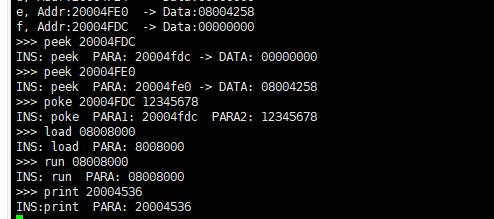

## 3 Boot Loader 实现

在实现了指令解析之后，我们可以具体实现 Bootloader 中 `peek`、`poke`、`load` 和 `run` 指令。

<span id="update1">

在实现 Bootloader 之前，我们需要了解 103 板的存储器布局，我们实验所用的开发板型号为 STM32F103C8T6，其 Flash memory 为 **64KB** ，SRAM 为 **20KB** 。其中，Flash memory 的起始地址为 `0x08000000`，SRAM 的起始地址为 `0x20000000`。如下图所示：


> 需要注意，此图中 Flash memory 为 128KB（因为图片为 STM32F103xx 通用的存储器布局），我们所用的开发板 Flash memory 为 64KB。如需要更加详细了解，可以参考 **<u>[STM32F103xx 数据手册](https://www.st.com/resource/zh/datasheet/stm32f103c8.pdf)</u>** 。

**需要重点关注 Flash memory 以及 SRAM 所在的地址区间，以免进行错误访问。** 在接下来实现 load 指令时，所产生的超时错误，很有可能是由于尝试擦除或者写入 Flash memory 以外的地址所导致的。

</span>

### 3.1 peek 指令

指令 `peek <addr>` 即为以一个字为单位，读取内存中 addr 位置的数据（addr是4字节对齐，十六进制的形式，长度为8位十六进制，没有引导字符，例如 `00008000`），并以十六进制的形式输出结果，输出结果为自然序（高位在前）。

此指令的实现较为容易，注意使用指针操作即可。可选的一种方法为使用 `sprintf` 函数，将数据输出到缓冲区的字符串中，再通过串口输出此字符串。

为了方便结果验证，请在完成此部分时，自行在代码中添加若干变量并赋值，在串口开始接收指令之前先将对应的变量地址和值输出到串口，以便验证此部分的代码是否正确。

`TASK4` ==请给出实现 peek 指令的关键代码。==（10分）

> ```c
> /*通过强制转换将参数转换成32bit指针类型，读取其中数据并格式化输出*/
> printf("INS: peek  PARA: %x -> DATA: %08x\r\n",arg0,*(int*)arg0);
> ```

`TASK5` ==在烧录后做若干测试，并证明结果正确性，请给出相应的截图。==（5分）

> p.s 变量未初始化
>
> 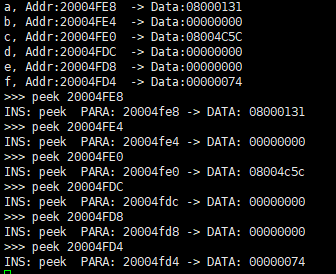

### 3.2 poke 指令

指令 `poke <addr> <data>` 以一个字为单位修改内存中 addr 位置的数据为 data（addr 是 4 字节对齐,十六进制的形式，长度为8位十六进制, data 也是十六进制的形式，长度为8位十六进制，为自然序高位在前）

与 `peek` 指令类似，也只需要通过一些简单的指针操作便可实现。需要注意的是，在测试此指令时，也需要自行添加若干变量并赋值。这样可以后续修改这些变量所在地址的值，方便进行验证。

`TASK6` ==请给出实现 poke 指令的关键代码。==（10分）

> ```c
> /*同peek一样进行指针操作，将参数一转换成32bit类型的指针，将参数二赋给该指针指向的区域即可*/
> *(int*)arg0 = arg1;
> ```
>
> 

`TASK7` ==在烧录后做若干测试，并配合 peek 指令证明结果正确性，请给出相应的截图。==（5分）

> 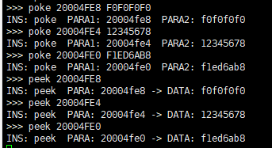

`TASK8` ==尝试随意寻找地址，并修改其中的值，可能会发生什么现象？为什么？==（5分）

> 可能会卡住，比如flash部分的地址被锁住，无法修改，程序卡死。如下图。
>
> 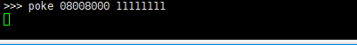
>
> 或者修改了某些程序需要用到的变量，导致程序向不可控的方向发展。

### 3.3 load 指令

#### 3.3.1 XModem 协议

XModem 协议是一种串口通信中广泛用到的异步文件传输协议。它以以128字节块的形式传输数据，每个块以SOH（0x01）开始，以CRC校验结束。每个块的格式如下：

| 命令字符 | 命令码  | 备注  |
| :-----: | :----: | :--: |
| SOH     | 0x01   | 数据头 |
| STX     | 0x02   |       |
| EOT     | 0x04   | 发送结束 |
| ACK     | 0x06   | 接收成功 |
| NAK     | 0x15   | 接收失败 |
| CAN     | 0x18   | 取消传输 |

XModem 包的格式如下：

```
---------------------------------------------------------------------------
|     Byte1     |    Byte2    |     Byte3      |Byte4~Byte131|  Byte132   |
|-------------------------------------------------------------------------|
|Start Of Header|Packet Number|~(Packet Number)| Packet Data |  Check Sum |
---------------------------------------------------------------------------
```

传输流程如下图所示：

```
------------------------------------------------------------------------------
|               SENDER                |          |          RECIEVER         |
|                                     |  <---    |  NAK                      |
|                                     |          |  Time out after 3 second  |
|                                     |  <---    |  NAK                      |
| SOH|0x01|0xFE|Data[0~127]|CheckSum| |  --->    |                           |
|                                     |  <---    |  ACK                      |
| SOH|0x02|0xFD|Data[0~127]|CheckSum| |  --->    |                           |
|                                     |  <---    |  NAK                      |
| SOH|0x02|0xFD|Data[0~127]|CheckSum| |  --->    |                           |
|                                     |  <---    |  ACK                      |
| SOH|0x03|0xFC|Data[0~127]|CheckSum| |  --->    |                           |
|                                     |  <---    |  ACK                      |
| .                                   |          |  .                        |
| .                                   |          |  .                        |
| .                                   |          |  .                        |
|                                     |  <---    |  ACK                      |
| EOT                                 |  --->    |                           |
|                                     |  <---    |  ACK                      |
------------------------------------------------------------------------------
```

可以参考如上流程，实现 XModem 协议，以便在串口上实现文件传输。此处允许使用开源的 XModem 协议实现，但需要在报告中说明使用的开源代码的出处。

???+ tip "参考资料"
    [XModem 协议](https://zhuanlan.zhihu.com/p/34464259)

同时，也可以参考官方给出的 **<u>[IAP](https://www.st.com/zh/embedded-software/x-cube-iap-usart.html)</u>** 。此 IAP 使用 YModem 协议，实现将串口文件从上位机传输到 STM32 的 Flash 中。

<span id="update2">

???+ note "IAP 提示"

    如果你想要使用以上 ST 官方提供的 IAP 进行移植，需要注意以下几点：
    
    - 需要在 AN4657-STM32Cube_IAP_using_UART / Projects / STM3210C_EVAL / IAP_Main 中寻找 `ymodem.c` 和 `ymodem.h`，放在Cube IDE工程的Drivers目录下，鼠标右键点击IDE右侧栏中含有ymodem.h等头文件的目录，选择“Add/Remove Include Path”，将其加入编译时的`-I`选项中。
    
    - 需要按需修改接收到的文件所存储的位置（更改 `APPLICATION_ADDRESS` ）。
    
    - 需要更改擦除 Flash 的范围（更改 `USER_FLASH_END_ADDRESS` ），以免擦除到其余地址导致错误。
    
    - 此 IAP 中使用的 `Ymodem_Receive`使用的是轮询模型，在调用此函数时，若之前开启了串口中断，需要将其关闭，否则会导致串口占用，无法进行文件传输。

</span>

#### 3.3.2 指令实现

指令 `load <addr>` 从串口接收一段二进制数据，保存在 addr 开始的地址中。需要使用 XModem、YModem 或 ZModem 协议进行数据传输。

注意，如果需要将数据保存在 FLASH 中，需要先擦除对应的扇区，然后再写入数据。因为在对 FLASH 进行编程时，只能将1变为0。擦除操作即为将Flash的某个扇区全部写入1。擦除完毕后，对 FLASH 进行编程，即可实现改变 FLASH 中的数据。

当然，本实验中没有要求一定要将数据保存在 FLASH 中，也可以将数据保存在 RAM 中，这样操作会更加简单，但数据会在断电后丢失。

<span id="update3">

如果你需要使用串口调试工具进行文件传输（即用软件帮助你做好相关协议的打包工作），在 MacOS 或者 Linux 系统下，可以继续使用 Picocom，但在 Windows 系统下，PuTTy 和 CoolTerm 对 XModem/YModem/ZModem 协议的支持不太好，可以尝试使用以下软件：

- **<u>[Xshell](https://www.netsarang.com/en/xshell/)</u>**

- **<u>[SecureCRT](https://www.vandyke.com/products/securecrt/)</u>**

- **<u>[TeraTerm](https://ttssh2.osdn.jp/index.html.en)</u>**

</span>

???+ tip "参考资料"
    HAL 库中提供了对 FLASH 的操作函数，可以直接使用。具体的函数请参考 **<u><a href="https://www.st.com/content/ccc/resource/technical/document/user_manual/2f/71/ba/b8/75/54/47/cf/DM00105879.pdf/files/DM00105879.pdf/jcr:content/translations/en.DM00105879.pdf" target="_blank">HAL手册</a></u>**。

    也可参考如下链接：**<u>[STM32中Flash的读写（HAL库）](https://doc.embedfire.com/mcu/stm32/f103mini/hal/zh/latest/book/FLASH.html)</u>** 

`TASK9` ==请给出实现 load 指令的关键代码。要求对协议实现或者借用开源代码的部分做出适当的解释。==（15分）

> ```c
> /*main while*/
> /*解析指令后先判断地址的合法性，我们规定用户使用的flash为0x08008000开始的32KB大小区域，其余地址
>  *报错。
>  * 然后直接调用基于XMODEM协议的接收函数，写入Flash也在该函数中一并完成。
>  */
> if((uint32_t)arg0 <0x08008000 || (uint32_t)arg0 > 0x0800FFFF ){
> 	printf("Invalid ADDR!!! \r\n");
> }
> Xmodem_Receive(&huart1, (uint32_t *)arg0);
> ```
>
> ```c
> /*xmodem.h xmodem.c*/
> /* .h文件中主要定义了一些用到的常量以及一个单独的Xmodem_Receive函数*/ 
> #define SOH                     ((uint8_t)0x01)  /* start of 128-byte data packet */
> #define STX                     ((uint8_t)0x02)  /* start of 1024-byte data packet */
> #define EOT                     ((uint8_t)0x04)  /* end of transmission */
> #define ACK                     ((uint8_t)0x06)  /* acknowledge */
> #define NAK                     ((uint8_t)0x15)  /* negative acknowledge */
> #define CA                      ((uint32_t)0x18) /* two of these in succession aborts transfer */
> #define CRC16                   ((uint8_t)0x43)  /* 'C' == 0x43, request 16-bit CRC */
> #define NEGATIVE_BYTE           ((uint8_t)0xFF)
> 
> #define PACKET_SIZE				132
> #define DATA_SIZE				128
> #define PACKET_NUM_INDEX		1
> #define PACKET_NEGNUM_INDEX		2
> #define DATA_START_INDEX		3
> #define CHECKSUM_INDEX			131
> 
> #define RcFLG_SUCC				0
> #define RcFLG_END				1//EOT
> #define RcFLG_TimeOut   		2//超时
> #define RcFLG_CKWRONG			3//校验错误
> #define RcFLG_NUMWRONG			4//序号错误
> 
> #define RcState_PRE				0
> #define RcState_Rc				1
> #define RcState_EOT				2
> 
> uint8_t Xmodem_Receive(UART_HandleTypeDef *huart, uint32_t* addr);
> 
> /* .c文件中主要实现Xmodem_Receive函数以及接收单个包的静态函数Receive_Packet 
>  * 直接使用了官方IAP的计算校验和的函数 CalcChecksum
>  * Xshell 传输128Byte的Xmodem协议使用的是Checksum校验，NAK发送接受请求 
>  * 函数处理过程可能有一些奇怪的时序问题，导致程序运行结果出错，使用时延函数解决
>  */
> uint8_t Xmodem_Receive(UART_HandleTypeDef *huart, uint32_t* addr)
> {
> 	HAL_UART_AbortReceive(&huart1); //关闭uart1中断
> 	FLASH_If_Erase(USER_FLASH_START);//每次接收擦除一次用户的FLASH区
> 	HAL_Delay(2000);
> 
> 	uint8_t packet[132]; //接收整个包的数组
> 	uint32_t size = 0; //包大小
> 
> 	uint8_t Rc_State = 0;
>     /*  状态机实现轮询接收，总共为3个状态
>     	准备状态，接收状态，结束状态。
>     */
> 	while(1)
> 	{
> 		if(Rc_State == RcState_PRE){ //准备状态
> 			Serial_PutByte(NAK);//发送NAK接收请求
> 
> 			uint8_t unuse;
> 			HAL_UART_Receive(huart, &unuse, 1, 1000);
>             //第一个包的第一个字节无用，官方注释是用于内存对其？
> 
> 			Rc_State = RcState_Rc;//转换到接收态
> 
> 		}
> 		else if(Rc_State == RcState_Rc){
> 			uint8_t state;
> 			state =  Receive_Packet(huart, packet, &size, 1000);//接收数据包
> 			HAL_Delay(50);
> 
> 			if(state == RcFLG_SUCC){//成功接收一个数据包
> 				Rc_State = RcState_Rc;
> 
> 				FLASH_If_Write((uint32_t)addr,(uint32_t *)(&packet[DATA_START_INDEX]), DATA_SIZE/4);
>                 //将接收到的数据写入Flash，由于使用官方IAP函数，传入的参数为32位类型，且内部四字节一写入，因此第三个参数数据大小需要在单字节大小基础上除以4.
> 
> 				addr += DATA_SIZE/4;//addr为四字节类型，计算时同上。
> 				Serial_PutByte(ACK);//发送ACK，一个包处理完成
> 			}
> 			else if(state == RcFLG_END){//接收到EOT包，即将结束传输
> 				Rc_State = RcState_EOT;//转换到结束态
> 				Serial_PutByte(ACK);
> 			}
> 			else if(state == RcFLG_TimeOut || state == RcFLG_CKWRONG || state == RcFLG_NUMWRONG){//异常处理，重发即可
> 				Rc_State = RcState_Rc;
> 				Serial_PutByte(NAK);//发送NAK，包未处理成功
> 			}
> 		}
> 		else if(Rc_State == RcState_EOT){
> 			uint8_t ch[25]  = "END OF TRANSMIT!!! \r\n";
> 			HAL_UART_Transmit(huart, ch, 25, 0xFFFF);//发送结束提示信息
> 			break;//结束轮询
> 		}
> 		else {
> 		}
> 	}
> 
> 	HAL_UART_Receive_IT(&huart1, (uint8_t *)UART1_temp , 1);//重新开启串口接收中断。
> 	return 0;
> }
> static uint8_t Receive_Packet(UART_HandleTypeDef *huart, uint8_t *p_data, uint32_t *p_size, uint32_t timeout)
> {
> 	uint32_t start_Time = HAL_GetTick();//用于计算超时
> 	uint8_t retries = 0;//接收次数
> 	static uint8_t max_retries = 10;//最大接收次数
> 
> 	for(; retries < max_retries ; retries++ )
> 	{
> 		uint8_t state = HAL_UART_Receive(huart, p_data, 1, 1000);//由于不一定是数据包，需要先接收一个字节判断包类型
> 
> 		if(state == HAL_OK)
> 		{
> 			if(p_data[0] == SOH)//数据包
> 			{
> 				HAL_UART_Receive(huart, &p_data[1], PACKET_SIZE - 1, 1000);//接收数据以及校验和
> 				if(p_data[1] != ((p_data[2]) ^ NEGATIVE_BYTE))//检测序号是否正确
> 				{
> 					return RcFLG_NUMWRONG;
> 				}
> 				if(p_data[CHECKSUM_INDEX] != CalcChecksum(&p_data[DATA_START_INDEX], DATA_SIZE ))//检测校验和
> 				{
> 					return RcFLG_CKWRONG;
> 				}
> 				return RcFLG_SUCC;//返回成功值
> 
> 			}
> 			else if(p_data[0] == EOT)//结束包
> 			{
> 				return RcFLG_END;//返回结束值
> 			}
> 		}
> 		if(HAL_GetTick() - start_Time >= timeout)
> 		{
> 			return RcFLG_TimeOut;//超时
> 		}
> 	}
> 	return RcFLG_TimeOut;
> }
> ```
>
> ```c
> /*flash_if.h flash_if.c*/
> /*直接套用官方IAP例子*/
> /*主要使用三个函数：初始化，擦除以及写入*/
> void FLASH_If_Init(void)//初始化函数，在while前调用，清除Flash标志位
> {
>   HAL_FLASH_Unlock();
>   __HAL_FLASH_CLEAR_FLAG(FLASH_FLAG_EOP | FLASH_FLAG_PGERR | FLASH_FLAG_WRPERR);
>   HAL_FLASH_Lock();
> }
> uint32_t FLASH_If_Erase(uint32_t start)//擦除函数
> {
>   uint32_t NbrOfPages = 0;
>   uint32_t PageError = 0;
>   FLASH_EraseInitTypeDef pEraseInit;
>   HAL_StatusTypeDef status = HAL_OK;
>   HAL_FLASH_Unlock();
> 
>   /* Get the sector where start the user flash area */
>   NbrOfPages = (USER_FLASH_END_ADDRESS - start)/FLASH_PAGE_SIZE;
>   //计算需要擦除的页数，将参数地址到flash末尾地址全部擦除，实际使用时start固定为08008000
> 
>   pEraseInit.TypeErase = FLASH_TYPEERASE_PAGES;
>   pEraseInit.PageAddress = start;
>   pEraseInit.Banks = FLASH_BANK_1;
>   pEraseInit.NbPages = NbrOfPages;//对FLASH_EraseInitTypeDef 类型的域进行赋值
>   status = HAL_FLASHEx_Erase(&pEraseInit, &PageError);//直接调用对应函数即可完成擦除
>     
>   HAL_FLASH_Lock();
> 
>   if (status != HAL_OK)
>   {
>     return FLASHIF_ERASEKO;
>   }
>   return FLASHIF_OK;
> }
> uint32_t FLASH_If_Write(uint32_t destination, uint32_t *p_source, uint32_t length)
> // destination 即要写入的flash地址，p_source即要写入数据的存储地址，length即数据的四字节长度。
> {
>   uint32_t i = 0;//即写入数据的索引
>   HAL_FLASH_Unlock();
>   for (i = 0; (i < length) && (destination <= (USER_FLASH_END_ADDRESS-4)); i++)
>   {
>     if (HAL_FLASH_Program(FLASH_TYPEPROGRAM_WORD, destination, *(uint32_t*)(p_source+i)) == HAL_OK)//四字节进行写入
>     {
>       if (*(uint32_t*)destination != *(uint32_t*)(p_source+i))//检查写入值
>       {
>         return(FLASHIF_WRITINGCTRL_ERROR);
>       }
>       /* Increment FLASH destination address */
>       destination += 4;//计算下一次写入的flash位置，destination 不是指针类型，按单字节进行加减计算即可
>     }
>     else
>     {
>       return (FLASHIF_WRITING_ERROR);
>     }
>   }
>   HAL_FLASH_Lock();
>   return (FLASHIF_OK);
> }
> ```
>
> 

`TASK10` ==在烧录后做若干测试，并配合 peek 指令证明结果正确性，请给出相应的截图。烧录的二进制文件可以自己使用 **<u>[ImHex](https://imhex.werwolv.net)</u>** 或其他编辑器创建。==（5分）

> 烧录的的文件
>
> 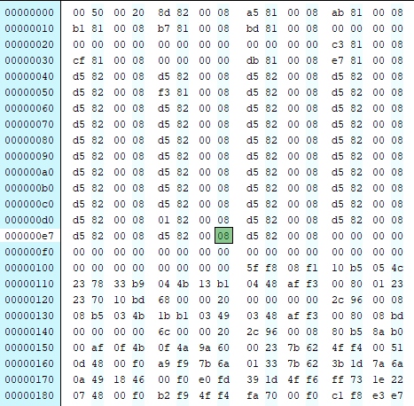
>
> 检测
>
> 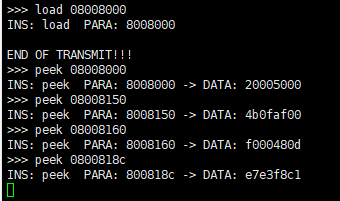

### 3.4 run 指令

`run <addr>` 指令为运行 RAM（或FLASH）地址 addr 开始的程序。

???+ tip "提示"
    本实验中，可以直接使用 `__set_MSP(addr)` 函数，将 addr 的值作为栈顶地址，然后跳转到 addr 开始的地址执行程序。

???+ tip "参考资料"
    [STM32 Cube IDE 下实现 IAP —— (1) 程序跳转](http://ibotx.com/?p=191)

    可以参考上述 `go2APP` 函数，实现 `run` 指令。但请在你所写的代码中给出详细的注释。

`TASK11` ==请给出实现 run 指令的关键代码。要求对代码做出较为详细的解释。==（10分）

> ```c
> /* main while*/
> JumpAddress = *(__IO uint32_t*) (arg0 + 4);//读取APP的main函数入口地址
> Jump_To_Application = (pFunction) JumpAddress; //类型转换，将普通地址转换成函数，
> __set_MSP(*(__IO uint32_t*) arg0);//设置APP的栈
> Jump_To_Application();//跳转到APP的main函数
> 
> /*APP main*/
> /*主要是最开头添加 重新定义中断的向量表 ，main函数内的初始化都可以舍弃减少文件大小,当然留着也行*/
> SCB->VTOR = FLASH_BASE | 0X8000;
> while(1)
> {
>     HAL_GPIO_TogglePin(LED_GPIO_Port, LED_Pin);
> 	HAL_Delay(500);
> }
> 
> ```
>
> 

实现 `run` 指令后，可以使用 `load` 指令将编译好的其他二进制文件烧录到 RAM 中，然后使用 `run` 指令运行。

<span id="update4">

STM32CubeIDE 编译默认产生的二进制文件为 `*.elf` 格式，而在使用 `load` 指令烧录到 RAM 中时，需要使用 `*.bin` 格式的文件。可以在 "Project -> Properties -> C/C++ Build -> Settings -> MCU Post build outputs" 中勾选 "Convert to binary file (-O binary)"，之后便可在对应工程的 Debug 文件夹中找到对应的 `*.bin` 文件。如下图所示：


</span>

需要注意的是，在编译二进制文件时，默认的入口地址为 0x08000000，即 Flash 的起始地址。由于存在了 bootloader，我们想要同时烧录其他程序在103板上时，需要对 Flash 的起始地址进行偏移，否则会导致覆盖，或者导致错误的中断偏移量，从而导致程序无法正常运行。具体的偏移量可以在 `STM32F103C8TX_FLASH.ld` 文件中找到`Memories definition`这一项，并进行修改。同时需要在`system_stm32f1xx.c`中修改 `VECT_TAB_OFFSET` 的值，以保证中断偏移量的正确。

???+ tip "参考资料"
    [STM32CubeIDE修改Flash/ROM起始地址及地址范围](https://www.cxyzjd.com/article/xiaowenshen/117468078)

`TASK12` ==请给出你在 `STM32F103C8TX_FLASH.ld` 中配置的 `Memories definition` 以及 `system_stm32f1xx.c` 中设置的 `VECT_TAB_OFFSET`. 注意，不需要修改 bootloader 程序的这些参数，只需要修改你想放置在 bootloader 后的其他程序的这些参数。==（5分）

> ```c
> /*STM32F103C8TX_FLASH.ld*/
> MEMORY
> {
>   RAM    (xrw)    : ORIGIN = 0x20000000,   LENGTH = 20K
>   FLASH    (rx)    : ORIGIN = 0x8008000,   LENGTH = 32K
> }
> 
> /*system_stm32f1xx.c*/
> #define VECT_TAB_OFFSET         0x00008000U
> ```
>
> 

`TASK13` ==请使用 `load` 指令将你编译好的二进制文件（选择实验1中的闪烁LED灯即可）烧录至103板，并使用 `run` 指令运行。给出使用 `run` 指令后成功跳转至指定程序运行的截图。==（10分）

> 执行指令
>
> 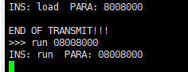
>
> 灯光闪烁
>
> 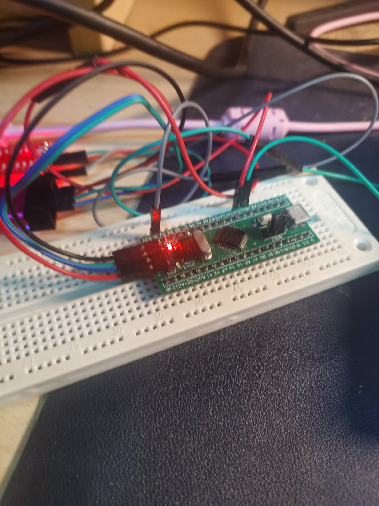
>
> 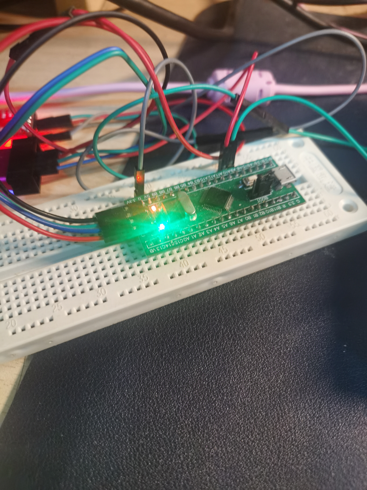
>
> debug模式下暂停观察其pc以及sp寄存器，肯定跳转到了APP对应地址。
>
> 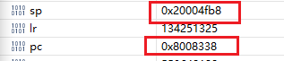

### 3.5 print 指令（Bonus）

`print <addr>` 指令以字符形式输出从addr开始的字节，直到0x00为止，addr不需要是4字节对齐的。

`BONUS1` ==请给出实现 print 指令的关键代码。要求对代码做出较为详细的解释。==（5分Bonus）

> ```
> /*将参数转换成单字节指针，逐一检查值，不是00就输出，然后地址+1，进行下一地址的检查*/
> uint8_t* addr = (uint8_t*)arg0;
> while(*addr != 0x00){
> 	HAL_UART_Transmit(&huart1, addr,1, 0xFFFF);//单字节输出
> 	addr +=1;
> }
> ```
>
> 

`BONUS2` ==请给出使用 print 指令输出字符串的截图。==（5分Bonus）

> 利用poke写入，输出成功。
>
> 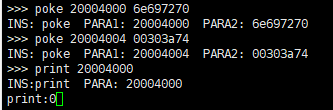

## 4 讨论和心得

本次实验主要有三个难点，

一个是用于接收指令串口接收中断函数配置，需要在main函数内调用开启中断且每次接收后回调函数内还需要再次调用开启，而且回调处理函数内不能使用串口发送函数，以及每次最好只接收一个字符，然后将接收到的字符拼接起来使用。

另一个是Xmodem协议实现，主要是使用的Xshell串口调试软件所用的Xmodem协议最初属于黑盒，偏偏Xmodem协议又有不同类型，而且网络上主流资料都介绍的是CRC16类型的协议，但Xshell却使用Checksum.导致摸索该协议花费了许多时间

最后就是run指令，在APP要重新设置中断，不然无法运行，这个也难以调试，在网络上不断查资料才解决
