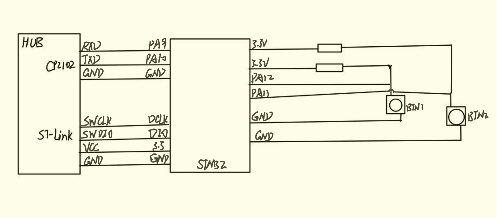
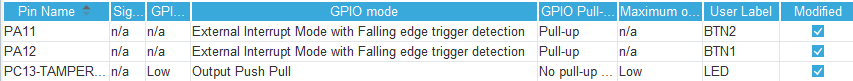
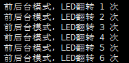
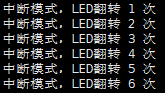
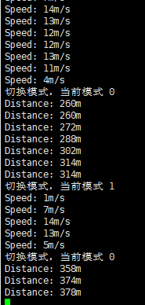

# 实验4指南

<!-- !!! danger "本实验指南尚未发布，内容随时可能发生变化" -->

<!-- <div style="display:none"> -->

请跟随实验指南完成实验，完成文档中所有的`TASK`。`BONUS`部分的内容完成可作为加分，但报告的总分不应超过100分。请下载此指南作为实验报告模版，将填充完成的实验报告导出为PDF格式，并命名为“学号_姓名_lab4.pdf”，上传至学在浙大平台。下载请点击 **<u>[这里](../download.md)</u>** 。

## 1 硬件连线

请参考 Lab1 中的按钮连接方法，通过面包板在PA11和PA12（若引脚有别的外设占用，可自行更改引脚）各连接一个按钮开关到地。并参考之前的连线完成103板和CP2102以及ST-Link的连接。

`TASK1` ==请拍摄你所连接的实物图==（5分）

> 

`TASK2` ==请画出完整的连线示意图，包括103板、ST-Link、开关以及串口，要求标记清楚需要连线的引脚==（5分）



## 2 外部中断EXTI

可以配置在GPIO的电平发生某种特定变化（上升沿/下降沿等）时触发中断，从而使得103板能够及时响应外部设备的变化。

STM32的GPIO中断/外部中断EXTI同时支持配置中断优先级以及中断嵌套。

关于使用HAL库配置GPIO中断/外部中断EXTI的具体方法，请参考以下链接：

!!! tip "参考资料"
    [STM32的HAL库开发系列 - GPIO中断/外部中断EXTI](https://developer.aliyun.com/article/1141153)

## 3 按键中断点灯

在 lab1 中，我们已经实现了用轮询的方式，在主循环中实现通过按钮控制LED灯的亮灭。

在本实验中，我们需要通过按键外部中断的方式来控制LED灯的亮灭。要求实现每次按下按键后，LED灯切换一次状态（亮变灭，灭变亮）。

请参考之前的按钮配置，但需要注意将引脚配置为中断引脚（`GPIO_EXTIx`），同时配置中断触发方式为下降沿触发。（任意选择其中一个按键即可，另一个按键将在配置码表时使用）

配置完成后，你需要重写中断服务函数 `HAL_GPIO_EXTI_Callback(uint16_t GPIO_Pin)`  。在每次引脚中断发生时，此函数会被调用。你需要实现每次按键中断发生时，LED灯的状态切换一次。本实验仍然要求实现按键去抖。

!!! tip "参考资料"
    [STM32外部中断模式控制LED灯亮灭](https://blog.csdn.net/qq_55894922/article/details/127416027)

    注意，上述参考资料所使用的开发环境不完全相同，也存在一些小错误。请注意参考。

`TASK3` ==请给出配置ioc文件中中断引脚的几个关键配置的截图==（5分）

> 
>
> 使能中断
>
> 
>
> 

`TASK4` ==编写前后台程序，在中断服务函数中使用尽量少的操作，完成LED灯状态的切换。请在此处给出 `while(1)` 以及 `HAL_GPIO_EXTI_Callback()` 中的代码。==（5分）

> ```c
> /*while(1)*/
> #ifdef LED_FB
> if(LED_flag){
>   HAL_Delay(16);//延时后如果还处于按下状态，说明稳定了
>   if(HAL_GPIO_ReadPin(BTN1_GPIO_Port, BTN1_Pin) == GPIO_PIN_RESET){
>     HAL_GPIO_TogglePin(LED_GPIO_Port, LED_Pin);//翻转LED
>     //计数，显示
>     times++;
>     sprintf(data_buffer,"前后台模式，LED翻转 %d 次\r\n",times);
>     HAL_UART_Transmit_DMA(&huart1,data_buffer,128);
>   }
>   LED_flag = 0;
> }
> #endif
> 
> /*HAL_GPIO_EXTI_Callback()*/
> #ifdef LED_FB
> if(GPIO_Pin == BTN1_Pin){
>   if(HAL_GPIO_ReadPin(BTN1_GPIO_Port, BTN1_Pin) == GPIO_PIN_RESET)
>     LED_flag = 1; //LED翻转标志
> }
> #endif
> ```
>
> 

`TASK5` ==编写中断驱动模式程序，在中断服务函数中完成LED灯状态的切换（包括去抖操作），主循环中不进行任何操作。请在此处给出 `HAL_GPIO_EXTI_Callback()` 中的代码。==（5分）

> ```c
> #ifdef LED_IT
> if(GPIO_Pin == BTN1_Pin){
>   My_Delay(16); //延时16ms
>   if(HAL_GPIO_ReadPin(BTN1_GPIO_Port, BTN1_Pin) == GPIO_PIN_RESET){
>     HAL_GPIO_TogglePin(LED_GPIO_Port, LED_Pin);//LED翻转
>     times++;
>     sprintf(data_buffer,"中断模式，LED翻转 %d 次\r\n",times);
>     HAL_UART_Transmit_DMA(&huart1,data_buffer,128);
>   }
> }
> #endif
> ```

`TASK6` ==在 TASK4 和 TASK5 的基础上，实现每次切换LED灯状态时，在串口输出相应的信息。请在此处给出实现的代码以及串口输出的信息截图。==（5分）

> 记录转换次数，在串口使用DMA模式进行输出。都在LED状态翻转后进行输出。分别是`while(1)`和中断处理程序内
>
> ```c
> sprintf(data_buffer,"中断模式，LED翻转 %d 次\r\n",times);
> HAL_UART_Transmit_DMA(&huart1,data_buffer,128);
> ```
>
> 
>
> 

`TASK7` ==思考：若在中断函数中使用轮询的方式向串口发送信息，或者在中断函数中使用延时进行去抖操作，会有什么潜在问题？==（5分）

> 1. 中断处理函数执行期间，中断请求可能屏蔽。使用延时函数会导致系统响应时间变长，影响系统实时性。
> 2. 竞态条件。中断处理函数中使用轮询像串口发送信息，可能被其余高优先级中断打断，导致竞态条件，使数据丢失或错误。同样，使用延时期间发生其他中断，可能导致去抖失败。
> 3. 中断嵌套，如果多个中断的优先级配置有误，多个中断之间打断，可能导致系统出现不可知的行为，程序出现错误，且调试困难。

`TASK8` ==在TASK5中，你能够在中断服务函数中正常使用`HAL_Delay()`函数吗？如果不能，你的解决方法是什么？==（5分） 

> 如果不对中断优先级进行调整，是无法正常使用`HAL_Delay()`的。
>
> 解决方案有
>
> 1. 将`Systick`中断的的优先级提高到比中断服务函数高比如GPIO外部中断的优先级为1，`Systick`的优先级设为0.
> 2. 使用TIM取代`Systick`进行延时，实现原理和`HAL_Delay()`类似
>
> ```c
> void HAL_TIM_PeriodElapsedCallback(TIM_HandleTypeDef *htim)
> {
>     if(htim == &htim2){
>     	timeR++; //TIM精度为1ms一中断
>   	}
> }
> void My_Delay(int delay)
> {
> 	int start = timeR;
> 	while(timeR - start < delay);
> }
> ```
>
> 3. 不使用延时函数去抖动。原理为设置一个16位变量，按钮按下期间每ms检测引脚电位，如果为按下状态，该变量右移一位并加1，否则右移不加1.当该变量为0xFFFF时，至少就延时了16ms，按钮肯定为稳定状态，此时进行LED状态变换。
>
>    另外，通过另一个变量进行中断和主程序的通信，检测该次按下LED是否改变状态。当然也可以直接在TIM中断函数中处理LED翻转。
>
>    注意此时外部中断需要在上升下降双边沿都进入中断。
>
> ```c
> void HAL_TIM_PeriodElapsedCallback(TIM_HandleTypeDef *htim)
> {
>   #ifdef TEST_Dither
>   if(htim == &htim2){
>     if(rising){
>       dither <<= 1;
>       dither += 1;
>     } else {
>       dither <<=1;
>       dither += 0;
>     }
>     if(dither == 0xFFFF){
>       if(Change == 0)
>         LED_flg = 1;
>     }else{
>       LED_flg =0;
>       Change = 0;
>     }
>   }
>   #endif
> }
> void HAL_GPIO_EXTI_Callback(uint16_t GPIO_Pin)
> {
>   #ifdef  TEST_Dither
>   if(GPIO_Pin == BTN1_Pin){
>     if(HAL_GPIO_ReadPin(BTN1_GPIO_Port, BTN1_Pin) == GPIO_PIN_RESET){
>       rising = 1;
>     } else {
>       rising = 0;
>     }
>   }
>   #endif
> }
> /*main while(1)*/
> #ifdef TEST_Dither
>     if(LED_flg == 1 && Change == 0){
>       HAL_GPIO_TogglePin(LED_GPIO_Port, LED_Pin);
>       Change =1;
>       times++;
>       sprintf(data_buffer,"前后台模式，LED翻转 %d 次\r\n",times);
>       HAL_UART_Transmit_DMA(&huart1,data_buffer,128);
>     }
> #endif
> ```
>
> 

!!! tip "提示"
    在ioc文件配置中的 System Core -> NVIC Settings 中，可以配置中断优先级，其中，数字越小，优先级越高。在中断服务函数中，可以通过 `HAL_NVIC_GetPriority()` 函数获取中断优先级，通过 `HAL_NVIC_SetPriority()` 函数设置中断优先级。

    在进行中断嵌套时，中断优先级的设置会影响中断的响应。

## 4 码表

本实验中需要实现一个简单的自行车码表，用于测量自行车行驶的里程和速度。我们可以通过测量轮胎转过的圈数来计算里程，通过测量轮胎转过的圈数和时间来计算速度。

在本实验中，将测量轮胎转过的圈数的霍尔元件简化为了一个按钮，每按下此按钮，即代表轮胎转过一圈。另一个按钮则负责切换显示模式（里程/速度）。自行车轮胎的周长可自己定义，合理即可。

所测量的里程/速度需要通过串口输出，要求每秒输出一次。所显示的里程为总里程，速度为近似的当前瞬时速度。

`TASK9` ==应当如何设计速度的计算方式，使得在选择为速度模式时，每秒输出的速度接近当时的瞬时速度？==（5分）

> 我们计算的速度实际上都是一段时间内的平均速度，只要我们计算该平均速度的时间周期尽可能短，就可以接近瞬时速度。由于我们显示的周期为1s，可以将我们测速的周期也置为1s，计算1s内的行驶距离即可得到速度。

!!! tip "提示"
    可以近似的认为自行车的速度变化曲线是较为均匀平滑的。不必采用过于复杂的计算方法。

在此实验中，你可能会需要定义一些全局变量，用于记录距离、状态、中断标识等信息。

### 4.1 前后台程序的码表

编写前后台程序，以中断处理时钟定时器和其中一个按钮（模拟钢圈计数），以主循环读取按钮的变化值并根据定时的值做输出，第二个按钮（模拟模式切换）由主程序轮询判断，用以改变输出的数据（速度还是里程）。程序通过串口输出；

`TASK10` ==请在下方给出主循环中的代码，并附上较为详细的注释。主循环应当处理绝大部分内容。==（10分）

> ```c
> #ifdef Cyclocomputer_FB
> if(Switch_Mode_Flg){//切换模式
>   HAL_Delay(10); //延时去抖
>   if(HAL_GPIO_ReadPin(BTN2_GPIO_Port, BTN2_Pin) == GPIO_PIN_RESET){
>     cur_mode = (cur_mode+1 ) % NUM_Modes; //切换模式
>     //输出信息
>     memset(data_buffer,0x00,BUFFER_SIZE);
>     sprintf(data_buffer,"切换模式，当前模式 %d\r\n",cur_mode);
>     HAL_UART_Transmit_DMA(&huart1,data_buffer,128);
>     Switch_Mode_Flg = 0;//重置标志位
>   }
> }
> if(Add_Cycle_Flg){//增加圈数计数
>   HAL_Delay(10);
>   if(HAL_GPIO_ReadPin(BTN1_GPIO_Port, BTN1_Pin) == GPIO_PIN_RESET){
>     new_record += Add_Cycle_Flg;//最新200ms的圈数
>     cycles += Add_Cycle_Flg; //总圈数
>     Add_Cycle_Flg = 0;
>   }
> }
> if(Record_UT_Flg){//更新圈数记录，200ms记录一次
>   record[cur_index] = new_record; //存入数组
>   cur_index = (cur_index+1) % RECORD_NUMS;//更新索引，循环记录
>   new_record = 0;//清空，重新记录
>   Record_UT_Flg = 0;
> }
> if(Display_Flg){//显示标志位
>   if(cur_mode){//显示速度
>     int speed = SUM(record, RECORD_NUMS) * CycleLength / 2;//计算2s内平均速度作为速度
>     memset(data_buffer,0x00,BUFFER_SIZE);
>     sprintf(data_buffer,"Speed: %dm/s\r\n",speed);
>     HAL_UART_Transmit_DMA(&huart1,data_buffer,128);
>   } else {//显示里程
>     int distance = cycles * CycleLength ; //计算总里程
>     memset(data_buffer,0x00,BUFFER_SIZE);
>     sprintf(data_buffer,"Distance: %dm\r\n",distance);
>     HAL_UART_Transmit_DMA(&huart1,data_buffer,128);
>   }
>   Display_Flg = 0;
> }
> #endif
> ```
>
> 

`TASK11` ==请在下方给出定时器中断函数中的代码，并附上较为详细的注释。其中应尽量处理较少的事务。==（5分）

> ```c
> #ifdef Cyclocomputer_FB
> if(htim == &htim2){
>    timeR++;//记录时间，精度1ms 
>    if(timeR % RECORD_UPDATE_TIME == 0){ //钢圈计数200ms更新一次
>      Record_UT_Flg = 1;  //更新标志位
>    }
>    if(timeR % DISPLAY_TIME == 0){//每秒显示1次
>      Display_Flg = 1; //显示标志位
>    }
> }
> #endif
> ```
>
> 

`TASK12` ==请在下方给出模拟钢圈的按键中断函数中的代码，并附上较为详细的注释。其中应尽量处理较少的事务。==（5分）

> ```c
> #ifdef Cyclocomputer_FB
> if(GPIO_Pin == BTN1_Pin && HAL_GPIO_ReadPin(BTN1_GPIO_Port, BTN1_Pin) == GPIO_PIN_RESET){
>     Add_Cycle_Flg =1;//钢圈计数模拟按键，计数标志
> }
> if(GPIO_Pin == BTN2_Pin && HAL_GPIO_ReadPin(BTN2_GPIO_Port, BTN2_Pin) == GPIO_PIN_RESET){
>     Switch_Mode_Flg = 1;//模式切换标志
> }
> #endif
> ```
>
> 

`TASK13` ==以上三个任务中，均强调在中断函数中做较少的内容，而在主循环中处理更多的任务，这样有什么好处？==（5分）

> 可以提高系统的实时性和响应性能，中断函数如果执行时间过长，会导致其余任务无法及时响应，影响系统的实时性。耗时 较长的任务放到主循环中，就减少了对其余任务的影响。
>
> 简化中断函数的设计和调试，复杂的中断处理容易导致程序出现错误，且难以调试。
>
> 提高系统的稳定性和可靠性：中断函数通常需要访问共享资源，如果在中断函数中处理过多的任务，容易出现资源竞争的问题，从而影响系统的稳定性和可靠性。将较多的任务放在主循环中处理，可以避免资源竞争问题，提高系统的稳定性和可靠性。
>
> 

### 4.2 中断驱动模式的码表

编写中断驱动模式程序，以中断处理时钟定时器和两个按钮（模拟钢圈计数以及模拟模式切换），主程序循环中不做事情。

`TASK14` ==请在下方给出定时器中断函数中的代码，并附上较为详细的注释。==（5分）

> ```c
> #ifdef Cyclocomputer_IT
> if(htim == &htim2){
>    timeR++;
>    if(timeR % RECORD_UPDATE_TIME == 0){ //钢圈记录更新，精度200ms
>      record[cur_index] = new_record; //添加新纪录
>      cur_index = (cur_index+1) % RECORD_NUMS;//下一个更新的记录索引
>      new_record = 0;//重置记录
>    }
>    if(timeR % DISPLAY_TIME == 0){ //每秒显示1次
>     if(cur_mode){//速度
>       int speed = SUM(record, RECORD_NUMS) * CycleLength / 2; //2s平均速度计算
>       memset(data_buffer,0x00,BUFFER_SIZE);
>       sprintf(data_buffer,"Speed: %dm/s\r\n",speed);
>       HAL_UART_Transmit_DMA(&huart1,data_buffer,128);
>     } else {
>       int distance = cycles * CycleLength ;  //里程计算
>       memset(data_buffer,0x00,BUFFER_SIZE);
>       sprintf(data_buffer,"Distance: %dm\r\n",distance);
>       HAL_UART_Transmit_DMA(&huart1,data_buffer,128);
>     }
>    }
> }
> #endif
> ```
>
> 

`TASK15` ==请在下方给出模拟钢圈的按键中断函数中的代码，并附上较为详细的注释。==（10分）

> ```c
> #ifdef Cyclocomputer_IT
> if(GPIO_Pin == BTN1_Pin && HAL_GPIO_ReadPin(BTN1_GPIO_Port, BTN1_Pin) == GPIO_PIN_RESET){
>   My_Delay(16);
>   if(HAL_GPIO_ReadPin(BTN1_GPIO_Port, BTN1_Pin) == GPIO_PIN_RESET){//钢圈模拟
>     cycles ++; //总圈数增加
>     new_record++; //最新200ms计数增加
>   }
> }
> #endif
> ```
>
> 

`TASK16` ==请在下方给出模拟模式切换的按键中断函数中的代码，并附上较为详细的注释。==（10分）

> ```c
> if(GPIO_Pin == BTN2_Pin && HAL_GPIO_ReadPin(BTN2_GPIO_Port, BTN2_Pin) == GPIO_PIN_RESET){
>   My_Delay(16);
>   if(HAL_GPIO_ReadPin(BTN2_GPIO_Port, BTN2_Pin) == GPIO_PIN_RESET){// 模式切换
>     cur_mode = (cur_mode+1 ) % NUM_Modes; //模式切换，两个模式0里程，1速度
>     memset(data_buffer,0x00,BUFFER_SIZE);
>     sprintf(data_buffer,"切换模式，当前模式 %d\r\n",cur_mode);
>     HAL_UART_Transmit_DMA(&huart1,data_buffer,128);
>   }
> }
> ```
>
> 

`TASK17` ==请在程序运行后尝试两个按钮的功能，并给出串口输出的截图，如下图所示（请替换为你自己的截图）==（5分）

> 

## 5 拓展内容

### 5.1 定时器的外部触发

尝试使用外部触发的方式进行计时，并实现4中码表的功能。

`BONUS1` ==请在下方给出实现定时器外部触发的关键代码，并附上较为详细的注释。==（5分bonus）

### 5.2 动态队列

请尝试使用动态队列模式编写程序，要求在中断响应程序中将对应的函数指针加入动态队列，主函数通过遍历队列来依次执行。

`BONUS2` ==请在下方给出实现动态队列的关键代码，并附上较为详细的注释。如果你已经了解过RTOS，可以讲一讲这种模式和RTOS调度的类似点==（10分bonus）

## 6 讨论和心得

> 请认真填写本模块，若不填写或胡乱填写将酌情扣分，写明白真实情况即可。

目前的实验在程序逻辑上都没有大问题，主要在于硬件配置方面容易出错，以及对HAL库不熟悉导致函数使用出错。

本次实验第一个问题在于中断优先级的设置，最初并未意识到优先级的问题，一运行到延时函数程序就卡住了。后续对Systick和GPIO外部中断的优先级进行调整才弄明白，包括使用自定义时钟延时也需要设置好优先级。

第二个问题是串口的DMA输出，最初在中断处理程序中使用的是局部变量作缓冲区，然而一直输出的是乱码，而换到主程序来却没有问题。怀疑是局部变量在中断处理函数结束后释放并被覆盖，而主程序中的局部变量一直在栈中存储，因为使用的变量较少也不存在变量覆盖的问题，所以没有出错。后面申明了全局变量作为缓冲区。
