# 实验5指南

<!-- !!! danger "本实验指南尚未发布，内容随时可能发生变化" -->

???+ note "5-4 更新内容"

    - 补充 “讨论和心得” 部分

<!-- <div style="display:none"> -->

请跟随实验指南完成实验，完成文档中所有的`TASK`。`BONUS`部分的内容完成可作为加分，但报告的总分不应超过100分。请下载此指南作为实验报告模版，将填充完成的实验报告导出为PDF格式，并命名为“学号_姓名_lab5.pdf”，上传至学在浙大平台。下载请点击 **<u>[这里](../download.md)</u>** 。

由于本实验较为复杂，涉及到较多新硬件，硬件整体连线部分将靠后讲解，可先在之前完成基本的芯片配置，在后续实验中逐步配置其余引脚等。

## 1 FreeRTOS

FreeRTOS 由美国的 RichardBarry 于2003年发布，RichardBarry是 FreeRTOS 的拥有者和维护者，在过去的十多年中 FreeRTOS 历经了9个版本，与众多半导体厂商合作密切，有数百万开发者，是目前市场占有率最高的 RTOS.

FreeRTOS 于2018年被亚⻢逊收购，改名为 AWSFreeRTOS，版本号升级为 V10，且开源协议也由原来的 GPLv2+ 修改为 MIT.

### 1.1 FreeRTOS 的任务状态

FreeRTOS 的任务状态及其转换关系如下图所示：

### 1.2 FreeRTOS 的任务优先级

- 每个任务都要被指定一个优先级，从`0` ~ `configMAX_PRIORITIES`， `configMAX_PRIORITIES` 定义在 `FreeRTOSConfig.h` 中

- 如果某架构硬件支持CLZ，将 `FreeRTOSConfig.h` 中  `configUSE_PORT_OPTIMISED_TASK_SELECTION` 设置为1，并且最大优先级数目 `configMAX_PRIORITIES` 不能大于32

- 低优先级数值代表低优先级。空闲任务(idle task)的优先级为0（`tskIDLE_PRIORITY`）

- 任何数量的任务可以共享同一个优先级。如果宏 `configUSE_TIME_SLICING` 未定义或着宏 `configUSE_TIME_SLICING` 定义为1，处于就绪态的多个相同优先级任务将会以时间片 切换的方式共享处理器

### 1.3 FreeRTOS 任务相关函数

在本指南中，仅介绍实验中可能会用到的函数以及其他较为常见的函数，更具体的API引用见 **<u>[官方文档](https://www.freertos.org/zh-cn-cmn-s/a00106.html)</u>** 

#### 1.3.1 任务创建函数

```c
TaskHandle_t xTaskCreate(
    TaskFunction_t pvTaskCode,           // 任务函数
    const char * const pcName,           // 任务名
    configSTACK_DEPTH_TYPE usStackDepth, // 任务栈大小
    void * const pvParameters,           // 任务参数
    UBaseType_t uxPriority,              // 任务优先级
    TaskHandle_t * const pvCreatedTask   // 任务句柄
);
```

- usStackDepth以字⻓为单位

- pvCreatedTask带回任务的id，之后要用这个id来表示任务

#### 1.3.2 任务函数

```c
void vATaskFunction( void *pvParameters )
{
    for( ;; )
    {
        /*-- 应用程序代码放在这里. --*/
    }

    /* 任务不可以从这个函数返回或退出。在较新的FreeRTOS移植包中，如果
    试图从一个任务中返回，将会调用configASSERT()(如果定义的话)。
    如果一个任务确实要退出函数，那么这个任务应调用vTaskDelete(NULL)
    函数，以便处理一些清理工作。*/

    // vTaskDelete( NULL );
}
```

#### 1.3.3 空闲任务和空闲任务钩子

- 空闲任务是FreeRTOS内核的一部分，它的优先级最低，当没有其他任务可运行时，空闲任务将会运行

- 删除任务后，空闲任务用来释放RTOS分配给被删除任务的内存
- 应用程序任务共享空闲任务优先级（`tskIDLE_PRIORITY`）也是可能的
- 空闲任务钩子是一个函数，每一个空闲任务周期被调用一次
`void vApplicationIdleHook( void )`;

#### 1.3.4 任务延时

##### 相对延时函数

```c
void vTaskDelay( const TickType_t xTicksToDelay );
```

按给定的 tick 数延迟任务。任务保持阻塞的实际时间取决于 tick 频率。 常量 portTICK_PERIOD_MS 配合 tick 周期分辨率可用于从 tick 频率计算实际时间。

vTaskDelay() 会指定任务想要取消阻塞的时间，该时间是 **相对于** vTaskDelay() 被调用的时间。 例如，如果指定时间块为 100 个 tick，那么在调用 vTaskDelay() 100 个 tick 后任务会取消阻塞。 vTaskDelay() 并不会因此提供一种 控制周期性任务频率的好办法，因为途径代码的路径以及其他任务和中断活动将影响 vTaskDelay() 被调用的频率，进而会影响下一个任务执行的时间。

##### 绝对延时函数

```c
void vTaskDelayUntil( TickType_t *pxPreviousWakeTime,
                      const TickType_t xTimeIncrement );
```

将任务延迟到指定时间。此函数可以由周期性任务使用，来确保恒定的执行频率。

此函数与 vTaskDelay() 在一个重要的方面有所不同： vTaskDelay() 会指定 任务想要取消阻塞的时间，该时间是相对于 vTaskDelay() 被调用的时间， 而 vTaskDelayUntil() 会指定任务希望取消阻塞的 **绝对** 时间。

示例用法：

```c
// 每10次系统节拍执行一次
void vTaskFunction( void * pvParameters )
{
TickType_t xLastWakeTime;
const TickType_t xFrequency = 10;

    // 使用当前时间初始化变量xLastWakeTime
    xLastWakeTime = xTaskGetTickCount();

    for( ;; )
    {
        // 等待下一个周期
        vTaskDelayUntil( &xLastWakeTime, xFrequency );

        // 需要周期性执行代码放在这里
    }
}
```

`TASK1` ==在需要使用 `vTaskDelayUntil` 或者 `vTaskDelay` 进行延时的函数中，可以使用空循环延时进行替代吗？请具体解释你的回答。==（5分）

> 一般不建议使用空循环替代这两个延时函数，这两个函数的延时会使任务进入阻塞状态被挂起，即任务不再占据CPU，可以将CPU转让给其余任务，等待延时完成后将任务取消阻塞，恢复执行。
>
> 但是空循环会导致一直占据CPU，降低系统响应能力和实时性，还可能导致高优先级任务无法及时执行。

#### 1.3.5 任务优先级

##### 任务优先级的获取

```c
UBaseType_t uxTaskPriorityGet( TaskHandle_t xTask );
```

必须将 INCLUDE_uxTaskPriorityGet 定义为 1，此函数才可用。

此函数作用为获取XTask 的优先级。

##### 任务优先级的设置

```c
void vTaskPrioritySet( TaskHandle_t xTask, UBaseType_t uxNewPriority );
```

INCLUDE_vTaskPrioritySet 必须定义为 1 才能使用此函数。

此函数用于设置任何任务的优先级。如果正在设置的优先级高于当前执行任务的优先级，则函数返回之前将发生上下文切换。

#### 1.3.6 任务的挂起和恢复

##### 任务挂起

```c
void vTaskSuspend( TaskHandle_t xTaskToSuspend );
```

##### 任务恢复

```c
void vTaskResume( TaskHandle_t xTaskToResume );
```

#### 1.3.7 信号量

FreeRTOS的信号量包括二进制信号量、计数信号量、互斥信号量和递归互斥信号量

- 互斥量具有优先级继承，信号量没有
- 互斥量不能用在中断服务程序中，信号量可以
- 释放一个空的二值信号量也不会导致任务被挂起，和释放互斥量一样（与Linux的信号量不同）
- 创建互斥量和创建信号量的API函数不同，但是共用获取和给出信号API函数

##### 二值信号量

- 信号量API函数允许指定一个阻塞时间。当任务企图获取一个无效信号量时，任务进入阻塞状态，阻塞时间用来确定任务进入阻塞的最大时间，阻塞时间单位为系统节拍周期时间。 如果有多个任务阻塞在同一个信号量上，那么当信号量有效时，具有最高优先级别的任务最先解除阻塞

- 如果需要任务来处理外设，使用轮询的方法会浪费CPU资源并且妨碍其它任务执行。更好 的做法是任务的大部分时间处于阻塞状态(允许其它任务执行)，直到某些事件发生该任务才执行。可以使用二值信号量实现这种应用：当任务取信号量时，因为此时尚未发生特定事件，信号量为空，任务会进入阻塞状态；当外设需要维护时，触发一个中断服务程序，该ISR仅仅给出信号量。中断退出后，任务获得信号量，如果优先级合适，则得到运行

- **中断程序中决不可使用无“FromISR”结尾的API函数**

##### 互斥量

- 如果一个互斥量正在被一个低优先级任务使用，此时一个高优先级企图获取这个互斥量，高优先级任务会因为得不到互斥量而进入阻塞状态，正在使用互斥量的低优先级任务会临时将自己的优先级提升，提升后的优先级与与进入阻塞状态的高优先级任务相同。这个优先级提升的过程叫做优先级继承
- 已经获取递归互斥量的任务可以重复获取该递归互斥量。使用  `xSemaphoreTakeRecursive()` 函数成功获取几次递归互斥量，就要使用 `xSemaphoreGiveRecursive()` 函数返还几次，在此之前递归互斥量都处于无 效状态

信号量的 API 具体见 **<u>[官方文档](https://www.freertos.org/zh-cn-cmn-s/a00113.html)</u>**

### 1.4 在103板上部署FreeRTOS

CubeIDE 可以很方便的部署 FreeRTOS，只需要在配置IOC文件时，在 Middleware 中选择 FreeRTOS 即可。如下图所示：


在右侧的配置选项中，可以选择是否使用 CMSIS-RTOS V1/V2 API。如下图所示：


在本实验中，选择两种类型均可。实验过程中其实基本不会使用到 CMSIS-RTOS API.

部署完成后，可以在 `Src` 文件夹下看到 `freertos.c` 文件，此实验后续有关 FreeRTOS 的操作都在此文件中进行。

`TASK2` ==使用 FreeRTOS 实现LED闪烁，请在下方给出实现代码和注释。==（5分）

> ```c
> /*MX_FREERTOS_Init() 创建任务*/
> xTaskCreate(vLEDTaskStart,LED_pcName,LED_usStackDepth,NULL,LED_uxPriority,&LED_pxCreatedTask)
> /*vLEDTaskStart()任务执行*/
> void vLEDTaskStart(void *pvParameters)
> {
>   TickType_t xLastWakeTime;
>   const TickType_t delay_time = pdMS_TO_TICKS(500);//延时500ms的tick数
> 
>   xLastWakeTime = xTaskGetTickCount();//获取当下时间
>   for(;;)
>   {
>     vTaskDelayUntil(&xLastWakeTime, delay_time);//阻塞，延时
>     HAL_GPIO_TogglePin(LED_GPIO_Port, LED_Pin);//翻转电平
>   }
> }
> ```
>
> 

## 2 DHT-11

DHTxx 系列数字温湿度传感器是一款含有已校准数字信号输出的温湿度复合传感器。

传感器包括一个电阻式测湿元件和一个 NTC 测温元件, 并与一个高性能8位单片机相连接。

### 2.1 引脚说明及连接

| Pin | 名称 | 说明 |
| :--: | :--: | :--: |
| 1 | VDD | 供电 3-5.5VDC |
| 2 | DATA | 串行数据，单总线 |
| 3 | NC | 空脚，请悬空 |
| 4 | GND | 接地，电源负极 |


和 MCU 的连线典型电路如下所示：


按照如上示意图，将 DHT11 与103板进行连接即可。注意需要共地。

`TASK3` ==请拍摄 DHT11 连接到103板的照片。==（5分）

> 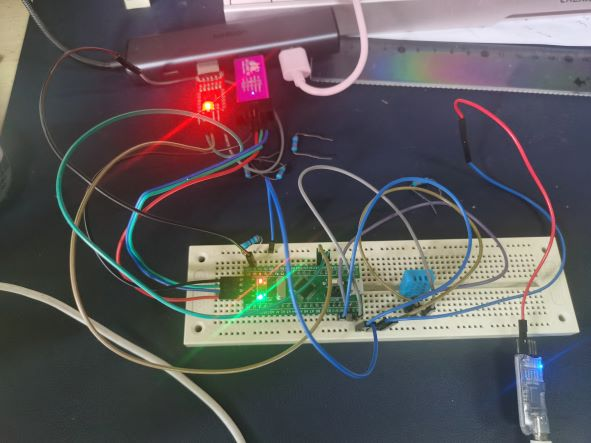

### 2.2 通信协议

DHT11 采用单总线通信，一次通讯时间4ms左右。通讯过程如下：

1. 主机向 DHT11 发送开始信号，低电平 18ms，高电平 20-40us；
2. 主机等待接受 DHT11 响应信号；
3. 主机连续接受 40bit 的数据（包括校验和）；

发送开始信号以及接受响应信号的过程如下图所示：


由于 DHT11 采用单总线通信，因此需要切换 GPIO 的模式。

在之前的实验中，GPIO 的模式均未在程序运行过程中发生变化，因此可以通过修改 IOC 文件，让 cubeIDE 自动生成代码。此实验则需要在程序运行过程中切换 GPIO 的模式，因此需要手动编写代码。

你可以参考 `gpio.c` 中自动生成的 `MX_GPIO_Init` 函数，自己编写切换 GPIO 模式的代码。你可能需要修改结构体 `GPIO_InitStruct` （类型为 `GPIO_InitTypeDef`）

`TASK4` ==请分别编写两个函数，一个用于切换 GPIO 为输出模式，一个用于切换 GPIO 为输入模式。需在下方给出代码和详细注释。==（5分）

> ```c
> /**
>  * @brief 修改对应引脚模式为输入模式
>  * 
>  * @param GPIO_Port 引脚端口
>  * @param GPIO_Pin 引脚编号
>  */
> void GpioSwitchToInput(GPIO_TypeDef *GPIO_Port, uint16_t GPIO_Pin)
> {
>   GPIO_InitTypeDef GPIO_InitStruct = {0};
> 
>   GPIO_InitStruct.Pin = GPIO_Pin; //设置引脚编号
>   GPIO_InitStruct.Mode = GPIO_MODE_INPUT;//设置引脚模式
>   GPIO_InitStruct.Pull = GPIO_PULLUP;//省略上拉电阻
>   HAL_GPIO_Init(GPIO_Port, &GPIO_InitStruct);// 重新初始化引脚
> }
> /**
>  * @brief 修改对应引脚模式为输出模式
>  * 
>  * @param GPIO_Port 引脚端口
>  * @param GPIO_Pin 引脚编号
>  */
> void GpioSwitchToOutput(GPIO_TypeDef *GPIO_Port, uint16_t GPIO_Pin)
> {
>   GPIO_InitTypeDef GPIO_InitStruct = {0};
> 
>   GPIO_InitStruct.Pin = GPIO_Pin;//设置引脚编号
>   GPIO_InitStruct.Mode = GPIO_MODE_OUTPUT_PP;//设置引脚模式
>   GPIO_InitStruct.Pull = GPIO_PULLUP;//省略上拉电阻
>   GPIO_InitStruct.Speed = GPIO_SPEED_FREQ_LOW;//输出速率
>   HAL_GPIO_Init(GPIO_Port, &GPIO_InitStruct);// 重新初始化引脚
> }
> ```
>
> 

`TASK5` ==请编写函数，用于向 DHT11 发送开始信号。需在下方给出代码和详细注释。==（5分）

> ```c
> void vDH11SignalStart()//发送开始信号，需要至少18ms的低电平和20-40us的高电平
> {
>   GpioSwitchToOutput(DH11_DATA_GPIO_Port,DH11_DATA_Pin);//将引脚设置为输出模式
> 
>   HAL_GPIO_WritePin(DH11_DATA_GPIO_Port,DH11_DATA_Pin, GPIO_PIN_RESET);//将引脚电平拉低
>   HAL_Delay(18);//延迟18ms
> 
>   HAL_GPIO_WritePin(DH11_DATA_GPIO_Port,DH11_DATA_Pin, GPIO_PIN_SET);//将引脚电平拉高
>   Delay_us(30);//延时30us
> }
> ```
>
> 

`TASK6` ==请编写函数，用于接受 DHT11 的响应信号并返回是否有效响应。需在下方给出代码和详细注释。==（5分）

> ```c
> uint8_t CheckResponseSignal()
> {
>   uint8_t wait=0;
>   GpioSwitchToInput(DH11_DATA_GPIO_Port,DH11_DATA_Pin);//切换到输入模式，感应DHT信号
> 
>   //可能还未响应，等待DHT拉低电平，最多等待20us
>   while(GPIO_PIN_SET == HAL_GPIO_ReadPin(DH11_DATA_GPIO_Port,DH11_DATA_Pin) && wait < 20){
>     wait++;
>     Delay_us(1);
>   }
>   //接收响应信号，低电平的时间有80us左右，实际由于代码执行的时间，计数远不足80
>   wait = 0;
>   while(GPIO_PIN_RESET == HAL_GPIO_ReadPin(DH11_DATA_GPIO_Port,DH11_DATA_Pin) && wait < 100){//读取电平信号
>     wait++;//计数
>     Delay_us(1);//延时
>   }
>   if(wait > 99 ){
>     return wait;
>   }
>   return 0;
> }
> ```
>
> 

主机接收数据的过程如下图所示：

数字0：低电平 50us，高电平 26-28us。如下图所示：


数字1：低电平 50us，高电平 70us。如下图所示：


接受到数据格式如下表所示：

| byte4 | byte3 | byte2 | byte1 | byte0 |
| :--: | :--: | :--: | :--: | :--: |
| 00101101 | 00000000 | 00011100 | 00000000| 01001001|
| 湿度整数部分 | 湿度小数部分 | 温度整数部分 | 温度小数部分 | 校验和 |

`TASK7` ==请编写函数，用于接受 DHT11 的数据并返回。读取数据以 1Byte 作为单位，即此函数需返回8位数据。需在下方给出代码和详细注释。==（10分）

> ```c
> // 实际上按照bit进行周期读取字节
> uint8_t DH11BitRead()
> {
>   uint8_t wait=0;
> 
>   // 上一个DHT拉高可能没有结束，等待
>   while(GPIO_PIN_SET == HAL_GPIO_ReadPin(DH11_DATA_GPIO_Port, DH11_DATA_Pin) && wait < 50)
>   {
>     wait++;
>     Delay_us(1);
>   }
>   wait = 0;
>   //检测DH11 1Bit 开始信号，最多持续50us
>   while(GPIO_PIN_RESET == HAL_GPIO_ReadPin(DH11_DATA_GPIO_Port, DH11_DATA_Pin) && wait < 50)
>   {
>     wait++;
>     Delay_us(1);
>   }
>   if(wait >= 50) {//开始信号过长，可能有硬件错误，检查
>     sprintf(TxBuffer,"DHT send bit begin fail\r\n");
>     HAL_UART_Transmit_DMA(&huart1,TxBuffer,30);
>   }
>   //DHT根据高电平脉冲宽度决定传输的数据比特，26us-28us表示0, 70us表示1，所以如果40us后仍为高电平则是1
>   Delay_us(40);
>   if(GPIO_PIN_SET == HAL_GPIO_ReadPin(DH11_DATA_GPIO_Port,DH11_DATA_Pin)) return 1;
>   else return 0;
> 
> }
> 
> uint8_t DH11ByteRead()
> {
>   uint8_t ret;//返回结果字节
>   for (uint8_t i = 0; i < 8; i++)
>   {
>     //接收DHT数据，从高位到低位
>     ret <<= 1;
>     ret |= DH11BitRead(); 
>   }
>   return ret;
> }
> ```
>
> 

`TASK8` ==编写 FreeRTOS 任务，定时读 DHT-11 数据。需在下方给出代码和详细注释。==（5分）

> ```c
> void vDH11TaskStart(void * pvParameters)//DHT执行任务
> {
>   //设置延时参数，每秒进行一次  
>   TickType_t xLastWakeTime;
>   const TickType_t delay_time = pdMS_TO_TICKS(1000);
>   xLastWakeTime = xTaskGetTickCount();
> 
>   for(;;){
>     vTaskDelayUntil(&xLastWakeTime, delay_time);//延时
> 
>     uint ret = DH11AllConnect();//进行一次检测
>     if(ret == 0){//检测成功，输出数据
>       sprintf(TxBuffer,"Humidity: %u.%u %%    Temperature: %u.%u ^C  \r\n",humidity[0], humidity[1],temperature[0], temperature[1]);
>       HAL_UART_Transmit_DMA(&huart1, TxBuffer, 50);
>     } else {//检测失败
>       sprintf(TxBuffer,"fail to put DHT data");
>       HAL_UART_Transmit_DMA(&huart1, TxBuffer, 25);
>     }
>   }
> }
> uint8_t DH11AllConnect()//进行一次完整的DHT交互，将得到的数据存储到全局变量中
> {
>   uint8_t ret;
>   vDH11SignalStart(); //发送开始信号
>   if((ret = CheckResponseSignal()) == 0)//等待响应
>   {
>     uint8_t data[5] = {0};
>     for(uint8_t i = 0; i < 5; i++){
>       data[i] = DH11ByteRead(); //依次读取5个字节
>     }
>     if((data[0]+data[1]+data[2]+data[3]) == data[4]){//检查校验和，成功则存储信息
>       humidity[0] = data[0];
>       humidity[1] = data[1];
>       temperature[0] = data[2];
>       temperature[1] = data[3];
>       return 0;
>     } else {//校验失败，输出调试信息
>       sprintf(TxBuffer,"DH11 Data checksum wrong, %u %u %u %u %u %u \r\n",data[0],data[1],data[2],data[3],data[4]);
>       HAL_UART_Transmit_DMA(&huart1, TxBuffer, 50);
>       return 2;
>     }
>     
>   } else {//DHT响应失败
>     sprintf(TxBuffer,"DH11 connect fail,code %u\r\n",ret);
>     HAL_UART_Transmit_DMA(&huart1, TxBuffer,35);
>     return 1;
>   }
> }
> ```
>
> 

`TASK9` ==在 TASK7 的基础上，使用逻辑分析仪查看DHT-11数据线上的时序。给出相应截图，并分析时序。==（5分）

> 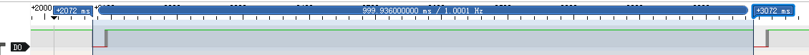
>
> 如图，大概每秒钟会进行一次温湿度检测。
>
> 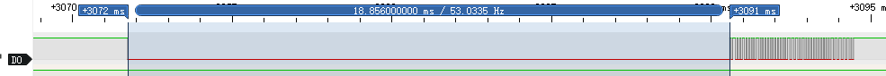
>
> 首先是STM32拉低18ms左右的低电平
>
> 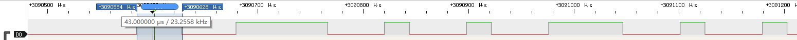
>
> 然后拉高电平至少20us，等待DHT响应拉低电平。
>
> 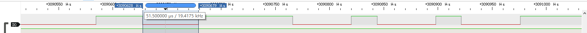
>
> 然后DHT感应到后拉低电平，标准是80us，实际只检测到50us左右。
>
> 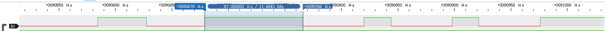
>
> 然后DHT再次拉高电平，准备传输数据。
>
> 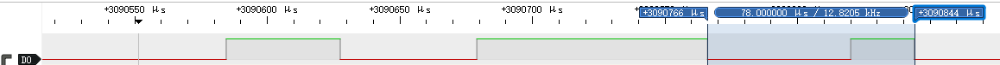
>
> 这是第一次数据传输，前面拉低准备约50us，高电平宽度约24us，这是传输bit 0.
>
> 后续为重复的bit传输，只是传输1时脉冲宽度为70us左右。不再赘述。

`TASK10` ==在 TASK7 的基础上，使用串口定时打印温湿度数据。要求检验校验和。请在下方给出相应截图。==（5分）

> 将前四个字节相加即为校验和，检测代码在TASK8。
>
> 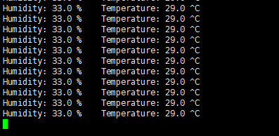

## 3 4位7段数码管

### 3.1 7段数码管

7段数码管是一种常用的显示器件，其特点是：每个数码管由7个LED（加上一个标识小数点的LED，共8个）组成，每个LED可以独立点亮，因此可以显示0\~9的数字，也可以显示A\~F的16进制数字。

7段数码管的引脚如下图所示：


### 3.2 4位7段数码管

单位的数码管有10个引脚，分别为公共和8个段；4位的也只有12个脚，分别是4个公共和8个段。只把其中的一个公共脚接到5V，就可以控制那一位的显示。

需要注意的是，公共脚接到引脚之前，需要先接上220欧姆到限流电阻，防止数码管烧坏。

引脚图如下所示：


在不使用复用计数的情况下，我们只能通过控制公共脚的电平来控制数码管的显示，且所有显示的数码管显示的内容均相同。

!!! tip "连线参考资料"
    [Arduino—四位七段码显示](https://blog.csdn.net/Luo_LA/article/details/107301427)

    可参考上述链接中的连线图。

`TASK11` ==请画出连接数码管和103板的电路示意图，要求标识清楚各个参与连线的引脚。==（5分）

> 
>
> 

!!! warning "注意"
    数码管中的LED很脆弱，务必保证电路连接正确、限流电阻正确连接后再上电测试，否则可能导致数码管损坏。因操作不当导致的数码管损坏可能会在实验报告中被酌情扣分。

`TASK12` ==请编写函数，控制数码管依次显示 `0000`、`1111`、`2222` ... `9999`。需在下方给出代码和详细注释。==（5分）

> 显示相同的数字，实际上就是将四根公共引脚都置为高电平，控制其余引脚显示单个数字即可。
>
> ```c
> static const uint8_t Digit[10] = {//数字的数码管表示，每个0 bit表示显示对应的段，从高到低分别Dot,G,F,E,D,C,B,A，
>     0b11000000,  // 0
>     0b11111001,  // 1
>     0b10100100,  // 2
>     0b10110000,  // 3
>     0b10011001,  // 4
>     0b10010010,  // 5
>     0b10000010,  // 6
>     0b11111000,  // 7
>     0b10000000,  // 8
>     0b10010000   // 9
> };
> void OneDigit(uint8_t digit)//控制数字显示
> {
>   //  根据传入的数字0~9控制七段数码管的亮灭
>   //  数字经过译码转换为8bit表示的字节控制8个段显示
>   //  Digit存储数字对应8个段的显示（0显示），只需判断哪一位上是否为0即可，将这个0移到最低位即GPIO_Pin_Reset值
>   HAL_GPIO_WritePin(LHA_GPIO_Port,LHA_Pin, ((Digit[digit]>>Shift_A) & Mask)); //是否显示a段
>   HAL_GPIO_WritePin(LHB_GPIO_Port,LHB_Pin, ((Digit[digit]>>Shift_B) & Mask));//是否显示b段
>   HAL_GPIO_WritePin(LHC_GPIO_Port,LHC_Pin, ((Digit[digit]>>Shift_C) & Mask));//是否显示c段
>   HAL_GPIO_WritePin(LHD_GPIO_Port,LHD_Pin, ((Digit[digit]>>Shift_D) & Mask));//是否显示d段
>   HAL_GPIO_WritePin(LHE_GPIO_Port,LHE_Pin, ((Digit[digit]>>Shift_E) & Mask));//是否显示e段
>   HAL_GPIO_WritePin(LHF_GPIO_Port,LHF_Pin, ((Digit[digit]>>Shift_F) & Mask));//是否显示f段
>   HAL_GPIO_WritePin(LHG_GPIO_Port,LHG_Pin, ((Digit[digit]>>Shift_G) & Mask));//是否显示g段
>   HAL_GPIO_WritePin(LHDot_GPIO_Port,LHDot_Pin, ((Digit[digit]>>Shift_Dot)&Mask) );//是否显示dot段
> }
> /*vDisplayTaskStart for循环内*/
> vTaskDelayUntil(&xLastWakeTime, delay_time);//阻塞延时
> OneDigit(digit);//显示对应数字
> digit = (++digit)%10;//数字0-9循环变化，
> ```
>
> 

### 3.3 复用技术

最基本的复用技术为分时复用计数，即将一个周期分成若干个时间段，每个时间段只显示一个数码管，利用视觉暂留效应（1/25秒），就可以看起来在同一时间显示多个数码管上的不同内容了。

`TASK13` ==运用分时复用计数技术，编写函数，控制数码管依次显示从 `0000`、`0001` 直到 `9999` 的数字。需在下方给出代码和详细注释。==（5分）

> ```c
> /*将数字改变逻辑和数码管显示逻辑分离，即另外创建一个任务用于进行数字增加，每秒增加一次即可
>  *数字使用全局变量存储，数码管显示任务不断读取该变量进行分时显示。
> */
> /*vDigitTaskStart() 数字改变逻辑for循环*/
> vTaskDelayUntil(&xLastWakeTime, delay_time);//延时1s
> digit++;//自增
> digit = digit%10000;//最大显示9999，再从0循环显示
> 
> /* 要达到视觉暂留的效果，我们需要不间断的显示，而为了数字显示可以更加稳定，需要较高的刷新率，即每个数
>  * 码管的显示时间较短，但显示频率要高。
>  * void DiffDigit(uint32_t* digit)
>  * 该函数获取一个指针参数，将该指针指向的数字进行显示
>  * 由于将循环的逻辑也加入了该函数，该函数为实际的数码管任务线程，原任务仅调用该函数。
> */
> void DiffDigit(uint32_t* digit)
> {
>   TickType_t xLastWakeTime;
>   const TickType_t delay_time = pdMS_TO_TICKS(1);//为了较高刷新率，将数码管显示时间压到延时函数精度单位，实际为1ms，
>   xLastWakeTime = xTaskGetTickCount();
> 
>   while(1){
>     uint16_t single=0;//取出显示数字每个位上的数，千，百，十，个
> 
>     //第一组数码管
>      single = *digit/1000 %10;
>      HAL_GPIO_WritePin(LH1_GPIO_Port,LH1_Pin,GPIO_PIN_SET); //使能第一组数码管
>      OneDigit(single); //显示数字
>      vTaskDelayUntil(&xLastWakeTime, delay_time);//延时
>      HAL_GPIO_WritePin(LH1_GPIO_Port,LH1_Pin,GPIO_PIN_RESET); //终止第一组的显示，利用视觉暂留效应保留视觉上的数字
> 
>      //第二组数码管
>      single = (*digit / 100)%10;
>      HAL_GPIO_WritePin(LH2_GPIO_Port,LH2_Pin,GPIO_PIN_SET); //使能第二组数码管
>      OneDigit(single); //显示数字
>      vTaskDelayUntil(&xLastWakeTime, delay_time);//延时
> 
>      HAL_GPIO_WritePin(LH2_GPIO_Port,LH2_Pin,GPIO_PIN_RESET); //终止第二组的显示，利用视觉暂留效应保留视觉上的数字
> 
>      //第三组数码管
>      single = *digit/10 %10;
>      HAL_GPIO_WritePin(LH3_GPIO_Port,LH3_Pin,GPIO_PIN_SET); //使能第三组数码管
>      OneDigit(single); //显示数字
>      vTaskDelayUntil(&xLastWakeTime, delay_time);//延时4
>      HAL_GPIO_WritePin(LH3_GPIO_Port,LH3_Pin,GPIO_PIN_RESET); //终止第三组的显示，利用视觉暂留效应保留视觉上的数字
> 
>      //第四组数码管
>      single = *digit %10;
>      HAL_GPIO_WritePin(LH4_GPIO_Port,LH4_Pin,GPIO_PIN_SET); //使能第四组数码管
>      OneDigit(single); //显示数字
>      vTaskDelayUntil(&xLastWakeTime, delay_time);//延时
>      HAL_GPIO_WritePin(LH4_GPIO_Port,LH4_Pin,GPIO_PIN_RESET); //终止第四组的显示，利用视觉暂留效应保留视觉上的数字
>   }
> }
> ```

由于不同的数字所需点亮的LED数量不同，1只有两位，而8需要7位，因此，相同的限流电阻会导致不同的数字显示亮度不同。

`BONUS1` ==请尝试使用复杂的电路或者复杂的程序，使得数码管显示的数字亮度相同。请详细解释你的解决方法。==（5分Bouns）

```c
/*亮度不同是由于需要显示的数码管数不同，那每次仅显示一个数码管，通过分时复用依次显示所有数码管即可*/
/*修改单组数码管显示函数OneDigit()*/
/*为了提高刷新率，每次先判断是否需要显示，忽略不需要显示的段，如此使显示更加稳定*/
/*另外，单个数码管已经有了分时显示，那么就不需要对一组数码管进行延时了，只需要再该函数调用后直接翻转电平即可*/
void OneDigit_SameLight(uint8_t digit)
{
	  TickType_t xLastWakeTime;
	  const TickType_t delay_time = pdMS_TO_TICKS(1);//最低只能为间隔1ms显示
	  xLastWakeTime = xTaskGetTickCount();
	  HAL_GPIO_WritePin(LHDot_GPIO_Port,LHDot_Pin, GPIO_PIN_SET );//Dot忽略不显示
  //  根据传入的数字0~9控制七段数码管的亮灭
  //  经过译码转换为 8bit 表示的字节控制8个段显示
if(((Digit[digit]>>Shift_A) & Mask) == 0){
     HAL_GPIO_WritePin(LHA_GPIO_Port,LHA_Pin, ((Digit[digit]>>Shift_A) & Mask)); //是否显示a管
     vTaskDelayUntil(&xLastWakeTime, delay_time);//延时
     HAL_GPIO_WritePin(LHA_GPIO_Port,LHA_Pin, GPIO_PIN_SET);
}
if(((Digit[digit]>>Shift_B) & Mask) == 0){
     HAL_GPIO_WritePin(LHB_GPIO_Port,LHB_Pin, ((Digit[digit]>>Shift_B) & Mask));
     vTaskDelayUntil(&xLastWakeTime, delay_time);//延时
     HAL_GPIO_WritePin(LHB_GPIO_Port,LHB_Pin, GPIO_PIN_SET);
}
if(((Digit[digit]>>Shift_C) & Mask) == 0){
     HAL_GPIO_WritePin(LHC_GPIO_Port,LHC_Pin, ((Digit[digit]>>Shift_C) & Mask));
     vTaskDelayUntil(&xLastWakeTime, delay_time);//延时
     HAL_GPIO_WritePin(LHC_GPIO_Port,LHC_Pin, GPIO_PIN_SET);
}
if(((Digit[digit]>>Shift_D) & Mask) == 0){
     HAL_GPIO_WritePin(LHD_GPIO_Port,LHD_Pin, ((Digit[digit]>>Shift_D) & Mask));
     vTaskDelayUntil(&xLastWakeTime, delay_time);//延时
     HAL_GPIO_WritePin(LHD_GPIO_Port,LHD_Pin, GPIO_PIN_SET);
}
if(((Digit[digit]>>Shift_E) & Mask) == 0){
     HAL_GPIO_WritePin(LHE_GPIO_Port,LHE_Pin, ((Digit[digit]>>Shift_E) & Mask));
     vTaskDelayUntil(&xLastWakeTime, delay_time);//延时
     HAL_GPIO_WritePin(LHE_GPIO_Port,LHE_Pin, GPIO_PIN_SET);
}
if(((Digit[digit]>>Shift_F) & Mask) == 0){
     HAL_GPIO_WritePin(LHF_GPIO_Port,LHF_Pin, ((Digit[digit]>>Shift_F) & Mask));
     vTaskDelayUntil(&xLastWakeTime, delay_time);//延时
     HAL_GPIO_WritePin(LHF_GPIO_Port,LHF_Pin, GPIO_PIN_SET);
}
if(((Digit[digit]>>Shift_G) & Mask) == 0){
     HAL_GPIO_WritePin(LHG_GPIO_Port,LHG_Pin, ((Digit[digit]>>Shift_G) & Mask));
     vTaskDelayUntil(&xLastWakeTime, delay_time);//延时
     HAL_GPIO_WritePin(LHG_GPIO_Port,LHG_Pin, GPIO_PIN_SET);
}
}


```


## 4 温湿度计实现

请将 DHT-11 和 4位7段数码管连接到 103 板上，实现温度计功能。要求使用两个FreeRTOS任务，一个定时读DHT-11数据，一个轮流驱动数码管，一秒一次显示当前温度和湿度。注意处理好两个任务之间的数据共享。

`TASK14` ==请画出你所设计的温湿度计的电路示意图，要求标识清楚各个参与连线的引脚。==（5分）

> 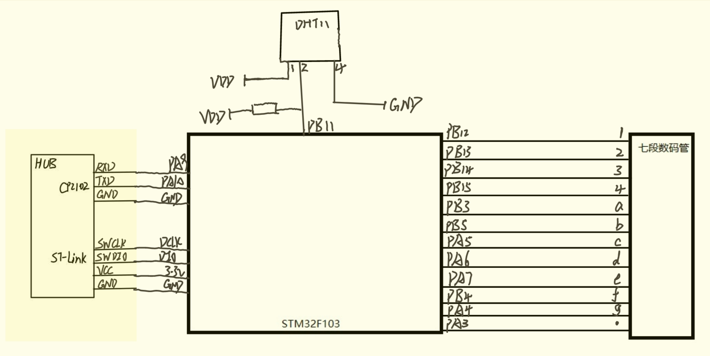

`TASK15` ==请拍摄实际的板卡连线图。==（5分）

> 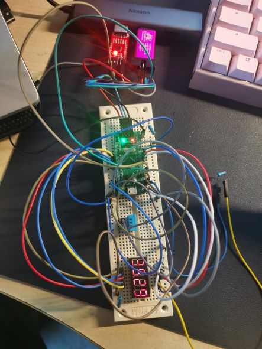

`TASK16` ==请给出代码和详细注释。要求解释清楚两个 FreeRTOS 任务的运行逻辑以及数据共享。==（15分）

> ```c
> /* 由于温湿度小数部分没有数字，湿度和温度都不超过两位数，故将湿度和温度结合为四位数进行显示，湿度放在
>  * 1，2号管进行显示温度放在3，4号管进行显示。
>  * 由于上面任务逻辑已经基本分离且可重用，所以本任务增加的代码不多。
>  * 对于DHT11的任务我们新增一个全局变量用来表示湿度和温度的组合值，放在原来校验成功后存储温湿度的后面
>  * 即可。
>  * 对于数码管显示任务，我们只需要将该全局变量的地址传给我们的分时显示函数void DiffDigit(uint32_t* digit)即可
> */
> 
> /*DHT11新增组合值，DH11AllConnect()函数内 */
> ...
> if((data[0]+data[1]+data[2]+data[3]) == data[4]){
>       humidity[0] = data[0];
>       humidity[1] = data[1];
>       temperature[0] = data[2];
>       temperature[1] = data[3];
>     //前面保持不变
> #ifdef DHT_Digit
>       DHTnumber = humidity[0] *100 + temperature[0];//十进制，将湿度移动到高两位，乘100.
> #endif
> }
> ...
> /*数码管显示任务  for循环内，将温湿度的组合全局变量的指针传给显示函数即可*/    
> #ifdef CountDigit  //显示连续数字，0-9999，保持不变，宏定义控制
>   DiffDigit(&digit);
> #endif
> #ifdef DHT_Digit   //显示温湿度
>   DiffDigit(&DHTnumber);
> #endif
> ```
>
> 

`TASK17` ==请改变温湿度计所处的环境状态，如向传感器哈气、从室内转移到室外阳光下等，观察温湿度计的显示是否正确。请给出你所处的环境和拍摄的温湿度显示照片，并结合当日天气预报等数据判断温湿度计是否正常运作。==（5分）

> 宿舍桌面，湿度  36%，温度29$^{\circ}$C
>
> 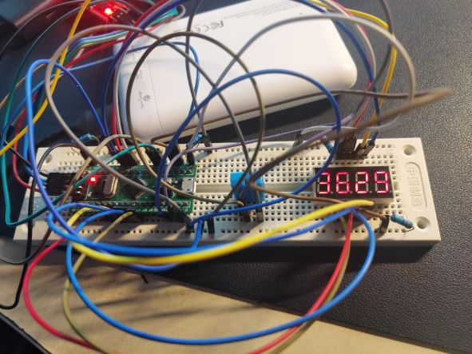
>
> 
>
> 向温度计哈气。湿度上升为42%，温度29$^{\circ}$C
>
> 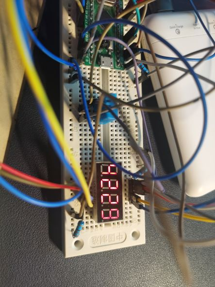
>
> 
>
> 吹风机热风。湿度  24%，温度51$^{\circ}$C
>
> 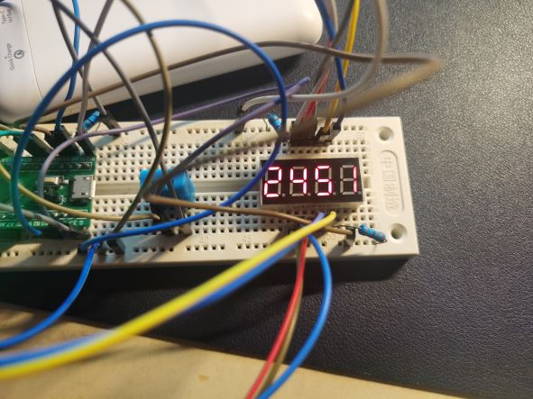
>
> 手机天气预报，西湖区当下湿度为68%，温度28$^{\circ}$C.
>
> 温度差异不大，但是湿度有较大差异，考虑到在环境改变时，显示是有明显变化的，可以认为湿度的局部差异较大，温湿度计还是正常工作的。

## 5 讨论和心得

> 请认真填写本模块，若不填写或胡乱填写将酌情扣分，写明白真实情况即可。

本次实验我们接触了嵌入式中的操作系统RTOS，并利用接口写了一个温湿度感应显示系统。

对于DHT11，我们需要控制发送信号的延时时间以及记录接收信号的延时时间以此判断传递的bit值，虽然有多种延时以及计时方法，但是实际由于代码执行的影响，我们很难达到非常精确的计数，比如80us的脉冲宽度，我们如果延迟1us读取电平计数一次，可能连一半都无法计数到。我们在进行信号的发送和接收时要有充分考虑。

另外，对于硬件实验，硬件本身影响还是很大的，尤其是作为CS人并没有电路基础，出问题也不知道原因，只能不断检查代码或者更换电路设计。杜邦线和面包板连接不稳定，数码管不显示（小心晃动线材，让其接触良好）以及明明仅使能了一个公共引脚，却是该亮的不亮，不该亮的亮一片（考虑到可能是电阻的两端不直，在面包板内形成未知电路，只能不断修改电路中电阻连接方式及位置，让数码管可以正常控制。
