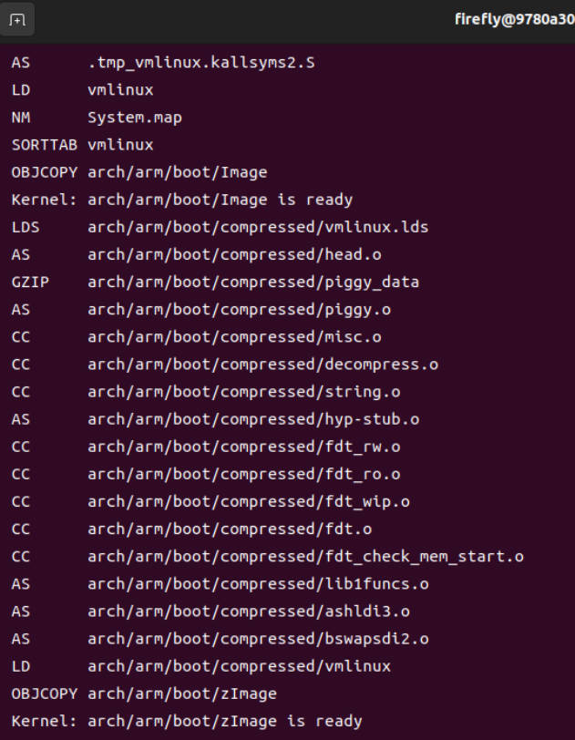
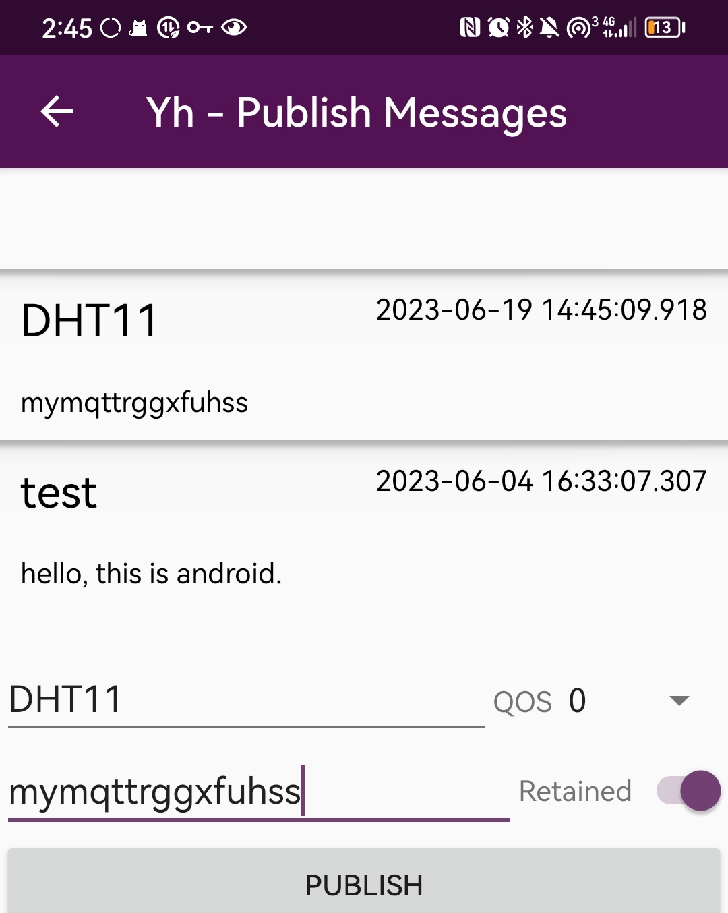

# 实验7指南

<!-- !!! danger "本实验指南处于预发布状态，内容随时可能发生变化" -->

<!-- <div style="display:none"> -->

请跟随实验指南完成实验，完成文档中所有的`TASK`。`BONUS`部分的内容完成可作为加分，但报告的总分不应超过100分。请下载此指南作为实验报告模版，将填充完成的实验报告导出为PDF格式，并命名为“学号_姓名_lab7.pdf”，上传至学在浙大平台。下载请点击 **<u>[这里](../download.md)</u>** 。

## 1 LED 矩阵

本实验中所使用的 LED 矩阵为 8x8 的点阵，使用 MAX7219 驱动。MAX7219 是一款集成了 8x8 LED 矩阵驱动电路的芯片，可以通过 SPI 接口控制。

### 1.1 引脚定义

MAX7219 的引脚定义如下图所示：


> 图片来源自 [https://lastminuteengineers.com](https://lastminuteengineers.com)

- 输入端接口

    - **VCC:** 电源。连接到5V。因为显示器需要很大的电流（在最大亮度时高达1A），最好使用外部电源而不是 3568 板的5V电源。如果你想使用 3568 板的 5V 电源，请将亮度保持在 25% 以下，以避免电压调节器过热。

    - **GND:** 地。连接到地。

    - **DIN:** 数据输入。将其连接到 3568 板的任一空闲 GPIO 引脚。DIN的数据仅在CLK处于上升沿的时候有效。

    - **CS/LOAD:** 片选。将其连接到 3568 板的任一空闲 GPIO 引脚。作用为是控制串口通讯，其为低电平时，串行数据才被载入寄存器，高电平时会被锁存。

    - **CLK:** 时钟。将其连接到 3568 板的任一空闲 GPIO 引脚。

- 输出端接口

    - **VCC:** 电源。连接到下一个 MAX7219 的 VCC 引脚。

    - **GND:** 地。连接到下一个 MAX7219 的 GND 引脚。

    - **DOUT:** 数据输出。将其连接到下一个 MAX7219 的 DIN 引脚。

    - **CS/LOAD:** 片选。将其连接到下一个 MAX7219 的 CS/LOAD 引脚。

    - **CLK:** 时钟。将其连接到下一个 MAX7219 的 CLK 引脚。

### 1.2 内置寄存器功能

> 以下内容摘录自 [https://juejin.cn/post/6976559353666994189](https://juejin.cn/post/6976559353666994189)

通过查阅 max7219 的 **<u>[datesheet](./MAX7219_datasheet.pdf)</u>** 可以发现，max7219芯片内不同的地址存储的值都有相应的作用。

0x01-0x08对应的是led 1到8行的显示通过8位二进制数来控制这一行led的显示状况，0 led熄灭，1 led点亮。

比如说 0x3C 转换成二进制就是 00111100 ，该行的led的显示模式就是 ○○●●●●●○○

| 地址 | 寄存器名称 | 作用 |
| :----: | :----------: | :----: |
|0x09| 译码模式寄存器 |  0 为关闭译码模式
|0x0b| 扫描限制寄存器 |  设置扫描led的行数 1-8 |
|0x0a| 亮度调节寄存器 |  16位调节亮度 |
|0x0c| 关断模式寄存器 |  0: 关断状态； 1: 正常操作状态 |
|0x0f| 显示测试寄存器 |  0: 正常模式； 1: 测试模式（全部点亮）|

### 1.3 点亮 LED 矩阵

???+ tip "参考资料"

    1. [第二个树莓派应用——LED点阵](https://juejin.cn/post/6976559353666994189#heading-9)
    
    2. [Interfacing MAX7219 LED Dot Matrix Display with Arduino](https://lastminuteengineers.com/max7219-dot-matrix-arduino-tutorial/)
    
    3. [树莓派学习笔记——使用文件IO操作GPIO SysFs方式](https://blog.csdn.net/xukai871105/article/details/38456801)

`TASK1` ==请设计接线方案，使得 3568 板能够在之后的实验中使用 LED 矩阵。画出你的连线示意图，并拍摄你实际连接的板卡照片。==（5分）

> 连线示意图
>
> 

`TASK2` ==编写 C 程序，采用 Arduino-ish 库或虚拟文件系统（或其他你选择的库）访问 GPIO，实现在矩阵上显示文字或图案。请在下方给出你的源代码（需有详细注释），对你选用的方式（库 / 虚拟文件系统）做出阐释，并对代码关键步骤进行解释。同时需附上 LED 矩阵成功显示文字或图案的照片。==（20分）

> 由于通过sysfs操作GPIO的代码比较庞大，该项任务采用bcm2835库。
>
> bcm2835库是一种C语言库，由Broadcom开发，用于控制树莓派上的硬件。它提供了一组函数，可以直接访问GPIO引脚，以及SPI和I2C总线。需要注意的是，bcm2835库需要在超级用户（root）权限下运行。
>
> 编译代码时需要通过`-l`选项链接bcm2835库，如 `gcc task2.c -o task2  -lbcm2835`
>
> 运行`sudo ./task2`
>
> 另外，虽然可以将bcm2835编译为静态库安装进系统中，也可以将`bcm2835.h bcm2835.c`复制到代码文件夹中当成自定义文件参与编译，可以达到相同的效果,`gcc task2.c bcm2835.c -o task2`

> ```c
> #include <bcm2835.h>
> #include <stdio.h>
> #include <time.h>
> 
> // 重新定义引脚名，注意右侧定义 _J8_03 说明是三号物理引脚，对应 GPIO2 
> #define  CLK   RPI_BPLUS_GPIO_J8_03 // GPIO2
> #define  CS   RPI_BPLUS_GPIO_J8_05  // GPIO3
> #define  Din   RPI_BPLUS_GPIO_J8_07 // GPIO4
> 
> void setBitData(int data);
> void Write_Max7219_byte(int data);
> void Write_Max7219(int addr, int data);
> int gpio_Max7219_init();
> int heart[] = {0x00,0x66, 0xff, 0xff, 0xff, 0x7e, 0x3c, 0x18};
> 
> char matrix[] = {0x99,0x66,0x5a,0xa5,0xa5,0x5a,0x66,0x99};
> 
> int gpio_Max7219_init() //初始化bcm2835库并设置好对应的GPIO
> {
>     if(!bcm2835_init()) //使用库函数前需要初始化
>     {
>         printf("BCM2835 initialization fails !!!");
>         return -1;
>     }
> 
>     bcm2835_delay(800);//延时准备
>     bcm2835_gpio_fsel(CS, BCM2835_GPIO_FSEL_OUTP);//配置GPIO方向为输出
>     bcm2835_gpio_fsel(CLK, BCM2835_GPIO_FSEL_OUTP);
>     bcm2835_gpio_fsel(Din, BCM2835_GPIO_FSEL_OUTP);
> 
>     // 设置Max7219
>     Write_Max7219(0x09, 0x00); // 关闭译码模式
>     Write_Max7219(0x0a, 0x00); // 设置led亮度 3 ,15最大
>     Write_Max7219(0x0b, 0x07); // 设置扫描行数
>     Write_Max7219(0x0c, 0x01); // 设置正常模式
>     Write_Max7219(0x0f, 0x00); // 设置正常模式
> }
> 
> void setBitData(int data)
> {
>     // 传输1bit数据，需要先拉低时钟再拉高，数据才会传输出去
>     bcm2835_gpio_write(CLK, LOW); 
>     bcm2835_gpio_write(Din, data);
>     bcm2835_gpio_write(CLK, HIGH);
> }
> 
> void Write_Max7219_byte(int data)
> {
>     //传输一个字节的数据
>     // 从高位到低位判断是否为1 or 0，传输即可
>     int i;
>     for(i = 0 ; i < 8 ; i++){
>         if(((data <<i) & 0x80) == 0x80){//判断对应bit位是否为1
>             setBitData(HIGH);
>         }
>         else {
>             setBitData(LOW);
>         }
>     }
> }
> 
> void Write_Max7219(int addr, int data)
> {
>     //传输一次数据，即两个字节
>     // 先传地址，再传数据
>     bcm2835_gpio_write(CS, LOW);// 将CS信号拉低才能写入数据
>     Write_Max7219_byte(addr);//传输地址
>     Write_Max7219_byte(data);//传输数据
>     bcm2835_gpio_write(CS, HIGH);//拉高CS，说明此次传输完成
> }
> 
> void ShowDotMatrix()
> {
>     int i=0;
>     for (i=0;i<8;i++){
>         Write_Max7219(i+1,heart[i]);//将要显示的图案数据依次写入
>     }
> }
> int main()
> {
>     gpio_Max7219_init();
>     ShowDotMatrix();
>     return 0;
> }
> ```
>
> 显示图案：
>
> 

## 2 字符设备驱动

### 2.1 Linux内核模块

> 此节内容摘录自 [Linux驱动基本知识 - Linux内核模块](https://doc.embedfire.com/linux/imx6/driver/zh/latest/linux_driver/module.html)

Linux是一个跨平台的操作系统，支持众多的设备，在Linux内核源码中有超过50%的代码都与设备驱动相关。 Linux为宏内核架构，如果开启所有的功能，内核就会变得十分臃肿。 内核模块就是实现了某个功能的一段内核代码，在内核运行过程，可以加载这部分代码到内核中， 从而动态地增加了内核的功能。基于这种特性，我们进行设备驱动开发时，以内核模块的形式编写设备驱动，只需要编译相关的驱动代码即可，无需对整个内核进行编译。

模块是具有独立功能的程序，它可以被单独编译，但不能独立运行， 在运行时它被链接到内核作为内核的一部分在内核空间运行，这与运行在用户空间的进程是不一样的。 模块由一组函数和数据结构组成，用来实现一种文件系统、一个驱动程序和其他内核上层功能。 因此内核模块具备如下特点：

- 模块本身不被编译入内核映像，这控制了内核的大小。

- 模块一旦被加载，它就和内核中的其它部分完全一样。

我们编写的内核模块，经过编译，最终形成.ko为后缀的ELF文件。我们可以使用file命令来查看它。

### 2.2 编译内核

#### 2.3.1 交叉编译环境配置

> 此节内容参考自 [https://doc.embedfire.com/linux/imx6/driver/zh/latest/linux_driver/exper_env.html](https://doc.embedfire.com/linux/imx6/driver/zh/latest/linux_driver/exper_env.html)

设备驱动是具有独立功能的程序，它可以被单独编译，但不能独立运行，在运行时它被链接到内核作为内核的一部分在内核空间运行。也因此想要我们写的内核模块在某个版本的内核上运行，那么就必须在该内核版本上编译它，如果我们编译的内核与我们运行的内核具备不相同的特性，设备驱动则可能无法运行。

由于嵌入式 Linux 板卡的性能有限，编译内核需要较长时间，因此我们需要使用交叉编译的方式，在PC上编译内核，然后将编译好的内核模块传输到板卡上。

可以参考 **<u>[编译环境搭建](https://wiki.t-firefly.com/zh_CN/ROC-RK3568-PC-SE/prepare_compile_linux.html)</u>** 下载并解压 **<u>[Firefly_Linux_SDK源码包](https://www.t-firefly.com/doc/download/180.html#other_447)</u>**。

> 需要选择和你之前烧录固件相同版本的 Linux 内核，或者也可以选择编译好 SDK 以后重新烧录一次固件。

> 这里仍然只有百度网盘，且 SDK 源码很大（十几GB），超过了浙大云盘的限额，所以要做好心理准备。

同时配置好相关的交叉编译环境（推荐使用docker，并参考以上教程使用如下的 dockerfile）：

```dockerfile
FROM ubuntu:18.04
MAINTAINER firefly "service@t-firefly.com"

ENV DEBIAN_FRONTEND=noninteractive

RUN cp -a /etc/apt/sources.list /etc/apt/sources.list.bak
RUN sed -i 's@http://.*ubuntu.com@http://repo.huaweicloud.com@g' /etc/apt/sources.list

RUN apt update

RUN apt install -y build-essential crossbuild-essential-arm64 \
	bash-completion vim sudo locales time rsync bc python

RUN apt install -y repo git ssh libssl-dev liblz4-tool lib32stdc++6 \
	expect patchelf chrpath gawk texinfo diffstat binfmt-support \
	qemu-user-static live-build bison flex fakeroot cmake \
	unzip device-tree-compiler python-pip ncurses-dev python-pyelftools \
	subversion asciidoc w3m dblatex graphviz python-matplotlib cpio \
	libparse-yapp-perl default-jre patchutils swig expect-dev u-boot-tools

RUN apt update && apt install -y -f

# language support
RUN locale-gen en_US.UTF-8
ENV LANG en_US.UTF-8

# switch to a no-root user
RUN useradd -c 'firefly user' -m -d /home/firefly -s /bin/bash firefly
RUN sed -i -e '/\%sudo/ c \%sudo ALL=(ALL) NOPASSWD: ALL' /etc/sudoers
RUN usermod -a -G sudo firefly

USER firefly
WORKDIR /home/firefly
```

???+ warning "警告"
    所给的参考资料使用的上位机架构为 x86_64，如果你使用的上位机架构为 arm64（对说的就是你 Apple 的 M 系列芯片），那么就需要对以上教程中的相关配置进行修改。（实际上是更简单了，因为如果使用 docker 中的 Linux 进行编译，那么就不需要进行交叉编译，直接编译即可）

`TASK3` ==请参考以上教程配置 docker 镜像，创建容器并启动。在 docker 中使用交叉编译工具编译 C 语言的 "Hello, world" 程序，并将编译后的二进制文件传输到 3568 板上运行。请给出你在 docker 中成功交叉编译产生二进制文件的截图以及在 3568 板上成功运行此程序的截图。==（15分）

> ```c
> #include <stdio.h>
> int main()
> {
>     printf("Hello, world!\n");
>     return 0;
> }
> ```
>
> 编译：
>
> 
>
> 运行（通过sftp传输，需要先添加执行权限）：
>
> 

#### 2.3.2 开始编译内核

请参考 **<u>[Kernel 使用](https://wiki.t-firefly.com/zh_CN/ROC-RK3568-PC-SE/kernel_introduction.html)</u>** ，在前一节中配置好的环境中编译 Linux 内核。

`TASK4` ==请参考以上教程，编译内核。请给出编译过程中的截图，以及编译完成后生成的内核镜像文件的截图。若选择与之前固件内核版本不同需要重新烧录，则需要同时放上烧录成功的截图。==（15分）

> 烧录的树莓派内核版本为`6.1.y`，下载对应源码即可。
>
> 获取树莓派的内核配置`sudo modprobe configs`
>
> 将该配置解压至内核源码根目录下，运行 `KERNEL=kernel7  make ARCH=arm CROSS_COMPILE=arm-linux-gnueabihf- zImage modules `（使用自己的配置前最好先用默认配置配一次，再覆盖`.config`文件，否则会有文件缺失）
>
> 编译过程：
>
> 
>
> （modules 编译选项错误，后面重新编译`modules`）
>
> 
>
> 编译完成：
>
> zImage：
>
> 
>
> modules:
>
> 

### 2.3 驱动编写

#### 2.3.1 第一个内核模块

请先参考 **<u>[第一个内核模块](https://doc.embedfire.com/linux/imx6/driver/zh/latest/linux_driver/first_module.html)</u>** 和 **<u>[Linux驱动实践：带你一步一步编译内核驱动程序](https://www.cnblogs.com/sewain/p/15565443.html#编译为驱动模块)</u>** ，尝试一个最简单 hello module 框架。需要注意 `Kconfig` 和 `Makefile` 的编写。

`TASK5` ==将以上框架编译成 `.ko` 文件后，传输到 3568 板上，加载此驱动后再卸载此驱动，并在过程中观察串口输出，并使用如 `lsmod`、`dmesg` 等命令查看驱动加载状态。请给出相应的截图和对截图的解释。==（10分）

> 单独编译模块，得到`hellomod.ko`：
>
> 
>
> 查看驱动加载状态：
>
> 
>
> 模块加载过程串口输出：
>
> 

#### 2.3.2 编写字符设备驱动程序

完成以上内容后，请编写字符设备驱动程序，通过内核 GPIO 库访问引脚，能将 `write()` 送来的单个字符在矩阵上显示出来。

> 以下内容摘录自 [https://zhuanlan.zhihu.com/p/137636768](https://zhuanlan.zhihu.com/p/137636768)

Linux 系统将设备分为三大类：字符设备、块设备和网络设备。字符设备是其中较为基础的一类，它的读写操作需要一个字节一个字节的进行，不能随机读取设备中的某一数据，即要按照先后顺序。举例来说，比较常见的字符设备有鼠标、键盘、串口等。

字符设备驱动所做的工作主要是添加、初始化、删除 cdev 结构体，申请、释放设备号，填充 `file_operations` 结构体中的功能函数，比如 `open()`、`read()`、`write()`、`close()` 等。当我们创建一个字符设备时，一般会在 `/dev` 目录下生成一个设备文件，Linux 用户层的程序就可以通过这个设备文件来操作这个字符设备。

???+ tip "参考资料"

    1. [字符设备驱动](https://doc.embedfire.com/linux/imx6/lsl's's's's's's's'sdriver/zh/latest/linux_driver/character_device.html)
    
    2. [Linux驱动篇(五)--字符设备驱动(一)](https://zhuanlan.zhihu.com/p/137636768)
    
    3. [GPIO 使用](https://wiki.t-firefly.com/zh_CN/ROC-RK3568-PC-SE/driver_gpio.html#faqs)

`TASK6` ==编写字符设备驱动程序，通过内核GPIO库访问引脚，能将 `write()` 送来的单个字符在矩阵上显示出来。请给出源代码（需有详细注释）以及对关键部分的解释。将驱动编译并加载后，请编写C语言程序（或直接使用 shell 脚本）测试此驱动，并给出测试使用的程序、终端中的截图以及 LED 板显示的照片。==（20分）

> 由于完成了Bonus，此处一同展示对应代码。但是不对bonus的部分着重解释。
>
> ```c
> // 驱动程序
> #include <linux/kernel.h>    
> #include <linux/module.h>  
> #include <linux/device.h>          
> #include <linux/stddef.h>   
> #include <linux/types.h>    
> #include <linux/fs.h>      
> #include <linux/cdev.h>    
> #include <linux/delay.h>    
> #include <linux/uaccess.h>  
> #include <linux/init.h>   
> #include <linux/gpio.h>  
> #include <linux/string.h>
> #include <linux/slab.h>
> #include <linux/time.h>
> #include <linux/param.h>
> 
> // 定义设备名称
> #define DEVICE_NAME "led_matrix"  
> 
> //class声明内核模块驱动信息,使UDEV能够自动生成/dev下相应文件  
> static dev_t led_matrix_devno; //设备号 
> static struct class *led_matrix_class;     // cdev所需结构
> static struct cdev led_matrix_class_dev;  // cdev用于在系统中注册字符设备
> 
> // 对应的引脚号
> #define Din 4
> #define CS 3
> #define CLK 2
> // 定义电平信号值
> #define HIGH 1
> #define LOW  0
> 
> // 定义led显示形状对应的各寄存器值，matrix为初始化默认形状
> // 数字和字母对应表示来自 https://xantorohara.github.io/led-matrix-editor/ 给出的默认库
> int matrix[8] = {0x99,0x66,0x5a,0xa5,0xa5,0x5a,0x66,0x99};
> int digits[][8]={
>  {0x1c, 0x22, 0x22, 0x22, 0x22, 0x22, 0x22, 0x1c}, // 0
>  {0x08, 0x18, 0x08, 0x08, 0x08, 0x08, 0x08, 0x1c}, // 1
>  {0x1c, 0x22, 0x22, 0x04, 0x08, 0x10, 0x20, 0x3e}, // 2
>  {0x1c, 0x22, 0x02, 0x0c, 0x02, 0x02, 0x22, 0x1c}, // 3
>  {0x04, 0x0c, 0x14, 0x14, 0x24, 0x1e, 0x04, 0x04}, // 4
>  {0x3e, 0x20, 0x20, 0x3c, 0x02, 0x02, 0x22, 0x1c}, // 5
>  {0x1c, 0x22, 0x20, 0x3c, 0x22, 0x22, 0x22, 0x1c}, // 6
>  {0x3e, 0x24, 0x04, 0x08, 0x08, 0x08, 0x08, 0x08}, // 7
>  {0x1c, 0x22, 0x22, 0x1c, 0x22, 0x22, 0x22, 0x1c}, // 8
>  {0x1c, 0x22, 0x22, 0x22, 0x1e, 0x02, 0x22, 0x1c}, // 9
> };
> int letters[][8] = {
>  {0x3c, 0x42, 0x02, 0x3e, 0x42, 0x46, 0x3a, 0x00}, // a
>  {0xe0, 0x60, 0x60, 0x7c, 0x66, 0x66, 0xdc, 0x00}, // b
>  {0x00, 0x00, 0x78, 0xCC, 0xC0, 0xCC, 0x78, 0x00}, // c
>  {0x1C, 0x0C, 0x0C, 0x7C, 0xCC, 0xCC, 0x76, 0x00}, // d
>  {0x00, 0x00, 0x78, 0xCC, 0xFC, 0xC0, 0x78, 0x00}, // e
>  {0x38, 0x6C, 0x60, 0xF0, 0x60, 0x60, 0xF0, 0x00}, // f
>  {0x00, 0x00, 0x76, 0xCC, 0xCC, 0x7C, 0x0C, 0xF8}, // g
>  {0xE0, 0x60, 0x6C, 0x76, 0x66, 0x66, 0xE6, 0x00}, // h
>  {0x30, 0x00, 0x70, 0x30, 0x30, 0x30, 0x78, 0x00}, // i
>  {0x0C, 0x00, 0x0C, 0x0C, 0x0C, 0xCC, 0xCC, 0x78}, // j
>  {0xE0, 0x60, 0x66, 0x6C, 0x78, 0x6C, 0xE6, 0x00}, // k
>  {0x70, 0x30, 0x30, 0x30, 0x30, 0x30, 0x78, 0x00}, // l
>  {0x00, 0x00, 0xCC, 0xFE, 0xFE, 0xD6, 0xC6, 0x00}, // m
>  {0x00, 0x00, 0xF8, 0xCC, 0xCC, 0xCC, 0xCC, 0x00}, // n
>  {0x00, 0x78, 0xCC, 0xCC, 0xCC, 0xCC, 0x78, 0x00}, // o
>  {0x00, 0xDC, 0x66, 0x66, 0x7C, 0x60, 0xF0, 0x00}, // p
>  {0x00, 0x76, 0xCC, 0xCC, 0x7C, 0x0C, 0x1E, 0x00}, // q
>  {0x00, 0xDC, 0x76, 0x66, 0x60, 0xF0, 0x00, 0x00}, // r
>  {0x00, 0x7C, 0xC0, 0x78, 0x0C, 0xF8, 0x00, 0x00}, // s
>  {0x10, 0x30, 0x7C, 0x30, 0x30, 0x34, 0x18, 0x00}, // t
>  {0x00, 0xCC, 0xCC, 0xCC, 0xCC, 0xCC, 0x76, 0x00}, // u
>  {0x00, 0xCC, 0xCC, 0xCC, 0xCC, 0x78, 0x30, 0x00}, // v
>  {0x00, 0xC6, 0xD6, 0xFE, 0xFE, 0x6C, 0x00, 0x00}, // w
>  {0x00, 0xC6, 0x6C, 0x38, 0x6C, 0xC6, 0x00, 0x00}, // x
>  {0x00, 0xCC, 0xCC, 0xCC, 0xCC, 0x7C, 0x0C, 0xF8}, // y
>  {0x00, 0xFC, 0x98, 0x30, 0x64, 0xFC, 0x00, 0x00}, // z
> };
> 
> static struct timer_list timer;  // 定时器指针
> 
> void setBitData(int data); //传输1bit数据·
> void Write_Max7219_byte(int data);//传输一字节数据
> void Write_Max7219(int addr, int data);//传输 两字节数据，即设置一个寄存器
> void ShowLEDMatrix(int ch[]);//根据传入的数组显示对应形状
> void init_GPIO_Max7219(void);//初始化LED矩阵
> 
> int checkQueue(void);// 检查数据队列是否为空
> int addToQueue(char one);//向队列添加数据
> char PopFront(void);// 将队列的第一个取出
> void HandleTimer(struct timer_list * name);// 定时器回调函数，定时显示传入数据
> 
> // 数据队列的数据结构，单个字符进行存储。
> typedef struct charq* charqPtr;
> struct charq {
>  char ch;
>  struct charq* next;
> };
> charqPtr ToShow = NULL;
> charqPtr Tail = NULL;
> 
> 
> int checkQueue(void)
> {
>  return ToShow != NULL; // 返回数据是否不为空，为空返回0，不为空返回1
> }
> int addToQueue(char one)
> {
>  charqPtr tmp = (charqPtr)kmalloc(sizeof(struct charq),GFP_KERNEL); // 为结构申请空间
>  tmp->ch = one; //赋值
>  tmp->next = NULL;
>     
>  if(ToShow == NULL){//队列为空和不为空时的添加操作有所不同，为空添加要把队头和队尾同时赋新值，
>      ToShow = tmp;
>      Tail = tmp;
>  }
>  else { // 不为空时仅需操作队尾。
>      Tail->next = tmp;
>      Tail = Tail->next;
>  }
>  return 0;
> }
> char PopFront(void)
> {
>  charqPtr tmp = ToShow;
>  char tmpch = ToShow->ch;
> 
>  if(ToShow->next != NULL){ // 不断将队首显示并移向下一个数据，
>      ToShow = ToShow->next;
>  }
>  else { // 其实队尾可以不管，此处怕有危险还是处理了
>      ToShow = NULL;
>      Tail = NULL;
>  }
> 
>  kfree(tmp); // 释放已显示的数据空间。
>  return tmpch;
> }
> void HandleTimer(struct timer_list *name)
> {
>  if(checkQueue()){  //检查是否为空
>      char ch = PopFront();// 获取显示字符，对数字和字母分别处理
>      if(ch >= '0' && ch <= '9'){
>          ShowLEDMatrix(digits[ch-'0']);
>      } 
>      else if(ch >= 'a' && ch <= 'z'){
>          ShowLEDMatrix(letters[ch-'a']);
>      }
>  }
>  	mod_timer(&timer,jiffies + msecs_to_jiffies(500/*ms*/));// 设置下一次显示定时器。  
> }
> 
> 
> 
> // MAx7219 引脚操作相关在上面有注释，在编写驱动时我们使用linux内核的引脚库对引脚进行操作，只是函数名换了，逻辑基本没变。
> void setBitData(int data)
> {
>  gpio_set_value(CLK, LOW);
>  gpio_set_value(Din, data);
>  gpio_set_value(CLK, HIGH);
> }
> void Write_Max7219_byte(int data)
> {
>  int i;
>  for(i = 0 ; i < 8 ; i++){
>      if(((data <<i) & 0x80) == 0x80){
>          setBitData(HIGH);
>      }
>      else {
>          setBitData(LOW);
>      }
> 
>  }
> }
> void Write_Max7219(int addr, int data)
> {
>  gpio_set_value(CS,LOW);
>  Write_Max7219_byte(addr);
>  Write_Max7219_byte(data);
>  gpio_set_value(CS,HIGH);
> }
> 
> void ShowLEDMatrix(int ch[])
> {
>  int i=0;
>  for (i=0;i<8;i++){
>      Write_Max7219(i+1,ch[i]);
>  }
> }
> void init_GPIO_Max7219(void)
> {
>  int ret ;
>  //  gpio_request()函数使用引脚，这是独占的，不允许其余程序再使用该引脚，实际只是进行了标记
>  ret = gpio_request(Din, "Din");
>  if (ret) {
>      printk(KERN_ERR "module: Failed to request GPIO %d, error %d\n", Din, ret);
>      return ;
>  }
>  ret = gpio_request(CS, "CS");
>  if (ret) {
>      printk(KERN_ERR "module: Failed to request GPIO %d, error %d\n", CS, ret);
>      return ;
>  }
>  ret = gpio_request(CLK, "Din");
>  if (ret) {
>      printk(KERN_ERR "module: Failed to request GPIO %d, error %d\n", CLK, ret);
>      return ;
>  }
>  gpio_direction_output(Din, 1); // 设置引脚方向 ，默认输出1.
>  gpio_direction_output(CS, 1);// 设置引脚方向 ，默认输出1.
>  gpio_direction_output(CLK, 1);// 设置引脚方向 ，默认输出1.
> 
>  Write_Max7219(0x09, 0x00); // 关闭译码模式
>  Write_Max7219(0x0a, 0x00); // 设置led亮度 3 ,15最大
>  Write_Max7219(0x0b, 0x07); // 设置扫描行数
>  Write_Max7219(0x0c, 0x01); // 设置正常模式
>  Write_Max7219(0x0f, 0x00); // 设置正常模式
> 
>  ShowLEDMatrix(matrix);
> 
> }
> static int  dev_write(struct file *file, const char __user *buffer, size_t count, loff_t *ppos)
> {
> 
>  char ch[100]={0};
>  copy_from_user(ch,buffer,count); // 从用户空间将写入的字符拷贝下来
>  printk("get %s from user ,count %d ok\n",ch,count); // 输出得到的字符串
>  int i;
>  for(i=0;i<count;i++){
>      if ((ch[i] >= '0' && ch[i]<='9') || (ch[i] >= 'a' && ch[i]<='z') || (ch[i] >= 'A' && ch[i]<='Z')){
>          // ShowLEDMatrix(digits[(ch[i]-'0')]);
>          addToQueue(ch[i]);// 将得到的字符逐一加入队列中，不再直接显示。
>      }
>  }
>  return count;
> }
> 
> //内核调用后的open操作
> static int dev_open(struct inode *inode, struct file *filp)
>     // 由于设备并不独占，设备的打开操作不需要处理，此处仅显示信息的不同。
> {
>  static int open_flag = 0;
>  printk("Open LED matrix ......!\n");    
>  if(open_flag ==0){  
>     open_flag =1;  
>     printk("Open LED matrix success!\n");  
>     return 0;  
>  }  
>  else{  
>     printk("LED Matrix has opened!\n");       
>  }  
>  return 0;
> }
> 
> //内核调用后的release操作
> static int dev_release(struct inode *inode,struct file *file){  
>   printk("LED Matrix has release!\n");  
>   return 0;  
> } 
> 
> //file_operations使系统的open,write等函数指针指向我们所写的dev_open等函数,  
> //这样系统才能够调用 
> static struct file_operations led_matrix_dev_fops = {    
>  .owner      =   THIS_MODULE,    
>  .write      =   dev_write,
>  .open       =   dev_open,  
> 	.release    =   dev_release,  
> };   
> 
> //内核加载后的初始化函数.
> static int __init led_matrix_init(void)  
> {  
>  struct device *dev;  
>  int major; //自动分配主设备号   
>  major = alloc_chrdev_region(&led_matrix_devno,0,1,DEVICE_NAME);  
> // 内核注册设备
>  cdev_init(&led_matrix_class_dev, &led_matrix_dev_fops);  
>  major = cdev_add(&led_matrix_class_dev,led_matrix_devno,1);  
>  //注册class  
>  led_matrix_class = class_create(THIS_MODULE,DEVICE_NAME);  
>  // 创建设备，暴露至用户空间
>  dev = device_create(led_matrix_class, NULL, led_matrix_devno, NULL, DEVICE_NAME);  
> 
>  init_GPIO_Max7219();
> 
>  timer_setup(&timer,HandleTimer,0);                  /* 初始化定时器 */ 
>  mod_timer(&timer,jiffies + msecs_to_jiffies(500/*ms*/));   /* 添加并启动定时器 */
> 
>  printk("led matrix module init ok!\n");  
> 
> return 0;  
> }  
> //内核卸载后的销毁函数
> void led_matrix_exit(void)  
> {  
>     // 释放引脚
>  gpio_free(Din);
>  gpio_free(CS);  
>  gpio_free(CLK);
>  device_destroy(led_matrix_class,led_matrix_devno);  // 销毁设备
>  class_destroy(led_matrix_class);  // 销毁class
>  cdev_del(&led_matrix_class_dev);  // 销毁内核注册信息
>  unregister_chrdev_region(led_matrix_devno, 1);  
>  printk("led matrix exit ok!\n");  
> 
> }  
> 
> module_init(led_matrix_init);  
> module_exit(led_matrix_exit);  
> 
> MODULE_DESCRIPTION("Rasp Matrix Driver");   
> MODULE_LICENSE("GPL");  
> 
> ```
>
> ```c
> // 测试用程序。
> #include <stdio.h>
> #include <stdlib.h>
> #include <unistd.h>
> #include <sys/ioctl.h>
> #include <sys/types.h>
> #include <sys/stat.h>
> #include <fcntl.h>
> #include <sys/select.h>
> #include <errno.h>
> #include <string.h>
> #define BUFSIZE 1
> int main(void)
> {
>     int fd,ret;
>     char ch[1];
>     char stdch[100];
>  
>     fd = open("/dev/led_matrix",O_RDWR );//增加写权限
>     if(fd < 0)
>         {
>             printf("Error: open /dev/led_matrix error,%d !\n",fd);
>             return(1);
>         }
>     
>     int stdinfd;
>     stdinfd = open("/dev/tty",O_RDONLY | O_NONBLOCK);//增加写权限
>     if(stdinfd < 0)
>         {
>             printf("Error: open /dev/tty error,%d !\n",stdinfd);
>             return(1);
>         }
>     
>     printf("open ok!\n");
>     while(1){//循环接受字符
>         //ch[0] = getchar();
>         //ret = write(fd, ch, 1);
>         
>         
>         // scanf("%s",stdch);
>          read(stdinfd, stdch, 100);
>          ret = write(fd, stdch, strlen(stdch));
>          memset(stdch,0,100);
>         if(ret < 0)
>          {
>                 printf("error\n");
>         }
>     }
>    return 0;
>  
> }
> ```
>
> 由于直接使用`read()`读取缓冲区，实际上字符后面还跟了`\n`，但是经过驱动筛选不会显示。下面摘录部分显示
>
>
> | 左边为测试代码输入，右边为dmsg内核信息输出。 |
> | ------------------------------------------------------------ |
> |  |
> |  |
> |  |
> |                                                              |
> 
> 

## 3 驱动的应用

`TASK7` ==编写 Linux 应用程序，能通过 MQTT 协议连接自己的 MQTT broker，将订阅收到的文字在 LED 矩阵上流动显示出来。要求给出源代码（有详细注释）以及对关键部分的解释。同时给出 LED 矩阵成功显示的现象照片。此 TASK 要求使用 TASK6 所编写的字符设备驱动程序，如果是通过 TASK2 的方式控制 LED，则此 TASK 分数减半。==（10分）

> 由于使用的MQTT服务器软件为`mosquitto `，因此此处我们同样使用`mosquitto`对应的C语言API。需要通过`sudo apt-get install libmosquitto-dev`安装对应的库。
>
> 方便使用多线程中断回调来接收信息，可在主线程进行管理（当然本程序仅）
>
> ```c
> #include <mosquitto.h>
> #include <stdio.h>
> #include <stdlib.h>
> #include <unistd.h>
> #include <fcntl.h>
> #include <string.h>
> 
> static int running = 1;
> 
> void ShowOnLED(char * msg, int len);
> 
> void ConnnectCallback(struct mosquitto *mosq, void* obj, int rc)
> {
>  printf("Connect: %s\n",mosquitto_connack_string(rc));
>  if(rc != 0){ // 连接失败
>      fprintf(stderr, "Error Connect: Connect fail !!!\n");
>      mosquitto_disconnect(mosq);//释放该连接
>  }
> 
>  rc = mosquitto_subscribe(mosq, NULL, "DHT11", 0);//订阅主题：mosq结构体，id, 主题， Qos
>  if(rc != MOSQ_ERR_SUCCESS){
>      fprintf(stderr, "Error subscribe: %s\n", mosquitto_strerror(rc));
>      mosquitto_disconnect(mosq);
>  }
>  running = 1;
> }
> 
> void SubscibeCallback(struct mosquitto *mosq, void* obj, int mid, int qos_count, const int *granted_qos)
> {
>      int i;
>      bool have_subscription = false;// 订阅是否成功 flag.
> 
>      for(i=0; i<qos_count; i++){// 申请Qos
>              printf("on_subscribe: %d:granted qos = %d\n", i, granted_qos[i]);
>              if(granted_qos[i] <= 2){
>                      have_subscription = true;
>              }
>      }
>      if(have_subscription == false){
>              fprintf(stderr, "Error: All subscriptions rejected.\n");
>              mosquitto_disconnect(mosq); //订阅失败，释放连接
>      }
> }
> 
> void MessageCallback(struct mosquitto *mosq, void *obj, const struct mosquitto_message *msg)
> {// 接收消息回调
> 
>  // 输出对应信息并显示LED字符
>  printf("********* Message Begin **********\n");
>  printf("Topic: %s  Qos%d  len:%d\n",msg->topic, msg->qos,msg->payloadlen);// 输出相关信息，主题，Qos，信息
>  printf("Msg: %s\n", (char*)msg->payload);
> 
>  ShowOnLED((char*) msg->payload,msg->payloadlen);// 显示字符
> 
>  printf("*********  Message END  **********\n\n");
> 
> 
> }
> 
> void DisconnectCallback(struct mosquitto *mosq, void *obj, int rc)
> {
>  printf("Disconnect: disconnect_callback\n");
>  running = 0;
> }
> 
> void ShowOnLED(char * msg, int len)
> {
>  int fd, ret;
> 
>  fd = open("/dev/led_matrix",O_RDWR | O_NONBLOCK);//增加写权限 ，不阻塞
>  if(fd < 0)
>  {
>      fprintf(stderr, "Error Open: open /dev/led_matrix error! fd:%d\n",fd);
>      return ;
>  }
> 
>  ret = write(fd, msg, len); // 写入LED设备
>  if(ret < 0)
>  {
>      fprintf(stderr,"error to write msg to LED\n");
>      return ;
>  }
>  close(fd);
> }
> 
> 
> 
> 
> int  main()
> {
>  struct mosquitto *mosq;
>  int rc;
> 
>  // 初始化mosquitto库
>  mosquitto_lib_init();
> 
>  // 创建新的客户端实例。
>  mosq = mosquitto_new(NULL, true, NULL);
>  if(mosq == NULL){
>      fprintf(stderr, "Error: Not able to create mosquitto.\n");
>      return 1;
>  }
> 
>  // 设置各操作对应回调函数。
>  mosquitto_connect_callback_set(mosq, ConnnectCallback);// 连接回调
>  mosquitto_message_callback_set(mosq, MessageCallback); // 订阅回调
>  mosquitto_subscribe_callback_set(mosq, SubscibeCallback); // 接收消息回调
>  mosquitto_disconnect_callback_set(mosq, DisconnectCallback); //释放连接回调
> 
>  mosquitto_username_pw_set(mosq,"yanhan","yanhan");//设置服务器用户名和密码，否则不允许访问
>  rc = mosquitto_connect_async (mosq, "192.168.43.145", 1883, 60);// 连接
>  if(rc != MOSQ_ERR_SUCCESS){
>          mosquitto_destroy(mosq);
>          fprintf(stderr, "Error connect main: %s\n", mosquitto_strerror(rc));
>          return 1;
>  }
> 
>  // 异步循环
>  rc = mosquitto_loop_start(mosq); // 开启循环接收线程
>  if(rc != MOSQ_ERR_SUCCESS)
>  {
>          mosquitto_destroy(mosq);
>          fprintf(stderr, "Error loop main: %s\n", mosquitto_strerror(rc));
>          return 1;
>  }
> 
>  // 开始循环
>  printf("Start mosquitto loop!\n");
>  while(running) //此处仅管理程序结束
>  {
>      char ch;
>      scanf("%c",ch);
>      if(ch == 'q') break;
>  }
> 	mosquitto_disconnect(mosq);//释放该连接
>  mosquitto_loop_stop(mosq, 1) //结束循环接收线程
>  // 结束后的清理工作
>  mosquitto_destroy(mosq);
>  mosquitto_lib_cleanup();
>  printf("End mosquitto loop!\n");
>  return 0;
> }
> ```
>
> 手机发送信息：
>
> 
>
> 程序接收信息：
>
> 
>
> 部分显示：
>
> 
>
> 

`TASK8` ==在 TASK7 的基础上，实现 Lab6 的 DHT-11 的数据发布到自己的 MQTT broker 上后显示在 LED 矩阵上。要求给出源代码（有详细注释）以及对关键部分的解释。同时给出 LED 矩阵成功显示的现象照片。==（5分）

> 实际上同时运行task7 中代码和lab6对于dht的代码即可。
>
> ```python
> # lab6dht 发布代码，为了简化将发送的字符串缩小并仅支持字母和数字
> # 导入模块
> from machine import Pin
> from umqtt.simple import MQTTClient
> import time
> import dht
> 
> def dhttest():
>  d = dht.DHT11(Pin(4))
>  d.measure()   
>  return "t"+str(d.temperature())+" h"+str(d.humidity())# 返回温度和湿度信息字符串
> 
> def main():
>  print("Welcome to RT-Thread MicroPython!")
> 
>  led = Pin(2, Pin.OUT) 
>  v = 1 # state of led，根据led灯得知消息发送
> 
>  client = MQTTClient("DHT11","192.168.43.145") # 设置mqtt服务器地址和客户端名字
>  topic = b"DHT11" # 设置订阅主题
> 
>  while True:
>      led.value(v)  # change state of led
>      v = 1 - v
> 
>      info = dhttest()
>      client.connect() # 连接
>      client.publish(topic,info) # 发布消息
>      client.disconnect() # 断开连接
>      print("POSTED:"+info) # 终端打印输出信息
> 
>      led.value(v)
>      v = 1 - v
>      time.sleep(5) # 延时
> 
> if __name__ == '__main__':
>  main()
> ```
>
> 终端显示：
>
> 
>
> |  |  |  |
> | ------------------------------------------------------------ | ------------------------------------------------------------ | ------------------------------------------------------------ |
> |  |  |  |
>
> 

## 4 拓展内容

拓展内容要求对驱动进行进一步细化，满足以下要求：

`BONUS1` ==设备驱动程序能将 `write()` 送来的字符串以每个字母停留 500ms 的速度依次显示。==（5分Bonus）

> ```c
> // 最初直接在write处理函数中显示，在显示完后添加睡眠500ms即可。
> 
> for(i=0;i<count;i++){
>   if ((ch[i] >= '0' && ch[i]<='9') || (ch[i] >= 'a' && ch[i]<='z') || (ch[i] >= 'A' && ch[i]<='Z')){
>       ShowLEDMatrix(digits[(ch[i]-'0')]);
>       msleep(500);
>   }
> }
> ```
>
> 

`BONUS2` ==BONUS1 中的 `write()` 函数是非阻塞类型的，每500ms一个字符的显示是由内核定时器队列实现的。==（5分Bonus）

> 直接在write中延时会导致多个程序写入时write无法及时响应，将write改为非阻塞有可能导致显示的错乱。因此我们使用定时器来完成字符的延时显示。
>
> write不再直接显示字符，而是将获取的字符添加进一个待显示的队列中，这样大大加快了write的速度。
>
> ```c
> // 数据队列的数据结构，单个字符进行存储。
> typedef struct charq* charqPtr;
> struct charq {
> char ch;
> struct charq* next;
> };
> charqPtr ToShow = NULL;
> charqPtr Tail = NULL;
> 
> 
> int checkQueue(void)
> {
> 	return ToShow != NULL; // 返回数据是否不为空，为空返回0，不为空返回1
> }
> int addToQueue(char one)
> {
> 	charqPtr tmp = (charqPtr)kmalloc(sizeof(struct charq),GFP_KERNEL); // 为结构申请空间
> 	tmp->ch = one; //赋值
> 	tmp->next = NULL;
> 
> 	if(ToShow == NULL){//队列为空和不为空时的添加操作有所不同，为空添加要把队头和队尾同时赋新值，
>   		ToShow = tmp;
>   		Tail = tmp;
> 	}
> 	else { // 不为空时仅需操作队尾。
>   		Tail->next = tmp;
>   		Tail = Tail->next;
> 	}
> 	return 0;
> }
> 
> char PopFront(void)
> {
> 	charqPtr tmp = ToShow;
> 	char tmpch = ToShow->ch;
> 
> 	if(ToShow->next != NULL){ // 不断将队首显示并移向下一个数据，
>   		ToShow = ToShow->next;
> 	}
> 	else { // 其实队尾可以不管，此处怕有危险还是处理了
>  		 ToShow = NULL;
>   		Tail = NULL;
> 	}
> 
> 	kfree(tmp); // 释放已显示的数据空间。
> 	return tmpch;
> }
> 
> // write
> for(i=0;i<count;i++){
>   if ((ch[i] >= '0' && ch[i]<='9') || (ch[i] >= 'a' && ch[i]<='z') || (ch[i] >= 'A' && ch[i]<='Z')){
>       // ShowLEDMatrix(digits[(ch[i]-'0')]);
>       addToQueue(ch[i]);// 将得到的字符逐一加入队列中，不再直接显示。
>   }
> }
> ```
>
> 而在模块初始化同时我们也要初始化定时器。`timer`为全局变量。`HandleTimer`为回调函数。
>
> ```c
> timer_setup(&timer,HandleTimer,0);                  /* 初始化定时器 */ 
> mod_timer(&timer,jiffies + msecs_to_jiffies(500/*ms*/));   /* 添加并启动定时器 */
> ```
>
> 在回调函数中我们将需要显示的字符从队列中取出并显示，如果为空则不操作。
>
> 最后为了能够不断显示队列中的字符，回调函数最后我们需要通过`mod_timer`修改定时器的触发时间后再次添加进队列等待延时触发。
>
> ```c
> void HandleTimer(struct timer_list *name)
> {
> if(checkQueue()){  //检查是否为空
>   char ch = PopFront();// 获取显示字符，对数字和字母分别处理
>   if(ch >= '0' && ch <= '9'){
>       ShowLEDMatrix(digits[ch-'0']);
>   } 
>   else if(ch >= 'a' && ch <= 'z'){
>       ShowLEDMatrix(letters[ch-'a']);
>   }
> }
> 	mod_timer(&timer,jiffies + msecs_to_jiffies(500/*ms*/));// 设置下一次显示定时器。  
> }
> ```
>
> 

## 5 讨论和心得

> 请认真填写本模块，若不填写或胡乱填写将酌情扣分，写明白真实情况即可。

请在此处填写实验过程中遇到的问题及相应的解决方式。


有关树莓派编译内核的相关博客大都比较遥远了，甄别信息花费了一点时间。

另外，由于docker突然无法连接网络，最初直接使用ubuntu 22.04 虚拟机进行交叉编译，一开始还是正常编译成功，程序也可以放到树莓派跑，后来不知道更新了什么，突然有`glibc`的版本问题，高版本虚拟机的`glibc`版本太高了导致树莓派无法运行，花大量时间更新`glibc`后也没解决问题。只能转而解决docker网络问题，使用firefly的ubuntu18.04容器来进行交叉编译。

另外，写驱动只能使用内核中的库时，关于`linux`内核的`gpio`库在网上的资料也良莠不齐，大都过时，因此探索`gpio`的操作也花了不少时间。

最后是关于`bonus`的非阻塞`write`，一开始不太理解非阻塞和阻塞的区别，因为不断输入虽然由内核信息write不会一次性接收到，但是最终都会一一输出（这个是因为用户输入缓冲区的管理，多次回车输入都会一一响应），后来同时开启两个程序并 非阻塞地从标准输入读取发现非阻塞写会导致不同程序的显示错乱甚至LED点阵熄灭。使用定时器显示后就没有这样的情况了。

