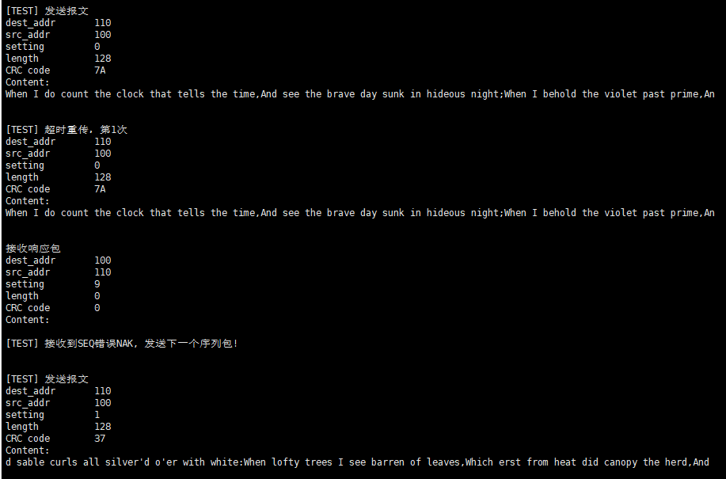

# M2报告——点对点通信

### 1 实验过程

本次实验我们要完善报文的发送和接收机制，定义完整的报文格式，接收所需的报文而无视噪声以及不相关报文。

报文头完整定义如下，本次实验我们主要使用到`dest_addr, src_addr, seq, ack, nak, length, crc `字段，其余字段预留到后面实验可能使用。

`dest_addr, src_addr`即接收设备和发送设备的编号。`seq, ack, nak` 分别是序列号，`ack, nak`的标志位。由于目前设备仅同时仅处理一个数据报，`seq`仅需一位，发送方从0开始，每次取反，而接收方ack将接收到的序列号发送回去，nak则将期待接收的序列号发送回去 。`length`即报文的内容长度，`crc`为要求实现的软件校验码，为CRC16高低字节的异或结果。

设备编号由每个设备各自设置全局变量指定。

```c
typedef struct LoraPacketHeader {
  uint8_t dest_addr;
  // if addr is 0, it should be ignored.
  uint8_t transfer_addr[LORA_TRANSFER_NUM];
  uint8_t src_addr;
  uint8_t magic_number;// = LORA_MAGIC_NUMBER;
  struct {
    uint8_t seq : 1;
    bool ack : 1;
    bool use_wifi : 1;
    bool nak : 1;
    uint8_t reserved : 1;
    uint8_t service : 3;
  } settings;
  uint8_t length; // the length of payload
  uint8_t crc; // xor of crc16 high and low bytes
} LoraPacketHeader;
```

#### 1.1 单个报文发送

```c
void LoraWriteAsync(const char *s, uint8_t len, const LoraPacketHeader *header)
{
    SX1278_LoRaEntryTx(&sx1278, len+LORA_PACKET_HEADER_LENGTH, 2000);//进入发送模式
  	//准备发送缓冲区
    memset(buffer,0x00,sizeof(buffer));
  	memcpy(buffer, header, LORA_PACKET_HEADER_LENGTH);
  	memcpy(buffer+LORA_PACKET_HEADER_LENGTH, s, len);

  	SX1278_LoRaTxPacket(&sx1278, (uint8_t*) buffer,
                len+LORA_PACKET_HEADER_LENGTH, 2000);//发送
}
```

单个报文发送函数即 将报头和内容连接起来再调用SX1278发送接口进行发送。

本函数对准备好的数据报进行直接发送，发送数据报或者响应报时都有使用。物理层内部使用，不对上层开放。

#### 1.2 内容发送

本节针对较长的数据量，一个数据报无法全部发送出去，因此需要一个单独的函数，对所有数据进行处理并发送出去。提供给上层使用，发送指定内容。

该发送函数(`LoraWrite`)需要处理发送以及接收响应报的功能，由于未定义单独的接收函数，需要添加包内容的判断以及对于接收超时的判断，该函数接收和发送逻辑是耦合的。

**补充说明：**该函数应当建立起两点间的连接会话，并且隔绝其余设备， 但由于目前仅考虑两个设备间的通信，实际上未处理接收响应包时其余设备发送数据报的情况，后续可能需要修改。

```c
int LoraWrite(const char *s, uint32_t len, uint8_t dest_addr);
//此处参数s, len针对的是需要发送的所有数据量的内容及长度
//dest_addr 即目标接收设备编号
```

```
//主要伪代码如下
while(已发送数据量 < 数据总量){
	数据发送量 = MIN[最大报文长度, 剩余待发送量];
	准备数据报头部(源，目的设备编号；序列号；报文长度；CRC)
	发送该数据报
	
	while(1){// 检测重发循环
		检查是否发送成功(是否触发发送回调函数)
			发送失败进行重传，重传最大次数终止该次发送
		
		进入接收状态，准备接收响应报
		
		while(1){// 接收响应报循环
			接收报文
			if (该报文目的为本设备)
				if ack
					设置结束信号，退出循环
				else if nak
					if 接收seq != 发送中seq
						说明ack丢失，但是该数据报发送成功，设置结束信号，退出循环
					else
						重传次数++
						重发数据报，退出接收响应报循环
			延时1ms
			if 等待ack超时
				检查重发次数，达到最大即发送失败，退出函数。
				重发数据报，退出接收响应报循环
		}
		if 结束信号被设置
			结束检测重发循环
	}
	重置结束信号
	计算已发送数据量
	计算下一数据报序列号
}
```


#### 1.3 报文接收

设备通常处于接收报文的状态，仅当上层调用`LoraWrite`函数准备发送数据时才进入发送状态，并且发送结束后应当重新调用接口回到接收状态。该函数内发送数据报仅调用单次报文发送函数`LoraWriteAsync`即可。

```c
void LoraRead()
```

该函数无参数，无返回。但是修改SX1278库函数后新增加了接收回调函数，上层用户可编写回调函数来处理接收的数据。

```c
//回调函数
// s    接收到的数据报地址
// len  接收到的数据长度
void LoraRxCallbackFromISR(const char *s, uint8_t len) {
}
/* sx1278.c */
uint8_t SX1278_LoRaRxPacket(SX1278_t *module){
...触发接收信号
    LoraRxCallbackFromISR(module->rxBuffer, module->readBytes);
...
}
```

```
//接收函数伪代码

进入接收状态
while(1){
	接收数据报
	if 接收到数据报{
		存储数据报到指定内存
		读取报头
		if 目标设备编号 是 本机编号{
			准备响应报头
			if 序列号seq 符合预期{
				读取报文
				计算CRC校验值
				if CRC 校验成功
					设置ack
					计算下一数据报预期编号
				else
					设置nak	
			}
			else 
				设置nak
			
			发送响应报(无报文)
			回到接收状态
		}
	}
}
```


### 2 测试

该实验测试项目分为四项

* 无干扰测试，发送方和接收方自行通信
* 超时重传测试，接收方在接到数据报后延迟一定时间再发送ack响应报
* CRC校验错误NAK测试，发送方第一次发送前将计算的CRC校验值取反，人为造成CRC错误
* SEQ数据报序列号错误测试，实际上模拟ACK响应报丢失，即接收方不发送某一响应报，等待重传后发送NAK同步接收信息。

测试方法：通过宏定义在使用函数中添加串口输出信息，指定接收和发送后在两台设备运行程序。


#### 2.1 无干扰


发送数据报，第一个数据报序列号0


接收数据报，并发送响应报。

测试过程出现ACK丢失情况，在发送方重发后，接收方发送NAK并设置SEQ请求下一数据报。


接收到NAK（发现序列号为1，和期待接收的响应序列号不同，说明上一数据报已接收），发送下一数据报。


接收方接收到第二个数据报发送ACK，发送方接收到ACK响应报。

.........

#### 2.2 超时测试

**延时5000ms，重发1次**

发送方串口输出


接收方串口输出


接收方手动延时5000ms

发送方发送一次报文后，由于延时未能收到响应报，于是进行重传。然后接收到迟到的ACK响应报，发送下一数据报。

**延时30000ms，超时重传达最大次数，发送失败**

发送方串口输出


接收方串口输出


#### 2.3 CRC错误测试

发送方串口输出


和前面对比可以看出，相同报文内容，CRC从7A变成了85，接收到NAK响应报，因此重新计算CRC并发送后（并未打印重发报文），接收到ACK，该数据报发送成功。

接收方串口输出


两次接收，一次CRC校验失败，一次CRC校验成功。


#### 2.4 ACK响应报丢失，SEQ错误

虽然前面意外也出现了相应错误，但此处还是主动进行触发测试

发送方串口输出



发送一次后未接收到ACK，导致超时重传1次，接收到重传包的NAK响应报后发送下一个数据报，不再等待ACK报。


接收方串口输出


接收方忽略某一数据报不发送ACK，又接收到重传报后发现和预期SEQ不一致，发送NAK响应报。后续正常接收下一数据报并发送ACK。

#### Other

* 目的地址不符合，接收方丢弃数据报，不响应。（由于只有两个设备进行测试，因此只有发送方的串口输出，表现出来就是超时重传达最大次数，发送失败）
  * 修改目标设备编号为 120.


