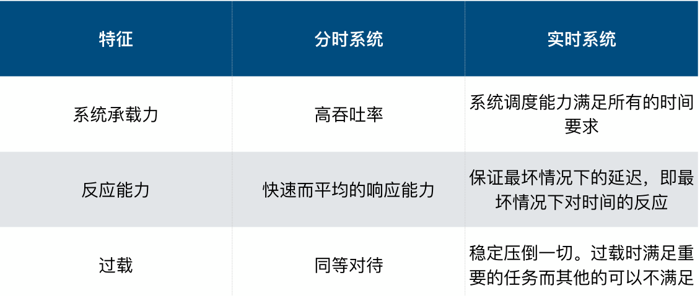
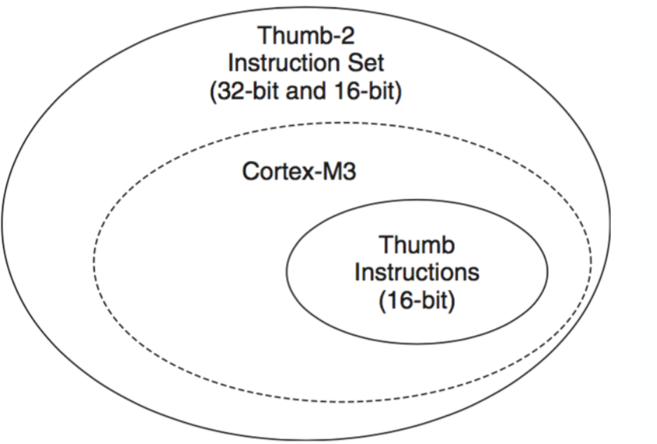
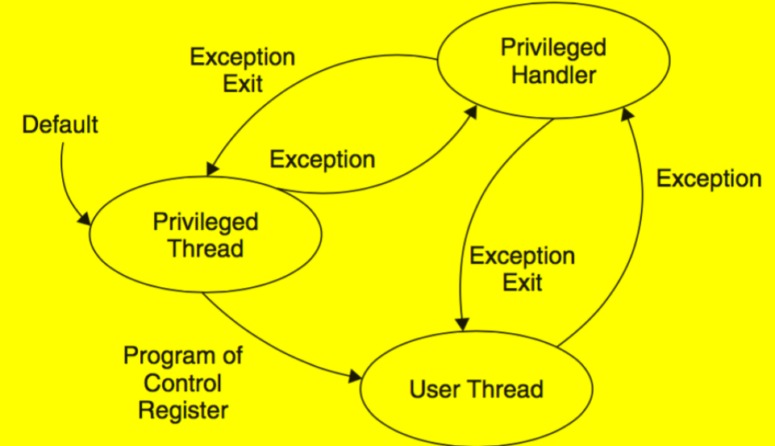
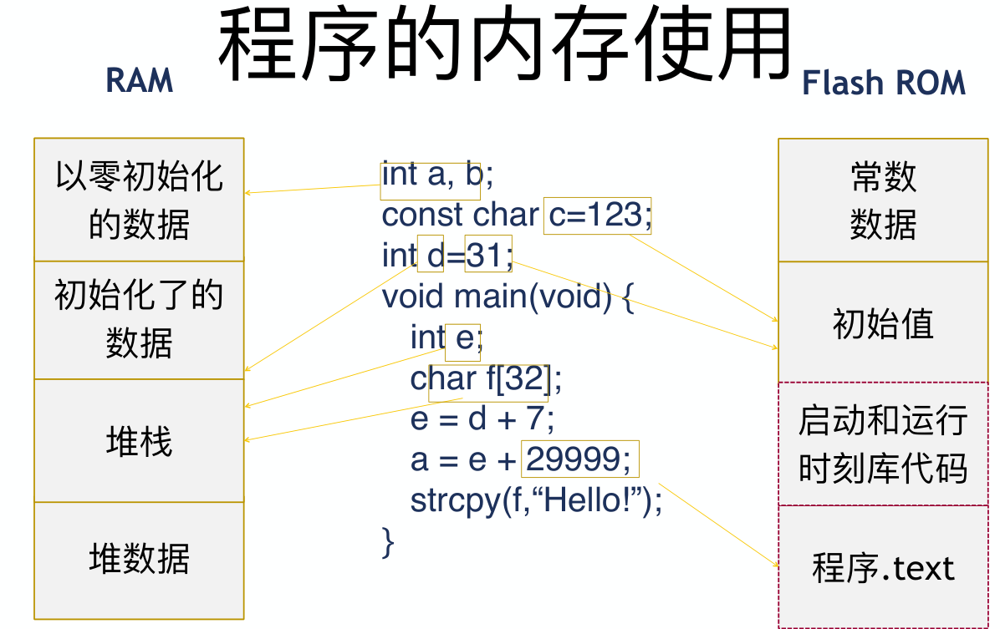
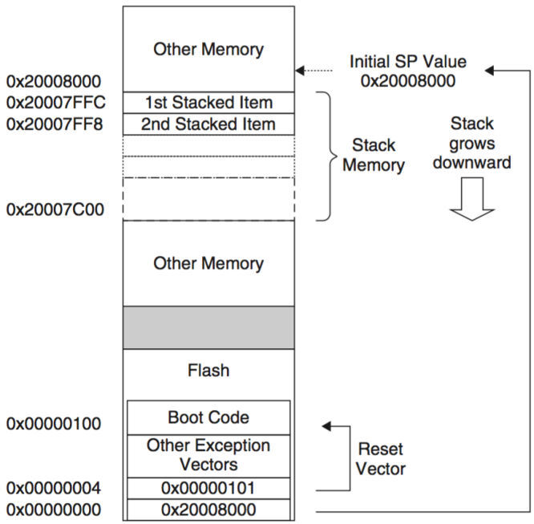
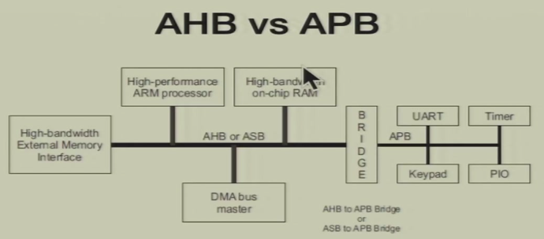
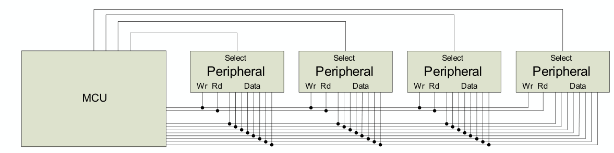
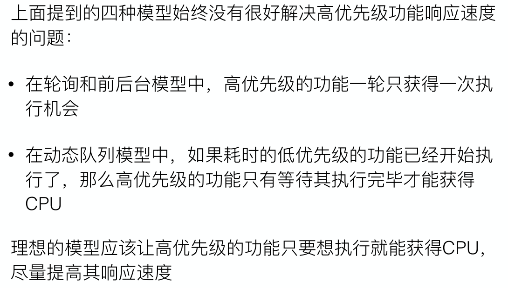
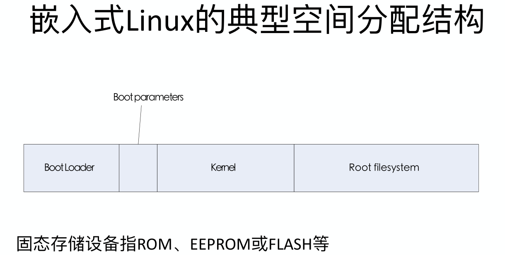

[TOC]

> 补天所得, 没有建立知识体系,按照课件顺序记录
>
> 笔记标记:
>
>  wzh老师的课件添加标记"\wzh  \end"; 不过两老师的内容差距较大,可能还是在最后集中补充
>
> 感觉重要且大概率会考的部分使用 h6标题突出方便索引

## 嵌入式系统概述

* 嵌入式定义

  * IEEE（国际电⽓和电⼦⼯程师协会）的定义：嵌⼊式系统是“⽤于控制、监视或者辅助操作机器和设备的装置”

  * 嵌入式系统是以应用为中心，以计算机技术为基础，采用可剪裁**软硬件**，适用于对功能、可靠性、成本、体积、功耗等有严格要求的**专用计算机系统**。
  * • 对环境的监测和反应
    • 控制环境
    • 信息的处理
    • 特定应⽤
    • 应⽤程序的优化
    • 资源限制
    • 实时
    • 多速率

###### 嵌入式系统和桌面通用系统区别

1. 嵌入式系统中运行的任务是专用而确定的( 只处理一类任务,控制设备,显示信息,  更改任务需要重新设计系统或在线维护)
2. 桌面通用系统需要支持大量的需求多样的应用程序。(对系统运行程序不作假设,程序更新方便)
3. 嵌入式系统对实时性有较高要求(实时系统：指系统能够在限定的响应时间内提供所需⽔平的服务。)
4. 嵌入式:强实时: us-ms, 一般: ms-s， 弱: S+
5. 嵌入式中一般使用实时操作系统
6. 嵌入式需要高可靠性保障, 嵌入式系统需要长时间无人值守条件下的运行,运行环境恶劣
7. 嵌入式系统有功耗约束
8. 嵌入式可用资源少(配置遵循够用就行),嵌入式开发需要专用工具和特殊方法(交叉编译,交叉链接,虚拟机调试,在线升级)
9. 嵌入式是**综合**计算机应用技术

**实时和分时系统**

>  

* 嵌入式系统构成:嵌入式微处理器、外围硬件设备、嵌入式操作系统（可选），以及用户的应用软件系统等四个部分组成

`\wzh`

* 采用RISC架构的微处理器- ARM
  * 体积小、低功耗、低成本、高性能
  * 支持Thumb（16位）/ARM（32位）双指令集，能很好的兼容8位/16位器件
  * 大量使用寄存器，指令执行速度快
  * 大多数数据操作都在寄存器中完成
  * 寻址方式灵活简单，执行效率高
  * 采用固定长度的指令格式

* 外围硬件设备: I/O 设备,通讯设备, 片外总线, 电子盘

* 嵌入式操作系统:性能指标,:  
  * 内核大小：几K～几百K；
  *  调度时间片：1ms；
  * 实时任务响应时间：20～40us
  * 一般任务响应时间：20us～几百ms
* 嵌入式系统应用
  * 智能家居:
  * PDA( Personal Digital Assistant ): 个人信息助理,掌上电脑
  * 便携多媒体播放器( Portable Media Player)
  * 办公:录音笔,电子书kindle
  * 手表

`\end`

## 嵌入式程序设计

* 工作平台
  * ⼀旦确定CPU（通常是ARM），最重要的⼀步就是建⽴在这块CPU上的⼯作平台.
  * 评估板和核心板(包括芯片以及部分外设,便于快速设计产品原型)
  * 编译器、链接脚本、Hello World
  * 串⼝、AD、定时器等的库或测试/示例/基础代码

### ARM(wk没讲多少, 还得wzh补充)

* ARM指令是为资源丰富,高性能计算机系统设计的(深度流水线,高时钟频率,宽内存总线)
* 低端嵌入式系统: 慢时钟频率, 浅流水线, 代码大小很重要

因此对ARM的指令集作出修改来适应

* Thumb指令集: 16位指令, 降低内存需求但是降低性能
* Thumb-2指令集, 增加部分32位指令,改进内存
* CPU根据是Thumb状态还是ARM状态来解码指令，状态由T位控制

> 

* ARM系统的操作模式(用户态下的异常可以返回系统态或用户态,但是系统态的异常只能返回系统态 )

> 

### C语言的实现

* 程序员的世界: 各种函数与变量,数据结构,控制结构

* 处理器:只有有限的数据结构(整数), 普通的算术指令
* 应⽤程序⼆进制接口（ABI）:定义让分别开发的函数可以⼯作到⼀起的规则
* ARM体系过程调⽤标准（AAPCS）:定义了哪些寄存器必须被保存和恢复, 如何调⽤过程 ,如何从过程返回

----此处各种东西,涉及甚广,其他课程的,部分省略...

* AAPCS 寄存器使⽤协议
  * 对于cortex-M，有两类寄存器
  * 调⽤者保存的寄存器”：不能指望被调⼦程序返回时还能保有原值的寄存器  R0-R3(参数, 返回结果, 临时变量), R12, LR,( Link Reg) PSR()
  * 被调者保存的寄存器”：这些受保护的（“变量”）寄存器，从被调⼦程序返回后还能继续保有原值.   R4-R11
  * SP(R13)
  * LR(R14)
  * PC(R15)

* 程序内存使用类型: 

  * 代码
  * 只读的静态数据
  * 可写的静态数据: 初始化了, 初始化为0的, 未初始化
  * 堆
  * 堆栈

  * 程序需要怎样的内存?

    * 可否修改?
      * 不能:放在只读,不易失的内存( flash)中, 指令,常数字符串,常数操作数, 初始值(全局变量)
      * 能放在可读可写的内存,  变量,计算中间结果, 返回地址, 
    * 存在多久?
      * 静态分配: 从程序开始到结束都存在,变量位置固定,空间不能重用
      * 自动分配: 从函数开始到结束都存在,. 可被重用
      * 动态分配: 从分配到回收存在, 可被重用

    

* 访问内存数据
  * 静态变量:可能存在于内存任意位置, 指令中无法直接放下32位指针,先将指针放在r0, 然后用r0 取变量到r1, 如此可以使用变量的值了.
  * 自动变量:存储于堆栈中,(函数的活动记录),  通过sp 加偏移量进行寻址

* 数组访问: 基本遵循取地址,偏移量 ,取变量的模式. 省略吧……
* 函数调用
  * 没有CALL/RET指令，BL指令在跳转时将当前PC+4存⼊R14(LR)
  * 返回时将R14移⼊PC（R15）即返回
  * 嵌套调用需要存储R14和返回取出  ( `STMFA R13!, {R0-R2, R14}     LDMFA R13!, {R0-R2, PC} ` )
  * 参数规范: 4个以下参数，由R0～R3传递，其中arg1－R0    ⼤于4个参数时，通过堆栈传递        返回结果存在R0中

## 启动和外设

上电启动

* 两个比较重要的字:
  * Address 0x00000000: Starting value of R13 (the stack pointer)
  * Address 0x00000004: Reset vector (the starting address of program execution; LSB should be set to 1 to indicate Thumb state) **`PC Reset_Handle`**
  * 即分别存储栈空间起始地址和程序的起始地址.

* 初始化的内存
  * 启动是一个中断,而不是从0地址开始执行
  * 启动中断是中断向量表的第⼀项
  * 在0地址的不是中断向量表的第⼀项
  * 初始堆栈指针由0地址的值指定
* 重启后,单片机
  * 初始化硬件: 外围部件, 设置堆栈指针
  * 初始化C/C++的运行时刻环境, 设置堆内存, 初始化变量

* 启动代码(可以看STM32工程给出的`startup_stm32f103xb.s`启动文件)
  * Reset入口
  * 填充bss
  * 初始化时钟,调用main(`bl main  ;  bx lr`)跳转至main, 如果从main返回了则会卡死在下一个指令
* SystemInit
  * 初始化时钟，设置时钟的PLL分频⽐
  * 采⽤默认配置就不需要修改

链接脚本

* 定义内存
* 中断向量
* 默认中断处理函数(什么都不干, weak属性, 可以自己定义覆盖/替换)

###### Cortex-M 的中断向量

* 中断向量表是编译链接时刻确定下来放在flash中的
* 不能在程序运⾏中来写⼊中断处理函数地址
* 在启动代码⽂件中预置中断处理函数(即默认处理函数)
* 自己写的中断处理函数必须完全同名，函数的地址才能被链接器放到正确的位置去
* 其他CPU：中断处理函数可以任意起名，通过特殊的修饰关键字来表明中断函数性质，通过主动的代码在运⾏时刻把函数地址放到中断向量表中

* ARM的中断产生和返回, LR被设置成一个特殊值(magic number),可以判定中断的返回

### 处理器(processor)和微控制器(microcontroller)

* 处理器是纯芯片(IO是为⼈机交互服务的), 微控制器还有片上外设,嵌入式是微控制器(嵌⼊式微控制器的⽤途是控制其他设备IO是为控制（输⼊/输出）服务的)

ARM的两条总线

> 

* APB可以视作挂在AHB上的器件
* AHB仅挂载处理器, RAM,FLASH; 而APB上挂载所有外设
* AHB的速度快于APB

* GPIO就是可以由CPU直接操纵的引脚，可以写，可以读，可以接通信单元

* 输入信号值由电压决定,输⼊阈值电压是由供电电压VDD所决定的
* 任何时候都不要使使用的GPIO悬空(可能会有周围的电磁感应,导致GPIO产生输入电压), (我们实验过程中电路添加电阻来提供稳定的电压.)
* 输出电压受引脚上的负载所汲取的电流的影响

* 驱动外部LED
  * 需要限制电流，使其对LED和单⽚机端⼝驱动电路是安全的(LED压降是一定的, 需要外部的电阻来降低电流大小)

* 输出HIGH 和LOW
  * 扇出:  输出HIGH时，电流从CPU的Vcc流⼊，经过引脚输出给外部
  * 灌入:  输出LOW时，电流从外部的Vcc流⼊，经过引脚后，直接到地
  * 对于某些CPU，使⽤灌⼊⽅式，整体能驱动更⼤的设备
  * ⼯业界⼀般采⽤灌⼊(逻辑需要反过来, 低电平亮)
  * (引脚具有推挽能力时,输出高低电平的能力是一样的.)推挽?不懂……

* 控制寄存器
  * 每个通⽤I/O端⼝具有四个32位配置寄存器, 两个32位数据寄存器, ⼀个32位置位/清除寄存器, ⼀个32位锁定寄存器, 两个32位可选功能选择寄存器
  * 控制寄存器中的每个位对应端⼝的⼀个位
  * 所有的寄存器都必须以32位的字来访问
  * 需要原子操作

* STM32F4Discovery上的AHB1总线⽀持对⼀位或多位的原⼦访问,  ⽐特级别对GPIOx_ODR编程时⽆需关闭中断

* 初始化GPIO
  * 需要开启外设端口时钟(默认关闭省电)

* CMSIS(定义一组宏) ——在C语⾔⾥访问硬件寄存器

* 要写出兼容多个平台的代码,需要使用CMSIS而不能用HAL库

## MCU 编程平台

* 通信: 与外界的信息交换称为通信（讯）. 基本通信方法有并行通信和串行通信
  * ⼀条信息的各位数据被同时传送的通信⽅式称为并⾏通信。
  * 并⾏通信的特点是：各数据位同时传送，传送速度快、效率⾼，但有多少数据位就需多少根数据线，因此传送成本⾼，且只适⽤于近距离（相距数⽶）的通信。

* 并行总线
  * 所有的器件通过总线共享数据、读和写的信号
  * 单⽚机⽤单独的⽚选线来点选每个外围部件
  * 单⽚机所需的数据线少了，但是还是每⼀个⽐特需要⼀条线
  * 单⽚机同时只能和⼀个外围部件通信

* 串行通信: ⼀条信息的各位数据被逐位按顺序传送的通信⽅式称为串⾏通信。

  * 串⾏通信的特点是：数据位传送，传按位顺序进⾏，最少只需⼀根传输线即可完成，

  * 成本低但送速度慢。串⾏通信的距离可以从⼏⽶到⼏千⽶。
  * 根据信息的传送⽅向，串⾏通信可以进⼀步分为单⼯、半双⼯和全双⼯三种。

* 选择串行通信的原因
  * 成本和重量：需要更多的线、更⼤的接插件
  * 结构可靠性：更多的线=>更多的接插件触点失效
  * 定时复杂性：因为导线上不同的容抗和阻抗，有些⽐特可能⽐其他的到得晚些
  * 电路复杂程度和能耗：谁也不想系统中有16个不同的⽆线发射机＋接收机
  * (现在硬盘选择串行而非并行, 线上电信号传导过快,并行的线会形成干扰,导致传输反而慢下来?)

* 同步通信
  * 建⽴**发送方时钟**对**接收⽅时钟**的直接控制，使双⽅达到完全同步。(注意方向)
  * 传输数据的位之间的距离均为“位间隔”的整数倍，同时传送的字符间不留间隙，即保持位同步关系，也保持字符同步关系。

* 异步通信
  * 以字符（构成的帧）为单位进⾏传输，字符与字符之间的间隙（时间间隔）是任意的，但每个字符中的各位是以固定的时间传送的，即字符之间是异步的（字符之间不⼀定有“位间隔”的整数倍的关系），但同⼀字符内的各位是同步的（各位之间的距离均为“位间隔”的整数倍）。
  * 特点:  不要求收发双⽅时钟的严格⼀致，实现容易，设备开销较⼩，但每个字符要附加2～3位⽤于起⽌位，各帧之间还有间隔，因此传输效率不⾼。

* 速率计算:  
  * ⽐特率是每秒钟传输⼆进制代码的位数，单位是：位／秒（bps）。如每秒钟传送240个字符，⽽每个字符格式包含10位(1个起始位、1个停⽌位、8个数据位)，这时的⽐特率为： 10位×240个/秒 = 2400 bps
  * 波特率表示每秒钟调制信号变化的次数，单位是：波特（Baud）
  * 波特率和⽐特率不总是相同的，对于将数字信号1或0直接⽤两种不同电压表示的所谓基带传输，⽐特率和波特率是相同的。

### 流控制

* 解决MCU内存不⾜以保存收到的全部数据的问题
  * 硬件流控制常⽤的有RTS/CTS（请求发送/清除发送）流控制和DTR/DSR（数据终端就绪/数据设置就绪）流控制
  * ⼀般通过XON/XOFF来实现软件流控制

* 错误检测：奇偶校验or不校验

* 串⼝⽤于PC和MCU（或MCU和MCU之间）的通信
* 最简单的连接⽅式只接三根线：RXD、TXD和GND
* 通常RXD（数据接收）和TXD（数据发送）是以所在的设备（PC或MCU）来标识的因此连接串⼝时，⼀个设备的TXD应该连接到另⼀个设备的RXD，反之亦然
* 串⼝是电压协议，因此通信的两⽅必须共地

* RS232（EIA-RS-232C对电器特性、逻辑电平和各种信号线功能都作了规定。 ）
* 在TxD和RxD上： 
  *  逻辑1(MARK) =-3V～-15V   逻辑0(SPACE)=+3～＋15V
* 在RTS、CTS、DSR、DTR和DCD等控制线上：
  * 信号有效（接通，ON状态，正电压）＝+3V～+15V
  * 信号⽆效（断开，OFF状态，负电压) = -3V～-15V

* RS232的不⾜：
  * 传输距离短，传输速率低
  * 有电平偏移
  * 抗⼲扰能⼒差

* RS422
* RS-485是RS-422A的变型：
* RS-422A⽤于全双⼯，⽽RS-485则⽤于半双⼯。

* RS-232：较⾼电压、点对点
  ▪ RS-422：较⾼电压、差分数据发送、多点接收
  ▪ RS-485：较⾼电压、多点

* 通⽤同步/异步收发器 (USART)

* SPI 1,2; USART 2,3; UART 4,5 以及I2C 1,2,3 ⽤的是APB1来的时钟
  ▪ USART 1 和 6 ⽤的是APB2的时钟
  ▪ 在使⽤这些串⾏通信模块之前得先开启这些时钟

* 发送基础
  * 如果没有数据要发送，持续发送1（停⽌位）——空闲线
    ▪ 当有数据要发送时
    ▪ 发送⼀个0（起始位）来表明开始发送⼀个数据了
    ▪ 发送数据中的每个位（对发送缓存的数据⽤移位寄存器）
    ▪ 发送⼀个1（停⽌位）来表示数据的结束

* 接收
  *  等待下降沿（起始位的开始）
    ▪ 然后等待½位的时间
    ▪ 数据有⼏位就做⼏次下⾯的操作
    ▪ 等待1位的时间
    ▪ 读那⼀位然后移位进接收缓存（移位寄存器）
    ▪ 等待1位的时间
    ▪ 读这⼀位
    ▪ 如果1（停⽌位），那么OK

* 发送方和接收方必须有协议
  * 数据位的顺序
    ▪ 数据位的数量
    ▪ 起始位是什么（1还是0）
    ▪ 停⽌位是什么（1还是0）
    ▪ ⼀位要持续多久
    ▪ 发送⽅和接收⽅的时钟必须尽可能⼀致，因为唯⼀的定时基准就是起始位的开始

* 串口代码模型（轮询，中断，DMA）
* 发送
  • 发送⼀个字符，然后轮询等待这个字符发送完成，再发送下⼀个
  • 发送⼀个字符，⼀个字符发送完成后产⽣中断，中断响应程序⾥发送下⼀个字符，直到发送完成
  • 启动DMA依次发送n个字符，全部发送完成后结束DMA并产⽣中断
*  接收
  • 轮询等待字符到
  • 到了⼀个字符产⽣中断，中断响应程序⾥处理这⼀个字符
  • 启动DMA收n个字符，全部收到或超时后结束DMA并产⽣中断

* 轮询会有时序问题，串⼝发送时整个MCU不能做其他事情，串⼝输出内容的多少会影响整个系统的时序。

### 定时器

## 嵌入式软件模型

⽀持并⾏的MCU硬件和软件

* CPU执⾏⼀个或多个线程的指令

* 特殊的硬件外围部件实现专⻔的并⾏处理
  * DMA – 在内存和外围器件之间传输数据
    ▪ 看⻔狗定时器
    ▪ 模拟接⼝
    ▪ 定时器
    ▪ 与其他器件通信
    ▪ 检测外部信号事件

* 外围部件⽤中断来通知CPU事件的发⽣

* CPU调度
  * MCU的**中断**系统实现了基本的CPU调度⽅法
  * 更复杂的系统需要⽀持多个独⽴的线程并⾏执⾏
  * 如何让处理器是有响应的？（如何能让它在正确的时间做正确的事情？）

* 任务调度
  * 是否每次都以相同的顺序运⾏这些任务？
    ▪ 是：静态调度（轮流执⾏、轮换执⾏）
    ▪ 否：动态、有优先级的调度
  *  ⼀个任务是否可以抢占其他任务，还是必须等待别
    ⼈完成？
    ▪ 是：抢占式
    ▪ 否：⾮抢占式（协作、运⾏到结束再切换）

轮询模型

* 整个程序就是⼀个循环
* 程序按顺序检查每⼀个需要关⼼的I/O设备，完成每⼀件需要完成的⼯作

* 轮询模式下，会将循环中的代码分解为多个任务
  • 每个任务有确定的执⾏时间（延迟）和执⾏周期
  • 整个循环有确定的执⾏时间也即执⾏周期
* 优势
  * 程序逻辑简单直观
  * 不使⽤中断
    • 系统执⾏的时间是可预计的
    • 系统执⾏所需的内存是可预计的
    • 没有共享数据冲突的⻛险

* 问题：
  * 无法对外部事件及时响应
  * 如果⼀个设备需要的最⻓响应时间⼩于程序循环⼀次的时间，轮询模型就⽆法满⾜要求。
  * ⼀个⼯作如果需要很⻓时间完成，后续的⼯作必须等
    待其完成后才能执⾏
    • ⼗分脆弱。即使通过努⼒让系统满⾜性能要求，但是
    只要增加⼀个新的功能或者访问⼀个新的设备，就可
    能让系统不再满⾜性能要求
    • 紧急的任务得不到优先处理

前后台模型

* 中断⽤来处理硬件的紧急请求，并设置相应的操作标识
* 主循环轮询这些标识，进⾏后续处理

* 特点：
  * 延时通过定时器中断实现（在⼤⼩循环中查看定时标识）
  * 不在主循环中做外设的等待（由等待外设完成变成等待中断置标志）

* 优点：
  * 紧急任务可以放在中断中优先处理
  * ⼤量计算的任务放在主循环，对其他任务的影响被减轻了
  * 任务被分隔在中断处理程序和主循环中，代码更加清晰
  * 当设备没有产⽣中断时，就⽆需查询和等待，节省了处理时间

* 困难：
  * 对CS⼈存在编程习惯问题
  * 共享数据存在冲突问题（通过关中断解决？可以但是不好）
  * 还是无法保证重要且具有⼤计算量的任务优先完成
  * 被认为是轮询的变种，只是⽤中断解决了在轮询中等待的问题
* 优先级问题：主循环可以增加⾼优先级任务的标识检查机会

中断驱动模型

* 基础体系结构，对于简单低功耗设备有⽤
* 中断系统内置的任务分派机制的作⽤（可以⽤输⼊变化、定时器到时、UART收到数据、模拟数据电平跨越⽐较器阈值等来触发中断响应程序）
* 主函数配置好系统就去睡眠，如果被中断了，它还会回去继续睡眠

* 特点：
  * 没有主循环，⼤量时间睡眠，功耗低
  * 编程模型类似事件驱动的GUI程序
  * 通过中断优先级和中断嵌套实现不同任务之间的协调
  * 适⽤于功能任务简单，任务之间冲突机会⼩，空闲时间多的产品
  * 不适合任务间存在冲突可能的产品

时间驱动

* 开启定时器中断，确定个任务的执行时间和周期，

* 将所有的任务分解为若⼲个⼩的阶段，让每个阶段所需的时间等⻓

能保证任务在规定的时间节点上得到运⾏
• 能实现任务的轮流运⾏
• 实现⽅式复杂，任务间协调麻烦
• 没有OS的时间⽚轮转

动态队列

* 将处理的各个功能编写成函数的形式
* 中断产⽣时，将相应的处理函数的指针放⼊队列中
* 主循环不断的读取队列，取出函数指针并调⽤该函数

优点：

* 动态队列有更好的响应时间

* 主函数可以按照任何优先级策略来调⽤队列中的函数（或中断函数可以以任何策略来插⼊函数）
* ⾼优先级的功能能得到更多的CPU资源

* 低优先级的功能将获得更少的CPU资源，甚⾄有可能饿死

缺点

* 某个低优先级的功能执⾏时间很⻓的话，⼀旦这个功能被执⾏，⾼优先级的功能就需要等待很⻓时间才能执⾏

* 编程复杂，接近于⾃⼰实现⼀个OS了

> 

* 动态调度

* 抢占式实现了最佳响应时间
  * 需要更复杂的编程和更多的内存
    ▪ 引⼊了数据竞争可能造成的不可靠性

* 实时是什么意思？
  ▪ 每个任务和中断服务程序的最⼤响应时间是可以计算和得到保证的
  ▪ 响应时间的这个“绑定”使得它可以⽤在硬实时系统中（具有必须满⾜的截⽌时间）
* RTOS有什么
  * 任务调度器
    ▪ 采⽤抢占式和优先级策略以使得响应时间最⼩
    ▪ ⽀持中断
  * RTOS核⼼集成的服务
    ▪ 进程间通信和同步（安全的数据共享）
    ▪ 时间管理
  * RTOS集成的可选服务
    ▪ I/O抽象？
    ▪ 内存管理？
    ▪ ⽂件系统？
    ▪ ⽹络⽀持？
    ▪ GUI??

### boorloader

* 一个典型的轮询模型
* boorloader是什么？上电后的第⼀段代码
  * 程序本身：⼩规模单⽚机程序
  * 采⽤bootloader是为了⽅便程序的下载、启动和最初
    的调试
* Boot Loader是在系统启动时激活，在操作系统内核运⾏之前运⾏的⼀段程序
  * 初始化硬件设备和建⽴内存空间的映射图
  * 将系统的软硬件环境带到⼀个合适的状态，以便为最终调⽤操作系统内核准备好正确的环境
* 将程序放进嵌入式机器

  * 预先烧录(没焊芯片)

    * ROM
    * flash
    * 将整个MCU当作flash来烧录

  * 专⽤硬件接⼝（焊芯片但是没跑程序）

    * JTAG
    * SWI
  * ISP（跑了程序）
    * 厂家实现的bootloader

* IC（circuit 电路）P： 没有程序跑起来就烧录
* IS（service  服务）P: 有程序跑起来在烧录
* IAP： 有（用户）程序跑起来了，还可以通过网口网络来进行烧录

   

程序的位置可以是ROM, flash, SDIO, IDE, SATA

但是只有ROM或flash的可以启动时直接访问

程序可以运⾏在ROM, flash, SRAM, DRAM

上电时的第⼀条指令只能在ROM或flash中,DRAM需要初始化控制器之后才能访问

* bootloader的操作模式： 启动加载模式 (直接启动操作系统)    下载模式（等待用户指令再操作）
* Bootloader与主机之间的通信设备及协议（通过分包来区分）
  • 串⼝协议：xmodem/ymodem/zmodem
  • ⽹络协议：TFTP（Tiny FTP）

### 嵌入式linux的引导装载程序

* Flash启动⽅式
* 硬盘启动⽅式（通过flash装载硬盘的512字节）
  • 在硬盘主引导区放置bootloader
  • 从⽂件系统中引导操作系统
* ⽹络启动⽅式
  • Bootloader放置在EPROM或Flash中
  • 通过以太⽹远程下载操作系统内核或⽂件系统
  • 开发板不需配置⼤的存储介质

功能分类

* 简单Bootloader
  • 只具有系统引导功能
* 具有监控功能（Monitor）的Bootloader
  • 调试⽀持
  • 内存读写
  • Flash烧写
  • ⽹络下载
  • 环境变量配置

###### 两阶段bootloader 结构

阶段1：实现依赖于CPU体系结构的代码

* 硬件设备初始化
  * 屏蔽所有的中断
  * 设置CPU的速度和时钟频率
  * RAM初始化
  * 初始化LED
  * 关闭CPU内部指令／数据Cache
* 为加载阶段2准备RAM空间
  * 除了阶段2可执⾏映象的⼤⼩外，还必须把堆栈空间也考虑进来
  * 必须确保所安排的地址范围的确是可读写的RAM空间
  * 内存区域有效性检测⽅法
    • 保存指定内存区域
    • 写⼊预定数据
    • 读⼊数据并⽐较
    • 恢复内存数据
* 拷⻉阶段2代码到RAM中
* 设置堆栈指针sp
* 跳转到阶段2的C语⾔⼊⼝点

阶段2：实现⼀些复杂的功能

* 初始化本阶段要使⽤到的硬件设备
  * 初始化⾄少⼀个串⼝，以便和终端⽤户进⾏I/O输出信息
  * 初始化计时器等

* 检测系统的内存映射
* 加载内核映像和根⽂件系统映像
* 设置内核的启动参数
* 调⽤内核
  * CPU寄存器的设置
  * CPU 模式：
  * Cache和MMU的设置：
    • MMU必须关闭；
    • 指令Cache可以打开也可以关闭；
    • 数据Cache必须关闭。

### os rtos

* os 通过操作系统进入程序app
* rtos 直接进入app， 需要os干活时才加载os
  * 由于不需要在运⾏时换软件
    • 嵌⼊式操作系统⼀般是单进程的
    • 操作系统不需要从⽂件系统装载软件运⾏
    • 操作系统表现为⼀个函数库，与应⽤软件⼀起编译链接成可执⾏代码
    • 进⼊API的⽅式往往是直接调⽤

* 二元信号量和互斥量？？？？？

###### 优先级反转

在优先级多任务系统中引⼊互斥⽅案，会导致任务优先级反转的问题：假如
某时低优先级的任务占有资源，然后⼜有⾼优先级的任务申请资源，但因为
不能满⾜⽽被挂起了，即低优先级任务阻塞了⾼优先级任务的运⾏。假如这
时⼜有⼀个中优先级任务，那么它会把低优先级任务抢占。最终⾼优先级任
务会间接的被中优先级任务抢占了

* 指的是中优先级和高优先级的执行顺序

优先级继承

当⼀个任务占有了资源并且随后阻塞了其他申请该资源的任务的时候，该任
务将临时改变它的优先级为所有申请该资源的任务中的最⾼的优先级。并以
这个临时优先级在临界区执⾏。当任务释放资源后，则恢复它原有的优先级

优先级天花板是指将申请（占有）资源的任务的优先级提升到可能访问该资
源的所有任务的最⾼优先级。(这个最⾼优先级称为该资源的优先级天花板)

RTOS的通信

管道

事件

信号

邮箱，消息队列

###### 看门狗

* 硬件设计，一个定时器
* 如果记到零，系统重启
* （不使之重启）喂狗：写一下寄存器，重新计时

## uc/os介绍

* 开源代码， 可移植性， 可固化，可裁剪
* **抢占式（Preemptive）实时结构，**
* 多任务（64个，8个保留给操作系统）
* 可确定性（ 全部uC/OS-II的函数调用与服务的执行时间是可确定的）
* 任务栈（每个任务有自己单独的栈， 允许每个任务有不同的栈空间，以便减少应用程序对RAM的需求）
* 系统服务（邮箱、消息队列、信号量、块大小固定的内存的申请与释放、时间相关函数）内存管理时钟管理任务管理
* 中断管理
* 稳定性和可靠性

uc GUI 嵌入式的用户界面

* 用ANSI C书写
* 支持任何8, 16, 32-bits CPU
* 彩色，灰、度，等级或黑白显示

uc/FS 嵌入式的文件系统

* 用ANSI C书写
* 支持任何8, 16, 32-bits CPU
* 支持SMC, MMC, SD, CF, IDE, Flash, RAM其他介质

* C/OS-II中任何工作都是用任务来构成的

* 每个任务对应一个特定的优先级。**优先级越高，任务编号数字越小**

* 当任务完成以后，任务可以自我删除。
  注意任务代码并非真的删除了，μC/OS-Ⅱ只是简单地不再
  理会这个任务了，这个任务的代码也不会再运行，如果任务
  调用了OSTaskDel()，这个任务绝不返回什么。

* 任务控制块OS_TCB：保存该任务的相关参数，包括任务堆栈指针，状态，优先级，任务表位置，任务
  链表指针等

uc 任务调度

*  C/OS是占先式实时多任务内核
* C/OS中不支持时间片轮转法（每个任务的优先级要求不一样且是**唯一的**）
* C/OS任务调度所花的时间为常数，与应用程序中建立的任务数无关

###### 优先级计算
