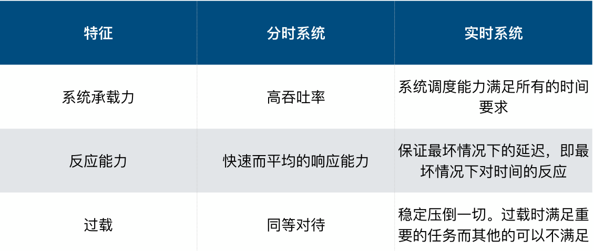
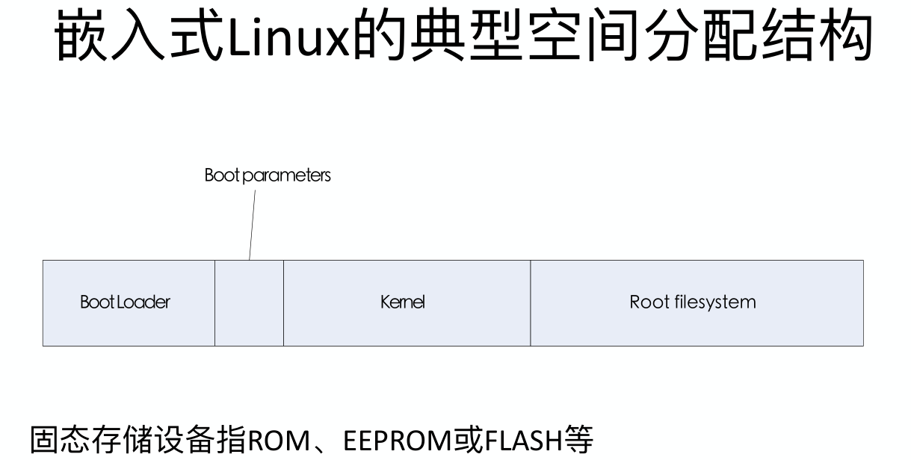
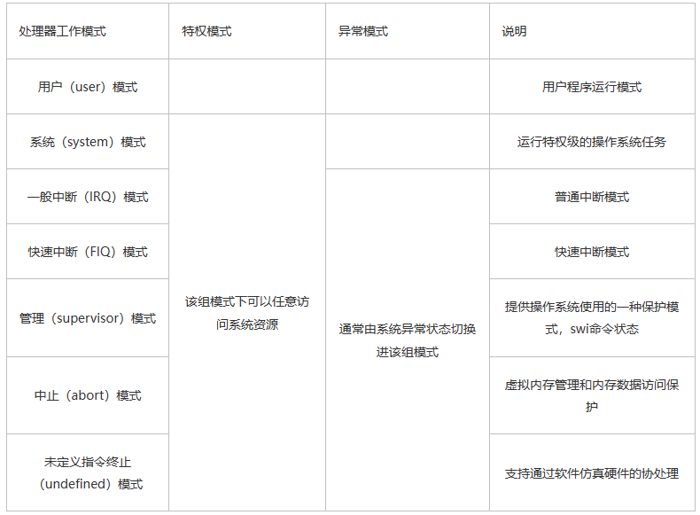

[TOC]


## 嵌入式系统 vs 桌面计算机

* 嵌入式系统是以应用为中心，以计算机技术为基础，采用可剪裁**软硬件**，适用于对功能、可靠性、成本、体积、功耗等有严格要求的**专用计算机系统**。

1. 嵌入式系统中运行的任务是专用而确定的( 只处理一类任务,控制设备,显示信息,  更改任务需要重新设计系统或在线维护……)

2. 桌面通用系统需要支持大量的需求多样的应用程序。(对系统运行程序不作假设,程序更新方便)

3. 嵌入式系统对实时性有较高要求(实时系统：指系统能够在限定的响应时间内提供所需⽔平的服务。)

   嵌入式:强实时: us-ms, 一般: ms-s， 弱: S+

   嵌入式中一般使用实时操作系统

4. 嵌入式需要高可靠性保障, 嵌入式系统需要长时间无人值守条件下的运行,运行环境恶劣

5. 嵌入式系统有功耗约束

6. 嵌入式可用资源少(配置遵循够用就行),嵌入式开发需要专用工具和特殊方法(交叉编译,交叉链接,虚拟机调试,在线升级)

7. 嵌入式是**综合**计算机应用技术

## 实时 和 分时



* 实时系统操作的正确性取决于  逻辑设计的正确性（没有“相应操作的执行时间’）。

* 软实时系统要求： 事件响应实时
* 硬实时系统： 事件和任务响应都实时
* 基于查询的实时编程结构实时性：其他所有任务执行时间之和
* 基于中断：中断响应时间
* 前后台系统实时性： 所有其余任务执行时间之和
* 非抢占式实时操作系统：最长任务执行时间
* 抢占式：任务切换时间


## 不可重入函数

如果某个函数可被多个任务并发调用而不会造成数据错误，则称该函数具有可重入性
可重入函数可在任意时刻被中断，稍后继续运行时不会造成错误

不可重入性：

不可重入函数不能被多个任务共享，除非采用信号量等机制确保函数的互斥调用，或者在代码的关键部分禁止中断
注意：可重入被多个任务并发调用，应该考虑为多个线程并发调用。因此代码中出现全局变量，或者是static的，多为不可重入函数。

* 即使用了一些共享的全局变量，不可被中断，否则会出现问题的函数。


## 嵌入式linux空间布局



* 不存在交叉编译器（显而易见的）


## ARM 指令集

* ARM指令是为资源丰富,高性能计算机系统设计的(深度流水线,高时钟频率,宽内存总线)
* 低端嵌入式系统: 慢时钟频率, 浅流水线, 代码大小很重要

因此对ARM的指令集作出修改来适应

* Thumb指令集: 16位指令, 降低内存需求但是降低性能
* Thumb-2指令集, 增加部分32位指令,改进内存
* CPU根据是Thumb状态还是ARM状态来解码指令，状态由T位控制
  * 相关题目（ARM处理器结构体系中具有T变种处理器核可以⼯作在ARM状态和Thumb状态。  正确）


## ARM寄存器

* 对于cortex-M，有两类寄存器
* 调⽤者保存的寄存器”：不能指望被调⼦程序返回时还能保有原值的寄存器  R0-R3(参数, 返回结果, 临时变量), R12, LR,( Link Reg) PSR()
* 被调者保存的寄存器”：这些受保护的（“变量”）寄存器，从被调⼦程序返回后还能继续保有原值.   R4-R11
* SP(R13)
* LR(R14)
* PC(R15)

## 看门狗

* 硬件设计，一个定时器
* 如果记到零，系统重启
* （不让它重启）喂狗：写一下寄存器，重新计时。


## 两阶段bootloader

* bootloader 是一个轮询模型
* Boot Loader是在系统启动时激活，在操作系统内核运⾏之前运⾏的⼀段程序
  * 初始化硬件设备和建⽴内存空间的映射图
  * 将系统的软硬件环境带到⼀个合适的状态，以便为最终调⽤操作系统内核准备好正确的环境
* 简答：
  * 阶段一：硬件设备初始化，为加载阶段2准备RAM空间，拷⻉阶段2代码到RAM中，设置堆栈指针sp，跳转到阶段2的C语⾔⼊⼝点
  * 阶段二：初始化本阶段要使⽤到的硬件设备，检测系统的内存映射，加载内核映像和根⽂件系统映像，设置内核的启动参数，调⽤内核

阶段1：实现依赖于CPU体系结构的代码

* 硬件设备初始化
  * 屏蔽所有的中断
  * 设置CPU的速度和时钟频率
  * RAM初始化
  * 初始化LED
  * 关闭CPU内部指令／数据Cache
* 为加载阶段2准备RAM空间
  * 除了阶段2可执⾏映象的⼤⼩外，还必须把堆栈空间也考虑进来
  * 必须确保所安排的地址范围的确是可读写的RAM空间
  * 内存区域有效性检测⽅法
    • 保存指定内存区域
    • 写⼊预定数据
    • 读⼊数据并⽐较
    • 恢复内存数据
* 拷⻉阶段2代码到RAM中
* 设置堆栈指针sp
* 跳转到阶段2的C语⾔⼊⼝点

阶段2：实现⼀些复杂的功能

* 初始化本阶段要使⽤到的硬件设备
  * 初始化⾄少⼀个串⼝，以便和终端⽤户进⾏I/O输出信息
  * 初始化计时器等

* 检测系统的内存映射
* 加载内核映像和根⽂件系统映像
* 设置内核的启动参数
* 调⽤内核
  * CPU寄存器的设置
  * CPU 模式：
  * Cache和MMU的设置：
    • MMU必须关闭；
    • 指令Cache可以打开也可以关闭；
    • 数据Cache必须关闭。

## 优先级反转，优先级继承

* 优先级反转简述：即由于低优先级占据了高优先级的资源导致高优先级任务无法执行，而此时又出现了一个不需要该资源的中优先级任务抢占了CPU。导致了**中优先级和高优先级执行顺序的反转**

在优先级多任务系统中引⼊互斥⽅案，会导致任务优先级反转的问题：假如某时低优先级的任务占有资源，然后⼜有⾼优先级的任务申请资源，但因为不能满⾜⽽被挂起了，即低优先级任务阻塞了⾼优先级任务的运⾏。假如这时⼜有⼀个中优先级任务，那么它会把低优先级任务抢占。最终⾼优先级任务会间接的被中优先级任务抢占了

* 优先级继承：即提升低优先级任务的优先级

当⼀个任务占有了资源并且随后阻塞了其他申请该资源的任务的时候，该任务将临时改变它的优先级为所有申请该资源的任务中的最⾼的优先级。并以这个临时优先级在临界区执⾏。当任务释放资源后，则恢复它原有的优先级

* 优先级天花板是指将申请（占有）资源的任务的优先级提升到可能访问该资源的所有任务的最⾼优先级。(这个最⾼优先级称为该资源的优先级天花板)


## 嵌入式联网需求

* 工作通信（报告数据，接受指令）
* 部署连接到网络？
  * 有线
  * 手机蓝牙，APP 
  * 先工作在AP模式下，作为一个wifi, 手机连接后发送本地wifi信息然后断开连接本地WiFi，然后发给服务器连接信息
* 远程管理
  * 信息：工作情况，最近的报告，电量，软件版本……
* 远程更新
  * 软件版本更新
  * 方法：有线，wifi联网下载，蓝牙
  * STM32程序跑在flash：1. 更新时程序运行在RAM，2. falsh保留一个扇区不更新，该扇区用于更新其余扇区
  * 更新数据存储，已有数据加需要下载下来的数据可能超出存储上限。
    * 分次更新，但是中间可能出现问题，那么就寄……

## 总线

* SPI(Serial Peripherals Interface)
  * 4线：
    * MOSI－SPI从输⼊、主输出
    * MISO－SPI主输⼊、从输出
    * SPICLK －SPI时钟
    * SPICE－SPI从发送使能
  * SPI通信双方是不对等的
  * 优点：快速（点对点连接快！！）且简单，没有寻址，几乎所有设备都实现了？
  * 缺点：SS makes multiple slaves very complicated，无确认能力，无固有仲裁，无流控制

* I2C
  * 同步串行数据总线


* 下面总线设备既是主设备又是从设备的是 DMAC
* 下面总线采用同步时序协议的是PCI  （RS232C, USB, SATA 不是）
* 异步时序协议  USB (  PCI， SPI, I2C 不是)

* 集中式仲裁的总线 PCI （I2C USB, CAN 不是）

* 分布式仲裁  I2C ( PCI USB  AMBA 不是 )

* 主从结构且单主设备  USB总线（AMBA总线   以太网   令牌总线）
* 主从结构且多主设备  PCI总线（以太网   令牌总线）

* 不属于主从结构  以太网（PCI   I2C   USB）

* 不属于对等结构   ( PCI )

* USB总线系统支持127个设备
*  有关USB设备连接与速度选择描述正确的是    低速设备必须在D-端连接一个上拉电阻

* USB总线采用的通信方式： 轮询

* USB接口移动硬盘最适合的传输类型： 批量传输

* USB接口鼠标的合适传输类型：中断传输 

*  USB接口摄像头最合适的传输类型为 等时传输
* 嵌入式设备最常用的数据传输方式：中断


## 驱动程序

* 以轮询阻塞模式实现设备驱动很容易，但是性能⽆法满⾜要求
* 涉及到通信、并⾏装置、操作需要等待的都可能涉及中断，从⽽形成⾮阻塞模式
  * 启动-读状态-读数据-结束
  * 启动-写数据-读状态-结束

* RTOS 设备驱动程序:将中断隐藏在设备驱动程序内 , 提供阻塞模型的API , 应⽤程序程序通过任务调度完成复杂的需求

* linux外部设备分为三类
  * 字符设备
  * 块设备
  * 网络设备: 不是基于文件系统访问的设备.


## 字符设备驱动的初始化和退出

```c
module_init(chrdev_init);
module_exit(chrdev_exit);
```

初始化

* 注册设备号
* 绑定字符设备操作函数集
* 添加字符设备
* 创建设备类
* 创建设备
* 初始化其余硬件

退出

* 卸载设备
* 删除类
* 删除cdev
* 取消字符设备注册


## BSP, 驱动程序， bootloader, HAL

* HAL: 硬件抽象层, 是对硬件的一种封装？向下直接接触硬件，对上层提供操作硬件的接口，上层不必知道硬件的具体实现

* BSP：板级支持包，所有与硬件相关的代码的集合体。可以使用HAL提供的接口，也可以直接操作硬件。

* 驱动程序：直接控制设备操作的那部分程序，是设备上层的⼀个软件接⼝。

  * 实际上从软件⻆度来说，设备驱动程序就是负责完成
    对I/O端⼝地址进⾏读、写操作。
  * 和硬件相关的部分包含在BSP中，而其余通用部分可以在其他部分实现。

  * 内核的一部分，提供设备的初始化和释放，设备和内核的数据交换，设备和应用软件的数据交换，出错控制

  * 

* bootloader：Boot Loader是在系统启动时激活，在操作系统内核运⾏之前运⾏的⼀段程序

## nand 和 nor

NOR型闪存的特点：

* 具有独⽴的地址线、数据线，⽀持快速随机访问，容量较⼩；
* 具有芯⽚内执⾏（XIP，eXecute In Place）的功能，按照字节为单位进⾏随机写；
* NOR型闪存适合⽤来存储少量的可执⾏代码。

NAND型闪存的特点：

* 地址线、数据线共⽤，单元尺⼨⽐NOR型器件⼩，具有更⾼的价格容量⽐，可以达到⾼存储密度和⼤容量；
* 读、写操作单位采⽤512字节的⻚⾯；

* NAND更适合作为⾼密度数据存储。


* 与NOR型器件相⽐，NAND型器件的写⼊、擦除速度较快。
* NOR闪存带有SRAM接⼝，可以实现随机写。
* NAND器件使⽤I/O⼝串⾏存取数据，操作单元为512字节，可取代硬盘或其他块设备，需要Memory Technology Devices(MTD)驱动。
* NAND型具有更⾼的擦除上限，对于经常⼤容量数据存储的应⽤来说，能够提供更⻓的使⽤寿命。

## 交叉编译指令

```shell
#编译
make -C KERNER_DIR M=$shell(pwd) modules

# 模块装载和卸载
lnsmod module.ko
rmmod module.ko
```

## 任务间通信

* 信号量、邮箱、消息队列，事件标志

（反正讲了这几种，貌似考的操作系统都是这几个，注意没有“邮件”方法）


## us/OS

* wk 本学期基本没讲，不知道考不考，待定吧

### ucOS2的优先级任务算法具体是怎样的？以优先级12为例进行说明?

> 计算出21所在的行列：21=0x0001 0101，行=2，列=5
> 设置就绪队列：OSRdyGrp |= 2^2=4, OSRdyTbl[2] |= 2^5 = 32
> 取消就绪队列：OSRdyTbl[2] &= ~32, if(OSRdyTbl[2]==0) OSRdyGrp &= ~4

以优先级12为例进行说明?

> 计算出12所在的行：12=0x001100，行=1，列=4，
> 设置就绪队列：OSRdyGrp | = 2^1, OSRdyTbl[1] |= 2^4
> 取消就绪队列：OSRdyTbl[1] &= ~16, if(OSRdyTbl[1]==0) OSRdyGrp &= ~2

* 加入OSRdyGrp==100 100b, OSRdyTbl[2]=0x12，求最高优先级：

* 通过OSRdyGrp右侧第一个1确定行：2，通过OSRdyTbl[2]右侧第一个1确定列：0x12=0b0001 0010, 列=1，则优先级=2*8+1=17


* 注意uc?OS 的优先级数字越小越高，且每个优先级仅有一个任务


## 嵌入式文件系统

文件系统的主要功能: 实现对文件的按名存储

嵌⼊式⽂件系统与桌⾯通⽤⽂件系统有较⼤差异：

* ⽂件系统占⽤资源应尽可能⼩；
* 满⾜可移动和便于携带的要求；
* 满⾜断电后的数据完整性保护；
* 满⾜抗辐射、单粒⼦翻转纠错；
* 满⾜存储节能管理与设计需求。


## RISC 和 CISC


## ARM 七种工作模式

1. 用户模式（USR）：正常程序执行模式，不能直接切换到其他模式
2. 系统模式（SYS）：运行操作系统的特权任务，与用户模式类似，但具有可以直接切换到其他模式等特权
3. 快中断模式（FIQ）：支持高速数据传输及通道处理，FIQ异常响应时进入此模式
4. 中断模式（IRQ）：用于通用中断处理，IRQ异常响应时进入此模式
5. 管理模式（SVC）：操作系统保护模式，系统复位和软件中断响应时进入此模式（由系统调用执行软中断SWI命令触发）
6. 中止模式（ABT）：用于支持虚拟内存和/或存储器保护，在ARM7TDMI没有大用处
7. 未定义模式（UND）：支持硬件协处理器的软件仿真，未定义指令异常响应时进入此模式




## 名词解释：GPIO、UART、USART、HAL、DMA、ISR、PWM、MCU、JTAG、SWI、ISP、IAP、SPI。

GPIO: 通用输入输出

UART:通用异步接收/发送装置。

USART: 通用同步/异步接收/发送装置。

HAL: 硬件抽象层

DMA: 全称Direct Memory Access，即直接存储器访问. 

* DMA传输将数据从一个地址空间复制到另一个地址空间，提供在外设和存储器之间或者存储器和存储器之间的高速数据传输。当CPU初始化这个传输动作，传输动作本身是由DMA控制器来实现和完成的。DMA传输方式无需CPU直接控制传输，也没有中断处理方式那样保留现场和恢复现场过程，通过硬件为RAM和IO设备开辟一条直接传输数据的通道，使得CPU的效率大大提高。

ISR: 中断服务处理程序，Interrupt Service Routines. 

PWM: Pulse Width Modulation” 的缩写，中文名称为：脉冲宽度调制，简称脉宽调制。

* 脉冲宽度调制要做的就是控制一个周期内高电平（或低电平）持续的时间。

MCU: Microcontroller Unit，微控制器

JTAG ：Joint Test Action Group，联合测试工作组

SWI ：Software Interrupt，软件中断

ISP ：In-System Programming，在系统编程

IAP ：In-Application Programming，在应用编程

SPI ：Serial Peripheral Interface，串行外设接口


## Linux 中驱动的加载使用主要有哪些方法？它们的差别是什么？

* 静态编译进内核：将驱动程序的代码编译到内核中，使得驱动程序随内核启动而加载。这种方法可以提高系统的安全性和性能，但是需要重新编译内核，不太方便。
* 利用模块动态加载机制：将设备驱动模块，以动态加载⽅式加⼊内核。在系统启动时，使用insmod 命令将驱动程序加载到内核中。这种方法不需要重新编译内核，但是需要手动加载驱动程序，比较繁琐。
* 这些加载驱动的方法主要区别在于加载时机和加载方式，每种方法都有其适用场景。编译进内核可以提高系统的安全性和性能，适用于对系统稳定性和安全性要求较高的场景；模块动态加载可以在系统运行时加载驱动程序，适用于对系统启动速度要求较高的场景，在需要的时候将设备驱动加载到内核，不再使用时就卸载，使内核能更有效地利用系统资源。


## 杂项题库

匆忙糊上，一时找不到归处。或者两个班不重叠部分

没说明就是对的。

* 嵌⼊式linux操作系统属于免费的操作系统。      
* 移植操作系统时需要修改操作系统中与处理器直接相关的程序。

* CPU正常工作的条件
  * 处理器的编译器能够产生可重入代码
  * 在程序中可以找开或者关闭中断
  * 处理器支持中断，并粗能产生定时中断

* 在总线时序协议中时序主要用于描述(事件 )出现在总线上的定位方式。

*  μClinux与标准Linux最大的区别在于    内存管理

* 嵌入式操作系统一般通过( 使用可定制的操作系统 )手段来解决代码体积与嵌入式应用多样性的问题。

* 关于μCOS-II应用以下说法不正确的是  任务可以返回一个数值(  )

* 硬件抽象层: 
  * 采用硬件抽象层可以大大提高系统的移植性
  * ~~采用硬件抽象层可以以大提高系统的运行效率~~   错误的    
  * 采用硬件抽象层可以缩短系统的测试周期
  * 采用硬件抽象层有助于提高系统的可靠性

* 在多任务实时系统中任务间或者中断服务与任务间常需要交换信息，这种信息交换分别为以下哪两个途径
  * 邮箱机制,  数据共享机制
