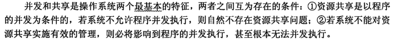

## 简单知识梳理

* 计算机系统分为四大部分：硬件、OS、应用程序和用户。

* 操作系统的目标：用户需求：操作系统需要容易学容易用，可靠性高，速度快。系统需求：OS必须易于设计实现维护，灵活可靠错误少高效
* 操作系统提供的接口：命令级接口（键鼠），程序级接口（一组系统调用）

* 中断（`interrupt`）和陷入（`trap`）


* 

* 操作系统介入
  * 硬件中断，软件运行错误造成的异常or陷入

* 特权指令只能在内核态下进行处理
  * 不允许用户程序中直接使用的指令。例如：I/O指令、设置时钟、置控制寄存器等指令都是特权指令。
  * 非特权指令:用户程序中所使用的指令。


* 操作系统功能
  * 进程管理 Process Management
    主存管理 Main Memory Management
    文件系统管理 File-System Management
    大容量储存管理 Mass-Storage Management
    高速缓存管理 Cache Management
    I/O系统管理 I/O System Management

* 大型机系统
  * 批处理系统，分时系统
  * 多道程序：Several jobs are kept in main memory at the same time, and the CPU is multiplexed among them.
  * 分时系统响应时间：
  * 用户发出终端命令到系统作出响应的时间间隔。系统的响应时间主要是根据用户所能接受的等待时间确定的。假设分时系统中进程数(用户数)为n，每个进程的运行时间片为q，则系统的响应时间为$S = n * q$


* 操作系统基本特征：**并发，共享**，虚拟，异步。

* 区分并发和并行
* 


* 批处理系统（batch system）
  * 单道批处理系统：自动，顺序，单道
  * 多道批处理系统：
  * 
* 分时操作系统：同时（多用户同时），交互（人机交互），独立（多用户相互无感知），及时（在一定响应时间内）

* 实时操作系统：在某个时间限制内完成紧急任务而不需要时间片排队
* 

## 王道习题

### 1.1

```
C
D
D  操作系统扩充裸机，管理资源，提供界面
D
B
C
B
B
C
A
A
A
D
B   C,顺序性是单道程序涉及的基本特征，多道程序相互制约，间断执行，共享资源
D
D
A
B   D,"被加载到"
```

### 1.2

```
D    脱机技术解决独占设备问题，虚拟技术和交换技术以多道程序设计为前提
D
C
B
B    实时也不是瞬间处理，只要在规定时间内完成即可
C
B
D
C
B     分时系统要求快速响应用户
C
B
B A C D
A
D 多道程序系统由于进行进程相互调度，系统开销反而大


```

