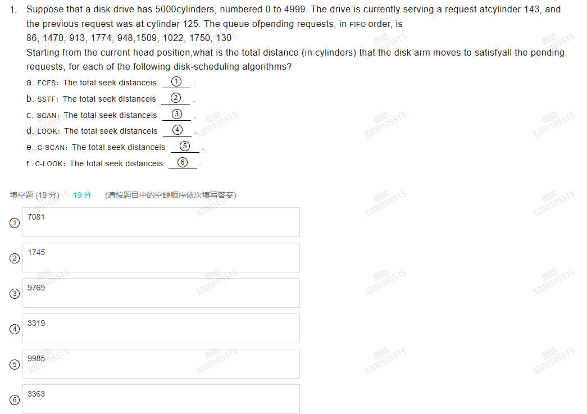
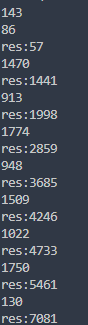
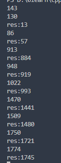
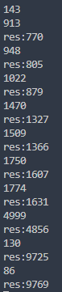
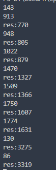
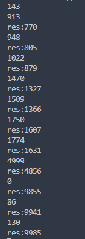
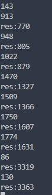

a. The FCFS scheduleis 143, 86, 1470, 913, 1774, 948, 1509, 1022,1750, 130. The total seek distanceis 7081.

b. The SSTF scheduleis 143, 130, 86, 913, 948, 1022, 1470, 1509, 1750,1774. The total seek distanceis 1745.

c. The SCAN scheduleis 143, 913, 948, 1022, 1470, 1509, 1750, 1774,4999, 130, 86. The total seekdistance is 9769.

d. The LOOK scheduleis 143, 913, 948, 1022, 1470, 1509, 1750, 1774,130, 86. The total seek distanceis 3319.

e. The C-SCAN scheduleis 143, 913, 948, 1022, 1470, 1509, 1750, 1774,4999, (0,) 86, 130. The total seekdistance is 9985.

f. The C-LOOK scheduleis 143, 913, 948, 1022, 1470, 1509,1750, 1774, 86, 130. The total seek distanceis 3363.

