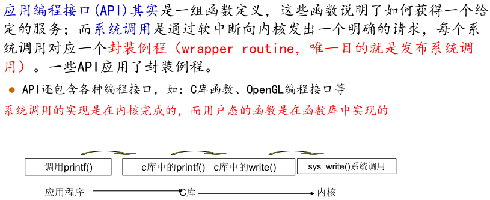
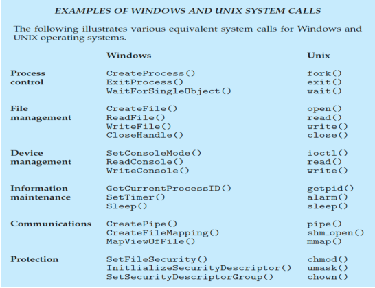
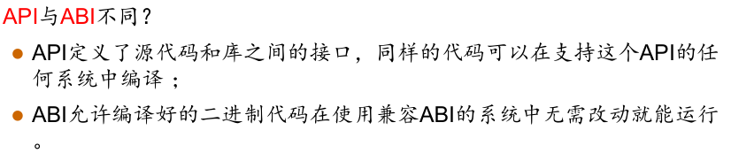
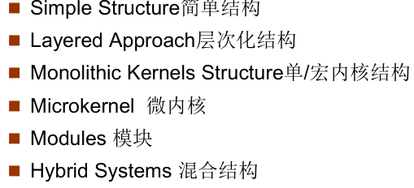
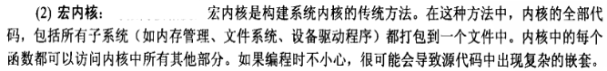
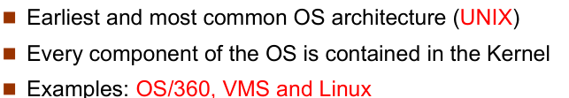
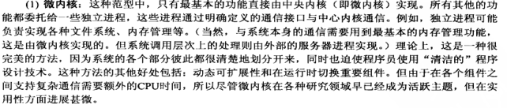
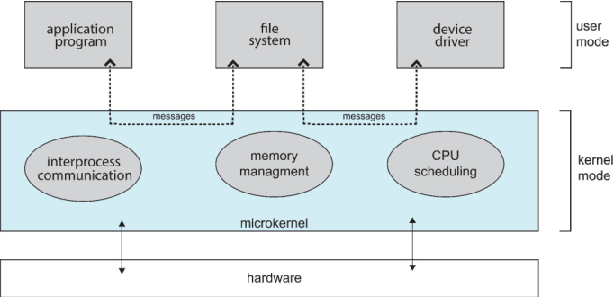
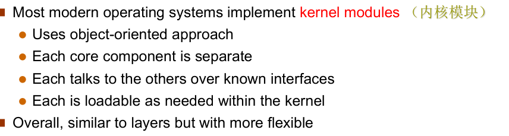

* 操作系统提供的服务
  * 用户界面，接口；程序执行，I/O操作，文件系统处理
  * 与其余计算机交互，错误检测（）
  * 申请资源，核算资源，保护安全

* 操作系统给用户提供的接口
  * 命令接口（命令行，图形，触摸，语音）
  * 程序接口（系统调用）

## 系统调用

* 现在多使用Application Program Interface (API) 而不是直接使用系统调用

* 系统调用参数传递：
  * 寄存器传递参数
  * 通过地址传递
  * 通过堆栈传递

一些系统调用

## 系统程序

## 链接器和加载器（linker and loader）

* relocatable object file 可重定位的目标文件
* 动态链接库 dynamically linked libraries (in Windows, DLLs)
* 

## 应用如何在不同操作系统运行

* 使用可在不同操作系统进行解释的解释语言，比如python
* 使用虚拟机进行运行比如java
* 使用标准语言在不同操作系统进行编译，比如C

* Application Binary Interface (ABI，应用程序二进制接口) 

* 操作系统的目标：用户需求：操作系统需要容易学容易用，可靠性高，速度快。系统需求：OS必须易于设计实现维护，灵活可靠错误少高效。

## 操作系统结构

* 简单结构：`MS-DOS`
* 层次化结构：底层为高层提供服务，最底层为硬件
* 单内核结构：
  * 优点：高效（不同组件直接交互）
  * 缺点：很难隔离错误来源，极难修改和维护，越来越大（臃肿）

* 微内核结构：由“微”内核以及若干服务组成
  * 优点：容易扩展，容易移植进新的架构，可靠，安全
  * 缺席：用户空间和内核空间交互通信的性能开销

* 模块：

* 混合系统