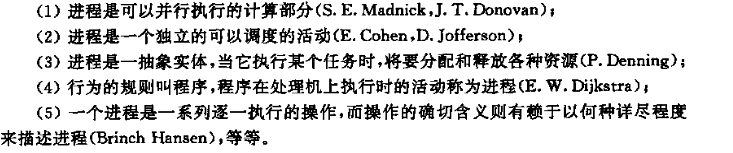

[TOC]

## 进程

* 进程：
  * 一个具有一定独立功能的程序在一个数据集合上的一次动态执行过程。
  * 正在执行中的程序(a program in execution )
  * 
* 进程包括
  * 程序代码（`text section`）
  * `program counter`
  * `register`
  * data section(global data)
  * stack (temporary data)
  * heap ( dynamically allocated memory )
* 操作系统使用进程描述和控制进程的并发执行，实现操作系统的并发性和共享性
* 进程控制块（`Process Control Block,PCB`）（//描述进程的数据结构），系统利用PCB描述程序基本情况和运行状态，控制和管理进程。
* 进程实体（进程映像）：程序段，相关数据段和PCB三部分构成。创建进程的实质是创建进程实体中的PCB，撤销进程实质也是撤销进程PCB。进程映像是静态的，进程是动态的（// 王道这个概念实际上是把进程的某个实际状态，信息抽象出来，课程应该并未区分所谓实体和进程，即进程也是这三部分构成）
* PCB是进程存在的唯一标志。

* 进程是系统进行资源分配和调度的独立单位。

* 进程状态（创建和结束外的三种为基本状态），注意CPU资源和其余资源是分割看待的：
  * 创建态( new )：即创建一个进程的过程。王道过程：申请空白PCB（PCB数量是有限的），填写控制和管理信息；为进程分配所必须的资源；转入就绪态并插入就绪队列。当必须资源未满足时，会滞留在创建态。
  * 就绪态（ready）：进程已获取运行的必须资源，等待CPU（处理机）资源的状态。按照一定算法（先入先出，优先级……）排序成一个**就绪队列**
  * 阻塞态，等待态（block, wait）：因等待某些事件发生而暂停运行。如等待输入输出或其余除CPU外的资源，根据阻塞原因不同会分成不同的**阻塞队列**。
  * 运行态（running）：即进程正在CPU中执行。单处理器每个时刻只会有一个进程处于运行态。
  * 结束态（terminated）：进程从系统中消失。可能是正常结束或其它原因退出运行。进程结束时，系统将进程置为结束态，然后进一步处理资源释放和回收。

* 进程状态切换（系统调用，操作系统的进程调度，中断等原因）：
  * 
  * 就绪$\rightarrow$运行：处理机空闲时，进程调度程序***必将***处理机分配给一个处于就绪态的进程
  * 运行$\rightarrow$等待：进程运行过程中需要等待某一事件发生。则放弃处理机，转入等待态
  * 等待$\rightarrow$就绪：等待事件发生，转为就绪态
  * 运行$\rightarrow$就绪：进程运行过程中，由于分配的时间片已经用完，所以让出处理机，转为就绪态
  * 等待$\rightarrow$运行，就绪$\rightarrow$等待这两种转换一般不可能发生。
* 进程和程序：
  * 进程是动态的，程序是静态的：程序是有序代码的集合；进程是程序的执行。
  * 进程是暂时的，程序的永久的：进程是一个状态变化的过程，程序可长久保存
  * 进程与程序的组成不同：进程的组成包括程序、数据和进程控制块（即进程状态信息）。
  * 进程与程序的对应关系：通过多次执行，一个程序可对应多个进程；通过调用关系，一个进程可包括多个程序

> 

* PCB， (`linux : struct task_struct`  )包含信息
  * Process state
  *  Program counter
  * CPU registers
  * CPU scheduling information
  * Memory-management information
  * Accounting information
  * File management
  * I/O status information

* 王道补充：
  * PCB的详细信息`P39`。
  * 进程控制`P40`，关于各进程状态的具体事项
  * 另外除通过队列（链接）管理进程外，还有索引表的形式进行进程状态管理

## 进程调度

* 进程调度：进程数远多于处理机个数，调度即将处理机分配给某进程运行（公平、高效）
  * 长程调度（作业($job$)调度）：从外存中后备队列的作业中选择一个调入内存，创建进程。一般用于多道批处理系统，现代操作系统（windows,linux）中基本消失。
  * 中程调度：将阻塞态或一段时间内不会运行的进程换入外存中（挂起），或可以运行且内存资源空闲时调入内存。（// 换进换出（swap in/out），现在也不用了？）
  * 短程调度（CPU调度，进程调度）：从就绪队列中选择一个进程分配处理机。最为基本的调度，所有操作系统都需要配置该调度，频率很高，一般在毫秒级。
* 进程分类？
  * I/O-bound process （I/O型进程），交互式进程？主要输入输出
  * CPU-bound process （CPU 型进程），计算型进程，主要在进行计算。
* 上下文切换：即切换进程时，操作系统需要保存旧进程状态并且加载新进程的状态。进程状态即PCB中的相关内容。
  * 上下文切换时，操作系统不会进行其他工作？

* 移动端操作系统
  * IOS区分前后台程序，后台程序限制资源，限制通知、后台播放等
  * android 使用“服务”来运行后台程序，限制相对较少？即使后台程序挂起，服务也可以运行；服务无用户界面，消耗内存少。

## 进程操作

(// 即系统、进程、外界行为导致进程状态改变)

* 创建进程
  * 季老师主要侧重于`fork()`函数的使用讲解，参考教材代码
  * `fork()`一次调用，两次返回（// 应该是表示父进程和子进程中获取的返回值是不同的，父进程得到的是子进程的`pid`,子进程为0 ，子进程的`pid`比父进程大）
  * [fork()函数详解 - _NewMan - 博客园 (cnblogs.com)](https://www.cnblogs.com/love-jelly-pig/p/8471206.html)
  * 进程标识符（`process identifier,pid`）
  * `wait()`函数用于父进程等待子进程结束后回收子进程。
  * 父进程可能比子进程先结束，此时操作系统会给子进程分配Pid为1的进程作为父进程。
  
* 进程终止
  * 引起进程终止：正常结束，异常结束，外界干预
  * 僵尸进程：子进程运行终止，但是父进程未调用`wait()`
  * 孤立进程：父进程未调用`wait()`,自己终止了。

## 进程通信

* 两种通信模型：共享内存（P，V操作），消息传递
* 常用通信机制：信号量(`signal`)，共享存储区(`shared memory`)，管道(`pipe`)，消息(`message`)，套接字（`socket`）

* Linux实现进程间通信(IPC Inter Process Communication)：
   System V IPC机制:
   信号量、 消息队列、 共享内存
   管道（pipe）、命名管道
   套接字（socket）
   信号( signal )
   文件锁(file lock)
   POSIX线程：
   互斥锁(互斥体、互斥量)（mutex）、条件变量(condition variables)
   POSIX：
   消息队列、信号量、共享内存

* 基于共享内存的缓冲区策略
  * 生产者消费者问题
  * 有限缓冲区和无限缓冲区

