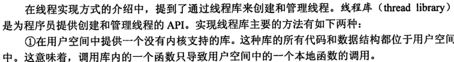
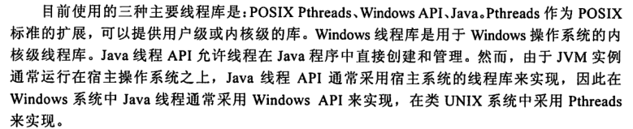
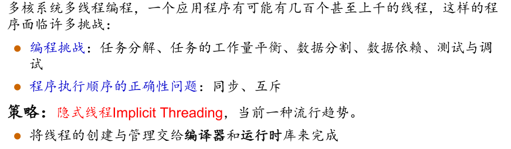
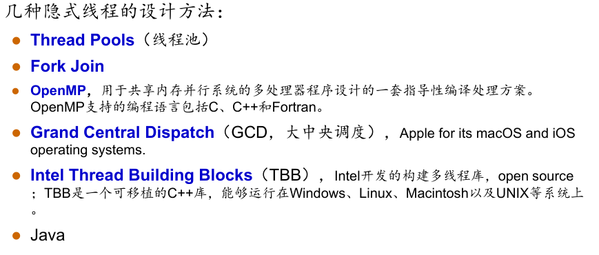

* 进程：资源分配和调度单位
* 线程可视为进程调度的具体化单位，又称轻型进程。线程定义为进程内一个执行单元或一个可调度实体。

* 线程只拥有一点在运行中必不可省的资源（程序计数器、一组寄存器和栈），但它可与同属一个进程的其它线程共享进程拥有的全部资源（代码段，数据段，操作系统资源）

* 线程：
   有执行状态（状态转换）
   不运行时保存上下文
   有一个执行栈
   有一些局部变量的静态存储
   可存取所在进程的内存和其他资源
   可以创建、撤消另一个线程

* 线程好处：创建切换线程的花费少；由于线程共享内存和文件，通信不需要操作系统的介入；适合多处理机系统进一步提升并发性
* 

## 多核编程

## 多线程模型

* 用户级线程
  * 用户线程的维护由应用进程完成；
     内核不了解用户线程的存在；
     用户线程切换不需要内核特权；
     用户线程调度算法可针对应用优化；
     一个线程发起系统调用而阻塞，则整个进程在等待。（一对多模型中）
* 内核级线程
  * 内核维护进程和线程的上下文信息；
     线程切换由内核完成；
     时间片分配给线程，所以多线程的进程获得更多CPU时间；
     一个线程发起系统调用而阻塞，不会影响其他线程的运行。
* 多对一模型
  * 多个用户线程对应一个内核线程；
  * 优点：在用户层级进行线程管理，OS无法感知用户级线程，无需OS支持，可以调整(tune)调度策略满足应用需求，无系统调用线程操作开销很低。
  * 缺点：无法利用多处理器 不是真并行，一个线程阻塞时整个进程也阻塞

* 一对一模型
  * 线程操作由操作系统完成
  * 优点：每个内核线程可以并行跑在多处理器上，一个线程阻塞，进程的其他线程可以被调度。
  * 缺点：线程操作开销大,OS对线程数的增多处理必须很好

* 多对多模型：
* 两级模型，多对多的变种，但是允许有一个线程是绑定到一个内核线程上。

## 线程库

## 隐式多线程（`Implicit threading`）

* 线程取消（终止）
  * 异步取消立即终止目标线程
  * 延迟取消（Deferred cancellation）允许线程定期检查是否该终止
* 

## 线程处理

* fork exec
* 信号处理
* 线程池
  *  Usually slightly faster to service a request with an existing thread than
    create a new thread
     Allows the number of threads in the application(s) to be bound to the size
    of the pool
  * 约束线程数量，可以利用已存在的线程提供服务而不是创建新进程
* 线程特有数据
* 