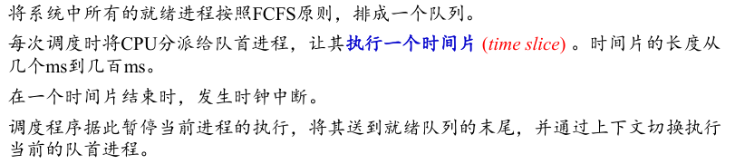

## 调度概念

* CPU调度=处理机调度=进程调度

* CPU、I/O Burst Cycle脉冲（运行）周期

* CPU Burst Time 、I/O Burst Time
* CPU-bound 、I/O-bound program （CPU型、I/O型程序）

* 三级调度；见导论的长中短调度
* 调度方式：
  * 非抢占式（Nonpreemptive）调度:调度程序一旦把处理机分配给某进程后便让它一直运行下去，直到进程完成或发生某事件而阻塞时，才把处理机分配给另一个进程。
  * 抢占式（Preemptive）调度:当一个进程正在运行时，系统可以基于某种原则，剥夺已分配给它的处理机，将之分配给其它进程。剥夺原则有：优先权原则、短进程优先原则、时间片原则。

* Dispatcher（调度程序）

* 调度延迟：调度程序停止一个进程到启动一个进程所需要时间

* Scheduling Criteria 调度标准

## 计算重点概念

* Burst time 可以理解即需要的时间

* 

* 最优准则
  * 

## 调度算法

## 学会画gantt chart

### First-Come, First-Served (FCFS) Scheduling先来先服务调度

按照进程或作业提交顺序形成就绪状态的先后次序，分派CPU

当前进程或作业占用CPU，直到执行完或阻塞，才出让CPU（非抢占方式

在进程或作业唤醒后（如I/O完成），并不立即恢复执行，通常等到当前作业或进程出让CPU

最简单的算法

* 有利于长进程，而不利于短进程。
* 有利于CPU Bound的进程，而不利于I/O Bound的进程。

### Shortest-Job-First (SJF) Scheduling 短作业优先调度

对预计执行时间短的作业（进程）优先分派处理机。

* 有两种策略
  * 非抢占式，站住了就不撒手
  * 抢占式，新进程所需时间更短可以抢占cpu（该算法也称Shortest-Remaining-Time-First (SRTF)）

* 该策略最佳的，有最小的平均等待时间，但是是不可实现的，因为不可能知道下一个CPU脉冲burst的时间长度，也就无法决定最短

变种：SRTF上面，另外有最高响应比优先

### Priority Scheduling优先权调度

该算法总是把处理机分配给就绪队列中具有最高优先权的进程。

* 确定优先权
  * 静态优先权: 静态优先权是在创建进程时确定的，在整个运行期间不再改变。依据有：进程类型、进程对资源的要求、用户要求的优先权。
  * 动态优先权: 动态优先权是基于某种原则，使进程的优先权随时间改变而改变。
* 注意高优先级是大还是小
* 同样有抢占式和非抢占式
* 有饥饿的问题，即某些低优先级的进程可能永远无法运行
  * 解决方法：老化，即优先级随时间增长

### Round Robin (RR)时间片轮转调度

通过时间片轮转，提高进程并发性和响应时间特性，从而提高资源利用率。

进程可以未使用完一个时间片，就出让CPU（如阻塞）。

* 响应时间=进程数*时间片
* 时间片长度的影响因素：
   就绪进程的数目：数目越多，时间片越小（当响应时间一定时）
   系统的处理能力：应当使用户输入通常在一个时间片内能处理完，否则使响应时间，平
  均周转时间和平均带权周转时间延长。

### Multilevel Queue Scheduling 多级队列调度

根据进程的性质或类型的不同，将就绪队列再分为若干个子队列。
 每个作业固定归入一个队列。
 各队列的不同处理：不同队列可有不同的优先级、时间片长度、调度策略等
。如：系统进程、用户交互进程、批处理进程等。

队列分为前台（交互式），后台（批处理）可使用不同调度策略

### Multilevel Feedback Queue Scheduling多级反馈队列调度

