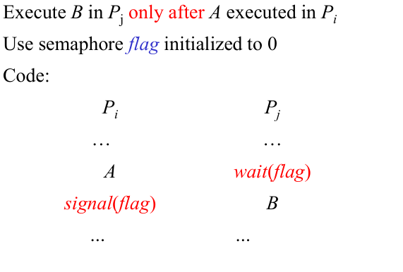

# 进程同步

* 并发访问共享数据可能导致数据不一致的情况
* 有界缓冲区问题：
  * 对于生产者和消费者新增一个共享的counter变量，用于记录物品数
  * 生产者检查物品队列是否达到最大，达到最大则一直死循环，否则队列后新增物品
  * 消费者检查物品队列是否为空，为空则一直死循环。
  * 注意counter变量的改变（`counter++ counter--`）需要是原子操作（高级语言编译后会形成一组指令，这一组指令不能被中断）


* `criticalsection.cpp`由于`sleep`函数等待时间较长，线程无法在一个时间片内运行结束，因此会轮到其余线程进行变量修改，从而交错运行导致结果错误。不互斥不一定就会结果错误。

* 原子操作 Atomic operation means an operation that completes in its entirety without interruption.
  * 也叫原语

* 进程之间竞争资源面临三个控制问题：
   互斥（mutual exclusion )指多个进程不能同时使用同一个资源
   死锁（deadlock )指多个进程互不相让，都得不到足够的资源。永远得不到资源（进程结束前不会释放已得到资源）
   饥饿（starvation )指一个进程长时间得不到资源（其它进程可能轮流占用资源）。资源分配不公平
* critical section（临界区），访问共享变量的代码段

* **临界资源**:一次只允许一个进程使用(访问)的资源。如：硬件打印机、磁带机等，软件的消息缓冲队列、变量、数组、缓冲区等。**临界区**：访问临界资源的那段代码

* 解决临界区问题：3个必须条件
  * Mutual Exclusion(互斥):只有一个能在临界区
  *  Progress（空闲让进）：如果其余进程未进入临界区，则需要进入临界区的进程不能无限推延
  * Bounded Waiting（有限等待）：进入临界区的等待时间必须有一个界限
  * 让权等待——不是必须的；当进程不能进入临界区，应该释放处理器


## 软件算法

* 双进程问题四种变形
  * 单个变量01转换来轮流进入临界区，但是强制轮流进入未考虑实际需要，不满足空闲让进
  * 一个bool数组分别对应自己是否准备进入临界区，将自身对应值置1，检查对方值，对方未进入则自己进入，但是可能导致双方都将自身置1后检查对方的值导致都无法进入临界区
  * 算法2变种，先检查对方的值，再将自己的值置1，进入临界区。这样可能导致都先查出对方未在临界区而后都进入临界区，即互斥条件不满足。
  * 同时使用两种变量，单一bool变量用来轮流，数组表示自己是否准备好了；先将自己的数组值置1表示自己准备进入临界区，然后将turn单一变量置为让对方进入临界区，再检查对方是否在临界区（对方数组变量和turn都准备好了），然后准备进入（实际就是再自己准备进入时进行“谦让”，如果对方数组变量未准备，那么单一变量让度也可以进入临界区，对方先准备好了，那么再让turn给对方，我方就卡住了，满足了互斥，而对方结束后同样也会把turn让会我们，我们可以进入临界区）

* Peterson’s Solution
  * 双进程问题
  * Assume that the LOAD and STORE instructions are atomic; that is, cannot be interrupted.

* 算法1


* 算法2


* 算法2-1


* 算法3 ：peterson


* 多进程算法，面包房算法
  * Before entering its critical section, process receives a number. Holder of the smallest
    number enters the critical section.
  * If processes Pi and Pj receive the same number, if i < j, then Pi is served first; else Pj
    is served first.
  * The numbering scheme always generates numbers in increasing order of enumeration;
    i.e., 1,2,3,3,3,3,4,5...
  * bool数组choosing表示是否在取号（准备进入临界区）；整形数组number表示对应进程所取的号
  * 对于进程Pi，首先准备取号，注意计算对应number时需要是原子操作，即不可被其余进程打断
  * 然后检查所有进程，如果存在进程正在取号，或者该进程号比较小或者号码相同但是靠前则陷入循环无法进入临界区。


**多处理器上的peterson算法**？？？？？？？


## 硬件指令

* Test-and-Set（测试与设置）


* SWAP指令 交换指令


* 解决饥饿问题，不再随机选，排队选；从本进程循环往复选择下一个等待中的进程，将其等待状态置为false，即让其进入临界区


* **自旋锁**
  * Windows、Linux内核用来达到多处理器互斥的机制“自旋锁”，它类同于TS指令机制。自旋锁是一个与共用数据结构有关的锁定机制。
  * 一个进程欲访问已被其他进程锁定的资源时，进程循环检测该锁是否被释放，这种技术叫自旋锁（spin lock），使用汇编指令进行锁的获取和释放（为了速度和使用任何在处理器体系下提供的锁定机构）
  * 当线程试图获得自旋锁时，在处理器上所有其它工作将终止。因此拥有自旋锁的线程永远不会被抢占，但允许它继续执行以便使它尽快把锁释放。内核对于使用自旋锁十分小心，当它拥有自旋锁时，它执行的指令数将减至最少。
* ## 


## 信号量机制

* 它从整型信号量机制发展到记录型信号量机制，进而发展为“信号集”机制。现在信号量机制已广泛应用于操作系统了同步互斥中。


* 只支持两种标准操作：wait() and signal() 或者也叫P(),V() ，以及初始化

* Can only be accessed via two indivisible (atomic) operations

  * ```
    wait (S) {
    	while S <= 0; // no-op
    	S--;
    }
    signal (S) {
    	S++;
    }
    ```

* Counting semaphore （计数信号量）– integer value can range over an unrestricted domain
* Binary semaphore（二值信号量） – integer value can range only between 0 and 1; can be simpler to implement
  * Also known as mutex locks
* Can implement a counting semaphore S as a binary semaphore

* 记录型信号量：

  * ```
    typedef struct {
    	int value;
    	struct process *list;
    } semaphore;
    ```

  * block() – place the process invoking the operation on the appropriate waiting queue.将调用操作的流程放在适当的等待队列上。

  * wakeup() – remove one of processes in the waiting queue and place it in the ready queue.删除等待队列中的一个进程，并将其放入就绪队列中。

  * ```c
    // Implementation of wait:
    wait(semaphore *S) {
    	S->value--;
    	if (S->value < 0) {
    		add this process to S->list;
    		block();
    	}
    }
    // Implementation of signal:
    signal(semaphore *S) {
    	S->value++;
    	if (S->value <= 0) {
    		remove a process P from S->list;
    		wakeup(P);
    	}
    }
    ```

* 

* wait、signal操作必须成对出现，
* 有一个wait操作就一定有一个signal操作。一般情况下：当为互斥操作时，它们同处于同一进程；当为同步操作时，则不在同一进程中出现。
* 如果两个wait操作相邻，那么它们的顺序至关重要，而两个相邻的signal操作的顺序无关紧要。一个同步wait操作与一个互斥wait操作在一起时，同步wait操作在互斥wait操作前。
* wait、signal操作的优缺点
   优点：简单，而且表达能力强
   缺点：不够安全；wait、signal操作使用不当会出现死锁；实现复杂。


进程同步



进程互斥


* 死锁，饥饿，优先级反转
  * Deadlock – two or more processes are waiting indefinitely for an event that can be
    caused by only one of the waiting processes
  * Starvation – indefinite blocking. A process may never be removed from the semaphore
    queue in which it is suspended
  * Priority Inversion - Scheduling problem when lower-priority process holds a lock needed
    by higher-priority process

* busy waiting 忙等In computer systems organization or operating systems, "busy waiting" refers to a process that keeps checking something (e.g., an I/O device) to see if it is ready so that it can proceed with the processing


## 经典同步问题

**Semaphore 信号量**

* Bounded-Buffer Problem 有限缓冲区问题（生产者-消费者问题）
  * 共享优先缓冲池，生产者投放消息，消费者取得消息
  * Semaphore mutex 初始化1；full初始化0；empty初始化n即缓冲池大小
  * 生产者和消费者对缓冲池操作时都要先操作信号量mutex，先wait后signal，然后进行添加或移除信息
  * 生产者`wait(empty) ... signal(full)`消费者`wait(full) .. . signal(empty)`

* Readers and Writers Problem 读者写者问题
  * 读者可以共享，但是写不能和任何进程共享（无论读写）
  * 

* Dining-Philosophers Problem 哲学家就餐问题


