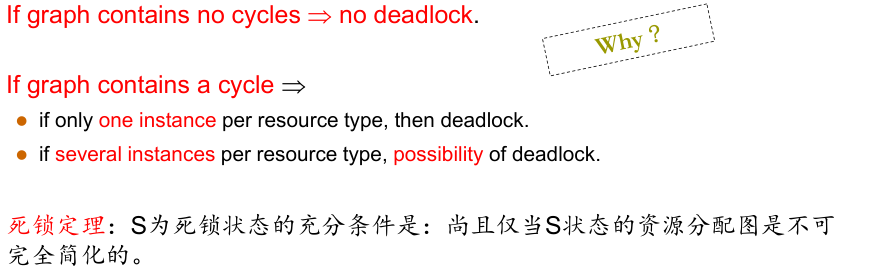
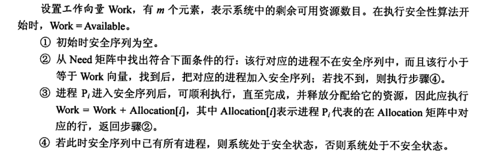

* 死锁预防
* 死锁避免
* 死锁检测
* 死锁恢复（解除）

* 死锁：指多个进程因竞争共享资源而造成相互等待的一种僵局，若无外力作用，这些进程都将永远不能再向前推进

* 死锁产生四个条件：
  * 互斥，一个时间段一个进程使用一个资源
  * 占有并等待，请求和保持：一个进程需要多个资源，而此时已持有一些，还需要申请另一些资源，又不能释放已占有资源
  * 不可抢占
  * 循环等待，进程占有了彼此的所需资源难以进行

* 单个循环不一定死锁，除非所有进程都陷入死循环，或者几类资源和进程都在循环中。

处理死锁：鸵鸟方法，忽视死锁，假装死锁不会发生（主流操作系统的选择，win，linux）

## 死锁避免

### 计算系统是否处于安全状态

寻找安全序列,即只要存在一个序列,使所有进程所需资源小于空闲资源和前面进程持有资源即可

**银行家算法**

* 检查请求量是否小于申明最大值,(`request < need`)
* 检查请求量是否小于目前系统可用值(`request < available`)
* 尝试分配后检查系统是否处于不安全状态

**安全算法**

死锁解除: 资源剥夺;撤销进程;进程回退
