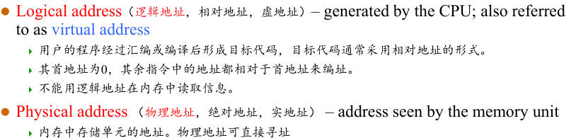
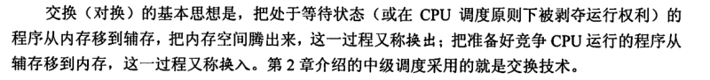
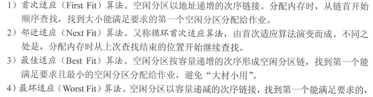
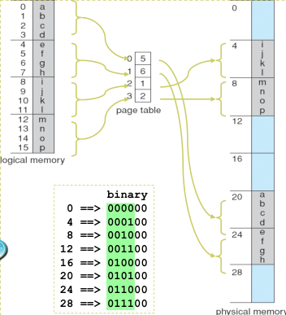
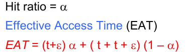

## 背景

* 程序在内存运行
* 逻辑地址，相对地址，虚地址
  * 用户的程序经过汇编或编译后形成目标代码，目标代码通常采用相对地址的形式。
    其首地址为0，其余指令中的地址都相对于首地址来编址。
    不能用逻辑地址在内存中读取信息
* 物理地址，绝对地址，实地址
  * 内存中存储单元的地址。物理地址可直接寻址

* 基址寄存器和限长寄存器
* （地址绑定，地址映射，重定位）发生的时间
  * **Compile time**: If memory location known a priori, absolute code can be generated; must recompile code if starting location changes
  * **Load time**: Must generate relocatable code if memory location is not known at compile time
  * **Execution time**: Binding delayed until run time if the process can be moved during its execution from one memory segment to another. Need hardware support for address maps (e.g., base and limit registers)

* MMU(Memory-Management Unit): Hardware device that maps virtual to physical address 

* 程序的逻辑地址和物理地址

* A pair of base and limit registers （基址寄存器和限长寄存器）

  * 限定了逻辑地址访问范围

  

* MMU:Memory-Management Unit,管理虚地址向物理地址映射的硬件

* 用户程序使用逻辑地址,无法得知真正的物理地址

  

* 

**内存保护**

* 上下限寄存器
* 基址+限长寄存器(重定位寄存器)

* 可重入代码又称纯代码,是一种允许多个进程同时访问但是不允许被任何进程修改的代码
* 

扩充内存

* 覆盖:即将不常访问的区域进行覆盖
* 交换
  * 

## 内存分配

* 单一程序连续分配:一个进程独占内存,只在不够大时将不必要的部分替换成需要的数据或代码
* 固定大小
  * 大小相等:
  * 大小不等:多个小分区,适量中等分区,少量大分区
  * 固定分区都存在小了浪费,大了装不进的问题,存在内部碎片Internal fragmentation (内碎片、内零头) 

* 动态分区分配
  * 会存在外部碎片External fragmentation（外碎片、外零头）,即进程分配的内存间无法利用的内存
* 动态分区分配策略
  * 

## 页式存储管理

* 将实际物理内存分成固定大小的帧frames(帧、物理块、页框)
* 将程序的逻辑内存分成相同固定大小的页
* 将页中内容加载进帧中
* page table列出了进程的逻辑页与其在主存中的物理帧间的对应关系

页表的使用

页号,偏移量

快表:即存储了一部分页表的缓存表

**有效访问时间**

* 快表访问时间
* 内存访问时间
* 快表命中率
* 注意访问完快表后还需要访问内存取数据,如果访问快表失败还需要访问内存页表才能再访问数据

* 

* 反转页表即以物理地址页号为索引,页表项个数和物理页号有关(前面的页表项和逻辑页号有关)

## 分段存储

