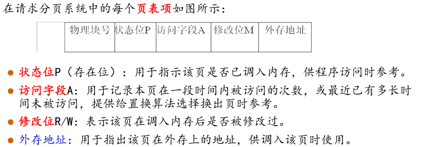
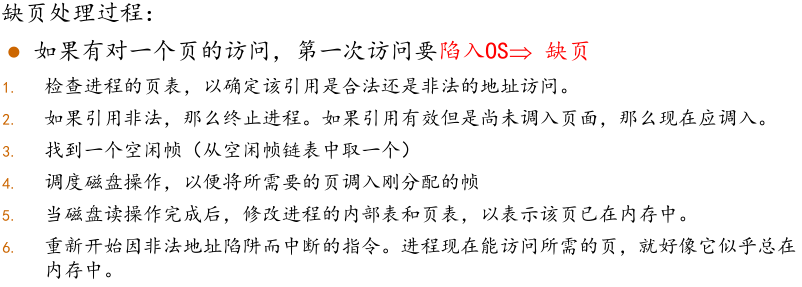
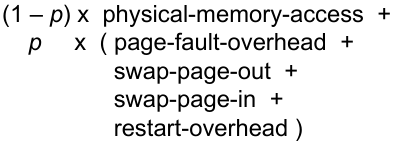
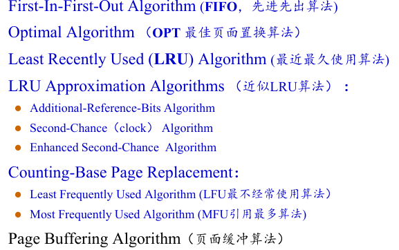

虚拟内存实现:

* Demand paging （请求调页，按需调页，请求页式管理）
* Demand segmentation（请求段式管理）

## 按需调页

* Bring a page into memory only when it is needed
*  需要更少的输入输出
* 更小的内存
* 更快的响应
* 更多的用户

* 懒惰交换-----即只在页面需要时才将页面从磁盘调入内存

  

* effective memory-access time(EAT)
  * 
* 缺页服务的总时间
  *  Service the page-fault interrupt(缺页中断服务时间)
  * Read in the page(将缺页读入时间)
  * Restart the process(重新启动进程时间)

* 写时拷贝(Copy on write)允许父子进程开始时共享同一页面，在某个进程要修改共享页时，它才会拷贝一份该页面进行写。

## 页面置换算法

## 帧分配

平均分配or按比例平均分配

