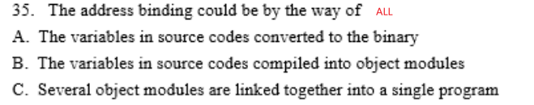

```
B	A 
D
D
C	宏内核没有那么多隔离，就是快！！
C
A	C最好的作业吞吐量？
B
B
B
B
A	进程是一个时间动态的概念？但是程序是静态的
C	A??注意子进程共享全局变量还是拷贝一份
B	D信号量低级通信?
D	多线程和单线程都有各自的优劣，
D
C	用户级线程？
C
D	C不懂？？
B	C
C	B
D	A输入输出比较重要
A
A
D
D
D	忙等
D
D	C
B	自旋锁常用于多处理器系统
	B


```

* API不由操作系统提供

* 子进程拷贝自己的全局变量，不和父进程共用

* 信号量是inter-process通信
* 
* 