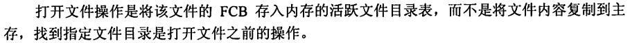

## 补充

* 操作系统内核： 时钟管理，中断机制，原语（atomic operation 即原子操作）系统控制的数据结构及处理
* 定义原语最直接的方法，关闭中断，结束操作后再打开
* 系统调用：


陷入指令又称访管指令

* 从用户态到核心态


## 王道题目

### 1.3

```
A   程序运行时间由操作系统调度，地址需要提供
C   批处理系统主要缺点是缺少交互性。操作系统中，通道技术是硬件技术。
C	
C
noB	D
D
D	A 中断处理的跳转由硬件直接实现，地址映射需要基址寄存器和地址加法器，始终管理需要硬件计数器。
C
B	A 计算机通过硬件中断机制完成由用户态到核心态的转换
B
B	A "访管"指令仅在用户态执行，可以转变为内核态
C
C
D
A	D 核心态不执行“访管”指令
B
A
C
A	B 子程序调用只需要保存程序断点（PC），而中断处理还需要保存程序状态字寄存器。即中断会涉及状态的切换
B	
A	D关闭中断
B	处理外部中断时，PC由硬件自动保存，通用寄存器由操作系统保存
C	D访存有缺页的可能，对R0操作不会有问题，无视而已。
A
C	执行系统调用，传参，trap，执行对应服务，返回
D
C
D
B
```


### 1.4


## 2.1

```
C
A
C
A
A
B
C
C
C
D
C
A	D 程序封闭性指程序的执行结果只取决于进程本身，不受外界影响，包括执行速度；失去封闭性，结果与速度有关
B
C	D 并发不等于同时
C
B
C
A
D
B D D C B A
A
A	B 程序代码经过多次创建可对应不同进程，同意系统的进程可通过系统调用被不同进程使用。
D
A
C
C
C
A
B	对进程的管理和控制功能是通过原语实现的
D
B
D
C	系统只拥有一个键盘，由人操作，只需要一个线程即可处理所有应用的输入
D
B
C
D
D	B一个进程由运行态变为就绪态一定引起进程调度
C
D	A一个进程被唤醒，意味着该进程可重新竞争cpu
D
A
C
C	B 用户及线程可以在任何操作系统中运行；“跨进程”的用户级线程调度需要内核参与
A
A
C
A
D
A
A
C
D
C
D	C进程唤醒
B
B
B

```


### 2.2

```
A
C
B
D
D
B
BECD
D
B
D
C
C	响应比 = （等待服务时间+要求服务时间）/ 要求服务时间
D
B
B	作业以用户任务为单位，进程以操作系统控制为单位
B   时间片过大时，可以认为时间片轮转算法为先来先服务算法
d   周转时间等于完成时间-到达时间，注意不一定都在0时刻到达
d
a   时间片轮转调度应用于分时操作系统为用户提供交互
B	先来先服务算法对短进程不利
B	短进程优先有最小的平均等待时间和周转时间
A	unix属于分时操作系统；中断PC的保存由硬件执行主要是保证系统运行可靠，另外才是提高处理速度
D
B
B	
C	进程处于临界区时也可进行调度，只要不违反临界区的规则
B	对于优先级调度算法，一般IO型的作业优先级高于计算型，因为IO操作需要及时完成，没法长时间保存io数据
A	
B
D
B
D	注意计算周转时间题目可能给了进程切换的系统开销可能没给
C	时间片轮转注意等待时间不要漏
D	多级反馈调度算法要考虑就需队列数量，优先级，调度算法
C	
D
```

* 抢占式的算法时刻记得抢占！！！！

* 加权平均周转时间 = 周转时间/cPU时间


### 2.3 进程同步 信号量 各种同步互斥问题

```
D
D	进程并发不需要信号量;信号量实现进程的同步和互斥;进程执行的前趋关系实际指进程的同步关系
A
C	临界区和调度只要满足互斥不影响结果都可以并发进行
C
D
D
B
B
C	并发进程是异步的,所以需要进行同步
C	生产者和消费者既需要同步也需要互斥
D 	PV操作是一种低级进程通信原语
C	P申请资源可能导致阻塞
D
A	管程monitors定义了一个数据结构和能为并发进程所执行的一组操作
C
B	信号量实现互斥时,信号量初始为1
D	实现同步时,信号量的初值由用户实现决定
C
D	共享程序段必须可重入编码
D
A
B
C
D	V操作后唤醒进程mutex可能<=0,即原来应该<0
C
C
C
A	区分执行PV操作前后0的包含
C B
B
C
B
B
D
C
A	互斥信号量指某一资源只允许一个进程访问,初值为1,但是该资源可能有较大容量
B	信箱通信是简介通信
C
B
D
C
C
B
A
B
D
C 	信号量方法可以让权等待,而硬件方法和peteson方法不能
C
```


### 2.4死锁

```
C
C
B
A
D
D
B
B
D
B
B
D	引入多道程序设计需要中断功能
C
D
B
D
A
D
C
D
B
C
C
C
C
c
D
B 	安全状态一定无死锁
B
B
B
C
A
B


```

## 3.1 主存 地址 分段分页

```
D	编址空间大小由硬件的访存能力决定,即地址总线宽度
B	IO操作时不能进行交换内存
A	覆盖和交换,节省主存空间
C	段页式存储管理每个进程一个段表,每个段一个页表
C	
A
D
C
B
D
A
A
A
B
B	通过内存保护使多进程彼此不干扰
A
C
C
B
D	页表始地址存放在寄存器中
A
B
A	分段有利于程序动态链接
BC
D
A
A	动态分区,可变式分区,在程序装入时建立
D
B
C
B
A	
C
B
B
A
A
C
B
B	分页存储管理提供一维地址结构
A
A
B
D
C	页式存储管理不可以采用静态重定位
A
C
B
B		P197
A	编译时形成逻辑地址
D	磁盘题目
C
D
B	注意分区fit算法在回收内存后会对分区碎片进行排序,即不一定是按照地址低到高排序的
B	共享段的段号可能不同;共享段必须确保没有进程使用后才回收
A
C
B
```


注意给出的数字可能是十进制可能是十六进制


## 3.2

```
B
B
B	虚拟存储技术扩充了内存逻辑空间
A
C
B
D 	CLOCK算法将最近未使用的页面置换出去,也叫NRU算法
D	页号数即页面数,即最小缺页次数
D	FIFO页帧增加,缺页大概率增加,但是也可以减少,
D	虚拟存储器容量即地址最大寻址单位
B
C
D
A
D
C
B
B
C
D
B
B
C
C
C
c	多级页表的级数计算,P228
B
D
B
D
A
B
B
C	加快虚地址转换:快表,页表常驻内存
A
A
C
A
A
C
D
C	置换已经存在的页,不存在当作页框无用?
C
```


## 4.1

```
D
A
A
D
C
C
A
D
A
D
A
D
D	文件的逻辑结构为了方便用户而设计
B	索引文件由逻辑文件和索引表组成
B	
c	索引顺序文件查找??
A
B	链接分配不适合直接存取方式
A
B
B	顺序文件容易导致磁盘碎片发生
A
D
D
C
B
B
A
B
C
A
A
A
A	一个索引节点一个文件
B
B
D
D
A
B

```





## 4.2 目录


