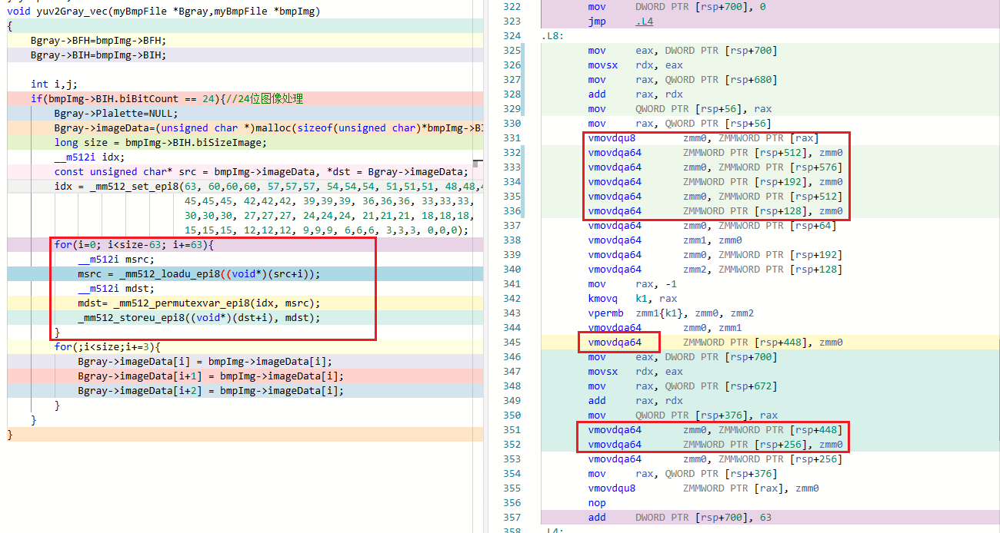

# SIMD向量化探索

# ——基于`intrinsics`的灰度图转换

## 背景

在课堂上有讲过向量化对于矩阵转置的应用以及对于循环的加速，很自然的就想到了图像的处理，在目前接触的编程应用中，图像处理无疑是最接近这两项的，`bmp`图片除了图像文件和信息头的元数据外，便只剩下了矩阵排布的像素点，处理时也是从图片一角出发，一个像素一个像素进行处理，无疑较慢。因此，本次探究从获取图像灰度图出发，看看向量化的效率是否真的有较大提升。

灰度图的获取实际分为两部分，传统图片色彩空间大部分为RGB，我们需要将其转换为YUV，而其中Y分量为像素点的亮度值，因此将Y值赋给U,V就可获取一张灰度图片，也就是黑白图片。

本次探究为了简单起见，仅探索第二步也就是Y覆盖UV分量的向量化，第一步采用常规手段提前完成，不计入时间测量。

## 实验环境

操作系统：`Windows 10 22H2`

编译器：`g++.exe (x86_64-posix-seh-rev2, Built by MinGW-W64 project) 12.2.0`

## 实验过程

**旧代码**

获得图片的像素宽与像素高，通过两层循环修改像素值（一个像素包含三个分量每个分量一个字节大小）。即将每个像素三个分量值全部修改为第一个分量（Y）的值。

节约空间，仅粘贴循环相关代码。

```c++
for(i=0;i<height-1;i++){
	for(j=0;j<width-1;j++){
		Bgray->imageData[i*width*3+j*3]  =bmpImg->imageData[i*width*3+j*3];
		Bgray->imageData[i*width*3+1+j*3]=bmpImg->imageData[i*width*3+j*3];
		Bgray->imageData[i*width*3+2+j*3]=bmpImg->imageData[i*width*3+j*3];
	}
}	
```

通过[Compiler Explorer (godbolt.org)](https://www.godbolt.org/)网站进行汇编代码的查看，可以看见，在开启了avx512相关`CPUID FLAG`的情况下，函数代码中存在部分代码使用了向量指令，但是是位于开头的元数据复制代码。

>

但是我们最为关注的循环部分却没有向量化，无论是几级优化都只是普通的指令。

>**O3优化下的循环**
>
>

**代码的普通优化**

考虑到二层循环有较大限制，对于编译器来说实在不好进行向量化。我们将循环层数进行一个减少，数据在内存中的存储实际上就是一维线性的，二维的计算实际上是方便人们对图片像素排布的抽象。

如下，我们以图片像素矩阵的字节数为界建立循环，每三个字节进行一个修改赋值。

```c++
for(i=0;i<size;i+=3){
	Bgray->imageData[i] = bmpImg->imageData[i];
	Bgray->imageData[i+1] = bmpImg->imageData[i];
 	Bgray->imageData[i+2] = bmpImg->imageData[i];
}
```

但是通过查看汇编代码，我们发现循环部分依然没有进行向量化。考虑到”指针别名问题“，可能编译器依旧有顾虑，我们再次进行修改。

这次我们先将数据拷贝到目标地址，再使用目标指针进行修改，肉眼可见的向量化，但是编译器仍然未进行向量化。

```c++
memcpy(Bgray->imageData,bmpImg->imageData,bmpImg->BIH.biSizeImage);
for(i=0;i<size;i+=3){
	Bgray->imageData[i+2] = Bgray->imageData[i];
	Bgray->imageData[i+1] = Bgray->imageData[i];
    Bgray->imageData[i]   = Bgray->imageData[i];
}
```

>**不存在的向量化**
>
>

**手动向量化**

既然这么明显的可向量化代码编译器都忽视，我们就只能进行手动向量化处理了。我们产生灰度图的过程实际上可以视作数据重新排列，因此可使用`permutex`相关指令进行操作。

```c++
__m512i idx;
const unsigned char* src = bmpImg->imageData, *dst = Bgray->imageData;

//设置数据重排的id，即目标数据的来源。
idx = _mm512_set_epi8(63, 60,60,60, 57,57,57, 54,54,54, 51,51,51, 48,48,48, 
                      45,45,45, 42,42,42, 39,39,39, 36,36,36, 33,33,33, 
                      30,30,30, 27,27,27, 24,24,24, 21,21,21, 18,18,18, 
                      15,15,15, 12,12,12, 9,9,9, 6,6,6, 3,3,3, 0,0,0);

for(i=0; i<size-63; i+=63){//向量化处理
    __m512i msrc;
    msrc = _mm512_loadu_epi8((void*)(src+i));//加载源数据
    __m512i mdst;
    mdst= _mm512_permutexvar_epi8(idx, msrc);//进行数据重排
    _mm512_storeu_epi8((void*)(dst+i), mdst);//存储目标数据到目标内存
}
for(;i<size;i+=3){// 向量化剩下的部分普通处理
    Bgray->imageData[i] = bmpImg->imageData[i];
	Bgray->imageData[i+1] = bmpImg->imageData[i];
	Bgray->imageData[i+2] = bmpImg->imageData[i];
}
```

查看其汇编代码，此时成功编译出向量化的指令。

>**O3优化下的汇编代码**
>
>
>
>**O0优化下也有向量化的指令，不过相比O3就多出了较多指令**
>
>

## 效率比较

最后我们还是要比较不同代码的执行效率才有实际意义。通过重复执行函数不同次数测量其执行时间然后比较不同函数逻辑的耗时来比较他们的执行效率。

```c++
// main.cpp 测试部分
auto t3 = Clock::now();//计时开始
for(i=0;i<times;i++){// 循环执行times次
	yuv2Gray_old(&bmp_gray,&bmp);//测试函数，可以替换
}
auto t4 = Clock::now();//计时结束
std::cout <<(double)std::chrono::duration_cast<std::chrono::nanoseconds>(t4 - t3).count()/(double)1000000000 << "\n";//整体耗时计算，单位秒
```

鉴于执行时间和计算机自身的状态也有较大关系，每个执行次数我们都会执行多次，每次会有几秒的间隔，选取差距不大的有效数据求一个平均值，有效数据基本为5个，最终结果保留4位有效数字。

old指代最初的代码，update指代普通修改后的代码（两次修改代码经过多次测试耗时基本相近，正式测试使用前一种代码），`avx`即手动向量化的代码。-Ox即代表编译的优化选项。

| 次数/时间(s) |  old -O0 |  old -O3 | update -O0 | update -O3 | `avx` -O0 | `avx` -O3 |
| -----------: | -------: | -------: | ---------: | ---------: | --------: | --------: |
|           10 | 0.008239 | 0.002181 |   0.005272 |   0.002539 |  0.001116 |  0.001045 |
|          100 |  0.07646 |  0.02957 |    0.05343 |    0.02824 |   0.01504 |   0.01642 |
|         1000 |   0.6784 |   0.2585 |     0.4633 |     0.2726 |    0.1478 |    0.1531 |
|         5000 |    3.385 |    1.244 |      2.311 |      1.146 |    0.6569 |    0.6096 |
|        10000 |    6.842 |    2.263 |      4.722 |      2.345 |     1.438 |     1.263 |

可以看出，向量化的代码相比较普通代码有显著的效率提升。而在O3的优化下，其余两个代码的运行时间都有明显的降低，但是向量化的代码在耗时高的部分已经有极大的优化了，以至于O3优化级别和O0无优化的运行时间相差不大。


## 心得与反思

本次实验正式解锁了一项新科技，发现了代码优化的新方法。虽然接触时间较短，还只能使用较简单的向量化扩展，还有相当一部分功能未进行探索，向量化的优势已经明显显现出来了。但是可以看出编译器的自动向量化目前依旧不成熟，稍复杂的代码便会保守停用向量化。

另外，值得一提的是，本次探究实际上耍了一点“小手段”，`bmp`图片一行像素的字节数实际应当是4的倍数，不足补0。而单个像素点只占3个字节，所以图片中是可能存在“非格式化”的数据的，此时，我们的探究代码是会出问题的，或者说图片结果会出错。但是一旦严谨，以笔者水平，可能要添加不少判断逻辑，向量化也不太方便，因此只能不太严谨的进行此次探究实验，选择了完全格式化的图片


