# Intel 微处理器

## 1 导论

## 2 微处理器及其体系结构

### 2.2.2 默认段和偏移寄存器

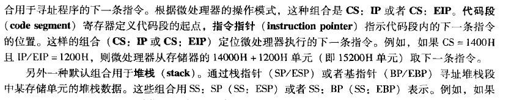

* 可重定位程序
* 可重定位数据

### 2.3保护模式存储器寻址

* 全局描述符（系统描述符）
* 局部描述符（应用描述符）
* 每个描述符表可包含8192个描述符
* 描述符组成：基地址，段界限，粒度位（G），L位（64位），段有效位（AV位），兼容位（D位），访问权限字节

## 3 寻址方式

### 数据寻址方式

* `intel` 所有型号微处理器有相同的寻址方式，比例变址寻址方式除外，他只用于`80386 ~ Core2` ...（当时只有`Core2`？），

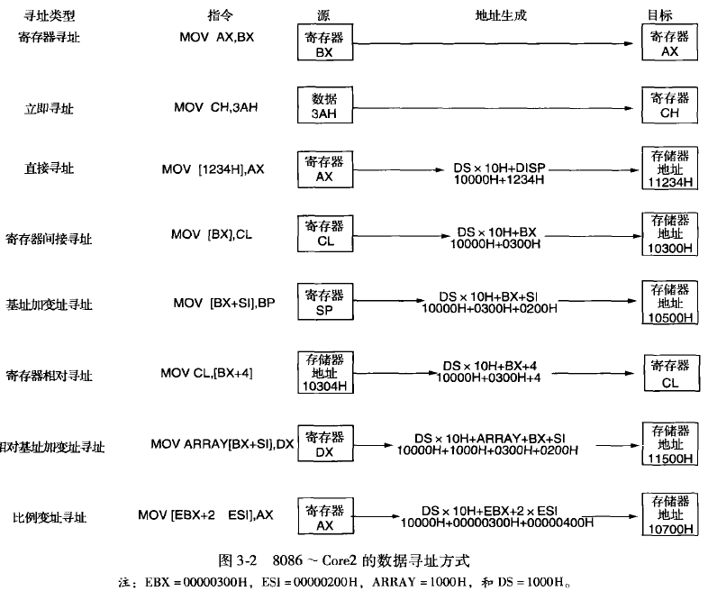

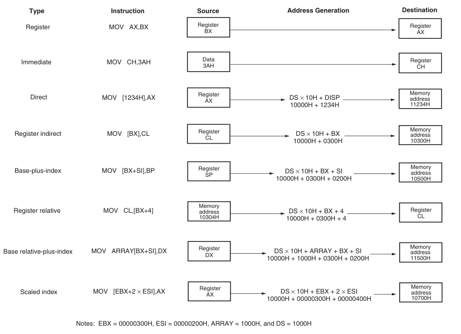

* **RIP相对寻址：**

* **寄存器寻址**：即在寄存器之间传输数据，注意不能在段寄存器之间寻址以及不能通过、mov改变代码段寄存器的值。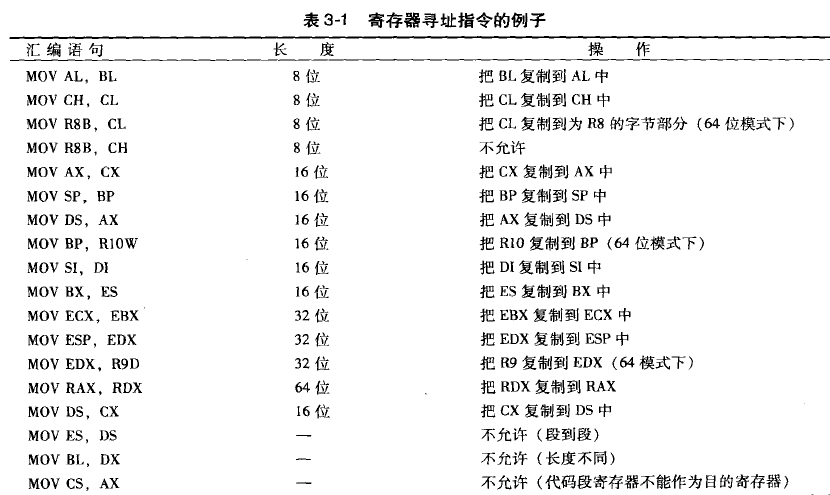

* **立即寻址：**即通过立即数对寄存器赋值（向存储器中赋值应该是定义数据例如dd,dw, db?）

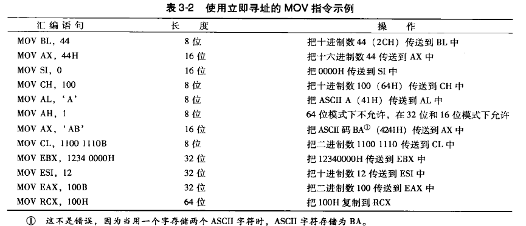

注意：对于数字来说，左侧为高位，右侧是低位；但是对于字符串来说，左侧低位，右侧高位。

**内存寻址：**`Effective Address = Base + (Scale * Index) + Disp`

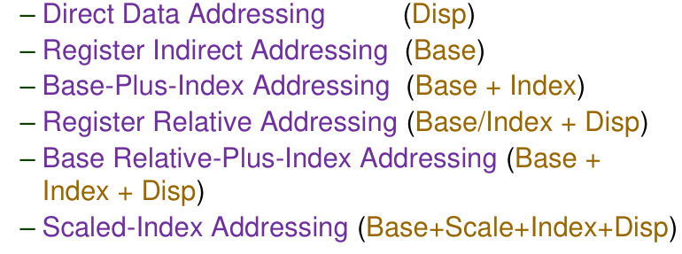

8种？

* **直接数据寻址：**通过标记或者直接的内存地址格式（段地址:[偏移地址]）进行数据寻址。
* 有两种指令格式：对于与 `AX,AL,EAX,RAX`来说，由于使用比较频繁，有专门的操作码，使得指令只需要3个字节；而另外的寄存器都需要4个字节。

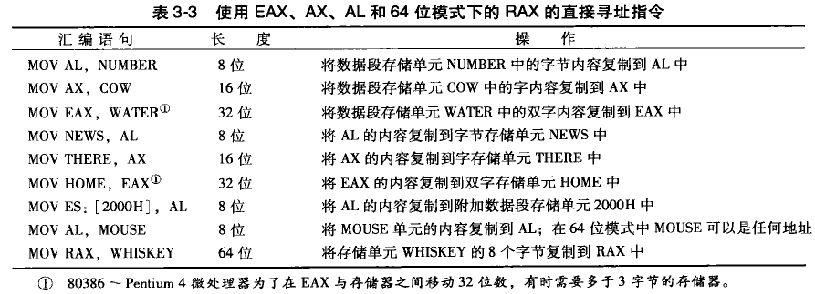

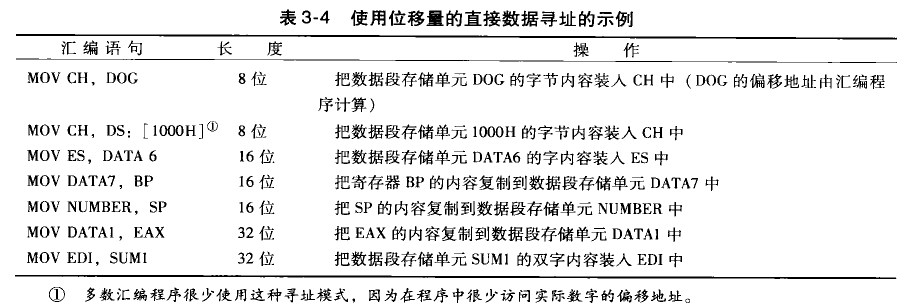

* 寄存器间接寻址
* 访问数组

* 两个操作数不能同时为寄存器间接寻址。
* 立即数存入内存需要指定长度。

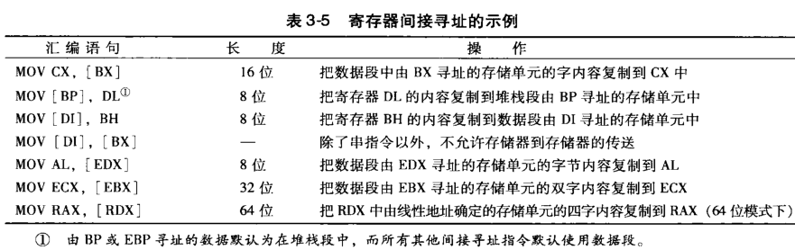

* **基址加变址寻址**

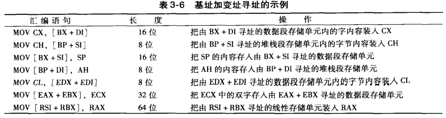

* 寄存器相对寻址
* 访问结构体元素

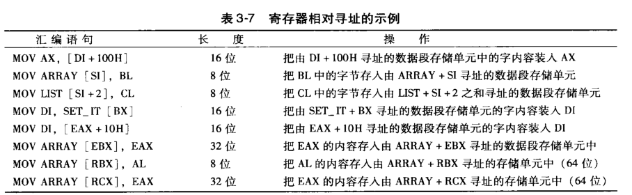

* 相对基址加变址寻址
* 访问结构体数组的内部元素

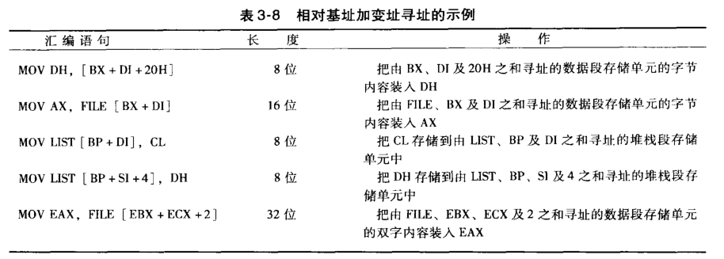

* 全表达式，比例变址寻址
* `Scale`取值为1,2,4,8，原因在于scale值只设置了两个位

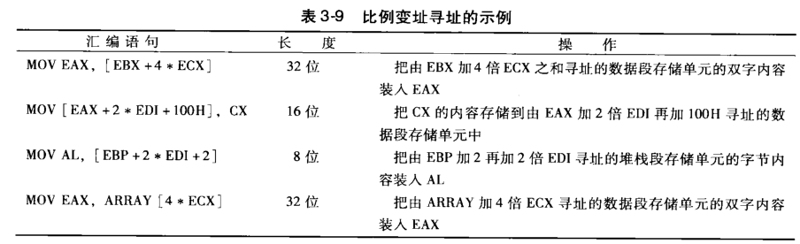