## 高级语言数据类型与`x86`汇编内存访问——以C语言为例

### 实验背景

程序就是算法加数据结构，数据的存储和访问在程序中不可谓不重要。高级语言大都提供了多种基础数据类型以及构造复杂数据类型的方法，这些数据存储在不同的区域中，结构不一，程序究竟是如何对它们进行访问的？相信经历本次探究后会对高级语言有一个更加清楚地认识。

### 实验工具与方法

**实验工具**

* `Ubuntu` 22.04 + `vscode` + `x86-64 gcc-11.3`。
* [compiler explore)](https://www.godbolt.org/)(`x86-64 gcc-11.3`)。

**实验方法**

* 通过定义各种不同的变量并使用它们进行一些简单或嵌套的计算，观察汇编代码

### 实验过程

**1. 局部变量、全局变量、静态变量**

初学编程时都学过局部变量存储在栈中，全局变量和静态变量存储于静态数据区，但是对于程序究竟如何访问它们从高级语言层次是难以看出来的。通过汇编代码我们可以一窥其究竟。

>1.1首先是变量的简单初始化。
>
>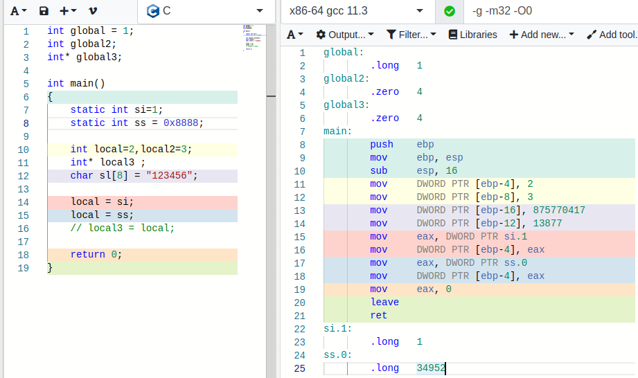
>
>从左右着色的对比我们就可以看出来，全局变量在程序外有特定的存储区域，静态变量一样（实际上在网站上原本未显示出来，在经过对局部变量赋值使用后才出现），这两者在程序中都有固定的储存地址，读写时只需要直接访问对应地址即可。
>
>而对于局部变量，通过栈进行管理存储，可见程序开头`sub esp, 16`指令为局部变量分配了空间，并在初始化过程中将对应的值存储到对应的栈空间中。当然，仔细的话，我们可以注意到我们使用了两个整形一个指针以及一个字符数组，应该有`2*4+4+8 = 20`（（网站中64位未编译出栈的分配指令，注意32位系统指针为4字节））个字节栈空间，实际上只分配了16个空间，通过其他变量的赋值我们可以明显察觉到指针变量并未分配栈空间。
>
>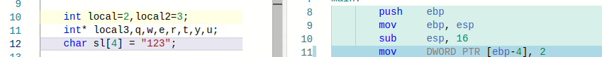
>
>通过进一步调整，可以看到即使多出很多未使用的指针，栈空间也不会增加指针的空间，而我们将字符数组缩小四个字节后，栈空间却没有变小。
>
>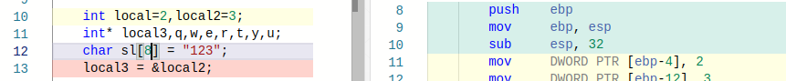
>
>再次调整，为一个指针赋值，栈空间增加了16字节，即可以看出栈的空间分配以一定字节数为单位。即使不足的字节数也会按这个字节数压栈。（在本地的`gdb`调试中同样按16字节压栈，但是鉴于机器种类单一，无法断定16字节是否绝对）
>
>因此，对于局部变量可以总结如下，未赋值的野指针并不分配栈空间，其余变量由函数在栈中统一分配空间与管理，栈空间会按一定的字节数进行分配而非需要多少给多少。

>1.2 函数参数的传递
>
>函数参数的传递和使用同样依赖于栈，但是实际使用起来与原本所想也是有诸多不同。
>
>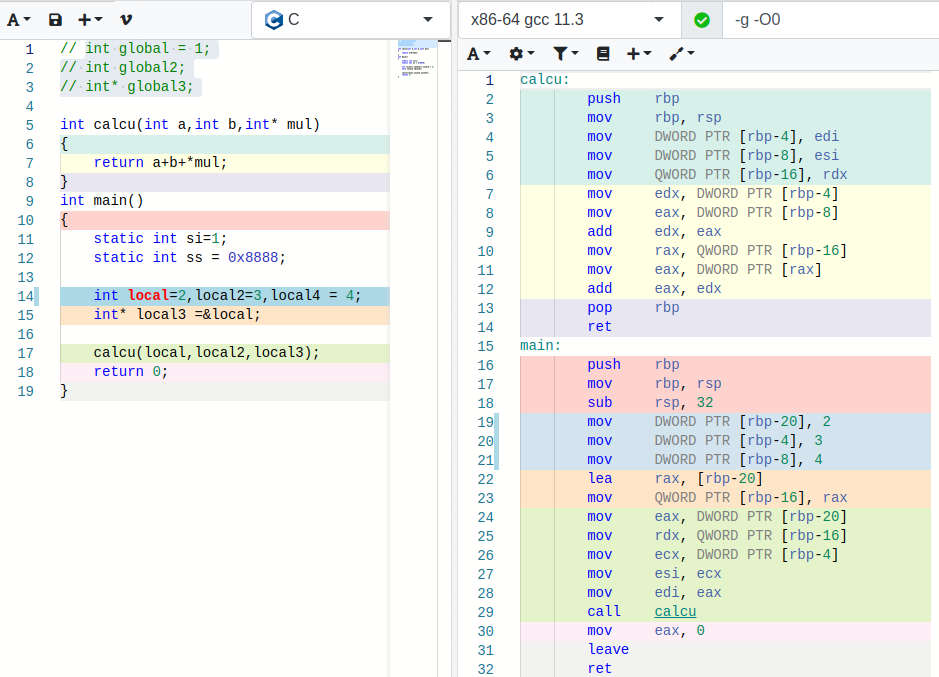
>
>通过简单的三参数函数调用，我们可以发现，函数调用过程首先是在调用函数中将参数同一存入寄存器，使用`call`指令进入被调用函数后各个参数再存入栈中，然后就是正常的函数体执行，最后将结果存入`eax`后返回调用函数。
>
>通过实际`gdb`调试查看寄存器的值。
>
>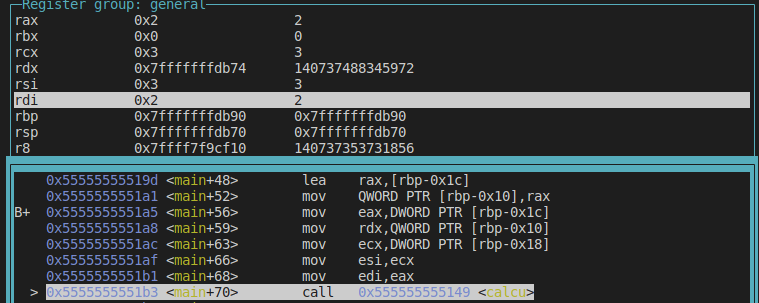
>
>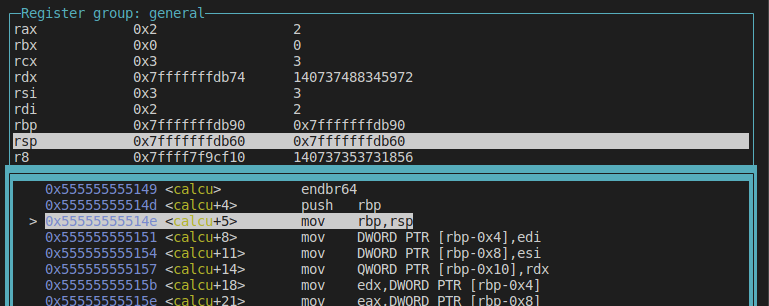
>
>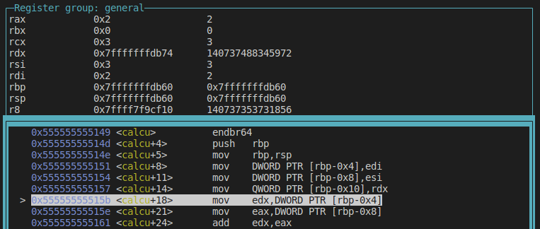
>
>在函数调用数据过程中使用`rbp`作为栈的基地址，但是另一方面`rsp`的值却和`rbp`相同，而非指向栈顶。为了继续深入，我们为函数添加局部变量以及添加另一个函数，并调试。
>
>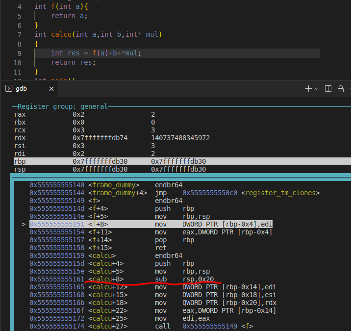
>
>重新编译调试后，可以发现发现函数栈是根据整个函数的变量情况在函数开头进行统一分配的，而如果函数内部不存在另一个调用，那么对于这最后一个栈帧，`rsp`并不需要指向顶部为下一个栈帧准备，那么编译器也不需要增加指令去操作`rsp`。

**2. 数组与结构体 **

 数组和结构体可将多个简单的数据联系为一个整体，数组可同时构造管理多个同类数据，结构体可以联系不同种类的数据。它们并不能单独算作一个数据类型，也不会超出“局部，全局，静态”的限制，但是由于它们占用比普通类型更多的空间且需要支持“内部成员访问“，对它们的内存访问也会相对稍复杂。

>2.1 简单的一维和二维数组
>
>介绍到数组，我们就需要引入新的存储空间“堆”，用以存储在程序运行过程中通过`malloc`申请空间确定下来的数组（当然实际上也可以只申请单个数据的空间）。因此该步探究我们主要有三个对象，局部数组，全局数组，`malloc`数组。
>
>首先依旧是**数组的声明和初始化**。
>
>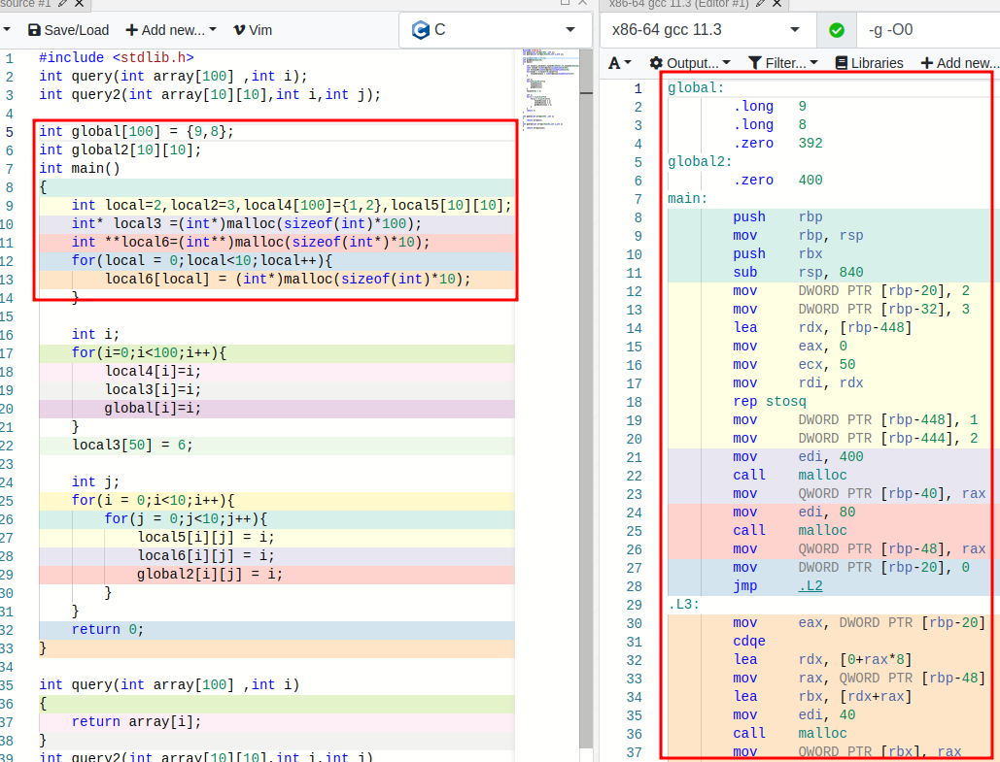
>
>对于全局变量，数组的表现并没有改变多少，存储于静态区域，将给定的初始化数据赋给内存后，直接将其余所需的内存初始化为0。
>
>而对于局部变量，首先同样是初始化栈的大小。但是程序对于局部变量并不会默认初始化，我们可以看到对于变量`local5`没有任何操作，而对于变量`local4`先是通过循环将**所有**给定空间初始化为0，然后将给定的值一一赋给对应内存。即使我们将指定初始化的数据再次增加，循环赋0的操作不会减少。
>
>而对于`malloc`数组，虽然数据并不存储于栈中，但是数组头的指针是存放于栈中的，即通过`malloc`得到的首地址会存储于栈中。每次`malloc`得到的地址是连续的，但是连续多次`malloc`得到的地址是不一定连续的。具体地说，对于`local5`来说，它在栈中是连续存储的，但是对于`local6`，栈中存储的二级指针指向的是一级指针组的首地址，然后各一级地址内存储的地址是具体的数据所在区域，显而易见，`malloc`所申请的二维数组连占用的内存多出了88字节（二级和一级共11个指针）。而它们访存的差别可从下面的探究看出。
>
>
>
>**一维数组访问**
>
>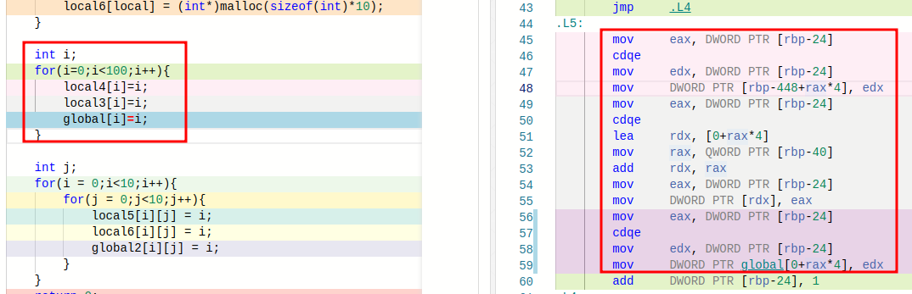
>
>局部数组和全局数组的访问基本相同，先直接取数组索引并拓展位，然后通过偏移地址与基地址可以很方便的得到具体的地址。
>
>而`malloc`数组多出了从栈中取出数据真实存储地址的步骤，将取出的地址加上（索引*数据字节数）才得到具体地址。
>
>**二维数组**
>
>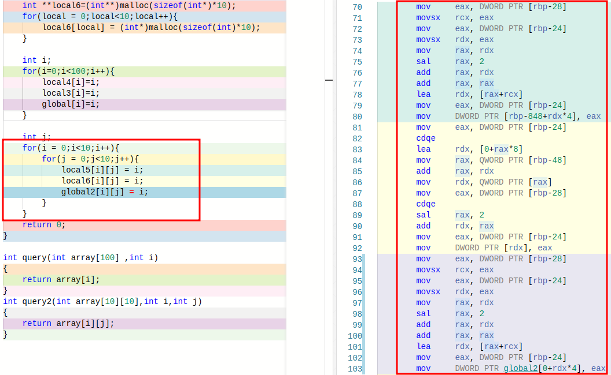
>
>二维局部数组和全局数组存储的空间连续，实际上可以当做一维数组进行访问（中间的移位和加法计算实际上是对乘法的等价运算，将高维数索引转化成低维数索引），访存方法也基本是按部就班计算索引，然后通过地址进行读写。
>
>`malloc`数组的基本思路是从栈中地址开始向下依次计算访问各级地址内存，直至计算出需要操作的数据对应的具体地址，多出几步访问内存的操作。
>
>**函数参数**
>
>虽然作为数组这三者的使用格式基本相同（`[] or *`）但这是编译器帮我们自动区分访问访问方式的结果，从上面的探究我们已经可以知道直接申明的数组（`a[]`）和通过指针和`malloc`申请的数组（`*a`）是不同。接下来我们将从作为参数时的表现看它们的不同。
>
>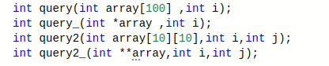
>
>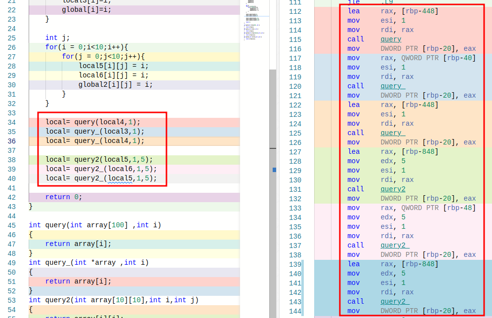
>
>在函数调用过程中，我们可以看到，对于一维数组，两者并没有什么差别，通过编译器的调整，最终传给函数的地址都是真实的数据所在地址。但是对于二维数组，编译器无法调整两级的差别，这两种访存方式的差异体现了出来，编译器给错误的参数添加了蓝色波浪线。
>
>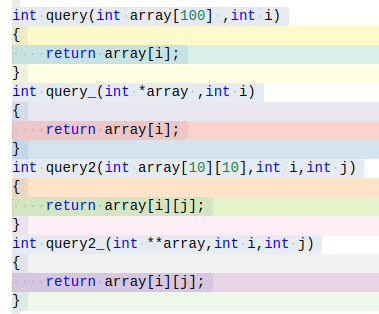
>
>（汇编代码内容略）
>
>通过函数栈得到了地址后，数组的访存也基本如所想的。得到具体数据地址的两个一维数组函数的动作相同，而参数本质不同两个二维数组函数（一个依旧是具体数据地址，另一个只是一级指针的地址）表现也不太相同，但也只是取地址所经历的操作有所区别。

>2.2 结构体
>
>结构体的内存访问其实和其余变量没什么差别，结构体只是方便我们操作一个整体，但是对于编译器来说它们依旧可视作一个个分开的数据，访问结构体内元素不过是为结构体整体的地址再添加一个偏移量而已。
>
>结构体初始化时也和数组相同，先全部初始化为0再将给定值赋给对应内存。
>
>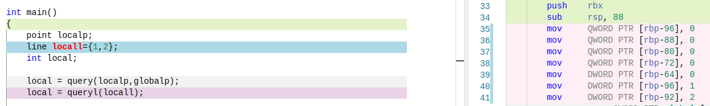
>
>需要注意结构体的函数参数传递有所不同，结构体所占的空间比普通数据大，又并不能像数组一样仅使用首地址取代，因此传参数时容易出现寄存器不足的情况。
>
>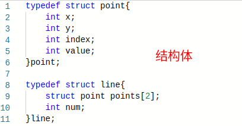
>
>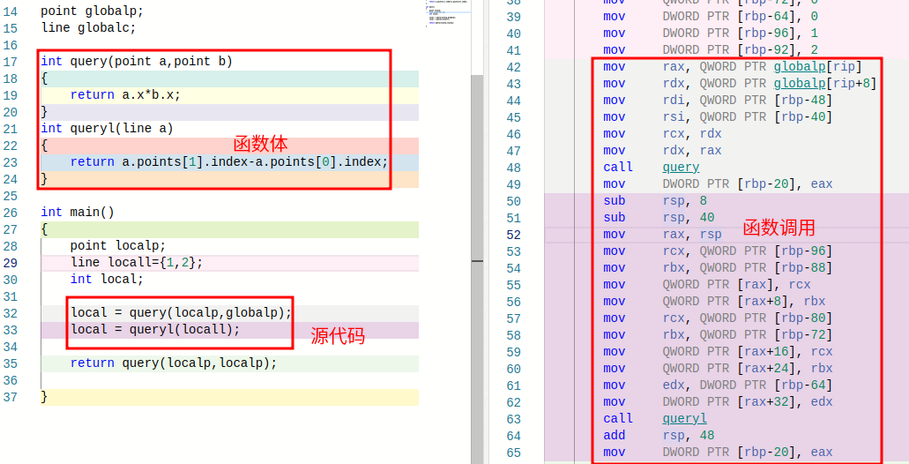
>
>通过`query`的调用代码，我们可以发现在结构体比较小时，可以用多个寄存器传递一个参数。而在`queryl`函数中，显然所有参数寄存器都用上也未必够，此时程序提前进行压栈，先将所有参数压入栈中再调用函数，完成了参数传递。

### 实验感想

本次探究到此也就结束了，当然还有许多没有涉及到的地方，诸如本次探究基本在64位下进行编译（除1.1忘记修改参数）未对32位进行一个探索，虽然感觉两者的差距应该并不是很大，毕竟寄存器的大小和数量对本次实验涉及的内容影响比较小。另外编写的程序实际上都比较简单，对于复杂情况可能会有所不及，不过看过各种汇编代码后，我们基本可以确认在无优化（`O0`）情况下数据的访问基本都是计算地址+实际读写的模式，区别只在于地址的计算复杂程度。当然在优化的情况下就复杂了……由于编写的程序较为简单，编译器会删减没有使用的所有变量，即使使用主函数返回值也大都直接由编译器给出结果作为立即数进行返回。而通过其余函数可以看到部分优化为直接使用寄存器和复杂的地址表达式来得到结果。

本次实验与其说是探究，不如说是一次验证，初接触汇编，便使用它来验证曾经所学习的一些的C语言知识，应该说对于C语言数据结构以及内存管理有了更加清晰的认识，不再像以前一样一知半解。由于编译器版本原因，也不得不在`ubuntu`中使用`gdb`进行程序调试，增加了熟练度。对编译器的强大也有了了解，从前只当编译出来的程序需要存储大量的多余信息，内存访问全靠操作系统，现在发现即使是动态变化的栈，在某一栈帧下，程序完全了解各变量的对应地址而不需要额外存储变量表，或者说编译器完全安排好了各变量所处的与指令所要操作的位置。

从最初的茫然不知道做什么到老师指点从寻址入手到最后逐渐确定这一主题，虽然“浪费”了不少时间，但是尝试编写“特殊”代码寻找探究点的过程在结束后也是别有风味，可能这就是探究吧。

