[TOC]

>辅助符号：
>
>（//）：自己的理解，不一定对…… or 部分操作书中未明说，可以实验
>

# 8086汇编语言（note 王爽）

## 1 基础知识

* 单纯的01机器码在阅读书写和纠错等各方面都十分不变，因此设计了汇编语言，可以与机器码一一对应且便于人类记忆和书写。
* **编译器**，将汇编指令转化成机器指令的翻译程序

* 汇编指令的组成

  * 汇编指令：普通机器码的助记符，与机器码一一对应

  * 伪指令：（// 特殊的汇编指令，一般是常用的汇编指令的简单格式，对应一条至多条指令，还有部分指令用于指示（`.`开头的指令），无对应机器码）

  * 符号：+-*/等由汇编器识别，无对应机器码

* 指令和数据是应用上的概念，实际上作为二进制编码无本质区别
* CPU运行需要和外部器件进行类信息交互
  * 存储单元的地址（地址信息）
  * 器件选择，读或写（控制信息）
  * 数据（数据信息）

* 系统中各个设备虽然是独立个体，但是CPU将各种存储器看作一个逻辑存储器，各个存储器都被映射到该逻辑存储器的一段地址。


## 2 寄存器

* 8086CPU有14个**16位**寄存器：`AX,BX,CX,DX, SI,DI, SP,BP, IP, CS, SS, DS, ES, ES, PSW`

* **8086通用寄存器**：`AX,BX,CX,DX`，为了兼容上一代8位寄存器，可以分为独立的8位寄存器使用，`AH(high),AL(low),BH,BL...`
* 8086一个字节8bit，一个字16bit.
* 进行数据传输或运算时，指令操作数的位数应该一致（寄存器大小一致，立即数的位数不能超过寄存器大小）
* 8086CPU有20位地址总线，1MB**寻址能力**，但是8086又是16位结构的
  * 通过两个16地址（段地址，偏移地址）合成（送入地址加法器）的方法形成20位物理地址
  * **地址加法器：**物理地址 = 段地址 * 16(基础地址) + 偏移地址
  * 8086描述数据存储于内存：1. “数据存在内存2000:1F60单元中”，2. “数据存在内存的2000H段中的1F60H单元中”

* **8086段寄存器**：CS, DS, SS, ES;8086CPU访问内存时由这四个段寄存器提供内存单元的段地址
* CS（代码段寄存器）和IP（指令指针寄存器）指示了CPU当前读取指令的地址。任意时刻，8086从 CS*16+IP 开始读取一条指令执行。每次 IP 中的值自动增加。简要过程：
  * 从CS:IP指向的内存单元读取指令，读取的指令进入指令缓冲器;
  * IP=IP+所读取指令的长度，从而指向下一条指令;
  * 执行指令。转到步骤(1)，重复这个过程。

* `mov`指令可以改变绝大部分寄存器的值，但是不能改变`CS,IP`的值，它们的值需要通过`jmp`指令改变。

  ```assembly
  # jmp 段地址:偏移地址
  jmp 2AE3:3 # 执行后CS=2AE3H，IP=0003H
  # jmp 寄存器。只修改IP的值
  jmp ax  #IP = ax,CS不变
  ```

* 可以人为定义一段内存为代码段，但是这只是编程的一种安排，要执行对应指令，还是要修改`CS:IP`的值。


## 3 寄存器（内存访问）

* 8086在内存中小端法存储数据（低位字节存放在低地址中）。

* 访问数据也需要段地址：偏移地址，`DS`**段寄存器**(不能直接将立即数直接放入段寄存器中)通常用于存放要访问数据的段地址。`[addr]`用于指定偏移地址的值，方括号用于表示内存读写。

  ```assembly
  mov bx, 1000H
  mov ds, bs
  mov al, [0] #指令执行时CPU会自动读取DS的值
  ```

* `add ds, ax`在`debug`写入时报错

* 数据段访问：通过将数据基地址存入`DS`，可以实现便捷访问数据

  ```assembly
  # 一个累加某三个字节数的程序
  mov ax,123BH
  mov ds,ax
  mov al,0
  add al,[0]
  add al,[1]
  add al,[2]
  ```

* 栈：先入后出，后入先出；两种操作，入栈(`push`)，出栈(`pop`)

  ```assembly
  push ax #将ax存入栈
  pop ax  #从栈顶取出数据存入ax
  #都以字为操作单位
  ```

* `SS,SP`寄存器用于指示栈顶的位置。任意时刻`SS:SP`指向栈顶位置。栈从高地址向低地址增长。`push ax`:

  * SP=SP-2, SS:SP指向当前栈项前面的单元，以当前栈顶前面的单元为新的栈顶;
  * 将ax中的内容送入SS:SP 指向的内存单元处，SS:SP此时指向新栈顶。

* 当栈中不存在元素时，栈顶指示最高位栈+1位置。

* 8086CPU并不关心栈的越界问题，需要程序员自己小心（//操作系统or编译器会处理？）

* 栈指令同样可以操作段寄存器和内存单元，在操作内存单元时同样要先设置`DS`寄存器。

  ```assembly
  mov ax,1000H
  mov ds,ax
  push [0]
  pop [2]
  ```

* 栈段：我们自己设置的`SS:SP`内存段


## 4 第一个程序

* 编写、编译（产生目标文件）链接、执行
* 可执行程序：
  * 程序(从源程序中的汇编指令翻译过来的机器码)和数据(源程序中定义的数据)
  * 相关的描述信息(比如，程序有多大、要占用多少内存空间等)


```assembly
assume cs:codeseg # 将段寄存器和段联系起来（//但是并不直接导入地址？）

codeseg segment	#段声明
	...
	mov ax,0123H
	mov bx, 0456H
	add ax, bx
	add ax, ax
	
	mov ax, 4c00H #两句合为程序结束返回命令
	int 21H #在debug中用p命令执行该条指令
	
codeseg ends # 段结束

end #程序结束
```


## 5 [BX]访问内存和loop

* 寄存器器相对寻址：`[BX]`，以`BX`中的值为偏移地址；能这么寻址的只有变址（index，指SI, DI）或基址（base，指BX, BP）寄存器。

* `loop [段地址:偏移地址 | 标签 | 段名]` 指令:`CX-1`，不为0则跳到指定位置继续循环，否则不循环。

  ```assembly
  # 计算 2^12
  assume cs:code
  code segment
  	mov ax, 2 
  	
  	mov cx, 11 # cx默认是计数器，计算11次
  s:	add ax, ax
  	loop s		# 执行cx-=1后判断cx的值
  	mov ax, 4c00h
  	int 21h
  code ends
  end
  ```

* `masm`在处理`[立即数]`时并不会将它解析成内存偏移地址，而是直接当作立即数，因此使用`masm`编译程序时需要指定段寄存器，即添加**段前缀**。如:`mov al, ds:[0]`;`[reg]`可以正常编译成偏移地址。

* `0:200~0:2ff`在`dos`中一般不会使用


## 6 含多个段的程序

* 程序存放数据时需要存放进安全的空间。

* 可以在代码段中使用数据。

  ```assembly
  assume CS : code
  code segment
  	dw 0123h,0456h, 0789h, 0abch, 0defh, 0fedh, Ocbah, 0987h
  start:	mov bx, 0
  	mov ax, 0
  	mov cx, 8
  s:	add ax, cs:[bx]
  	add bx, 2
  	loop s
  	mov ax, 4c00h
  	int 21h
  code ends
  end start
  ```

* 使用`dw(define word)`可以在程序中为数据申请空间，定义了一个字型数据。

* `end`伪指令不仅可以指定程序结束，其后添加标签可以指定标签处为程序开始（//即标签不一定叫`start`?），经过编译连接后起始地址会存储在可执行程序的描述信息中。

* 定义多个段（数据段、栈）

  ```assembly
  assume cs :code, ds:data, ss:stack
  
  data segment
  	dw 0123h, 0456h, 078 9h, 0abch, 0de fh, Ofedh, Ocbah, 0987h
  data ends
  
  stack segment
  	dw 0,0,0,0,0,0,0,0,0,0,0,0,0,0,0,0
  stack ends
  
  code segment
  start: mov ax, stack
  	mov ss, ax
  	mov sp, 20h ;设置栈项ss:sp指向stack:20
  	mov ax, data
  	mov ds, ax;ds指向data段
  	mov bx, 0;ds :bx指向data段中的第一一个单元
  	mov CX, 8
  s:	push [bx]
  	add bx,2
  	loop s;以上将data段中的0~15单元中的8个字型数据依次入栈
  	mov bx, 0
  	mov CX, 8
  s0: pop [bx]
  	add bx, 2
  	loop s0 ;以上依次出栈8个字型数据到data段的0~15单元中.
  
  	mov ax, 4c00h
  	int 21h
  code ends
  end start 
  ```

* 在程序中对段名进行引用即使用段的首地址


## 7 灵活的内存定位


## 10

ret

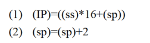

retf

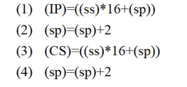

call

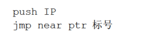

* call far ptr 标号    实现的是7段间转移（即指令长度加上段地址和偏移地址，可以任意转移）
* inc op     即op+=1
* mul乘法指令

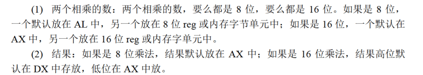


## 11标志寄存器

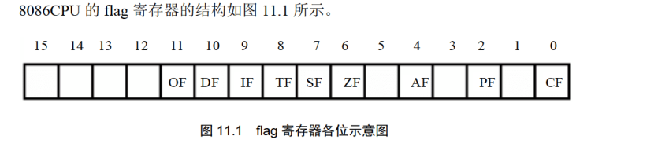

* 空白位保留

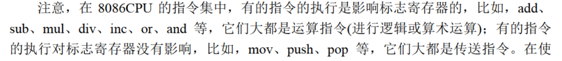

* ZF: 记录相关指令执行后结果是（1）否（0）为0，

* PF: 记录执行结果中1的个数，偶数（1），奇数（0）

* SF: 记录指令结果（补码）是否为负(1)，计算机的运行结果可以当作有/无符号数，当作无符号数时，SF的值没有意义。
* CF: 进位/借位 记录值，例如如果加法结果突破最高位1位（仅有1位），会在CF中置1.
* OF: 记录溢出（针对有符号数计算突破上下限），溢出为1
* CF对无符号数有意义，OF对有符号数有意义。

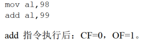

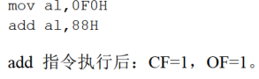

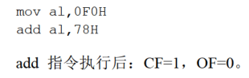


* adc op1,op2       op1 = op1 + op2 +CF. 提供该指令的原因在于可以用来计算多位（超16位）加法，adc也会设置CF位，这样就可以计算任意位数的加法。

* inc 和loop不影响CF标志位。
* sbb op1,op2   op1 = op1 - op2 -CF 借位减法指令
* cmp op1, op2        op1 - op2 比较指令（实质即减法），不保存结果，仅设置标志位。 

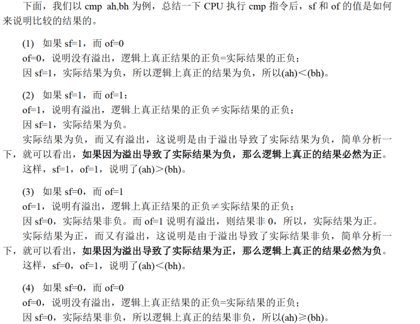

* 条件转移指令，所有条件转移指令的转移位移都是[-128,127]

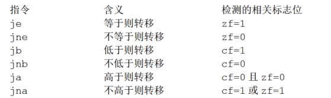


* DF 方向标志位，在串处理指令中控制每次操作后si,di的增（0）减（1）


* pushf 和 popf 将标志寄存器值压栈或从栈弹出

## dos使用

```assembly
masm file;
link file.obj;
debug file.exe

#debug
r #查看寄存器
r [reg]  #修改指定寄存器的值

d 段地址:内存地址 #查看指定内存单元内容

t #单步执行
u [段地址:偏移地址] #指令形式查看指定位置数据或直接查看当前段地址指令

```


ESP在80386中可以作为BAse寄存器
