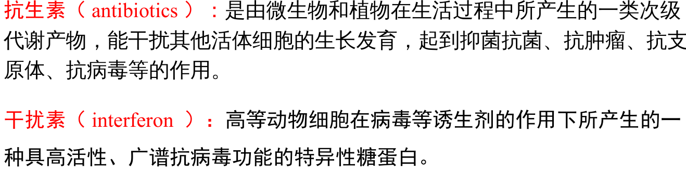
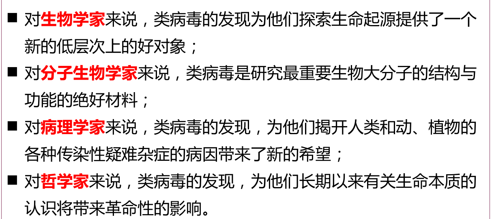
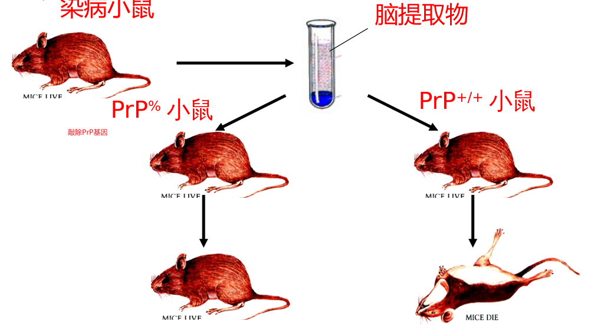
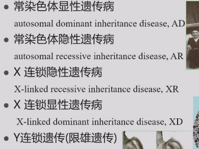
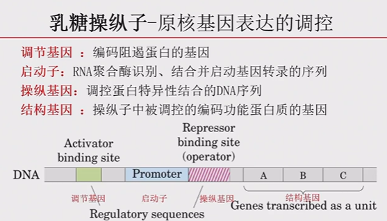

# 分子生物学？

## 细胞的概念

### 病毒

* 1665 年 Robert Hooke 在软木塞的切片上发现了蜂窝状的小格子结构 -“ 细胞”，开启了微观生物学的研究。 1676 年， Leeuwenhoek 首次观察到了活的细菌。

* 细胞是生命的基本结构单位，所有生物都是由细胞组成的
* 病毒分类
  * 真病毒：DNA 或 RNA 与蛋白质构成的核酸 - 蛋白质复合体
  * 类病毒：感染性的 RNA 构成，发现约 20 余种
  * 朊病毒：仅由有感染性的蛋白质构成

* 病毒的特点
  * 不具有细胞结构
  * 一种病毒内只含有一种核酸， DNA 或者 RNA 。
  * 依赖宿主细胞复制，形成子代。
  * 对大多数抗生素不敏感，对干扰素敏感。
  * 在寄主体外对高温 (55 ～ 60℃) 、 X 射线、 γ 射线、紫外线敏感，易变形失活。

* 人畜共患病：约200种；其中重要的有较89 种，病毒病 30 多种。
* **流行性乙型脑炎、口蹄疫、西部马脑炎、狂犬病、禽流感、 SARS 、埃博拉病毒（ EBoV ）、新冠肺炎等**
* 艾滋病无法治愈：艾滋病病毒逆转录DNA插入人体核DNA，目前无法进行如此细粒度的剪除操作。

 **疫苗**

* 种痘之术：从患有轻度天花症的人体内取出痘液给健康人接种
* 爱德华 · 詹纳得知牛痘是牛患的一种轻度病，也可以传染给人，人若传染上牛痘，就不会得天花病。他发明和普及了一种预防可怕的天花病的方法──接种疫苗法。

### 病毒的应用

* 疫苗：用细菌、病毒、螺旋体等制成的抗原性生物制品称为疫苗。
  * 减毒活疫苗：有潜在危险性，可能导致患病，甚至恢复毒性
  * 灭活疫苗：安全性好，有的免疫原性弱。
  * 类毒素疫苗：针对产生强力外毒素或肠毒素的病原菌。
  * 转基因疫苗：通过转基因技术，生产病毒的抗原蛋白。
  * 核算疫苗：将编码抗原蛋白的外源基因 (DNA 或 RNA ) 直接导入动物体细胞内， 并通过宿主细胞的表达系统合成抗原蛋白。

* 生物农药
  * 昆虫病毒:专一性, 毒性大, 使用方便, 后效长，对人畜安全，无公害1
  * 可能过头，破坏生态；需要隔绝大棚和外界

### 类病毒和阮病毒

* 类病毒：无蛋白质外壳，裸露的环状的 ssRNA 分子，能感染寄主细胞，独立侵染和复制的专性活细胞寄生的分子生物。

* 阮病毒：朊病毒是一类小型蛋白质颗粒，约由 250 个氨基酸组成，大小仅为最小病毒的 1 ％，而且毒性很强。

* 致病机理

>  

* $PrP^c$ 和 $PrP^{sc}$ 均来源于宿主中同一编码基因，并具有相同的氨基酸序列，所不同的是二者空间三维结构。

* 存在于宿主细胞内的一些正常形式的细胞朊蛋白（ $PrP^c$ ）受到致病朊蛋白（ $PrPP^{sc}$ ）的影响而发生相应的构象变化，发生了错误的折叠后变成了$PrP^{sc}$ ，从而使宿主致病。

* 先有鸡和先有蛋问题？ 核酸和蛋白质的先后问题，发现了不需要依赖对方生存的核酸和蛋白质，说明最初两种可能是独立演化。后来逐渐结合。

* 处理蛋白质和核酸混合物：加入蛋白酶处理复杂蛋白质，然后用加热去除蛋白酶
* 降解核酸可以使用射线

## 生物膜的结构和功能

* 低渗溶液发现人的染色体数量

### 溶酶体和疾病

* 矽肺：吸入肺泡，被巨噬细胞吞噬，含有矽尘的吞噬小体与溶酶体合并，导致溶酶体崩解，细胞本身也被破坏，矽尘释出，后又被其他巨噬细胞内吞噬，如此反复进行。受损或已破坏的巨噬细胞释放“致纤维化因子”，导致胶原纤维沉积，肺组织纤维化。
* 肺结核：结核杆菌的菌体成分硫酸脑苷脂能抵抗巨噬细胞内的溶酶体的溶菌作用，使结核杆菌在肺泡内大量生长繁殖，导致巨噬细胞裂解，释放出的结核杆菌再被吞噬而重复上述过程，最终引起肺组织钙化和纤维化。
* 贮积症：遗传缺陷引起溶酶体内的酶发生变异，功能丧失，导致底物在溶酶体中大量贮积。
* 类风湿关节炎

* 细胞自噬：
* 泛素：泛素控制的蛋白质降解具有重要的生理意义。

* 退行性变疾病：使用促进细胞自噬的药物，如 Rapamycin( 雷帕霉素 ) 可改善帕金森病、阿尔海默病等疾病的病情。

* 自噬是机体重要的抵抗病原微生物的通路。

* 正常细胞自噬增强，可抑制肿瘤的发生；肿瘤细胞则通过增强自噬来对抗缺氧、治疗药物诱导的应激反应。

## 细胞分裂

* 无丝分裂，有丝分裂，减数分裂

### 细胞分化

* 细胞协调分化过程：细胞分化过程是由一系列基因产物（ regulatory proteins ）调控的，一个关键的调控蛋白，可以调控一系列下游基因，完成细胞分化。

* 三种发育潜能：全能性，多能性，单能性
* 对于植物来说，分化成熟的植物体的细胞，仍保持全能性，仍有可能发育成完整的植株。
* 多利羊的诞生说明高度分化的哺乳动物体细胞核也具有发育全能性。

* 关键在于细胞质，细胞质中有着决定细胞分化全能性的物质，称为分化决定子。实验证明，细胞质中的分化决定子是 RNA 。

反义RNA：对基因表达的负调控。与 mRNA ( 基因编码 ) 序列互补，可抑制 mRNA 的翻译 ,

RNA干扰：由双链 RNA 诱发的、同源 mRNA 高效特异性降解的现象。由于使用 RNA干扰技术可以特异性剔除或关闭特定基因的表达，所以该技术已被广泛用于探索基因功能和传染性疾病及恶性肿瘤的基因治疗领域。

小分子RNA：非编码部分；进化保守，小分子，参与转录后基因表达调控。

### 细胞衰老

* 身体衰老是以细胞衰老为基础的。
* 细胞、至少是培养的细胞，不是不死的而是有一定寿命的。它们的增殖能力不是无限的，而是有一定极限的。
* 人体衰老时，并非全身细胞均衡衰老，而是部分细胞衰老，导致整体机能失调。激素系统和神经系统的衰老对全身的影响最大。

* 衰老机理
  * 氧化性损伤：活性氧基团或分子引发的氧化性损伤的积累，最终导致衰老。
    * 维生素E，抗氧化剂
  * 端粒与衰老：人类端粒结构为染色体末端重复上千次的 TTAGGG 序列所组成
    * 端粒每次都会有一段不会被复制，即不断缩短。
    * 大约 90% 的癌细胞都有着不断增长的端粒及相对来说数量较多的端粒酶。
    * 只有在胚胎细胞中端粒酶才有活性，可以重建和延长端粒 DNA 。
    * 通过抑制端粒酶治疗癌症；特异性激活端粒酶来使某些组织返老还童
  * 基因与衰老：基因突变引发早衰
  * 发育程序与衰老
  * 线粒体DNA与衰老：
  * 

* 女性寿命长于男性
* 男性和女性在免疫系统衰老过程中存在显著差异，男性衰老更快

* 饮食决定寿命
  * 热量限制延缓衰老
  * 运动能缓解机体功能下降
  * 营养过剩导致的肥胖会诱发许多衰老相关的代谢性疾病

* 抗衰老物质：若反
* 抑郁症造成衰老：
* 抑郁症常与炎症以及免疫反应过度相联系，有抑郁情绪的个体往往炎症发病很高。

主要衰老疾病

* 老年痴呆：阿兹海默病
* 帕金森病：
* 亨廷顿病

### 细胞死亡

* 因环境因素或病原物入侵而死亡，称为病理死亡，或细胞坏死（ Necrosis） 。
* 因个体正常生命活动的需要，一部分细胞在一定阶段死去，称细胞凋亡(Apoptosis) 。。
* 细胞凋亡是一个由基因决定的自动结束生命的过程，所以也常常被称为细胞程序性死亡

细胞凋亡普遍存在

* 变态发育：蝌蚪青蛙尾巴
* 哺乳动物：皮肤，指甲
* 红细胞
* 淋巴细胞

癌细胞亦可看作是凋亡失控了的细胞。

诱发细胞凋亡的因素

* 物理性因子 :射线，重金属，较温和的温度刺激，热激，冷激
* 化学和生物因子：活性氧基团和分子， DNA 和蛋白质合成的抑制剂，激素，细胞生长因子，肿瘤坏死因子

* 常见的模式生物：斑马鱼、小鼠、线虫、果蝇、拟南芥

## 基因的发现

* 孟德尔遗传定律
  * 德弗里斯，切尔马克，贝特森
* 摩尔根的果蝇杂交实验：确定了基因在染色体上作直线排列

* 摩尔根的成功
  * 方法使用：经典的统计遗传学加微观遗传学方法
  * 选对了实验材料：果蝇是很好的模式动物
  * 优秀的团队
*   内含子和外显子
  * 基因由若干编码区和非编码区间隔形成
* 基因突变：物理诱变技术
  * X射线可以诱发基因突变，诺贝尔奖
* 基因敲除
* 基因编辑。

中心法则

生物性状是由基因和环境共同作用的结果

* 单基因遗传
* 
* 表观遗传
  * 甲基化
  * 组蛋白修饰
* 杂种优势
  * 选择有利于杂合子的程度大于两种纯合子
  * 显性学说：杂合态有害基因被显性有利基因的效应所遮盖。
  * 超显性学说：非等位基因间的互作。

* 基因表达和调控
  * DNA复制水平
  * RNA转录水平
  * 前体RNA加工水平
  * 蛋白质翻译水平
  * 翻译后加工和转运水平
  * 蛋白质降解水平

* 原核基因表达的调控

在没有乳糖的情况下，由I基因编码的阻遏蛋白结合操纵序列O，并且乳糖操纵子处于抑制状态，不能合成三种分解乳糖的酶。在存在乳糖的情况下，乳糖作为诱导剂诱导阻遏蛋白质变构，不能与操纵序列结合，并且诱导乳糖操纵子公开合成三种分解乳糖的酶。因此，乳糖操纵子的这种调节机制是诱导型负调节。细菌相关功能的结构基因通常连接在一起形成基因簇。它们在相同的代谢途径中编码不同的酶。基因簇由相同，开放和封闭调节。也就是说他们组成了一个受监管的单位。其他相关的功能基因也包括在该调节单元中，例如编码酶的基因，尽管其产物不直接参与催化代谢，但它可以将小分子底物转运到细胞中。

链终止法（ chain termination method ）的技术来测定 DNA 序列。

CRISPR-Cas系统

1987年，日本大阪大学课题组在大肠杆菌的碱性磷酸酶基因附近发现串联间隔重复序列，随后发现其广泛存在于细菌和古细菌的基因组中。
2002年，将其命名为成簇的规律间隔的短回文重复序列(CRISPR) 。蛋白质翻译水平翻译后加工和转运水平蛋白质降解水平

CRISPR/Cas 系统是原核生物在长期演化过程中形成的一种适应性免疫防御，可用来对抗入侵的病毒及外源 DNA 。

基因工程的内容：基因的获得、筛选、表达和产物分离， PCR 是基因的获得中常用技术。
植物转基因技术有农杆菌介导法、基因枪法、花粉管通道法和原生质体转化法等。
动物转基因技术有逆转录病毒法、显微注射法和胚胎干细胞法等。

一个是正常细胞如何转变成癌细胞，一个是转基因食品的安全性