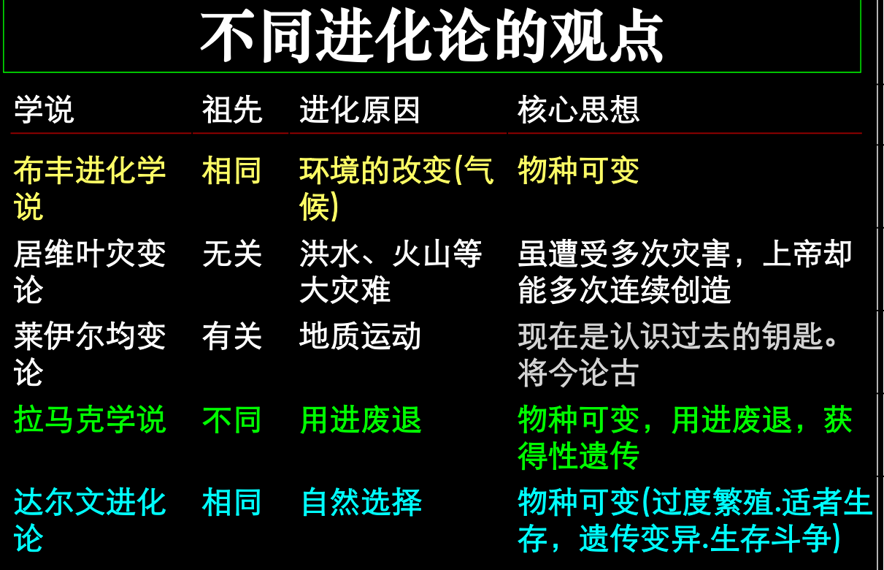
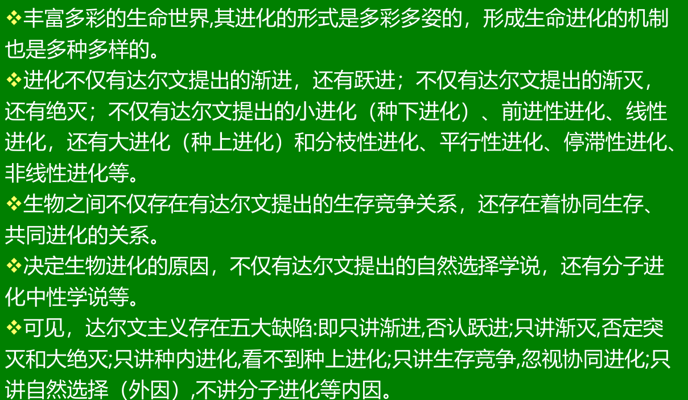

* 宏生物概念：几乎所有的多细胞生物都是宏生物。生物体内有生物连单细胞的细菌体内都有噬菌体。
* 蚂蚁？苹果核
* 自疏现象和自疏法则。
  * -3/2 自疏法则 (The -3/2 thinning law): 如果播种密度进一步提高和随着高密度播种下植株的继续生长，种内对资源的竞争不仅影响到植株生长发育的速度，而且进而影响到植株的存活率。在高密度的样方中，有些植株死亡了，于是种群开始出现“自疏现象”
  * 西北荒漠生态系统，灌木群丛
* 拟态：避免天敌和猎物发现。
* 标志拟态：吓唬天敌。

* 城市的树在台风下倒伏
  * 城市中的树环境太安逸，营养成分不缺，根系太浅
* 顶端优势：去除顶端，下方 侧芽生出来。
  * 砍我一枝条，萌出三根苗
  * 自然生态系统中，火甚至是群落演过程必须的。

* 植物有非常复杂的代谢方式

* 性别分化：
* 雌雄同体：藤壶，蜗牛，蚯蚓
* 蚯蚓：动态呼吸，土质松软，有腐殖质

* 不同生物眼中的世界，看见的东西的形状和颜色未必一样
* 这个世界上的任何生物，都有其弱点，也都有其长处！缺点和优点共存是其永续生存的必备条件！

生命起源

* 神创论
* 自然发生论
* 泛胚种论——宇宙发生论

* 无发生论
  ◼鉴于前面种种假说的局限性和困难，有人就主张生命和物质、能量一样是永恒的，没有发生和起源，只有传播和变迁。

* 生命与无生命之间没有不可逾越的鸿沟，这和自然发生论好像很相似，其实却有根本不同，可称为“新的自然发生学说”

* 化学演化说

  * 生命基础物质的形成
  * 氨基酸聚合成多肽

  * 多聚体整合为多分子体系颗粒(原球体)
  * 代谢与遗传体系的形成和进化最终产生出最简单的生命形式(原核细胞)

* 由小分子单体形成多聚体的问题
  * 独特环境说
  * 特殊化学反应说
  * 干热聚合说
  * 干-温循环说
  * 氰化氢、水、阳光直接反应说
  * 粘土催化说

生物进化研究的热点问题：
1. 生命的起源
•
来自外星球
•
来自地球的“原始汤”
2. 物种起源
•
生殖隔离机制
•
分子机制
3. 鸟类的起源
•
兽脚类恐龙
•
槽齿类爬行动物
4. 现代人类的起源
•
多域起源
•
近代非洲起源