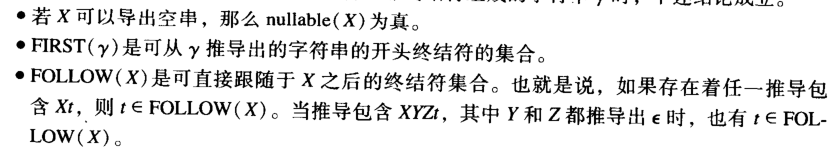
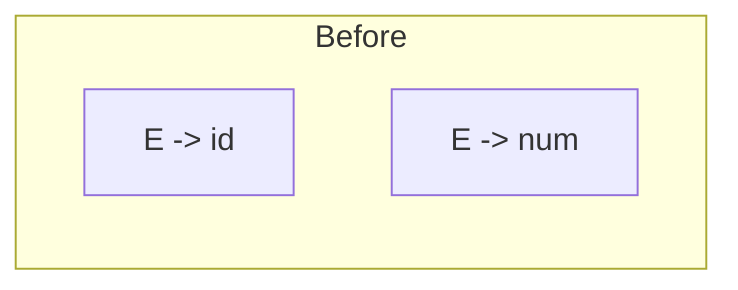

小题随缘

* 两个原则：
  * 

* RE -> NFA -> DFA |C FG
* DFA -> mini DFA
* 最左推导，最右推导
* 判断是不是 ambiguous 的方式是能够有多个 parse tree 或多个最左（最右）推导；而不是有两个推导就行了。

* FOLLOW: FOLLOW(X)可以直接跟随在X后的终结符的集合

* FIRST:First(y)，从y可以推导出的字符串的**开头终结符**的集合

* LL(1),LR(1), SLR(), LALR(1) 表 ， 状态图

