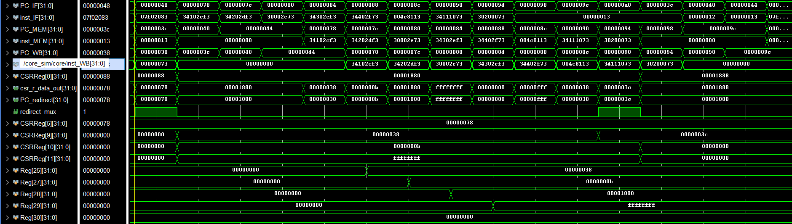
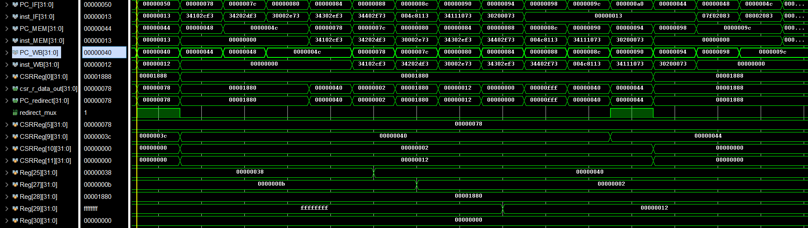
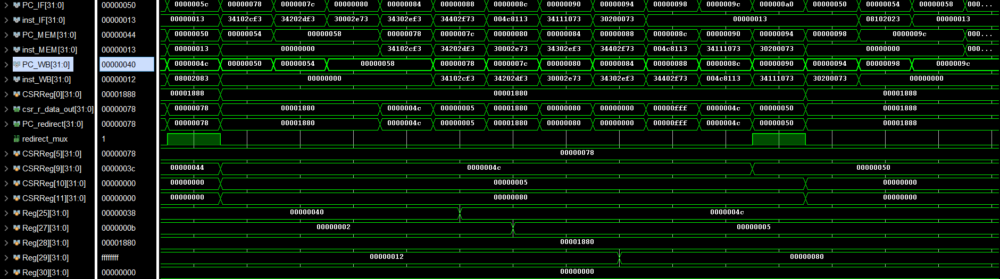
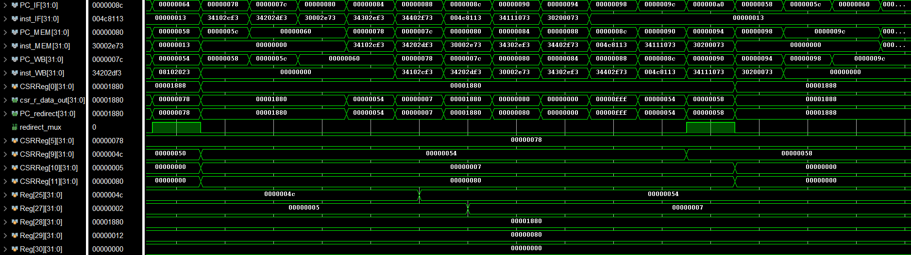
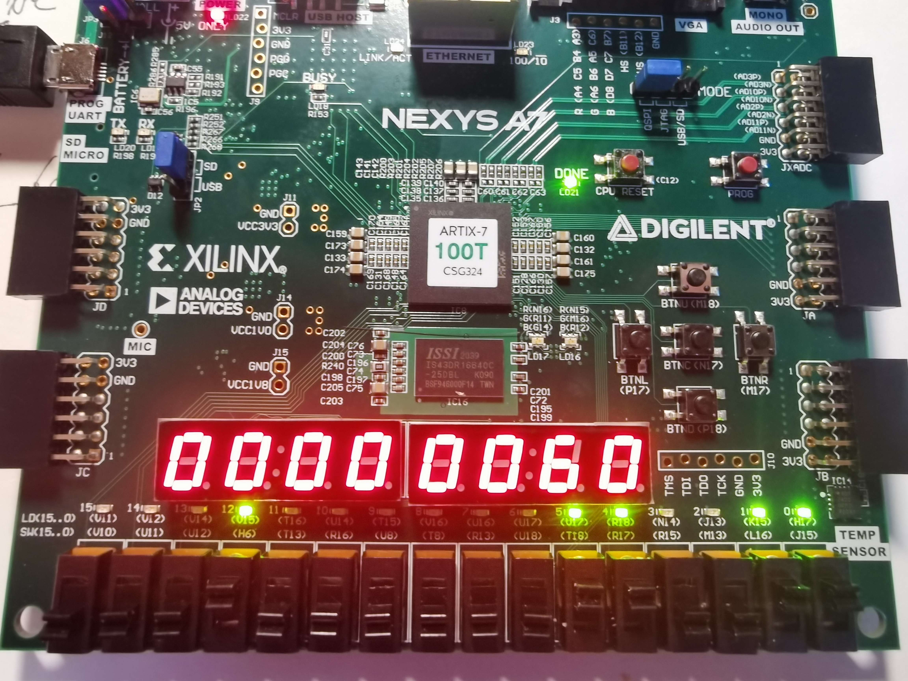
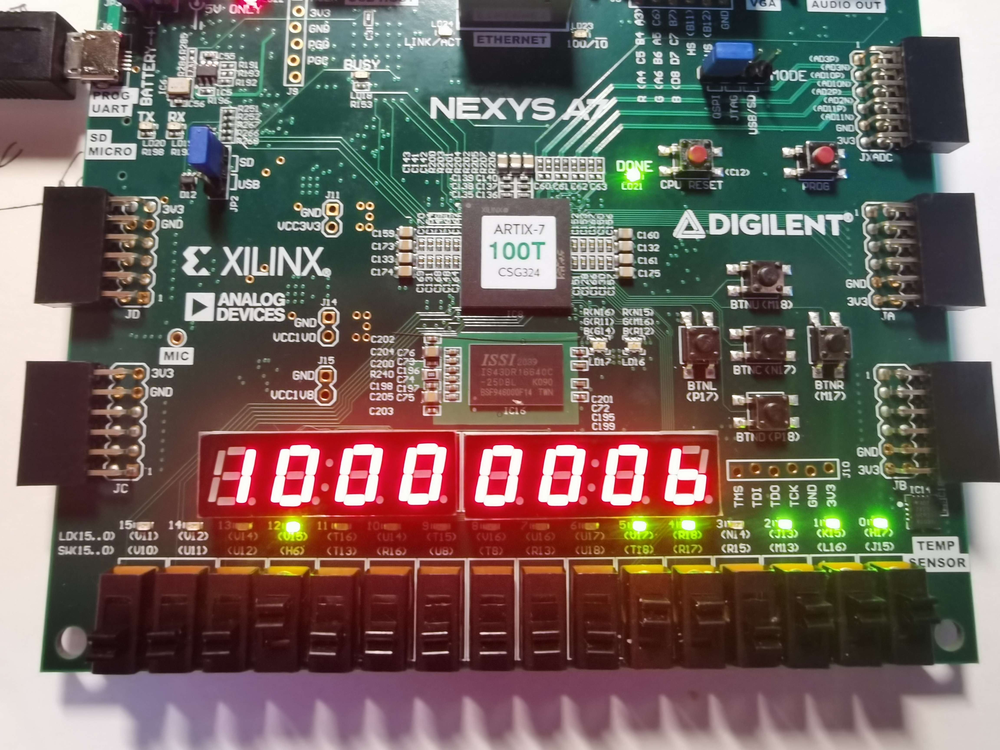
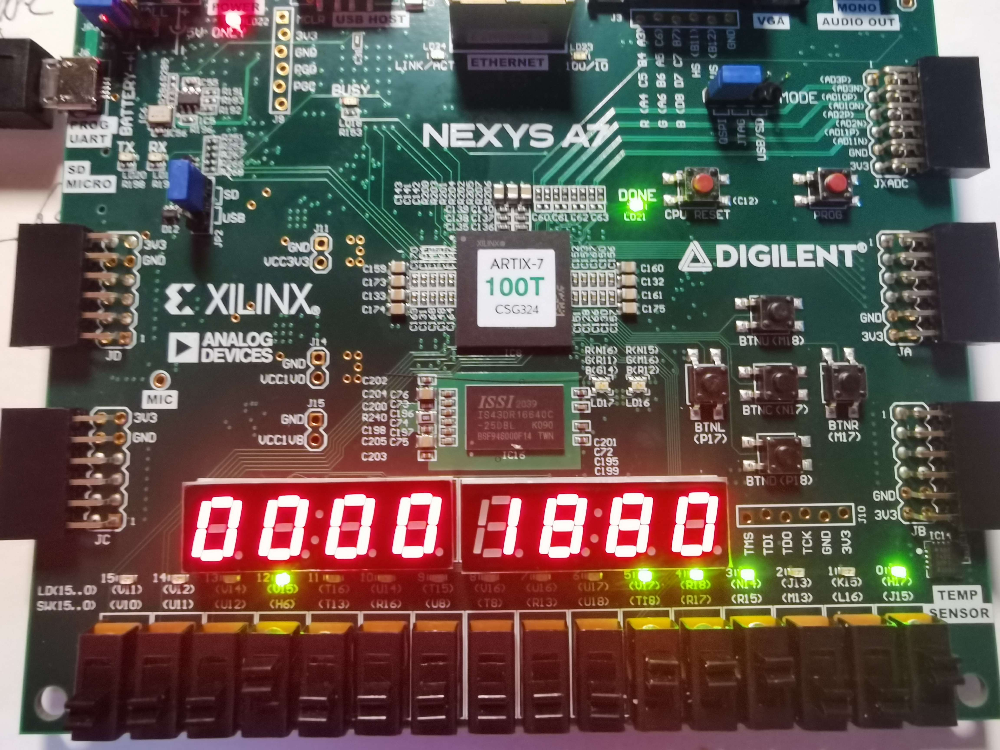
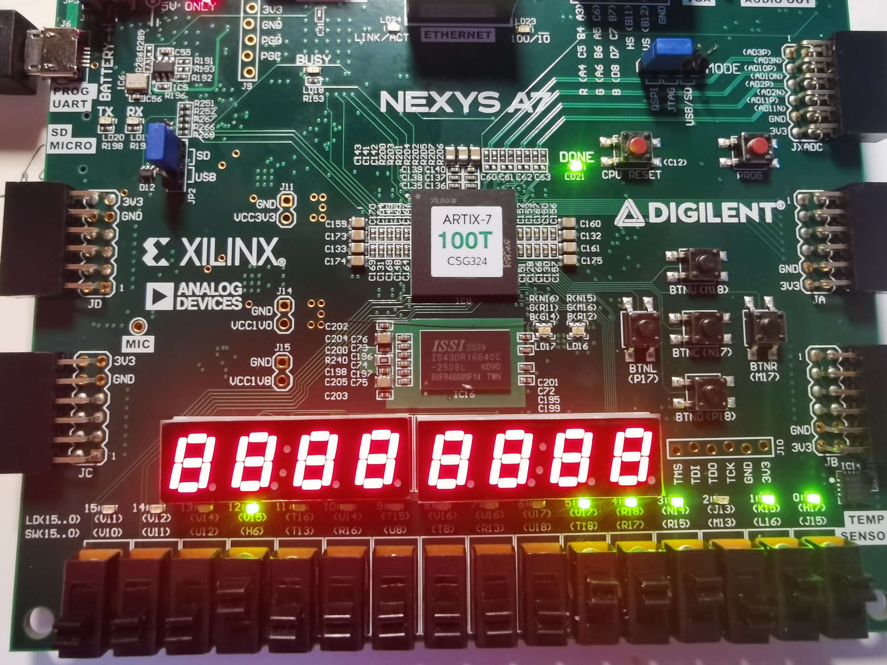

# LAB2 流水线异常和中断设计

## 1 实验目的

* 了解 RISC-V 简单的异常和中断
* 了解如何在流水线中添加异常和中断机制

## 2 实验过程

实验所需其余模块已经给出，基本不需要变动，实验主要编写的模块为`ExceptionUnit .v`以及`CSRRegs.v`两个模块。

首先需要了解实验所需的前置知识，即发生各种中断以及异常时`CSR`寄存器的值的变化。

|             | `mstatus` | `mtvec` | `mepc` | `mcause` | `mtval`     |
| ----------- | --------- | ------- | ------ | -------- | ----------- |
| `interrupt` | h1880     | h78     | ----   | h1 ...b  | 88888888    |
| `illegal`   | h1880     | h78     | h40    | h0... 2  | `inst`(h12) |
| `l_access`  | h1880     | h78     | h4C    | h0... 5  | `addr`(h80) |
| `s_access`  | h1880     | h78     | h54    | h0... 7  | `addr`(h80) |
| `ecall`     | h1880     | h78     | h38    | h0...  b | `ffffffff`  |
| `mret`      | [3] = [7] | ------  | ------ | ----     | ----        |

`mstatus:`M模式下的状态寄存器，因为功能设计较简陋，有用的位实际上只有[3]号位，即全局中断使能位，置0时无法触发中断，置1时可触发中断。因此在实际操作中所有中断异常的`mstatus`都是相同的。

`mtvec:`保存中断向量表，即发生中断或异常时的跳转地址表。无需改变，由程序自行设置。

`mepc:`保存发生中断或异常时的地址，即发生异常的地址或中断位置(`WB`阶段)的下一地址。本次实验中有固定的异常地址。

`mcause:`保存发生中断或异常的具体原因，手册中有具体值，最高位是中断/异常的判断，最低位的值代表具体类型。

`mtval:`保存一些可以帮助处理中断或异常的信息，对于本次实验仅考虑错误的指令或越界的内存地址。


然后，我们需要了解给定的模块及内部信号的运算方式，考虑如何将我们需要的信号添加进去。实验给定了单独的`CSR`寄存器组以及`CSR`指令的运算结构，我们需要将中断异常的`CSR`操作给出。

`CSRRegs`模块用来作为`CSR`寄存器组，在成型的指令操作中，只有一个读端口和一个写端口，对于读取数据，指令每次只需要操作一个寄存器，而中断和异常以及返回也只需要读出跳转的地址(`mtvec,mepc`)，因此我们可以用现成的端口读出数据。但是对于写数据，每次中断异常我们一定要同时设定多个寄存器，因此一个写端口肯定是不够的，而我们又不能从外部设置`CSR`寄存器组，因此我们将各个中断异常信号引入该模块，在内部进行判断和写多个寄存器。

`ExceptionUnit`模块用于处理待传入`CSRRegs`的信号（读写地址，写使能，写数据以及中断异常的相关信号），以及其他需要输出的控制信号（各个阶段寄存器的`flush`信号，`PC`的选择信号）。

两者具体代码如下：

```verilog
// CSRRegs.v
// 实验给出的与指令读写相关代码省略
assign mstatus_out = CSR[0];
reg [31:0] mstatus;
always@(posedge clk or posedge rst) begin
    mstatus = mstatus_out;
    if(rst) begin
		CSR[0] <= 32'h88;   // mstatus 300
		CSR[1] <= 0;
		CSR[2] <= 0;
		CSR[3] <= 0;
		CSR[4] <= 32'hfff;  // mie 304
		CSR[5] <= 0;        // mtvec 305
		CSR[6] <= 0;        // mcountern
		CSR[7] <= 0;
		CSR[8] <= 0;
		CSR[9] <= 0;        // mepc 341
		CSR[10] <= 0;       // mcause 342
		CSR[11] <= 0;       // mtval 343
		CSR[12] <= 0;       // mip 344
		CSR[13] <= 0;
		CSR[14] <= 0;
		CSR[15] <= 0;
	end
    else if(mstatus_out[3] & interrupt) begin // 中断控制
        CSR[0] <= {mstatus[31:13],{2'b11},mstatus[10:8],mstatus[3],mstatus[6:4],{1'b0},mstatus[2:0]};
        CSR[10] <= 32'h1000000b;
        CSR[11] <= 32'h88888888;
        CSR[9]  <=epc_next;
    end
    else if(csr_w) begin // 指令写控制
        case(csr_wsc_mode)
            2'b01: CSR[waddr_map] = wdata;
            2'b10: CSR[waddr_map] = CSR[waddr_map] | wdata;
            2'b11: CSR[waddr_map] = CSR[waddr_map] & ~wdata;
            default: CSR[waddr_map] = wdata;
        endcase            
    end
    else if(illegal_inst) begin // 非法指令信号
        CSR[0]  <= {mstatus[31:13],{2'b11},mstatus[10:8],mstatus[3],mstatus[6:4],{1'b0},mstatus[2:0]};
        CSR[10] <= 32'h00000002;
        CSR[11] <= inst_ill;
        CSR[9]  <=epc_cur;
    end
    else if(l_access_fault) begin // 访存地址错误
        CSR[0] <= {mstatus[31:13],{2'b11},mstatus[10:8],mstatus[3],mstatus[6:4],{1'b0},mstatus[2:0]};
        CSR[10] <= 32'h00000005;
        CSR[11] <= addr_access_fault;
        CSR[9]  <=epc_cur;
    end
    else if(s_access_fault) begin // 访存地址错误
        CSR[0]  <= {mstatus[31:13],{2'b11},mstatus[10:8],mstatus[3],mstatus[6:4],{1'b0},mstatus[2:0]};
        CSR[10] <= 32'h00000007;
        CSR[11] <= addr_access_fault;
        CSR[9]  <=epc_cur;
    end
    else if(ecall_m) begin // 环境调用异常
        CSR[0]  <= {mstatus[31:13],{2'b11},mstatus[10:8],mstatus[3],mstatus[6:4],{1'b0},mstatus[2:0]};
        CSR[10] <= 32'h0000000b;
        CSR[11] <= 32'hffffffff;
        CSR[9]  <=epc_cur;
    end
    else if(mret) begin // 中断异常返回
        CSR[0]  <= {mstatus[31:13],{2'b11},mstatus[10:8],1'b1,mstatus[6:4],mstatus[7],mstatus[2:0]};
        CSR[10] <= 0;
        CSR[11] <= 0;
    end
    else begin
    end
end
```

如上，通过`if...else...`语句逐个判断相关信号并写入寄存器。本次实验的要求此处仅涉及`mstatus,mtval,mepc`。

```verilog
assign csr_r_data_out = csr_rdata;
    assign PC_redirect = csr_rdata;

    wire trap = (mstatus[3] & interrupt) | illegal_inst | l_access_fault | s_access_fault | ecall_m;
    assign csr_raddr = rst ? 0 : trap ? 12'h305 : mret ? 12'h341 :csr_rw_addr_in;
    assign csr_waddr = rst ? 0 : csr_rw_addr_in;
    assign csr_wdata = rst ? 0 : csr_w_imm_mux? {27'b0,csr_w_data_imm} : csr_w_data_reg;
    assign csr_w     = rst ? 0 : csr_rw_addr_in;
    assign csr_wsc   = rst ? 0 : csr_wsc_mode_in;

    assign reg_FD_flush = (mstatus[3] & interrupt) | illegal_inst | l_access_fault | s_access_fault | ecall_m | mret;
    assign reg_DE_flush = (mstatus[3] & interrupt) | illegal_inst | l_access_fault | s_access_fault | ecall_m | mret;
    assign reg_EM_flush = (mstatus[3] & interrupt) | illegal_inst | l_access_fault | s_access_fault | ecall_m | mret;
    assign reg_MW_flush = (mstatus[3] & interrupt) |illegal_inst | l_access_fault | s_access_fault | ecall_m;
    assign RegWrite_cancel = illegal_inst | l_access_fault | s_access_fault | ecall_m;
    
    assign redirect_mux = (mstatus[3] & interrupt) | illegal_inst | l_access_fault | s_access_fault | ecall_m | mret;
```

本次实验尝试了适应实验的代码风格，删去了`always @*` 块。

`csr_raddr:`读取数据地址，由于指令和中断异常共用端口，共有三个可能信号，指令地址，`mtvec`，`mepc`。

而对于`csr_waddr, csr_wdata, csr_w, csr_wsc`信号，仅指令在使用。注意写入的数据可能来自通用寄存器或者立即数。

对于中断，无论在内外模块都需要额外注意，仅当`mstatus`的全局中断使能位（[3]）为1时才可触发中断，否则中断信号无效，即这两个信号是绑定在一起的，如果某处缺少`mstatus`的判定可能导致中断出现问题。

## 实验结果

对于异常，可同通过仿真更好的查看对应信号，对于中断，就拍摄上板的寄存器值进行检验。

**`ecall`环境调用异常**



**非法指令异常**



**访存地址异常（`load, store`）**





**中断**

在`5c`处中断，存储的`mepc`值。



**`mcause`**



**`mstatus`**



**`mtval:`**随意设置的中断值




## 实验心得

本次实验说不上很难，只需要设置中断异常的相关值，但是浪费了不少时间，一方面对于`verilog`不熟悉，导致时序出错，仿真对了，但是第一次上板无法进入处理程序。另外，对于`mstatus`的作用不敏感，而且内外模块都有中断判断信号，却遗漏了内部信号的`status`的判断，导致连续中断寄存器值设置错误以至一直在处理程序中循环无法退出。


## 思考题

1. 由于流水线的设置分阶段，在异常发生时，`PC`的实际指向为其后的某指令。即异常地址为`WB`阶段，而`PC`为`IF`阶段。非精确异常就是将错误的`PC`存入`mepc`，而精确异常就是将正确的异常地址`WB`阶段地址存入`mepc`。
2. 第一次导致异常的指令为`h38`地址处的`ecall`指令；

​		`trap`后各指令先将设置的各`CSR`寄存器取出写入通用寄存器中，然后将`mepc`的值加4后写回`mepc`，最后通过`mret`指令读取`mepc`的值返回发生异常地址的下一地址继续执行。

​		如果设置了`U mode`，会导致在`trap`处理程序之外的`CSR`指令出现异常，因为`U mode`不能执行`CSR`指令。

3. `WB`阶段是指令执行的最后阶段，此时各种信号都可以汇总在一起，即方便统一处理。
   而分开处理异常应该也是可以的，但是我们显然要考虑更多。首先是如果同时发生异常时不同阶段异常的优先级，显然后面阶段的异常优先级要高于前面的。然后是检测到的异常显然不能对正常的系统状态有所改变，或者说不能写寄存器，需要额外添加传递信号。还有发生异常后要对异常后的阶段进行`flush`，还有需要传输不同阶段的相关信息进入异常处理模块。
