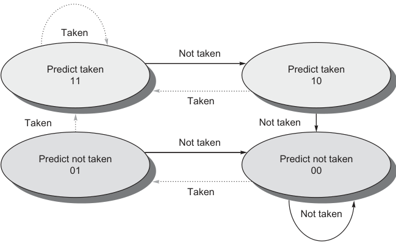
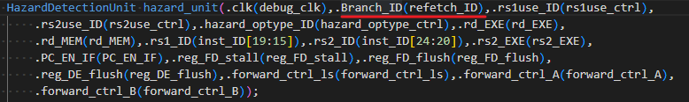
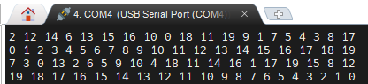
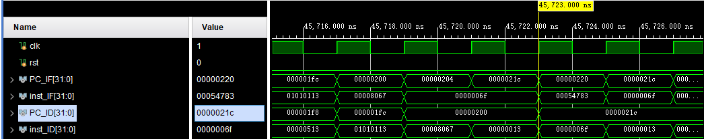
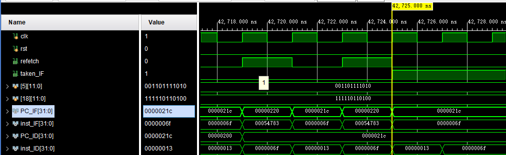
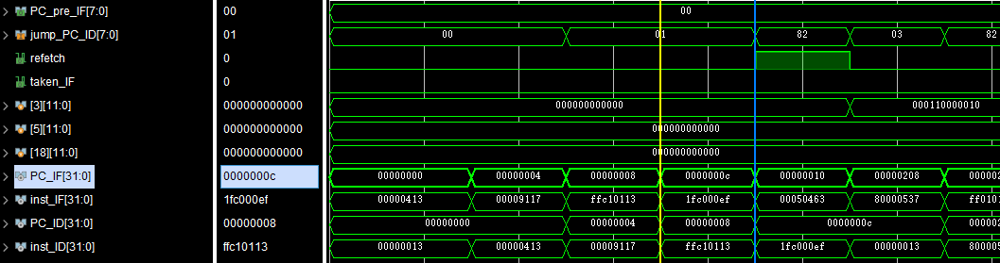
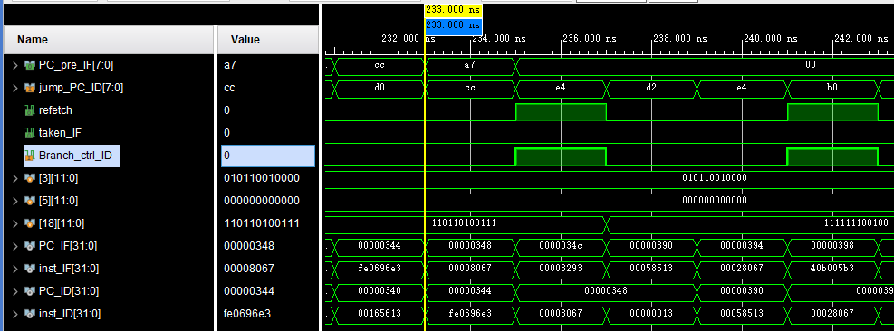
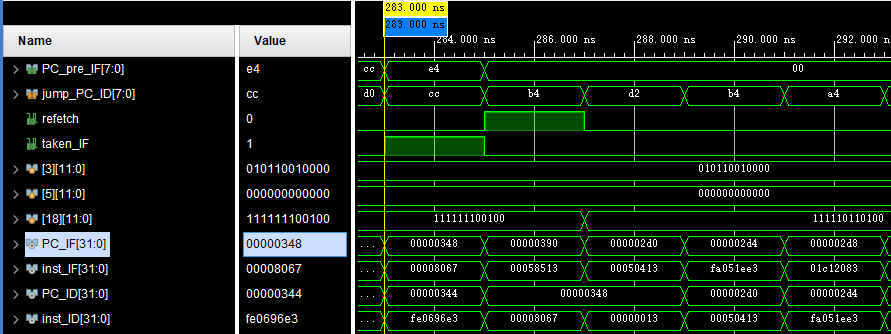
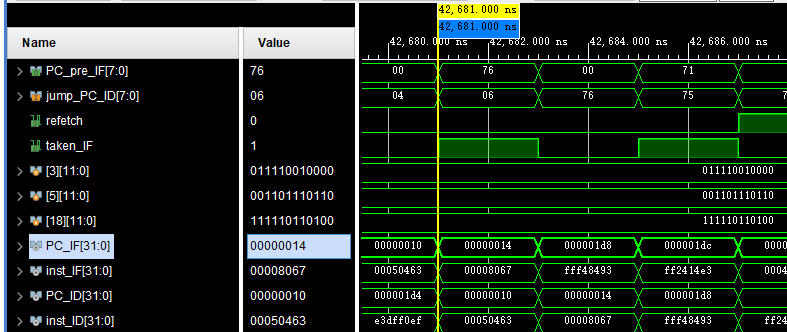

# Lab3 动态分支预测

## 1 实验目的

* 了解分支预测的原理
* 实现以`BHT`和`BTB`为基础的动态分支预测


## 2 实验过程

本次实验主要设计模块为`BranchPredictUnit.v`，通过`BHT`以及`BTB`进行动态分支预测并控制`PC`的跳转。具体设计如下：

### 主要信号

本次实验主要用于了解预测技术的原理，在实现方面存在简化而与真实应用有一定差异。

`BHT`和`BTB`实际上是两张表，且两张表的记录数不一定相同，而在本次实验中我们将这两张表合并从而使`BHT`和`BTB`有了一一对应关系，同时使用“全相联”的方式安排记录的存储位置，从而简化了记录的寻找和替换步骤。另外针对测试样例的地址大小，在实验中存储的地址只截取了有效的低位地址，大小为`8bits`，实际应用显然需要存储完整地址。

```verilog
reg [11:0] BranchPredictor[63:0];
```

`BranchPredictor`即两张表的合体，它是一个包含64个12位寄存器的数组，对于每个12位寄存器，`[11:10]`位存储地址的`tag`位（8bit地址使用低6位作为`index`，最高两位作为`tag`）；`[9:8]`存储`BHT`内容，即对应地址的历史跳转信息，一个2-bit的饱和计数器；`[7:0]`记录`BTB`的内容，即跳转地址。

另外还有两个控制信号`taken_IF`以及`refetch`，`taken_IF`用于反馈预测结果，1即表中存在相关记录且预测跳转，0说明表中无记录或预测不跳转。而`refetch`用于预测失败的补救，一方面是跳转与否的预测失败，另一方面对于`jalr`指令来说，跳转地址与寄存器关联，也就是说跳转地址是可变的，所以存在即使成功预测到了跳转也需要`stall`重新取指令情况。

### `BranchPredictUnit.v`实现细节

分支预测主要与`IF,ID`两个阶段有关，在`IF`阶段进行预测，在`ID`阶段进行确认，具体在代码上也分为两个部分。通过组合逻辑进行相关信号输出，通过时序逻辑进行预测表的内容更新。

```verilog
always @(*) begin
    if(rst) begin
        taken_IF = 0;
        PC_pre_IF = 8'h00;
        refetch = 0;
        BP_HIT_IF = 0;
    end
    else begin
        if(BranchPredictor[index_IF][11:10] == tag_IF[1:0]) begin
            PC_pre_IF[7:0] <= BranchPredictor[index_IF][7:0];
            taken_IF  <= BranchPredictor[index_IF][9];
            BP_HIT_IF = 1;
        end
        else begin
            PC_pre_IF[7:0] <= 8'h00;
            taken_IF       <=0;
        end
        
        refetch = (taken_ID^Branch_ctrl_ID && inst_valid) || 
        (inst_valid && taken_ID && Branch_ctrl_ID && (PC_pre_ID != jump_PC_ID));
    end
end
```

组合逻辑可划分为三个部分。

第一部分为`rst`信号高位时，此时全局信号重置为0。

第二部分为`PC_pre_IF, taken_If, BP_HIT_IF`信号的赋值，其中`BP_HIT_IF`信号不输出，代表了预测表中存在相关地址的预测记录，即“命中”。而`PC_pre_IF, taken_If`分别输出作为跳转地址和跳转选择信号，由于使用的2-bit预测状态机，较高的一位实际上就代表了跳转的预测结果。

第三部分为`refetch`信号，在前面已经有介绍，需要重新取指令的情况分为两种，对应或符号的两边表达式。

>各个信号含义解释：
>
>`taken_ID:`指令的预测结果，将`taken_IF`通过时序逻辑同步传递到 ID 阶段。
>
>`Branch_ctrl_ID：`指令的实际跳转结果，从外部传递进来。
>
>`inst_valid:`由于另存在冲突的检测和处理机制，在`load-stall`的情况下会出现带有原跳转地址的`nop`指令，影响到分支预测结果，因此需要有针对的判断。实际上即一个判断指令类型是否是跳转指令的信号。
>
>`PC_pre_ID`和`jump_PC_ID：`分别为预测的跳转地址和实际在ID阶段计算出来的地址。

```verilog
integer i;
always@(posedge clk or posedge rst) begin
    if (rst) begin
        for(i=0; i < 64; i = i+1) begin
            BranchPredictor[i] = 12'h000;
        end
        taken_ID  <= 0;
        PC_pre_ID <= 0;
        BP_HIT_ID <= 0;
    end 
    else if(FD_stall) begin
        taken_ID  <= taken_ID;
        PC_pre_ID <= PC_pre_ID;
        BP_HIT_ID <= BP_HIT_ID;
    end
    else begin
        taken_ID  <= taken_IF;
        PC_pre_ID <= PC_pre_IF;
        BP_HIT_ID <= BP_HIT_IF;
        if(Branch_ctrl_ID) begin //确实跳转
            if(BranchPredictor[index_ID][11:10] == tag_ID) begin //存在记录
                if(BranchPredictor[index_ID][8]) begin
                    BranchPredictor[index_ID][9:8] = 2'b11;
                end
                else begin
                    BranchPredictor[index_ID][8] = 1'b1;
                end
            end
            else begin //记录不存在
                BranchPredictor[index_ID][11:10] <= tag_ID;
                BranchPredictor[index_ID][9:8]   <= 2'b01;
            end
            BranchPredictor[index_ID][7:0] <= jump_PC_ID;
        end
        else begin
            if(BranchPredictor[index_ID][11:10] == tag_ID && BP_HIT_ID && inst_valid ) begin //记录存在
                if(BranchPredictor[index_ID][8]) begin
                    BranchPredictor[index_ID][8] = 1'b0;
                end
                else begin
                    BranchPredictor[index_ID][9] = 1'b0;
                end
            end 
        end
    end
end
```

时序逻辑同样分为三个部分。

第一个部分依旧是`rst`重置信号处理。

第二个部分处理`load-stall`带来的问题——存在`load-stall`的情况下，`PC`的更新同样会停止，也就是如果此时重新取指令是会失败的，所以需要保留原有值等待`stall`结束再进行更新。

第三部分更新预测表。共有四种情况，而不存在记录且不跳转的情况是不需要处理的。其余三种分为存在记录且跳转，存在记录但不跳转，不存在记录但跳转。

>根据代码从上到下情况解析：
>
>* 存在记录且跳转：此时需要增加历史跳转的记录，计算方法为将低位左移再与1进行或运算，实际实现按低位的信号值分情况赋常值。
>* 不存在记录但跳转：此时需要先增加相关记录，即将`[11:10]`设置为相关地址的`tag`位，再将跳转历史记录记为`2'b01`。
>* 由于`jalr`指令存在，在跳转时我们还需要需要更新跳转地址，无需区别对待，统一赋值即可
>* 不跳转但是存在记录：此时我们需要减少历史跳转的记录，同样是根据低位进行分类赋值
>* 需要注意的是2-bit状态机的增减并不是单纯的0~3的数字增减，而是有不同的变化。
>
>
>
>* 对于不跳转但是记录存在的情况，也会有来自`load-stall`的影响，需要额外的信号进行筛选处理。

### 其他修改

* `CtrlUnit.v`模块中增加一个输出信号用来判断是否为跳转指令（注意不是判断是否跳转）。

* `PC`的选择从原来的2个到4个（忽略异常处理）。原本`PC`的来源只有`addr(IF)+4`以及来自ID阶段的跳转地址，而现在新增了IF阶段的预测跳转地址以及`addr(ID)+4`（即预测跳转但实际不跳转需要重新取址）

```verilog
REG32 REG_PC(.clk(debug_clk),.rst(rst),.CE(PC_EN_IF),.D(final_PC_IF),.Q(PC_IF)); 
//PC模块
add_32 add_IF(.a(PC_IF),.b(32'd4),.c(PC_4_IF)); //计算addr(IF)+4
MUX2T1_32 mux_PC_IF(.I0(PC_4_IF),.I1({22'h0,PC_pre_IF,2'b00}),.s(taken_IF),.o(next_PC_IF));
//选择IF阶段下一指令，即预测是否跳转
MUX2T1_32 mux_PC_ID(.I0(PC_ID+32'h4),.I1(jump_PC_ID),.s(Branch_ctrl),.o(next_PC_ID));
//选择ID阶段的实际跳转地址
MUX2T1_32 mux_PC_IFID(.I0(next_PC_IF),.I1(next_PC_ID),.s(refetch_ID),.o(next_PC_IFID));
//如果地址跳转正确，无需修改则选择IF阶段的地址，否则用ID阶段的地址进行修正
MUX2T1_32 redirectPC(.I0(next_PC_IFID),.I1(PC_redirect_exp),.s(redirect_mux_exp),.o(final_PC_IF));//增加异常处理，最后地址
```

* 由于预测跳转，控制冲突的发生也有变化，仅当需要重新取指令时才发生控制冲突需要`stall`，即将`Branch_ID`输入换为`refetch_ID`信号。




## 3 实验结果

### **上板结果**

**说明时序逻辑设计无误，可正常运行**



### **仿真结果**

**仿真用时**

下面两张图分别为未使用分支预测和使用了分支预测仿真结果，可以看出，使用了分支预测技术时程序运行耗时少了大约3000个时钟周期。（`0000021c`为程序终止地址。）





**预测波形分析**

1. 预测表不存在相关记录，继续运行，实际上和预测不跳转有相同的操作。



>地址`0x0000000c`， 指令 `jal	ra,80000208`
>
>在IF阶段，此时程序刚刚开始，预测表中不存在相关记录，根据地址映射到`[3]`号索引，可以看到信号值全部为0，预测信号为低位。
>
>由于实际应当跳转，在ID阶段，需要重新取指令，产生了一次`stall`。
>
>又一个时钟周期后，可以看到预测表`[3]`号索引内容被更新，记录了一次跳转历史和跳转地址。

2. 预测不跳转，失败



>地址：`0x00000348`，指令：`jalr	zero,0(ra)`
>
>对应索引为[18]，tag位对应正确，可以看见`[9:8]`位为01，所以IF阶段预测不跳转，但是实际上是跳转的，所以在ID阶段`refetch`信号升高重新取指令。
>
>又一个时钟周期后，计数器更新，`[9:8]`变为`11`。

3. 预测跳转，但是地址错误



>地址：`0x00000348`，指令：`jalr	zero,0(ra)`
>
>如图可以看见虽然指令确实跳转，但是预测的目标地址为`00000390`，实际跳转地址为`000002d0`，所以`refetch`信号拉高重新取指令。
>
>然后经过一个时钟后预测表中目标地址改变（跳转历史记录不变）

4. 预测跳转，成功



>地址：`0x00000014`，指令：`jalr	zero,0(ra)`
>
>预测跳转并且目标地址正确，都是`000001d8`，指令顺利进行下去，不进行`stall`，由于饱和计数器已达最大值，因此预测表更新实际也未改变值。


## 4 思考题

1. 在报告里分析分支预测成功和预测失败时的相关波形。

见实验结果。

2. 在正确实现 `BTB` 和` BHT` 的情况下，有没有可能会出现 BHT 预测分支发生跳转，也就是 `branch taken`，但是 `BTB` 中查不到目标跳转地址，为什么？

> 可能，本次实验针对实验条件有专门的简化设计，在实际应用中BTB要存储完整地址32~64bits不等而BHT只需要2bits的跳转历史记录，所以通常BTB能存储的记录数比BHT要少，即两者并不存在一一对应关系，所以在BTB已满发生替换后，很有可能出现在BHT中存在但是BTB中不存在的情况。

3. 前面介绍的 `BHT` 和 `BTB` 都是基于内容检索，即通过将当前 `PC` 和表中存储的 `PC` 比较来确定分支信息存储于哪一表项。这种设计很像一个全相联的 `cache`，硬件逻辑实际上会比较复杂，那么能否参考直接映射或组相联的 `cache` 来简化 `BHT/BTB` 的存储和检索逻辑？请简述你的思路。

>可以，实际上为了简化检索以及替换步骤本次实验就是采用的直接映射设计。BHT/BTB就是删去cache的标志位，然后将原本存储数据的区域换成存储跳转历史信息或跳转目标地址，我们也可以根据表的大小划定地址的`index`位以及`tag`位，将`tag`位以及信息存储在表中，通过`index`快速查询替换记录。

## 5 实验心得

本次实验原理不难，通过直接映射进行查询替换更加简化了设计，但是依旧出现了一些问题。

* 刚开始对数组使用不了解，下意识将索引和信号的使用等同起来，但是索引的数量实际上就是给出的数量，例如对于本次使用的预测表`reg [11:0] BranchPredictor[63:0]`，它表示64个12位信号，而不是$2^{64}$个12位信号，12位信号能表示$2^{12}$个信号状态。
* 最初认为分支预测减少了指令的执行数量，实际上分支预测只是减少了时钟周期数，所以正确的两个`trace.out`文件应该是相同的，但是没有历史文件也无法确认之前删改的一些设计究竟是否是正确的了。