# 实验 4 - L1 cache 设计

## 1 实验目的

* 了解 `cache` 在 `CPU` 中的作用
* 了解 `cache management unit`(CMU) 与 `cache` 和 `memory` 之间的交互机制
* 在 `CPU` 中集成 `cache`


## 2 实验过程

本次实验主要涉及两个模块`cmu.v`以及`cache.v`，另外由于需要与内存交互，RAM也需要进行一些信号修改。

绝大部分代码已经给出，以下仅梳理设计框架和相关信号。

### `cmu.v`

`CMU`作为`cache`和`mem`以及CPU的交互控制单元，一方面`hit`时接受从上一个阶段传来的控制信号（内存读写以及位数控制等）来控制`cache`进行读写，另一方面在`miss`情况下需要和`mem`进行交互进行数据替换,同时输出`stall`信号使CPU停摆，等待数据到位（RAM也存在stall信号，但是没有使用）。

`cmu.v`模块总共分为3个功能部分，状态转移，`cache`读写信号控制，`mem`读写信号控制。

#### 状态转移

CMU 状态机如下图所示，各状态描述如下（指导书已经有了部分描述，以下补充部分理解）：

>`S_IDLE:`命中情况下正常的数据读写，一个周期即可。
>
>`S_PRE_BACK:`考虑到时序问题，由于只在上升沿进行写操作，在进行第一次写回时我们需要先将第一次要写的数据从cache中读出来。
>
>`S_BACK:`每次时钟上升沿写回一个字大小的数据，下降沿从cache读取下一次写回的数据（cache传入的时钟是反相的，所以在cache模块中依旧是上升沿读取数据），通过`2-bit`计数器和ack信号记录写回数据数量，最大值时转移到下一状态。
>
>`S_FILL:`上升沿从mem读取一个字数据，下降沿将该数据写入cache，同样通过`2-bit`计数器和ack信号记录写回数据数量，最大值时转移到下一状态。
>
>`S_WAIT:`执行miss情况下的数据读写。虽然读写操作和状态转移和`S_IDLE`相似，看起来可以合并，实际上`S_IDLE`状态是不会进行`stall`的，而miss状态下依然需要一个周期stall完成数据读写。
>
>`assign stall = (next_state != S_IDLE);`

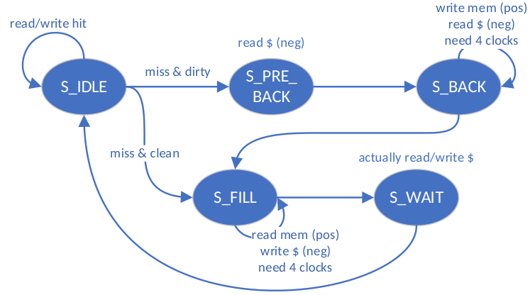


```verilog
always @ (posedge clk) begin
    if (rst) begin
        state <= S_IDLE;
        word_count <= 2'b00;
    end
    else begin
        state <= next_state;// 状态更新
        word_count <= next_word_count;// 计数器更新
    end
end
always @ (*) begin
    if (rst) begin
        next_state = S_IDLE;
        next_word_count = 2'b00;
    end
    else begin
        case (state)
            S_IDLE: begin
                if (en_r || en_w) begin
                    if (cache_hit)
                        next_state = S_IDLE;// 命中，直接读取数据，状态无需转移
                    else if (cache_valid && cache_dirty)
                        next_state = S_PRE_BACK;// 块被修改，替换前需要先写回内存
                    else
                        next_state = S_FILL;// 干净块，直接替换
                end
                next_word_count = 2'b00;// 计数器置零，为写回cache块和mem块准备
            end
            S_PRE_BACK: begin
                next_state = S_BACK;//该状态为第一次写回做准备
                next_word_count = 2'b00;// 计数器置零，为写回cache块准备
            end
            S_BACK: begin
                if (mem_ack_i && word_count == {ELEMENT_WORDS_WIDTH{1'b1}})// 2'b11 in default case
                    next_state = S_FILL;// 计数器11时，块内所有字都被写回内存，需要转移状态
                else
                    next_state = S_BACK;// 计数器未满时，状态不转移
                if (mem_ack_i)
                    next_word_count = word_count + 1;
                	//每次ack说明mem写回一字，在最大值2'b11时，会再次自增溢出置0，因此无需主动置0
                else
                    next_word_count = word_count;// 否则计数器不自增
            end
            S_FILL: begin
                if (mem_ack_i && word_count == {ELEMENT_WORDS_WIDTH{1'b1}})
                    next_state = S_WAIT;// 计数器11，说明替换的块被全部读取写入cache，需要转移状态
                else
                    next_state = S_FILL;// 否则状态不转移
                if (mem_ack_i)
                    next_word_count = word_count + 1;//每从内存读取一次数据，计数器自增1
                else
                    next_word_count = word_count;// 否则不自增
            end
            S_WAIT: begin
                next_state = S_IDLE;//cache替换成功后进行的数据读取
                next_word_count = 2'b00;
            end
        endcase
    end
end
```


#### `cache`读写信号控制

熟悉了cache状态后，对读写的控制也就容易了，在`S_IDLE,S_WAIT`状态下，只需将外部输入的信号与cache对应起来，`S_BACK,S_PRE_BACK,S_FILL`都是miss情况下替换状态，注意地址（按块操作，4字16字节，高28位无需动，[1:0]为字内偏移，置0即可，[3:2]为块内偏移地址，通过利用计数器可以逐一对块内的字进行访问，写回mem时读取的是下一个字，传入的是`next_word_count`信号，但是写入cache时是同一周期操作，写入本周期读取数据，传入`word_count`信号），其余信号基本可以置，除写入cache时注意数据和替换使能信号(store)。

```verilog
always @ (*) begin
    case(state)
        S_IDLE, S_WAIT: begin
            // @IDLE hit情况下读写数据
            // @WAIT 在cache miss替换后进行的数据读写
            // cache和CPU的交互读写，将外面传入的控制信号传入cache即可
            cache_addr = addr_rw;
            cache_load = en_r;
            cache_edit = en_w;
            cache_store = 1'b0;
            cache_u_b_h_w = u_b_h_w;
            cache_din = data_w ;
        end
        S_BACK, S_PRE_BACK: begin
           // 用于cache向内存写入
           //因为会影响LRU计数，所以不能使用load信号。u_b_h_w应该也可以不用管，反正是一个字全部取出
            cache_addr = {addr_rw[ADDR_BITS-1:BLOCK_WIDTH], next_word_count, {ELEMENT_WORDS_WIDTH{1'b0}}};
            cache_load = 1'b0;
            cache_edit = 1'b0;
            cache_store = 1'b0;
            cache_u_b_h_w = 3'b010;
            cache_din = 32'b0;
        end
        S_FILL: begin
            // 将内存中的数据读取到cache中
            // 应该是为了内存更好模拟现实所以也需要多个周期，只有ack信号到来时才有数据写入cache
            cache_addr = {addr_rw[ADDR_BITS-1:BLOCK_WIDTH], word_count, {ELEMENT_WORDS_WIDTH{1'b0}}};
            cache_load = 1'b0;
            cache_edit = 1'b0;
            cache_store = mem_ack_i;
            cache_u_b_h_w = 3'b010;
            cache_din = mem_data_i;
        end
    endcase
end
```


#### `mem`读写信号控制

在前面的描述中，对于mem的控制实际也很明确了，由于时序原因，对于内存的访问应该“ 预测 ”一个周期，反映到代码中为通过状态机的下一个状态来决定控制信号，只有下一个状态为`S_BACK`时，本周期才需要准备写入信号（cs类似mem使能信号，说明需要与mem交互，we即写使能信号，addr即访存地址），注意写回内存时使用的tag应该是cache中被替换的tag。只有下一个状态为`S_FILL`时，本周期才需要准备读取信号（写使能置0），读出内存数据。其余状态均与内存无关。

```verilog
always @ (*) begin
        case (next_state)
            S_IDLE, S_PRE_BACK, S_WAIT: begin
                mem_cs_o = 1'b0;
                mem_we_o = 1'b0;
                mem_addr_o = 32'b0;
            end

            S_BACK: begin
                mem_cs_o = 1'b1;
                mem_we_o = 1'b1;
                mem_addr_o = {cache_tag, addr_rw[ADDR_BITS-TAG_BITS-1:BLOCK_WIDTH], next_word_count, {ELEMENT_WORDS_WIDTH{1'b0}}};
            end

            S_FILL: begin
                mem_cs_o = 1'b1;
                mem_we_o = 1'b0;
                mem_addr_o = {addr_rw[ADDR_BITS-1:BLOCK_WIDTH], next_word_count, {ELEMENT_WORDS_WIDTH{1'b0}}};// {[31:4], 2bits 00}
            end
        endcase
    end
```

### `cache.v`

cache的原理在课堂已有详细介绍，实际实现将各信号分别使用寄存器管理。下面分别介绍各信号的作用。

```verilog
//输入信号解析
//对输入数据地址进行解析，获取tag(高23位),index(tag后5位), 块(element)的索引号和字(word)的索引号。
//由于使用二路组相联，计算块和字的索引时都需要两个，最后通过hit或recent信号选择是哪一个组修改或替换
//块的索引号高5位为地址索引，最低位标识同组中的不同块
//一个块4个字，字索引号即块索引号添加2位字偏移地址
assign addr_tag = addr[ADDR_BITS-1 : ADDR_BITS-TAG_BITS];
assign addr_index = addr[ADDR_BITS-TAG_BITS-1: ELEMENT_WORDS_WIDTH+WORD_BYTES_WIDTH];
assign addr_element1 = {addr_index, 1'b0}; // 6bits
assign addr_element2 = {addr_index, 1'b1}; 
assign addr_word1 = {addr_element1, addr[ELEMENT_WORDS_WIDTH+ WORD_BYTES_WIDTH-1:WORD_BYTES_WIDTH]};
assign addr_word2 = {addr_element2, addr[ELEMENT_WORDS_WIDTH+ WORD_BYTES_WIDTH-1:WORD_BYTES_WIDTH]};
```

```verilog
//用于load指令，通过字索引信号即可获取对应的数据，最后通过hit信号判断是哪一个，再通过u_b_h_w信号确认数据位数量和有无符号。
assign word1 = inner_data[addr_word1];
assign word2 = inner_data[addr_word2];  //need to fill in
assign half_word1 = addr[1] ? word1[31:16] : word1[15:0];
assign half_word2 = addr[1] ? word2[31:16] : word2[15:0];  //need to fill in
assign byte1 =  addr[1] ?
                addr[0] ? word1[31:24] : word1[23:16] :
                addr[0] ? word1[15:8] :  word1[7:0]   ;
assign byte2 =  addr[1] ?
                addr[0] ? word2[31:24] : word2[23:16] :
                addr[0] ? word2[15:8] :  word2[7:0]   ;  //need to fill in
```

```verilog
// cache块信息，标记innenr即真实cache信息。
// @recent 即lru算法记录，1说明上一次访问该块，则替换组中另一个为0的块，二路组只需要1个bit
// @valid 即是否有效，块中数据是否可用。
// @dirty 即脏位，是否被修改
// @tag 即标记该块的tag。
assign recent1 = inner_recent[addr_element1];
assign recent2 = inner_recent[addr_element2];  //need to fill in
assign valid1 = inner_valid[addr_element1];
assign valid2 = inner_valid[addr_element2];  //need to fill in
assign dirty1 = inner_dirty[addr_element1];
assign dirty2 = inner_dirty[addr_element2];  //need to fill in
assign tag1 = inner_tag[addr_element1];
assign tag2 = inner_tag[addr_element2];    //need to fill in

// 命中信号，当该块数据有效并且tag对应得上时说明命中
assign hit1 = valid1 & (tag1 == addr_tag);
assign hit2 = valid2 & (tag2 == addr_tag);    //need to fill in
```

对于cache信息的修改，不再多描述，只需注意`edit`信号对应store指令修改cache数据，而`store`信号对应的是miss情况下cache的数据替换。

### `data_ram.v`

可能为了适配真实情况，RAM的读写访问分别多出了3周期的等待，相当于每4个周期才能读出一个字数据，另外增加ack信号标记读写状态。

## 3 实验结果

### CMU&Cache 模块仿真分析

(图片可放大查看)

***read miss***

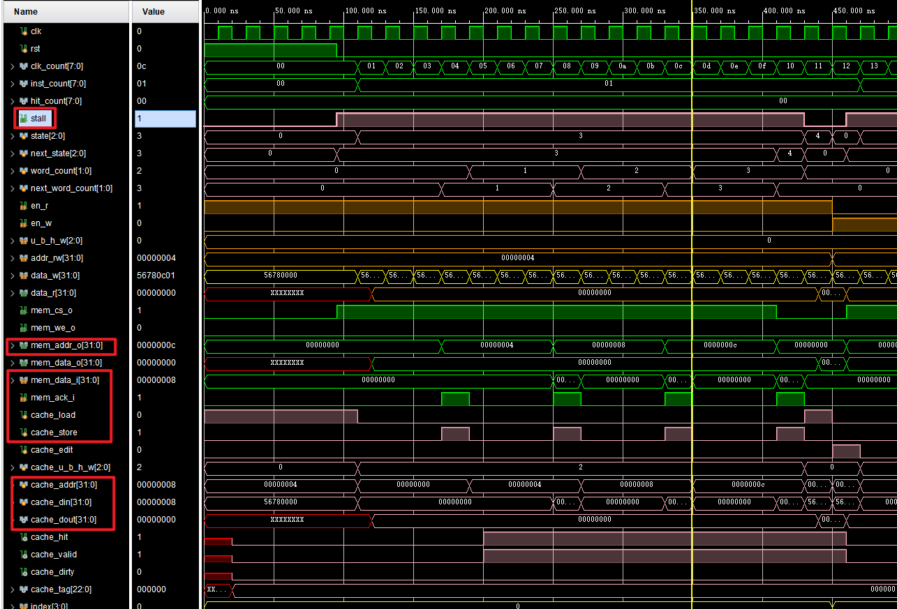

miss时，首先我们可以看到`stall`信号拉高，整个cache写入和最后读取数据期间（17周期）CPU停摆；而mem交互使能信号cs在S_FILL状态下（16周期）拉高。

内存地址每4个周期变一次，可以看出都是相同块内的地址。而ack信号和store信号每4个周期拉高一次，将输入的数据写入cache。

在最后一个S_WAIT状态的周期，cache的load信号置1，此时真正进行读取数据操作供给CPU。

其余的，我们可以看到当我们写入该块第一个字之后，cache的hit和valid信号就置1了，说明cache中存在块数据了，当然，在S_FILL状态下这两个信号是无用的。

***write miss***

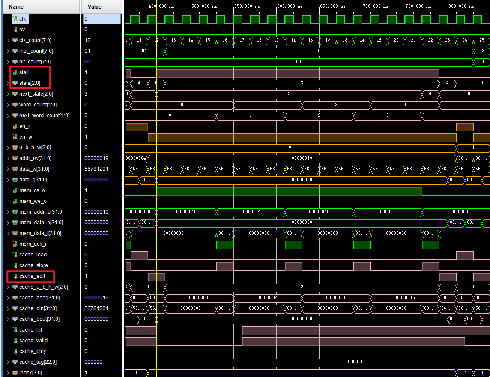

在miss后的空闲写入以及干净情况下的替换与read 的miss是差不多的，不多赘述。

我们看到第二条指令执行写操作时，cache的edit信号拉高，而当时钟下降沿到来试图写cache时，发现miss，此时stall信号再次生效。

又是在需要的块全部写入cache后，edit再次置1。进行cache的写操作。

***read write hit*** 

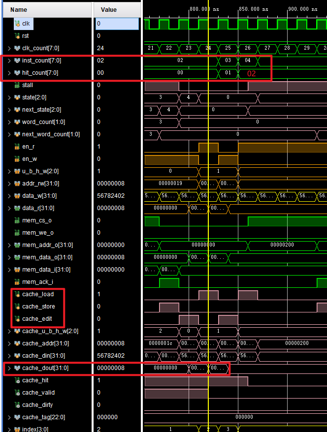

通过debug信号`inst_count 和 hit_count`我们可以清楚看出，第3，4条指令在命中情况下仅消耗一个周期完成了数据读写。

另外，同样的可以看出cache的时钟与CMU及CPU时钟为反相，或者说延迟半个周期进行操作。

***脏块的read miss 替换***

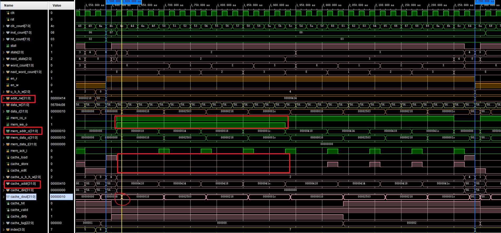

干净块的替换已经说了和read miss空闲相同，重点看脏块在`S_PRE_BACK , S_BACK`状态下的信号值。

可以看到，经过`S_PRE_BACK`状态的读数据，cache的读取数据才变为正确的写回数据。如果没有这个周期，势必使电路逻辑混乱（考虑到实验毕竟不是真实，结构简单，其实去掉这个状态对于仿真可能也会写入正确数据，只是在第一次写回数据过程中，数据会变化，但是考虑到时序，真实的电路就不一定得到正确结果）

整个`S_BACK`状态，cache相关操作信号全部置0，而mem的写信号拉高。

另外可以看到在写回mem阶段，CPU输入地址，mem访问地址，cache访问的地址分别为不同的值。

### 完整CPU仿真

cache内部仿真细节在模块仿真中可见，本节将cache放于完整cpu中看其时序是否正确

总体

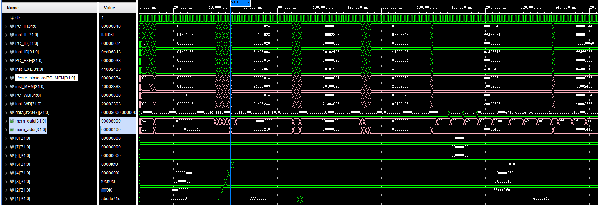

对于所有指令执行整体，可以看出对于miss以及需要替换的阶段，确实存在stall使整个cpu停摆用于取数据。


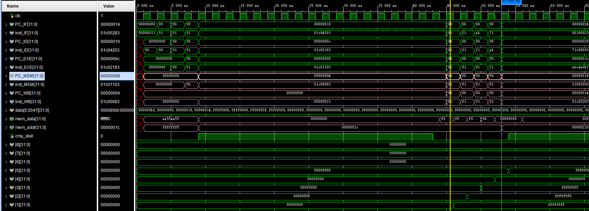

对于无需写回的stall，以第二条指令为例，可以数出其停摆18个周期，与理论相符，同时`cmu_stall`信号拉高。

而其后的指令，由于命中，只花费1个周期


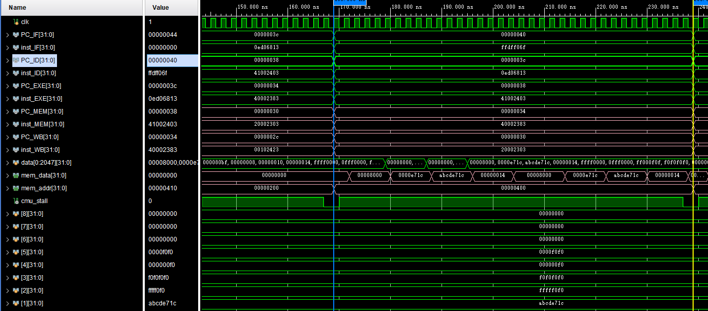

对于需要写回的指令（第14条指令）可以数出其正好需要35个周期，符合理论。

### 上板验证

上板没有特殊现象，难以验证，不逐个周期截图验证，截取部分数据。

第二条指令`lb x1,0x01C(x0)`，根据参考资料，读出的数据为`0xFFFFFFF0`.(内存访问在mem阶段，此时wb阶段为第一条指令)

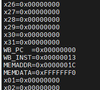

在第二条指令写回后，x1寄存器的值改变了。（在写回阶段x1寄存器依旧为0）

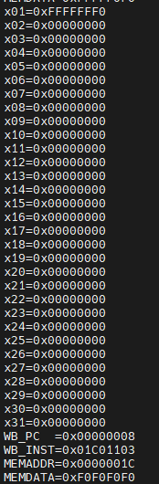

然后对于之后指令，命中情况下只执行一个周期并正确写入数据

第三条指令地址0x00000008 指令`lh x2, 0x02c(x0)`,读取0xFFF0F0写入x2。

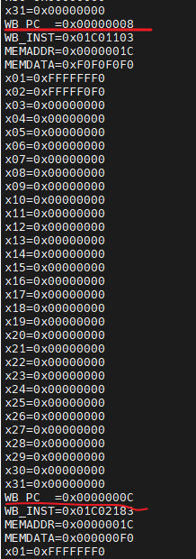

然后通过单步调试我们可以数出miss时确实经过了18个周期来进行cache的准备和数据读写再进入下一阶段。


## 4 思考题

> 1. 在实验报告分别展示缓存命中、不命中的波形，分析时延差异
>
>  见实验结果分析。
>
> 
>
> 2. 在本次实验中，cache 采取的是 2 路组相联，在实现 LRU 替换的时候，每一个 set 需要用多少 bit 来用于真正的 LRU 替换实现？
>
> 需要1个bit用于LRU替换实现。二路组相联，每组只有两个数据块，每次只需保留一个块，按照LRU算法，我们记录上一次访问的数据块即可。
>
> 
>
> 3. 如果要实现 cache 的 4 路组相联，请描述一种真 LRU 和一种 Pseudo-LRU 的实现方式，并给出实现过程中每一个 set 需要用到多少 bit 来实现 LRU。关于 Pseudo-LRU，实现方式可以在网上查阅。
>
> **真LRU**: 每个set使用8bits，set中每组使用2bits作为计数器。
>
> 1. 计数值越小说明最近被使用，越大说明越久未使用，当组中无空闲块时，替换计数器值最大的。
>
> 2. 命中时，被访问块计数器置0，比其原计数值小的计数器都加1，其余不变
> 3. 未命中时且组中有空闲块，新增加的块置0，其余块都加1。
> 4. 未命中且无空闲块时，计数器值最大即为3的块被替换，同时计数器置0，其余块的计数器加1.
>
> **Pseudo-LRU：**每个set使用3bits，通过寄存器模拟树指向近似最少使用的块。
>
> 1. LRU寄存器中每个位指明了最少访问块（即替换的块）的位置，0向左访问，1向右访问。（基于数组模拟的树，对于任意节点索引n，索引2n+1是其左儿子，2n+2是其右儿子）。
> 2. 无论命中还是未命中进行替换，对于访问对应块的路径，从根节点开始将各节点指向另一边。
> 3. 有空闲块时同样将访问对应位置的树路径各节点指向另一儿子。
> 4. 对于修改指向，通过示意图可以看出，对于组中各块，其组内索引从高到低就是从根节点开始的访问方式，我们只需要通过该索引位依次访问节点并将节点值置为其反相。例如，访问 01 号块，从根节点和组内索引最高位[1]开始，0所以下一步访问左儿子1号节点即`LRU[1]`，同时`LRU[0] = 1`；组内索引下一位为1，此时已经可以访问到块了，无需关心下一节点，但是`LRU[1] = 0`。
>
> 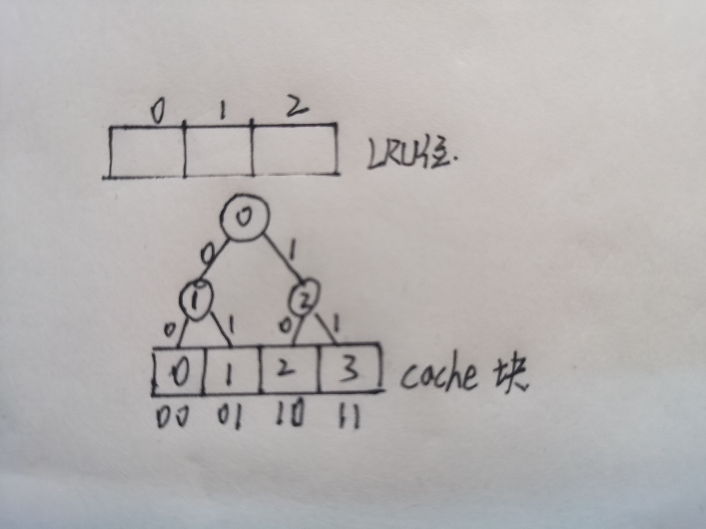

## 5 心得体会

本次实验由于给出了大部分代码框架，写代码并不算困难，但可能由于cache理解不到位，在对框架进行分析时花了非常多的时间才彻底理解其运行原理，不过收获也很大，算是对cache有了比较深入的理解，同时也深感硬件的深奥。

