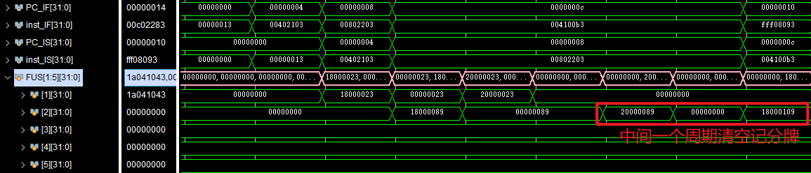

# 实验5 - 记分牌算法乱序流水线CPU

## 实验目标

* 理解记分牌算法
* 理解处理器的乱序执行
* 实现多周期乱序执行的流水线CPU

## 实验过程

本次实验我们要实现五阶段乱序流水线，分为`IF,IS,RO,EX,WB`五阶段，主要对`CtrlUnit.v`模块进行补充修改，“记分牌”也在该模块中集成。

```verilog
reg[31:0] FUS[1:5]; // 记分牌，实际上只使用了[29:0]
reg[31:0] IMM[1:5]; // 立即数记录
reg[2:0] RRS[0:31]; // 寄存器状态，标记将被哪个部件写入
reg[31:0] PCR[1:5]; // 即记录各指令的PC，用于可能的计算
```

接下来将分阶段对`CtrlUnit.v`模块中的信号进行介绍

### IF，IS阶段

这两个阶段主要和`stall, flush`控制有关，可以放在一起讨论。

`stall`情况主要是三种：结构冲突（即所需部件被占用），WRW数据冲突以及跳转指令相关控制冲突

```verilog
//冲突检测涉及两个信号，一个组合逻辑检测结构冲突及WAW，另一个时序逻辑阻塞跳转指令后的指令发射直至跳转指令确认结果。
assign normal_stall = (use_FU != `FU_BLANK && FUS[use_FU][`BUSY]) | (|RRS[dst]);
//检查等待发射的指令所需部件use_FU是否被占用
//检查等待发射的指令所写的寄存器状态RRS 是否会被已执行指令写(是否为0)

always @ (posedge clk or posedge rst) begin
    if (rst) begin
        ctrl_stall <= 0;
    end
    else begin
        // IS
        if (RO_en & (use_FU == `FU_JUMP)) begin
            ctrl_stall <= 1; //跳转指令(FU_JUMP)进行读取操作数准备执行(RO_en)，产生stall
        end
        else if (JUMP_done) begin
            ctrl_stall <= 0; //跳转指令执行结束，stall结束
        end
    end
end
```

结构冲突和WRW冲突只需简单控制stall信号即可，但是控制冲突还涉及`flush`问题，跳转情况下需要将原本已经进入流水线的后续无关指令清除。就涉及到了较复杂的使能信号控制。

```verilog
// CtrlUnit.v
assign IS_en = IS_flush | ~normal_stall & ~ctrl_stall; // is，if阶段使能，跳转flush情况下需要使能重新取指令

always @ (posedge clk or posedge rst) begin
    if (rst) begin
        IS_flush <= 0;
    end
    else if (JUMP_done & is_jump) begin
        IS_flush <= 1; // 准备跳转，flush置1
    end
    else begin
        IS_flush <= 0; //其余情况置0
    end
end

// RV32core.v
assign PC_EN_IF = IS_EN | FU_jump_finish & is_jump_FU; //IF阶段取指令使能
// 可以看到后一个表达式和IS_flush的拉高条件其实是相同的，但是这并不是冗余，其实控制的是不同阶段的flush。
//IS_flush由于采用时序逻辑置位，会延后一个周期生效。也就是说，当跳转指令完成的下一个周期，两个信号可以使IF阶段重新取指令，但是其实IS阶段还未flush，所以再一个周期IS_flush可以控制IF阶段的指令进入IS阶段并且IF阶段再次取指令，这样就完成了所有两阶段flush。
```


另外，在指令顺利执行的情况下，IS阶段还进行了记分牌的指令相关记录。

```verilog
assign RO_en = ~IS_flush & ~normal_stall & ~ctrl_stall;
//在不存在stall和flush的情况下，可以准备发射进入读取操作数的阶段。

if (RO_en) begin //时序逻辑内
    // not busy, no WAW, write info to FUS and RRS
    if (|dst) RRS[dst] <= use_FU;
    FUS[use_FU][`BUSY] <= 1'b1;
    FUS[use_FU][`OP_H:`OP_L] <= op;
    FUS[use_FU][`DST_H:`DST_L] <= dst;
    FUS[use_FU][`SRC1_H:`SRC1_L] <= src1;
    FUS[use_FU][`SRC2_H:`SRC2_L] <= src2;
    FUS[use_FU][`FU1_H:`FU1_L] <= fu1;
    FUS[use_FU][`FU2_H:`FU2_L] <= fu2;
    FUS[use_FU][`RDY1] <= rdy1;
    FUS[use_FU][`RDY2] <= rdy2;
    FUS[use_FU][`FU_DONE] <= 1'b0;
    
    IMM[use_FU] <= imm;
    PCR[use_FU] <= PC;
end
```

### RO 阶段

本阶段主要进行操作数的读取，检测RAW冲突。具体分为两部分：记分牌的相关位清零(两组Q以及R信号)

```verilog
// 当两个操作数都已经准备好时，我们才准备读取数据执行，此处将记分牌信号位清零
if (FUS[`FU_JUMP][`RDY1] & FUS[`FU_JUMP][`RDY2]) begin
    // JUMP
    FUS[`FU_JUMP][`RDY1] <= 1'b0;
    FUS[`FU_JUMP][`RDY2] <= 1'b0;
    FUS[`FU_JUMP][`FU1_H:`FU1_L] <= 3'b0;
    FUS[`FU_JUMP][`FU2_H:`FU2_L] <= 3'b0;
end
...//其余指令类型修改 `FU_JUMP 信号即可
```


```verilog
// 寄存器读取地址以及Ex阶段的相关控制信号设置
 always @ (*) begin
    ALU_en = 0;// 先将所有信号清零，后续针对指令类型单独设置需要的信号
    MEM_en = 0;
    MUL_en = 0;
    DIV_en = 0;
    JUMP_en = 0;
    rs1_ctrl = 0;
    rs2_ctrl = 0;
    PC_ctrl = 0;
    imm_ctrl = 0;
    JUMP_op = 0;
    ALU_op = 0;
    ALU_use_PC = 0;
    ALU_use_imm = 0;
    MEM_we = 0;
    MEM_bhw = 0;
    MUL_op = 0;
    DIV_op = 0;
    // JUMP
    if (FUS[`FU_JUMP][`RDY1] & FUS[`FU_JUMP][`RDY2]) begin
        ALU_en = 1'b0;
        MEM_en = 1'b0;
        MUL_en = 1'b0;
        DIV_en = 1'b0;
        JUMP_en = 1'b1;
        JUMP_op = FUS[`FU_JUMP][`OP_H:`OP_L];
        rs1_ctrl = FUS[`FU_JUMP][`SRC1_H:`SRC1_L];
        rs2_ctrl = FUS[`FU_JUMP][`SRC2_H:`SRC2_L];
        PC_ctrl = PCR[`FU_JUMP];
        imm_ctrl = IMM[`FU_JUMP];
    end
......// 对各类型指令需要的信号进行逐一设置，其余信号保持0即可。
end
```

### EX阶段

本阶段主要是各个部件的执行，和`CtrlUnit.v`模块的交互在于执行结束的`finish`信号需要写入记分牌用于WB阶段。

```verilog
FUS[`FU_ALU][`FU_DONE]  <=  FUS[`FU_ALU][`FU_DONE] | ALU_done; 
FUS[`FU_MEM][`FU_DONE]  <=  FUS[`FU_MEM][`FU_DONE] | MEM_done; 
FUS[`FU_MUL][`FU_DONE]  <=  FUS[`FU_MUL][`FU_DONE] | MUL_done;
FUS[`FU_DIV][`FU_DONE]  <=  FUS[`FU_DIV][`FU_DONE] | DIV_done;
FUS[`FU_JUMP][`FU_DONE] <=  FUS[`FU_JUMP][`FU_DONE] | JUMP_done;
```

注意记分牌的结束记录`FU_DONE`不能单纯靠从外部部件传入的`down`信号，因为`down`信号仅在结束的哪个周期拉高一次，但如果存在多个部件同时完成了指令执行，显然就无法在一个周期内写回，那么仅靠`down`信号就会导致未写回的指令彻底卡在EX阶段。因此还需要将记分牌本身的`FU_DONE`信号传给自身，使未写回的指令保持`down`的状态。至于`FU_DONE`信号的清零，可以在WB阶段写回寄存器后控制进行。

### WB阶段

写回阶段也是记分牌的设置以及外部写寄存器信号的控制，其中记分牌设置包括自身的信号清零（解除该指令对记分牌对应行的占用）以及其余和结果相关的信号（`Ri`,` Rj`）置位。

```verilog
// 对于WAR的检测，即检查其余部件的源寄存器是否是自己的目的寄存器或者要么该寄存器可以被覆盖。
// 注意R信号和Q信号配合可以有三种含义，R为1仅说明数据准备好了，但是并未读取，正是这种情况下要防止覆盖
//而当R信号为0时，Q为0说明已经读取数据并开始执行了，可以覆盖；Q不为0说明正需要该部件提供的数据(WAW已在IS阶段被阻塞，说明一个寄存器只会有一个部件写入)
wire ALU_WAR = (// 这是使能信号不是stall信号
(FUS[`FU_MEM][`SRC1_H:`SRC1_L] !=FUS[`FU_ALU][`DST_H:`DST_L] | ~FUS[`FU_MEM][`RDY1]  )&
(FUS[`FU_MEM][`SRC2_H:`SRC2_L] !=FUS[`FU_ALU][`DST_H:`DST_L] | ~FUS[`FU_MEM][`RDY2]  )&
(FUS[`FU_MUL][`SRC1_H:`SRC1_L] !=FUS[`FU_ALU][`DST_H:`DST_L] | ~FUS[`FU_MUL][`RDY1]  )&
(FUS[`FU_MUL][`SRC2_H:`SRC2_L] !=FUS[`FU_ALU][`DST_H:`DST_L] | ~FUS[`FU_MUL][`RDY2]  )&
(FUS[`FU_DIV][`SRC1_H:`SRC1_L] !=FUS[`FU_ALU][`DST_H:`DST_L] | ~FUS[`FU_DIV][`RDY1]  )&
(FUS[`FU_DIV][`SRC2_H:`SRC2_L] !=FUS[`FU_ALU][`DST_H:`DST_L] | ~FUS[`FU_DIV][`RDY2]  )&
(FUS[`FU_JUMP][`SRC1_H:`SRC1_L]!=FUS[`FU_ALU][`DST_H:`DST_L] | ~FUS[`FU_JUMP][`RDY1] )&
(FUS[`FU_JUMP][`SRC2_H:`SRC2_L]!=FUS[`FU_ALU][`DST_H:`DST_L] | ~FUS[`FU_JUMP][`RDY2] ) 
);
```

```verilog
// 记分牌修改
if (FUS[`FU_JUMP][`FU_DONE] & JUMP_WAR) begin
    // 写回后，积分牌和寄存器状态全部置零。
    FUS[`FU_JUMP] <= 32'b0;
    RRS[FUS[`FU_JUMP][`DST_H:`DST_L]] <= 3'b0;
    // ensure RAW 
    // 写回后其余处于RO阶段等待数据准备的指令就可以继续执行了，数据准备位拉高。
    if (FUS[`FU_ALU][`FU1_H:`FU1_L] == `FU_JUMP) FUS[`FU_ALU][`RDY1] <= 1'b1;
    if (FUS[`FU_MEM][`FU1_H:`FU1_L] == `FU_JUMP) FUS[`FU_MEM][`RDY1] <= 1'b1;
    if (FUS[`FU_MUL][`FU1_H:`FU1_L] == `FU_JUMP) FUS[`FU_MUL][`RDY1] <= 1'b1;
    if (FUS[`FU_DIV][`FU1_H:`FU1_L] == `FU_JUMP) FUS[`FU_DIV][`RDY1] <= 1'b1;
    if (FUS[`FU_ALU][`FU2_H:`FU2_L] == `FU_JUMP) FUS[`FU_ALU][`RDY2] <= 1'b1;
    if (FUS[`FU_MEM][`FU2_H:`FU2_L] == `FU_JUMP) FUS[`FU_MEM][`RDY2] <= 1'b1;
    if (FUS[`FU_MUL][`FU2_H:`FU2_L] == `FU_JUMP) FUS[`FU_MUL][`RDY2] <= 1'b1;
    if (FUS[`FU_DIV][`FU2_H:`FU2_L] == `FU_JUMP) FUS[`FU_DIV][`RDY2] <= 1'b1;
end
else if(...)
    ...

// 寄存器写回信号控制
always @ (*) begin
    write_sel = 0;
    reg_write = 0;
    rd_ctrl = 0;
    if (FUS[`FU_JUMP][`FU_DONE] & JUMP_WAR) begin
        write_sel = 3'd4; // 5个部件控制哪一个的结果要写回
        reg_write = 1'b1; // 寄存器写使能信号
        rd_ctrl = FUS[`FU_JUMP][`DST_H:`DST_L]; // 目的寄存器地址
    end
    else if()
    ......
end

```

WB阶段实际有两个周期，我们在EX阶段描述的逻辑实际上也是WB阶段发生的信号改变，由于使用的是非阻塞逻辑，所以在同一个`always`块的记分牌修改逻辑无法在上升沿即时感知到执行结束信号`BUSY`，需要再等一个周期。而寄存器的写控制信号不在一个`always`块，可以感知到结束信号，因此当前周期即可置位写入。这也是必须的，由于寄存器写控制信号实际是组合逻辑，所以必须保证其在一个周期内稳定，所以相关判断的记分牌信号不能变，即记分牌的修改要延后一个周期。

>EX段逻辑修改为阻塞，可以发现仿真stall的周期少了一个。但其实我们看寄存器的写控制信号和相关寄存器的改变，是不稳定的，仅在某些未知情况下可以正常写入寄存器。
>
>```verilog
>FUS[`FU_ALU][`FU_DONE]  =  FUS[`FU_ALU][`FU_DONE] | ALU_done; 
>FUS[`FU_MEM][`FU_DONE]  =  FUS[`FU_MEM][`FU_DONE] | MEM_done; 
>FUS[`FU_MUL][`FU_DONE]  =  FUS[`FU_MUL][`FU_DONE] | MUL_done;
>FUS[`FU_DIV][`FU_DONE]  =  FUS[`FU_DIV][`FU_DONE] | DIV_done;
>FUS[`FU_JUMP][`FU_DONE] =  FUS[`FU_JUMP][`FU_DONE] | JUMP_done;
>```
>
>

注意到WB以及RO阶段对记分牌以及外部信号的控制都是`if ... else  ... `逻辑，体现了一个周期只能完成一条指令的数据读取或写回。


## 实验结果


### 仿真分析(图片可放大清晰查看)

**1**


上图显示第一处**结构冲突**

```
0x4(地址)     lw x2,4(x0)
0x8     	 lw x4,8(x0)
```

可以看见0x4处`lw`指令发射后便检出结构冲突，`normal_stall`拉高，此时`IS_en, RO_en, PC_EN_IF`使能信号全部处于低位，阻止后面的`lw`指令发射，防止未发射指令被`flush`。

0x4 经过两个周期执行结束发出`finish`信号后又经过两个周期进行写回寄存器和解除记分牌占位后，后面的`lw`指令才发射。

此处可以看出，虽然划分为5阶段，除了Ex阶段需要不等的周期数，WB阶段实际也可视为2周期，因为只有在确认结果写回寄存器后才能清空记分牌对应行，总共两件事两个周期，如果下一条指令不使用同一部件自然不影响，但是如果使用同一部件则需要多一个周期清空记分牌。




**2**


```
0x8     lw x4,8(x0)
0xC     add x11,x2,x4
0x10    addi x1,x1,-1
```

这三条指令实际上显示了两处三种冲突，0x8和0xC之间存在**RAW**（0x4其实也和0xC存在，但是由于它本身和0x8的结构冲突，实际上不影响）而0xC 和0x10之间存在**WAW**，由于两指令都使用ALU部件，实际还存在**结构冲突**。

对于RAW冲突，可以看到，并不影响0xC指令顺利发射，只是停留在RO阶段等待数据。在MEM部件发出`finish`信号后第二个周期，，0xC指令就顺利读数执行。

由于WAW与结构冲突重合其处理就和第**1**项相似了，不赘述。


0x14~0x1C都是`load`类型指令导致结构冲突，省略

**3**


```
0x1C    lw x7,20(x0)
0x20	sub x1,x4,x2
0x24	addi x1,x10, -3
```

此处主要是看0x1C 和0x20同时执行完毕的写回情况。后两条指令的WAW和结构冲突略。

可以看见MEM和ALU部件同时发出`finish`信号，然后两部件对应的记分牌对应位拉高表示准备写回。然后先写回ALU的结果，再是MEM的结果，也相当于一次乱序执行吧。而MEM对应的记分牌在ALU写回时保持不变，对应了在介绍Ex阶段时所说的，不能用单一外部信号控制记分牌结束信号。


**4**


```
0x28	beq x4,x5,label0
0x2C 	beq x4,x4,label0
```

此处主要是两条跳转指令的情况。为了指令的一致性，方便信号管理，本实验中将b型指令转化为了写x0寄存器。

在一条跳转指令发射后，后续指令都停止发射，直到跳转结果确认。

可以看到在0x28执行时，除了`ctrl_stall`拉高了外，`normal_stall`也因为结构冲突拉高了（基于本实验设计还存在WAW，可以通过对x0的特殊判断消除），而不跳转的情况下`IS_en, RO_en`共同拉高拉低，控制后续指令发射。

在跳转情况下，部件的`finish`信号和`is_jump`信号可以提前拉高`PC_EN_IF`信号，覆盖IF阶段指令，然后`IS_en`拉高，覆盖IS阶段指令，然后就可以拉高`RO_en`进行指令发射了。

**5**


```
0x54	div x8, x7, x2
0x58	mul x9, x4, x5
0x5C	mul x9, x8, x2
0x60 	addi x2, x0, 4
0x64    jalr x1, 0(x0)
```

`div`指令Ex阶段约36周期，`mul`指令约7周期。此处看长指令带来的影响。

0x54 和0x58无冲突，相继发射并执行，但下一条乘法指令同时有RAW,WAW以及结构冲突，直到0x58执行结束并写回后才发射，但是由于和0x54之间存在的RAW也无法读取数据执行。

后续两条指令都顺利发射并执行。但是0x60存在WAR冲突，即使执行完成也不能写回寄存器，可以看见寄存器的写使能信号依旧低位；而0x64处跳转指令顺利执行结束，但是由于0x60迟迟无法写回，一直占用记分牌，第二轮的指令也无法发射，CPU一直处于stall状态。


几十个周期后，直到div指令结束并写回，然后0x5C读取数据执行，0x60写回自己的结果，CPU解除stall。


### 上板结果

上板主要检查时序是否正确，能否正常运行，在验收视频中介绍。


时钟计数0x61时，第一轮最后一个乘法指令执行完成，写回后第0x52个周期我们可以看到结果（`x9 = 0FFF 0000`），此时下x2寄存器已经是第二轮指令的执行结果。


## 思考题

1. Why doesn’t scoreboard use forwarding?

>对于使用相同部件的指令，必然有结构冲突stall，forwarding无效。
>
>即使不使用相同部件，我们还要考虑乱序执行下，本周期RO的指令是否需要该forwarding，更重要的是，双操作数且都缺失的指令仅靠一次forwarding仍无法执行等各种情况。
>
>强行添加forwarding反而会扰乱记分牌本身的秩序。

2. If we use a branch predictor, can we just let the CPU execute the predicted instructions? What if the prediction is wrong?

>不能，B型指令没关系，但是`jal`以及`jalr`是会写寄存器的，直接执行万一预测错误就导致了错误的结果。而且不阻塞的情况下后续指令也会发射执行，也会导致错误结果。
>
>因此我们需要引入对寄存器的恢复机制，即存储预测跳转指令时的1寄存器状态，在预测错误的情况下将存储的寄存器状态进行恢复。
>
>当然还有内存的状态，显然无法全部存储，那就暂时停止？

3. Point out where the out-of-order occurs based on simulation waveform.

>```
>0x54	div x8, x7, x2
>0x58	mul x9, x4, x5
>0x5C	mul x9, x8, x2
>0x60 	addi x2, x0, 4
>0x64    jalr x1, 0(x0)
>```
>
>
>
>1. 0x58 比0x54后执行，但是先结束并写回寄存器
>2. 0x5C, 0x60, 0x64相继发射，但是0x5C由于RAW冲突无法执行，后两条指令率先执行完成；
>3. 0x60 虽然执行完成但由于WAR冲突无法写回结果，只能0x64先写结果。
>
>

4. Analyze the pros and cons of scoreboard.

>记分牌算法优点自然是乱序执行，使指令执行的时间重叠部分增大，提高执行效率。实现也较为简单。
>
>但是记分牌算法在WAR和WAW情况下只能stall，效率提升有限；而且同类型指令等待队列有限，对于已经有同类型指令执行情况下，后续指令都无法发射；最后，记分牌算法还会导致数据写回的顺序打乱，即特殊情况下执行结果可能和预期存在差别，对异常恢复和程序调试不太友好。
>
>


## 心得体会

本次实验帮助我对乱序流水线CPU有了一个认识，同时补充代码调试的过程中对记分牌算法也更加熟悉，了解了其各种信号的作用和使用方法。

另外，在补充代码过程中，对于硬件时序控制的理解也逐渐加深。从最初不太理解WB阶段的两周期到现在基本理解其运作原理，虽然还没完整了解为什么阻塞情况下还有可以写入的指令，但是还是增长了不少见识，为这种精妙的设计感到吃惊，要是自己设计，估计会添加相当复杂的控制逻辑罢。


