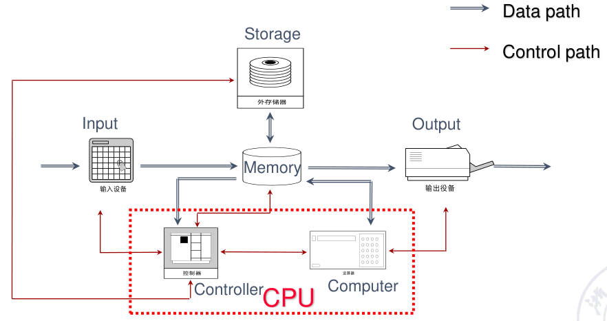
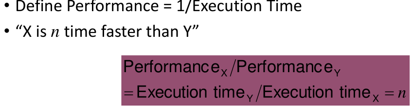
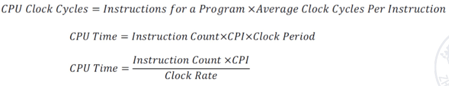
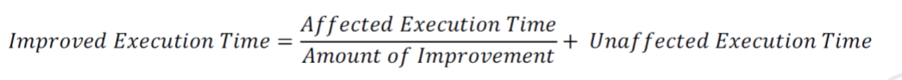

# 量化设计和分析基础

* 冯诺伊曼架构
  * 
* ISA（instruction set architecture ）的七个维度
  * Class of ISA（指令集分类）
  * Memory addressing（内存寻址）
  * Addressing modes（寻址模式？）
  * Types and sizes of operands（操作数的类型和大小）
  * Operations（操作）
  * Control flow instructions（控制流指令）
  * Encoding an ISA（指令集编码）

* 计算机体系结构包括指令集（ISA），系统组织结构，硬件

* 三堵墙
  * ILP Wall(指令级并行)
  * Memory Wall（存储）
  * Power Wall（功耗）
* 新的性能提升
  * 数据并行 Data-level parallelism (DLP)
  * 线程并行 Thread-level parallelism (TLP)
  * 请求并行 Request-level parallelism (RLP)
* 应用程序主要有两种并行：数据并行，任务并行
* 计算机种类
  * 桌面计算，个人计算机
    * 通用设计，多种软件
    * 多为第三方软件
    * 较低成本为单个用户提供较好的性能
  * 服务器
    * 对一些特定应用的强大性能
    * 同时服务多个用户的可靠性
    * 比个人计算机更好的计算，存储，网络能力
  * 嵌入式
  * 个人移动设备
  * 超级计算机
* 按指令和数据分类
  * 单指令单数据
  * 单指令多数据（SIMD）
  * 多指令单数据
  * 多指令多数据
* moore Law摩尔定律：
* 性能
  * 算法：执行操作的个数
  * 语言，编译，架构：每个操作的指令数
  * 处理器和内存：指令的执行速度
  * IO系统：IO操作的执行速度
* 计算机性能
  * 响应时间（任务从发起到完成的用时）和吞吐量（一定时间内的完成任务数）：
  * 
* 执行时间
  * 运行的总时间
    * 衡量系统的性能
    * 包括全部响应时间，计算，输入输出，系统开销，空转时间
  * CPU时间
    * 用于计算所给任务的时间，除去输入输出和其余任务共享的
    * 包括用户的开销和系统开销
    * User CPU time : CPU time spent in the program itself
    * System CPU time: CPU time spent in the OS, performing tasks on behalf of the program.
* 精简指令集和复杂指令集

## 8个体系设计的伟大思想

1. 遵循摩尔定律进行设计
2. 利用抽象进行简单设计
3. 使常见的情况快一点
4. 通过并行提升性能
5. 通过流水线提升性能
6. 通过预测提升性能
7. 构建存储的层次结构
8. 通过冗余设计提升可靠性

## 计算

### 功率和能耗计算

动态能耗：主要是晶体管开关时候的能耗

Power dynamic = ½ *Capacitive load * Voltage2 * Frequency switched（$1/2 * 容性负载*电压^2 * 开关频率$）

单次转换能耗Energy dynamic = 1/2 * Capacitive load * Voltage2（1/2可能要可能不要？） 

静态功率 = 电流 * 电压

### 可信任度 MTTF 计算

MTTF: Mean Time To Failure 

MTTR: Mean Time To Repair (service interruption)

FIT: Failure In Time = 1/MTTF

MTBF: Mean Time Between Failure = MTTF+MTTR

模块的可靠性
$$
MTTF/(MTTF+MTTR) = MTTF/MTBF
$$
模块故障率 $failure rate = 1/MTTF$

计算拥有多个模块的系统MTTF(计算各模块的故障率相加再取倒数，即MTTF倒数相加取倒数)

### CPU time计算

$CPU Time = CPU clock cycles * clock Period = CPU Clock Cycles / Clock Rate$

CPI 加权计算

### Amdahl's Law

[Availability](http://en.wikipedia.org/wiki/Availability)(可用性) - readiness for correct service 

[Reliability](http://en.wikipedia.org/wiki/Reliability_engineering)(可靠性) - continuity of correct service 

[Safety](http://en.wikipedia.org/wiki/Safety)(平安性?) - absence of catastrophic consequences on the user(s) and the environment 

[Integrity](http://en.wikipedia.org/wiki/Integrity)(完整性) - absence of improper system alteration

[Maintainability](http://en.wikipedia.org/wiki/Maintainability)(可维护性) - ability to undergo modifications and repairs 

[Confidentiality](http://en.wikipedia.org/wiki/Confidentiality)(机密性), *the absence of unauthorized disclosure of information*

Security(安全保障) is a composite of [Confidentiality](http://en.wikipedia.org/wiki/Confidentiality), [Integrity](http://en.wikipedia.org/wiki/Integrity), and [Availability](http://en.wikipedia.org/wiki/Availability). 