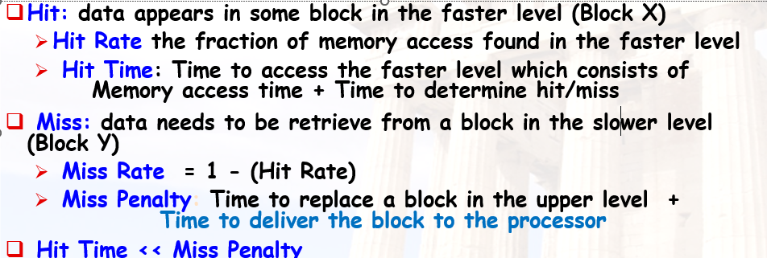
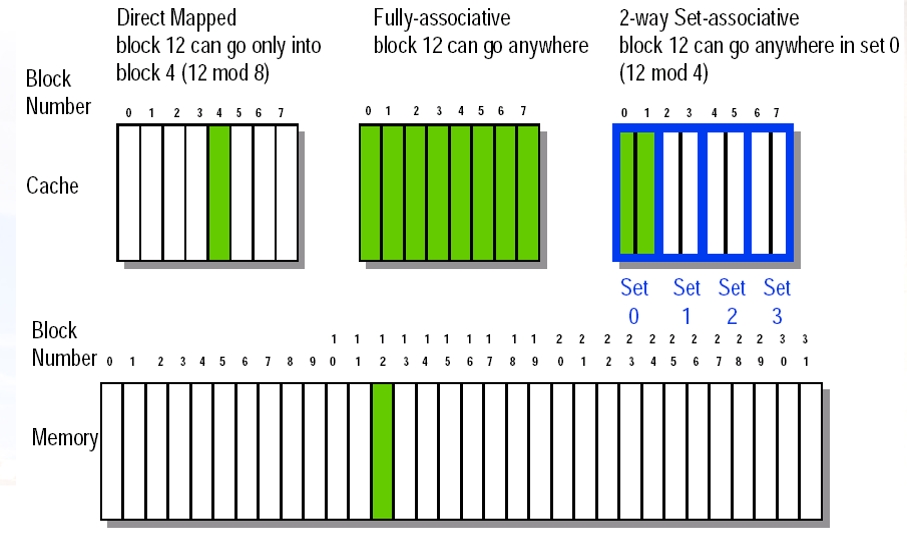
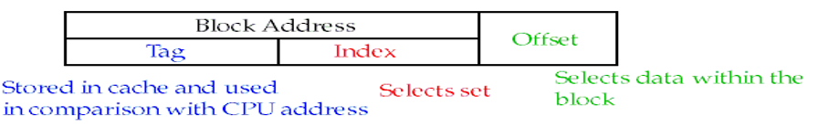
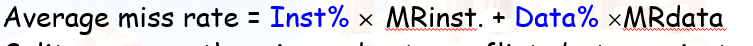
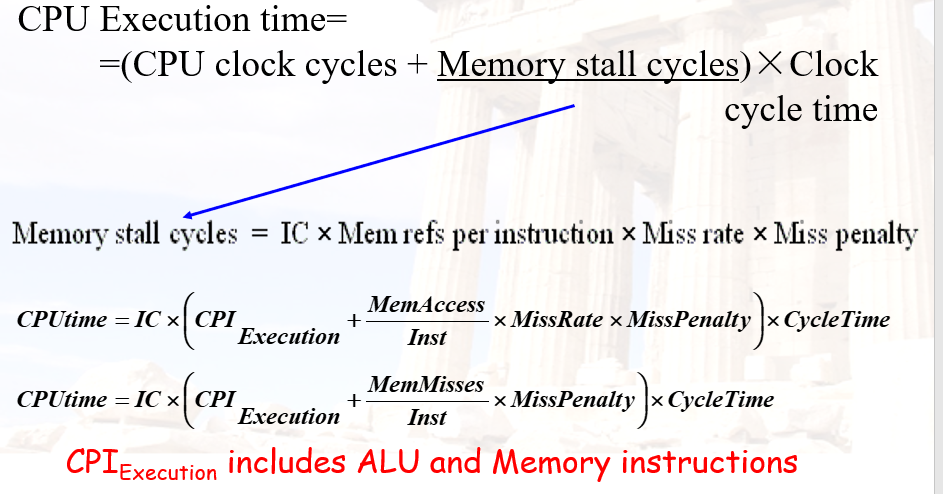
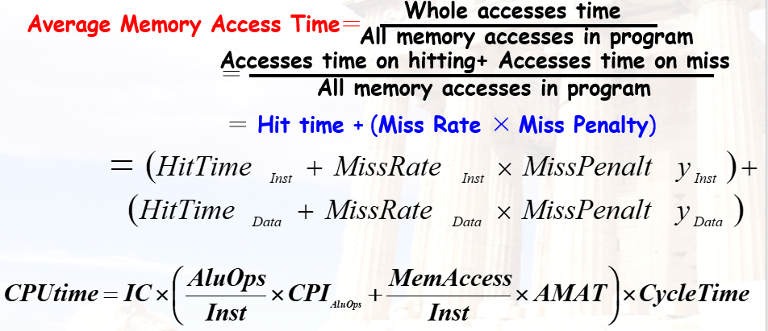
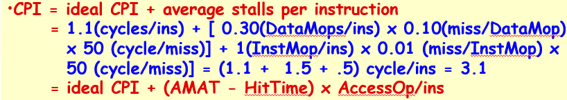

* 寄存器 缓存 主存 外存
* RAM
  * DRAM 高密度低能耗 便宜 慢；需要隔一段时间进行刷新
  * SRAM 低密度 高能耗 贵 快；数据可以持续保存除非断电
* 内存层次结构
  * make the common case fast ! 使用了局部性原理
* 不同考虑
  * 个人电脑：考虑内存的平均时延
  * 服务器：考虑内存带宽
  * 嵌入式电脑：实时应用，考虑最坏情况下的性能，考虑到功耗不使用硬件优化，简单系统，不进行内存保护
* 缓存命中和缺失
  * 

* 缓存四问
  * *(Block placement)*
  *  *(Block identification)*
  * *(Block replacement)*
  * *(Write strategy)*
* 映射
  * 直接映射：所有块对应cache中的唯一位置
  * 全相联：所有块可以存储在cache中的任意位置
  * 组相联：即内存块和一组cache块对应，可以存放在组中任意位置（上面两个是特殊分组）
  * 将内存块的索引号除余cache组数即可得到组的索引号
  * 

### 计算cache的表项

* 索引即cache中的组号，有隐性的编号，不用存储；（组的数量的二进制bits）
* tag即区分相同索引的不同内存块，存储在cache中
* 偏移量是块内的数据访问索引，此时我们考虑整个块，因此不用看该部分

* 替换策略
  * 随机替换
  * LRU:最近最远使用的块进行替换
  * FIFO：替换最先进入的块（重复访问不会刷新）
* 写策略
  * **write-through :**同时写cache和主存，实现较简单
  * **write-back:**只写cache，在替换时写回主存（需要增加dirty标志位）
  * **Write stall** ：即CPU为了等待写数据而停止
  * **Write buffers**：暂时存储部分等待写入内存的数据，防止stall，用于w-B策略
* miss情况下写cache策略
  * **Write allocate** :将数据加载进cache再写
  * **Write around (no write allocate)** ：直接写入内存，

In general, write-back caches use write-allocate , and write-through caches use write-around .

* Split vs. unified caches 

  * 即是否将指令缓存和数据缓存分离
  * 统一：更少的硬件，但是命中率较低
  * 分离：

  *  Average miss rate = Inst% **´** MRinst. + Data% ´MRdata

## cache优化

* 
* 注意本身取指令就需要访存一次，因此计算方寸次数是指令数再加上LS指令的数目

* 组相联cache可能提示mux导致的周期时间拉长；同样out of order处理器因为PC寄存器需要mux也要拉长
* 重叠的miss penalty 用原来的乘以重叠率即可

* 通过AMAT的计算公式我们得到优化策略
  * 减少hit time

