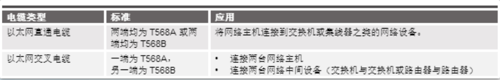
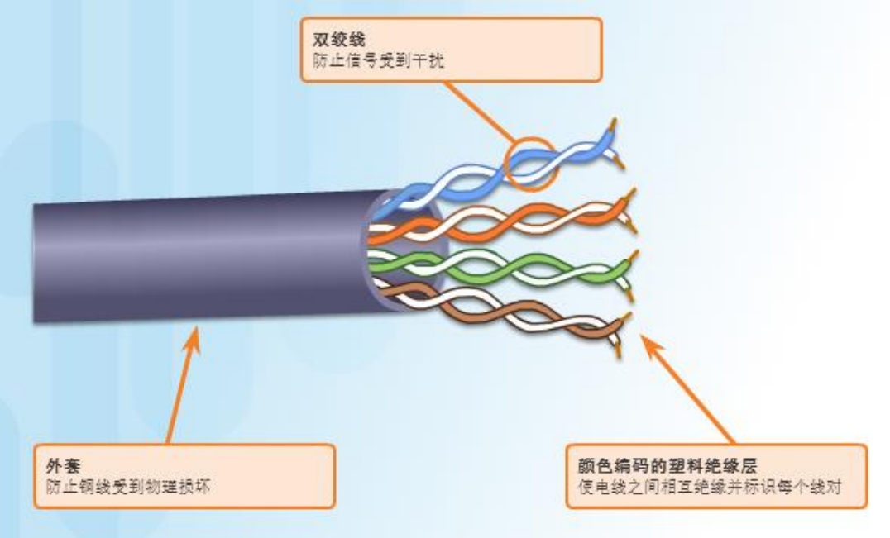
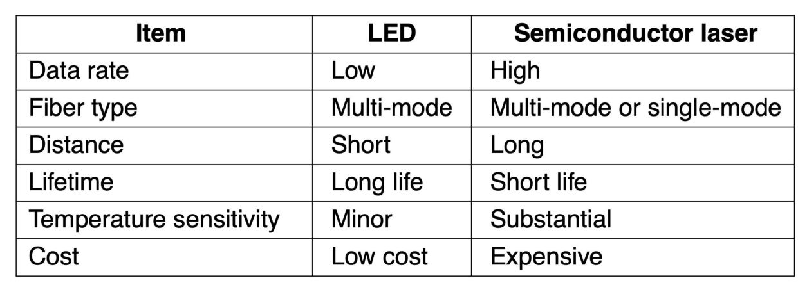
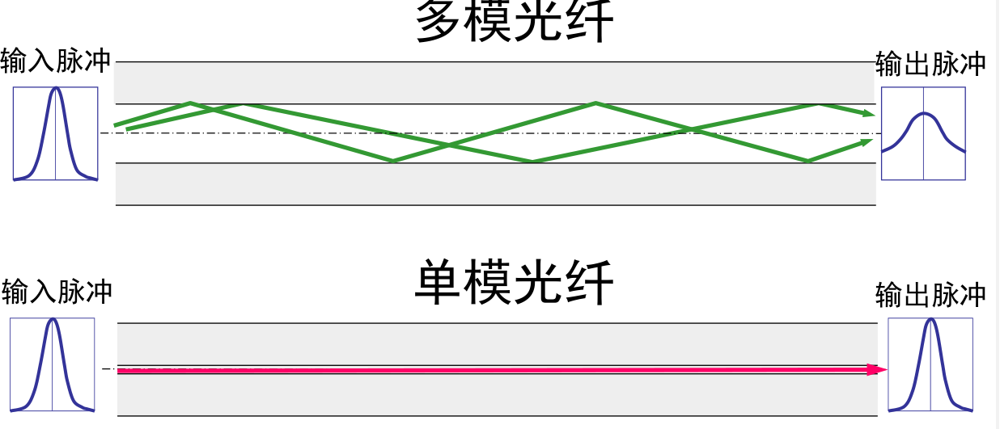

* 双绞线 Twisted Pair：常用于电话系统，距离很远的时候信号衰减就非常厉害，需要使用中继器
  * Unshielded Twisted Pair, UTP无屏蔽双绞线，即内部不带编织（整体）或锡箔（单组线）屏蔽
  * Shielded Twisted Pair, STP
  * 
  * 
*  同轴电缆 Coaxial Cable
* 光纤 Fiber Cables，利用了光的全反射原理，在特定的入射角度下不会发生折射，传输效率非常高
  * 无线带宽 ，考虑成本， 高速，
  * 关键部分：光源（LED,半导体激光器），传输介质，检测器 
  * 
  * 传输系统使用物理方式
  * 多模光纤和单模光纤
  * 光纤和铜线比较：带宽高、衰减小、抗干扰（不会被电涌power surges干扰）、轻、安全性高
  * 光通过玻璃的衰减：定义为输入输出信号的功率比
  * 光纤电缆和同轴电缆相似，只是没有编织
  * 
  * 多模光纤：较大核心，更大的散射因此信号可能丢失；长距离应用；LED作为光源
  * 单模光纤：小核心，散射较小，适合长距离应用，使用激光作为光源，通常用于几千米距离的园区骨干网
*  接口线 Interface Line
* 电源线 power line

* 全双工 半双工 单工定义

## 无线传输

## 从波形到bit

* 信道最大传输速率

