* M-commerce (mobile-commerce移动商务)
* NFC (Near Field Communication,近场通信)
* Sensor networks传感器网络
*  Content Provider Networks
  * Data-center network(网络服务来自云计算)（挑战：网络的吞吐量，能源，带宽）
  * CDN (Content Delivery Network)：许多服务器，按地理位置远近进行服务提供

* Transit network（转接网路、传递网络）
  * -当内容提供商和ISP (Internet服务提供商)之间没有直接连接时，在它们之间传输流量
  * 在少数大型内容提供商中整合内容
  * 扩大个人接入 ISP 网络的覆盖范围
* 企业网络
  * VPNs (Virtual Private Networks)
  * Allows IP telephony or VoIP (Voice over IP)
  * Allows desktop sharing 桌面共享
  * Allows electronic business communication

* 区域划分
* PANs (Personal Area Networks) （蓝牙：短区域无线）

* Local Area Networks
  * wireless 802.11 network
  * wired switched Ethernet network.
* Home Networks
  * 广泛的连接设备，易管理，可靠，安全
  * 需要属性：
    * Easy to install
    * Secure and reliable
    * Interfaces work between all products
    * Reduced consumer device costs
* Metropolitan Area Networks 城域网
* Wide Area Networks 广域网

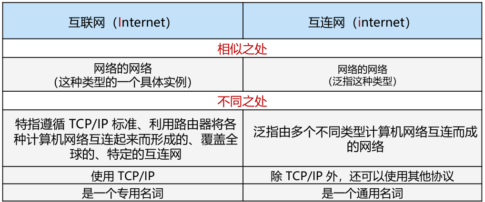

.

NSFNET是一个骨干网络，旨在成为阿帕网的继承者，它将向所有大学研究小组开放，允许他们无需与国防部签订合同就能进行通信。

HFC(混合光纤同轴)网络是一个单一的集成基础设施

-使用称为DOCSIS (Cable数据服务接口规范)的基于数据包的传输

DOCSIS传输各种数据服务，包括电视频道、高速数据和语音

Modem is short for “modulator demodulator” 调制解调器

* 移动网络
  * 来自互联网社区的包分发
    * 无连接
    * 每个包独立路由
    * 如果一些路由器宕机，不会造成危害，只要系统能够动态重新配置
  * 来自电话公司的电话交换
    * 面向连接
    * -拨号方必须拨打被叫号码并等待连接后才能通话或发送数据
    * 路由保持直到通话停止
    * 能保证QoS(quality of service )

* 

* 无线网络
  * IEEE created a wireless LAN standard
  * WLAN 标准被命名为802.11
  * 802.11系统在未经许可的频段运行
  *  802.11 network modes: Ad hoc and access point (AP)
  * （multipath fading） 多径衰落导致接收信号波动较大（在802.11所使用的频率上，无线电信号可以被固体物体反射，因此传输的多个回波可以沿着不同的路径到达接收机。回波可以相互抵消或增强，导致接收到的信号波动很大——这种现象被称为多径衰落(多径衰落)。）

* CSMA (Carrier Sense Multiple Access) scheme
  * 处理传输冲突
* 802.11 安全 
  * WEP (Wired Equivalent Privacy)
  * WiFi Protected Access (initially called WPA)
  * WPA2 and 802.1X

## 网络协议

* 网络协议的设计目标
  * Reliability (可靠性，具有检错和纠错功能，通过路由寻找工作路径
  * Resource allocation 共享有限的公共资源（拥塞问题）
  *  Evolvability (演进性
  * Security (安全性，拦住攻击（保密机制，身份验证，完整性机制）

* 分层设计
  * Protocol stack 协议栈: a list of the protocols used by a certain system, one protocol per layer
* 面向连接和无连接
  * 面向连接
    * 仿电话系统
    * 建立连接，使用连接，释放连接
    * negotiation、circuit
  * 无连接
    * 仿邮政系统
    * 包是网络层的信息
    * 存储转发 交换Store-and-forward switching:接受完整信息后发送到下一节点
    * 直通交换Cut-through switching：未完整接受信息就开始传输到下一节点
* 特定的服务原语
* 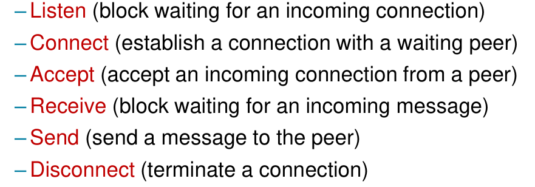

* 
* 

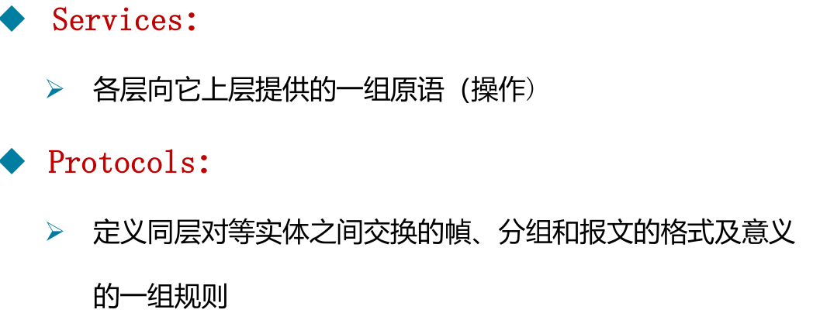

* OSI模型的三个中心概念：service ,protocol, interface

* 注意各层的传输单元名称

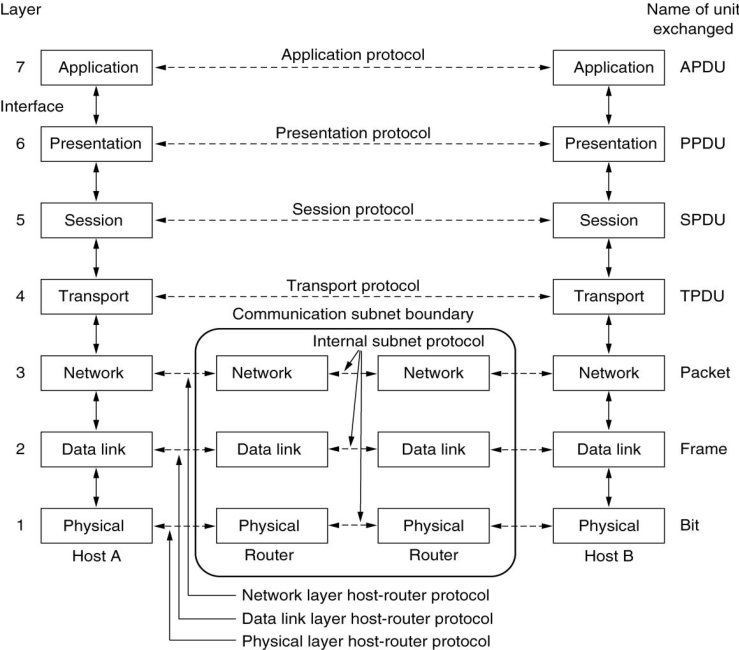

### TCP/IP 模型

* Link层
  * 最低的层级
  * 描述了 what links must do to meet the needs of this connectionless internet layer

* 网络层
  * 允许主机向任何网络注入数据包，并且独立到达目的地
  * 定义一种正式的数据包格式和协议，称为IP (Internet protocol)
  * 定义一个称为ICMP (Internet Control Message Protocol)的伙伴协议，帮助IP功能

* 传输层
  * TCP (Transmission Control Protocol)
  * UDP (User Datagram Protocol)

* 

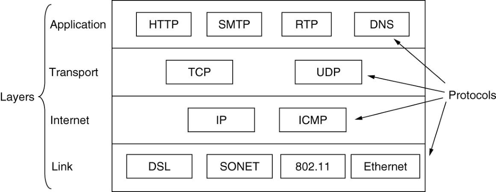

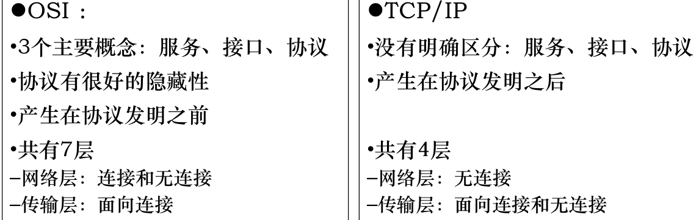

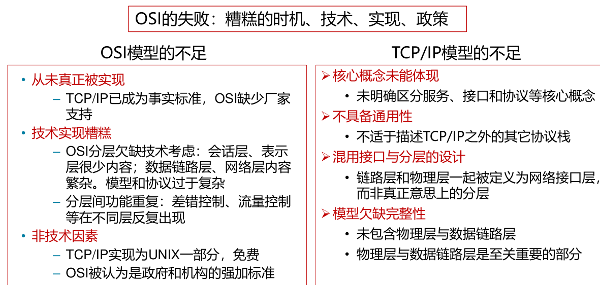

ONF (Open Networking Foundation，开放网络基金会)

 ITU (International Telecommunication Union)

 IAB (Internet Activities Board) oversaw ARPANET

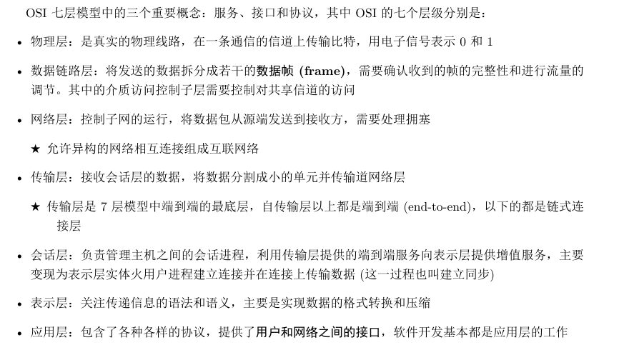

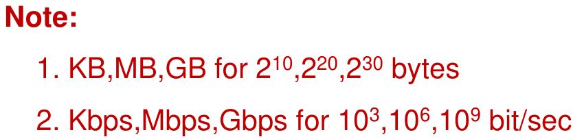

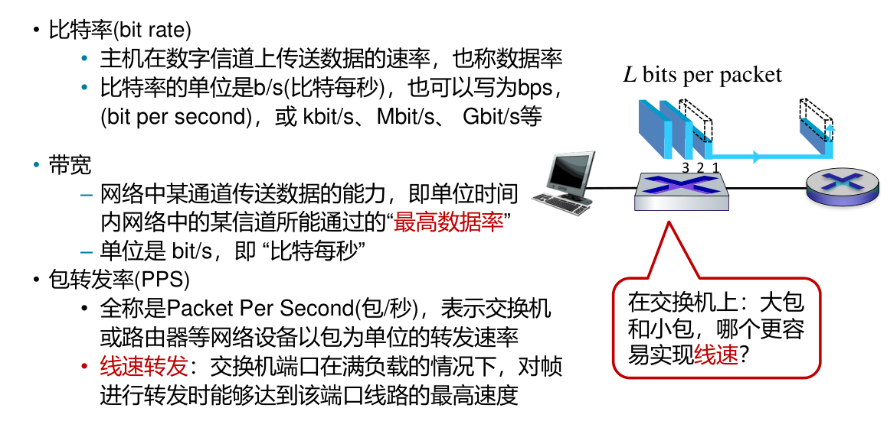

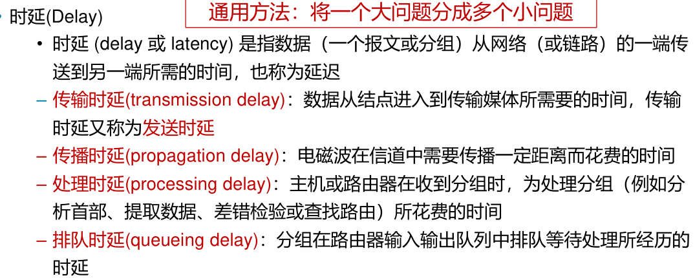

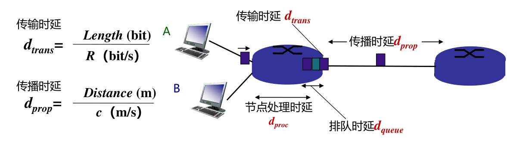

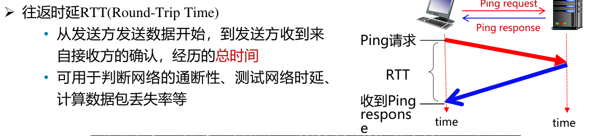

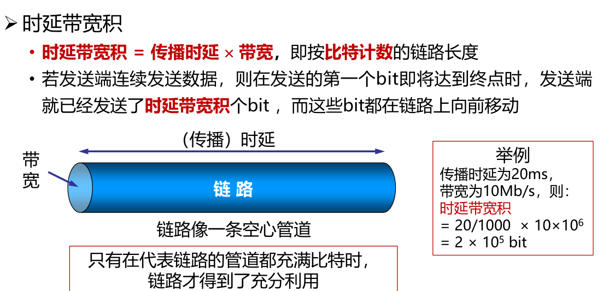

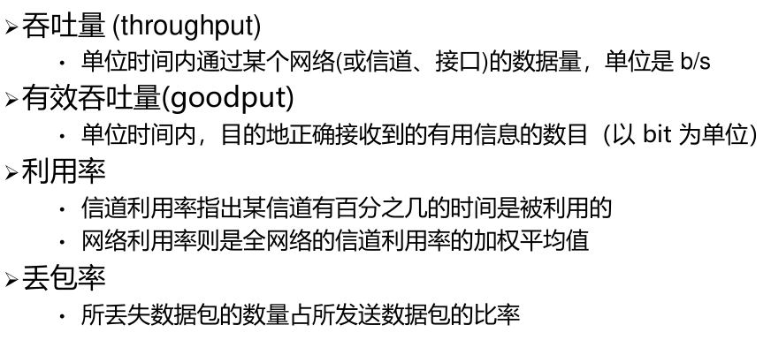

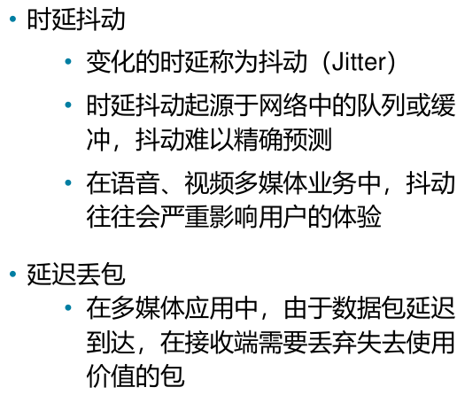