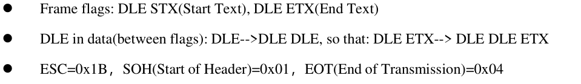
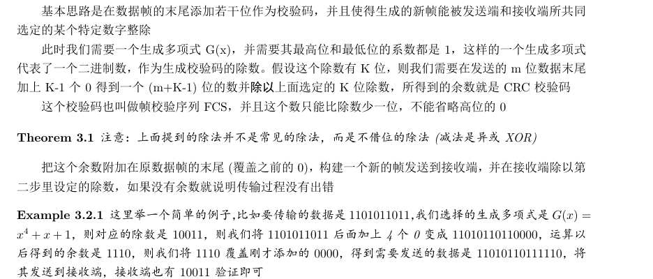
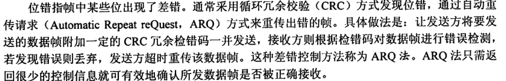
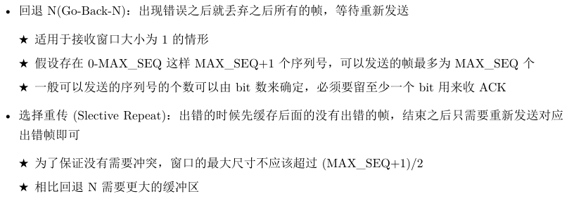
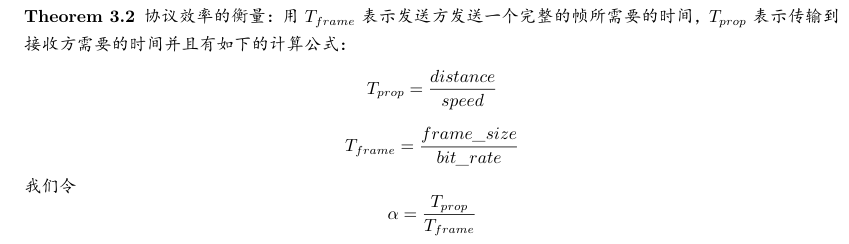
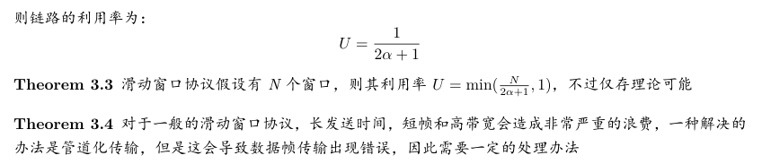
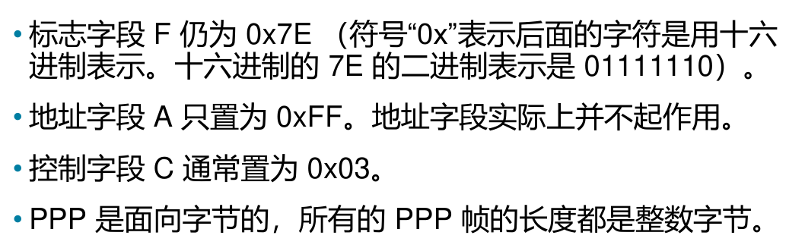
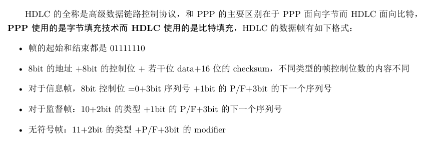

## 数据链路层

* packet 打包添加头和尾就成了帧,到达另一节点时去除头和尾就又得到packet
* 向网络层提供的服务，处理传输的错误，调节数据流，确保接收方不会被淹没。
  * Unacknowledged connectionless service 无确认的无连接服务
  * Acknowledged connectionless service 有确认的无连接服务
  * Acknowledged connection-oriented service 有确认的面向连接服务

* 成帧方法
  * Byte count：即添加字节数，但是容易出错且一旦出错后面全错
  * Flag bytes with byte stuffing 字节填充的标志字节法：（带字符填充的首尾界符法 ）
    * 
    * 用 STX 表示帧的开头，ETX 表示帧的结束，DLE 表示转义字符
    * PPP使用的方法
  * Flag bits with bit stuffing比特填充的标志比特法
    * 首尾添加01111110，防止混淆传输的数据
    * 可以在传输的数据中每出现连续的 5 个 1 就添加一个 0，保证数据中不会出现连续的 6 个 1，便于区分标识字符串
    * hdlc协议方法
  * Physical layer coding violations 物理层编码例外法

* 错误控制
* 流量控制
  * Feedback-based flow control （给予反馈的流量控制）：即接收方向发送方给予反馈
  * Rate-based flow control（给予速率的流量控制）：直接控制接收方速率，无需反馈

## 错误检测和纠正

* 海明距离：即两个二进制串的不同位个数（两个串异或结果中1的个数）
  * 纠正d比特错需距离为2d+1比特的编码
  * 检测d比特错需距离为d+1比特的编码

* 四种纠错码
  * Hamming codes 海明码
  * Binary convolutional codes 二进制卷积码
  * Reed-Solomon codes 里德-所罗门码
  * Low-Density Parity Check codes 低密度奇偶校验码

* 检错码
  * Parity 奇偶校验码（只能检验出奇数个bit错误，无法纠正）
  * Checksums 校验和
  * Cyclic Redundancy Checks (CRCs) **循环冗余校验码**（可以检测出所有单比特错误）
    * 
    * 具有r检测位的多项式能够检
      测所有长度<=r的突发错误
      •长度大于r+1的错误逃脱的
      概率为1/2r.
* 协议

* 三种简单数据链路协议
  * Utopia: No Flow Control or Error Correction
  * 添加流量控制Adding Flow Control: Stop-and-Wait
  * 
  * 添加纠错机制Adding Error Correction: Sequence Numbers and ARQ
  * 

## 滑动窗口协议

双向传输，捎带，更好地利用带宽

发送窗口:对应于发送方允许发送的帧的一组序列号

接收窗口:对应于接收方允许接收的帧的一组序列号

* A One-Bit Sliding Window Protocol（1位滑动窗口）
  * 1 位滑动窗口协议顾名思义两边的窗口大小都是 1，发送方发送了一帧之后必要要等待前一帧的确认到达之后才可以发送下一帧，所以这种协议使用的也是停止等待的方法。
* A Protocol Using Go Back N（后退n帧） 
  * 最大窗口即 最大序列号MAX_SEQ（从0开始共MAX_SEQ+1个）
* A Protocol Using Selective Repeat（选择性重传）
  * 为了保证没有需要冲突，窗口的最大尺寸不应该超过 (MAX_SEQ+1)/2
  * 窗口大小为W<=(MAX_SEQ+1)/2
    所需缓冲器的数量=W
    所需计时器的数量=W
    否定性确认帧-NAK

* 协议效率的衡量
  * 

* 数据链路层的PPP协议
  * 一种成帧的方法，可以准确地区分出一帧的结束和下一帧的开始
  * 链路控制协议 LCP，可以用于启动线路、测试线路，当不再需要线路的时候关闭线路
  * 网络控制协议 NCP，是一种协商网络层选项的方式，针对每一种支持的网络层都有一个不同的 NCP
  * 需要提供身份验证，可以动态分配 IP 地址
  
  
  
  
* HDLC协议

