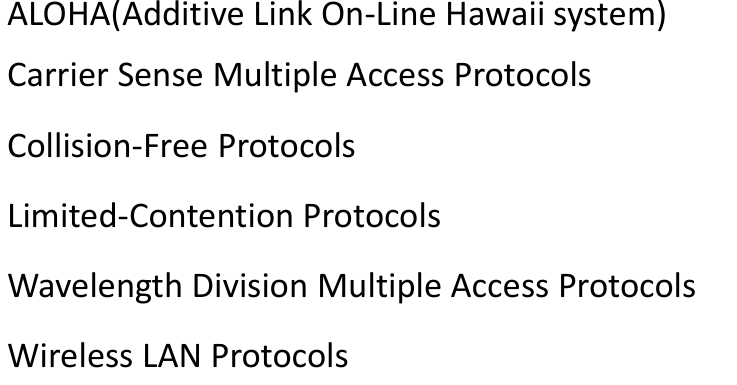
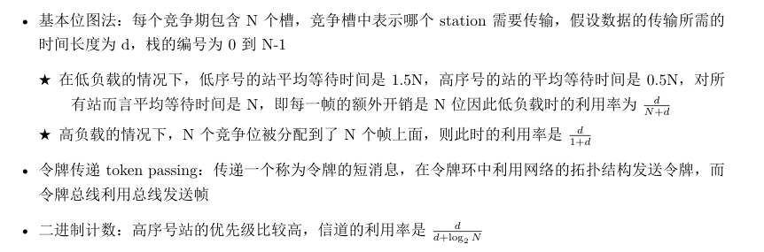
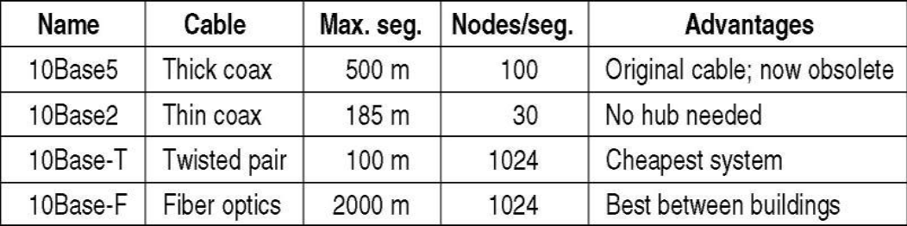
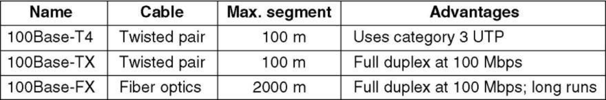
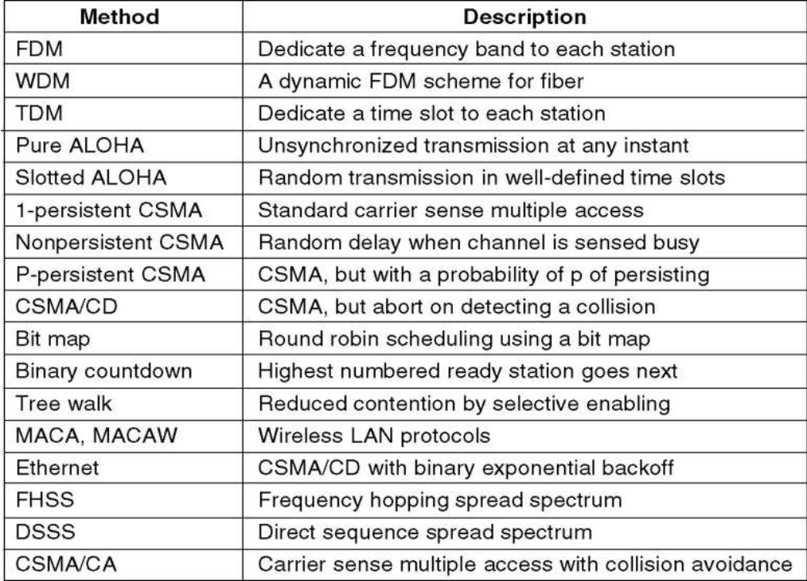
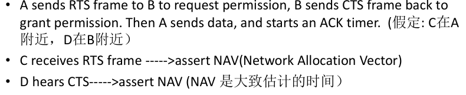

# 介质访问控制子层MAC

## 信道分配

* 网络链路分为两类
  * P2P 点对点连接
  * 广播信道（多路访问信道，随机访问信道），广播信道引起多方竞争，确定信道的下一个使用者就非常重要，这里就是介质访问控制子层 (MAC) 的主要作用。

* 局域网和城域网信道静态分配
  * 不适合极具爆发性数据流量的系统
  * 峰值流量和平均流量在1000：1时性能受影响
  * 大部分信道大部分时间闲置
  * 静态FDM的性能较差
  * 

* 动态分配
* 五个关键假设
  * 独立流量Independent Traffic. 
  * 单通道 Single Channel 
  * 可观测冲突Observable Collision 
  * 连续时间或时隙Continuous or Slotted Time
  * Carrier Sense or No Carrier Sense   载波侦听（Stations can tell if the channel is in use before trying to use it）和非载波侦听（Only later can they determine whether or not the transmission was successful）

## 多点接入协议

* ALOHA 协议
  * 纯ALOHA协议基本思想：在用户有需求的时候就传输。
  * 产生冲突之后，等待一个随机时间后重新发送（需要检测是否产生冲突）
  * 系统吞吐量（协议效率）$S = G*e^{-2G}$，大约18.4%(即G取1)；G-每帧时内传送的帧数，S-successfully transmitted frames per frame time
  * 分槽ALOHA：把时间分为离散的时间片(slot)，每段对应一帧，需要用户遵守统一的时间槽边界，
  * 此时的效率$S = G*e^{-G}$,36.8%,是纯aloha的两倍
* Carrier Sense Multiple Access Protocols（载波侦听多路访问协议 ）CSMA
  * 基本思想：检测其它站点，调整自己的动作，大大提高利用率
  * 1-persistant CSMA：持续监听直到空闲，立刻发送；发生冲突就随即等待一段时间
  * non-persistant CSMA：繁忙就放弃一段随机时间，然后再监听；利用率高但是延迟大
  * p-persistant CSMA：（适用于有槽的通道）持续监听，空闲时有p概率发送，否则推迟到下一个时间槽

* CSMA with Collision Detection（带冲突检测的CSMA ） CSMA/CD
  * Three states：contention,transmission,or idle
  * One version of it：IEEE802.3(Ethernet),which is an international standard.

* 无冲突协议：此类协议以根本不可能产生冲突的方式解决了信道竞争的问题，虽然这种协议并不被应用在主流系统
* 

有限竞争协议

竞争方法：低负载下高效低延迟；高负载下性能降低

无冲突方法：反

有限竞争协议：低负载的时候使用竞争协议降低延迟，高负载的时候采用无冲突的方法提高信道效
率，比如自适应树遍历协议。

Adaptive Tree Walk Protocol  适应树搜索协议（ATWP）

数据链路两个子层

逻辑链路控制 LLC (Logical Link Control)子层
媒体接入控制 MAC (Medium Access Control)子层。

与接入到传输媒体有关的内容都放在 MAC子层，而 LLC 子层则与传输媒体无关，不管采用何种协议的局域网对 LLC 子层来说都是透明的

无线网络

