# Ch 5 Network

### 5.1.1 Stored-and-forward packet switching (存储转发分组交换)

* 网络层以`packet`为传输单位
* 传输方式：一种是固定连接通路（虚电路，面向连接的服务方式），另一种通过`packet`内部封装的信息（源地址，目标地址）查路由表，决定运输方向，和其余路由器无关（Datagram数据报网络，无连接服务方式）
* 路由器处理`packet`
  * The packet is received, verified, and stored.
  * Then it is forwarded to the next router.
  * This step can be repeated many times.

### 5.1.2 Services provided to the transport layer

* 网络层为传输层提供服务，面向连接的服务，无连接服务
* virtual circuit（VC） 虚电路(不存在真实电路)，面向连接的服务，有较好的QOS（服务质量）
* 无连接服务，Datagram数据报，不稳定，根据路由表的变化，每个包可能不同路径

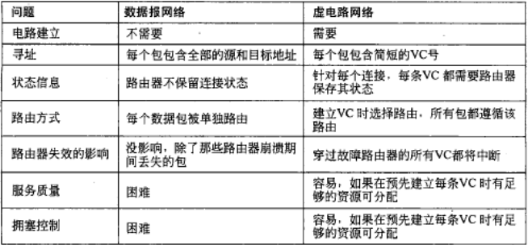

## 5.1 单个网络中的路由算法

* The Optimality Principle (最优化原则)
  * 网络拓扑结构中的最优路径的子路径一定也是一条最优子路径。从每个源端到目标的最优路径构成的集合构成了一棵以目标节点的树，称为汇集树 SinkTree

* Shortest Path Routing (最短路径路由)
  * 即利用Dijkstra 算法，关键为长度的定义（通常选取跳数hop或者网线长度）
  * 静态路由算法（下面定义）

* Flooding (扩散（泛洪）路由)
  * 每个路由器必须根据本地的知识而不是网络的全貌来做决策，泛洪算法将每个入境的数据包发送到了除了来路以外所有的出境线路。
  * 抑制真的泛洪，添加计数器，每一跳减小1，计数器变为0时丢弃数据包
  * 静态路由

* Distance Vector Routing (距离向量路由)
  * 每个路由器维护一张表，表中列出了当前已知的到每个目标的最佳距离和所使用的链路，通过邻居之间相互交换信息而不断被更新，最终每个路由器都可以了解到到达目标的最佳链路。
  * 对于邻居则直接将收到路由表的延迟记录，其余节点通过邻居记录最短值
  * 可能有无穷计数问题（对好消息反应迅速，对坏消息反应迟钝；因为B经过A才有最短，但是A不知道，当A断掉后和B沟通以为从B可以有一条路径，而B也需要和A不断沟通也即不断添加延迟才能获得这个断路坏消息）
  * 逆毒传染：B对于经过A的最短路径，传给A路由表时将延迟改为无穷大。
  * 应用：==RIP protocol；BGP protocol==

* Link State Routing (链路状态路由)
  * 其实和上一个相似，不过每个路由器只获取邻居的路径而后根据所有路由器的邻居自己计算最短路径
  * 发现邻居节点，并了解其网络地址(需要全局唯一姓名)；设置邻居节点的距离或者成本度量值；构造一个包含刚才所得信息的链路信息包；将包发送给所有的路由器，并接受来自所有其他路由器的信息包；计算出到达每个路由器的最短路径；
  * Designated Router (DR，指定路由器) and Backup Designated Router (BDR，后备指定路由器)
  * sending flag(0说明来源，1为发送目标) 和 ack flag（向来源发送确认信息） 
  * ==IS-IS (Intermediate System – Intermediate System)；OSPF (Open Shortest Path First)==

* Hierarchical Routing (分层路由)
  * 其实是一种设计思想？
  * 路由器被划分成了不同的区域，每个路由器知道如何将数据包路由到自己所在的区域内的布标地址，但是对于其他区域的内部结构不知情当网络被互相连结到一起的时候，每个网络就会作为一个独立的区域，一个网络中的路由器不必知道其他网络的拓扑结构。
  * 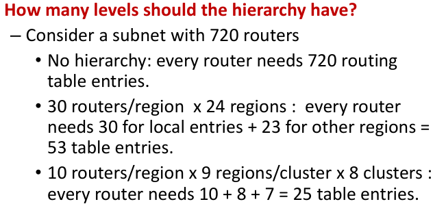

* Broadcast Routing (广播路由)
  * 是一种浪费带宽的行为，并且需要源头拥有所有目标机器的完整地址列表，不够理想但是被广泛使用。
    多目标路由：每个数据包包含了一组目标地址或者位图。

* Multicast Routing (多点传送路由)
  * Multicasting (组播)；
  * There are MOSPF(Multicast OSPF) or DVMRP( DistanceVector Multicast Routing Protocol)

* Anycast Routing (任意路由)

* 路由算法：routing and forwarding ，路由和转发
* 虚电路网络路由，也叫会话路由

* 路由算法的要求： Correctness (正确性), simplicity (简单性)，Robustness (健壮性)， Stability(稳定性)， Fairness (公平性), Efficiency (高效率)
* 公平性和高效率存在一定矛盾
* 路由算法分类
  * 非自适应算法，静态路由
  * 自适应算法，动态路由

* 最优化原则： If router J is on the optimal path from router I to router K (IJK), then the optimal path from J to K also falls along the same route.

* 汇集树：即到某个目标节点的最优化生成树

## 5.3 Traffic Management at the Network Layer

* 拥塞原因：
  * 低效内存；慢CPU；低带宽
* 拥塞控制针对整个子网，全局控制；流量控制针对端到端的传输；Both congestion control and flow control can tell the sender to slow down

*	Traffic-aware routing

*	Admission control

* Load shedding
  * 负载脱落、减少负载：减少负载是一种奇妙的方法，当路由器被无法处理的数据包淹没时，它们只是简单地将其丢弃。

* Traffic shaping

* Active queue management主动队列管理
  * 及时发现拥塞；

  * 及时报告拥塞

* Random early detection随机早期检测

* Choke packets 抑制包

* Explicit congestion notification显式拥塞通知

* Hop-by-hop backpressure逐跳后压
  * 使扼流包在它经过的每一跳上生效。

## 5.4 Quality of Service and Application QoE

* QoE： Quality of Experience， 用户体验质量
* QoS： 服务质量

### 5.4.1 Application QoS Requirements

* The needs (or requirements) of each flow can be characterized by four primary parameters:
  * Bandwidth (带宽) ，Delay (延迟)，Jitter (抖动)，Loss（丢失）

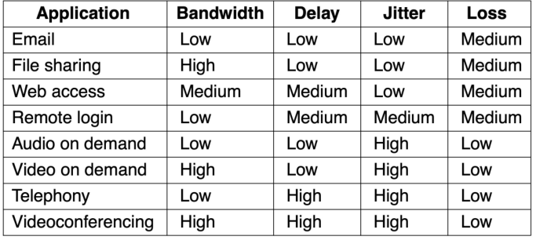

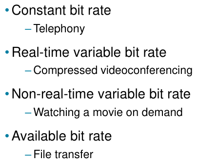

### 5.4.2 Overprovisioning （过度配置）

### 5.4.3 Packet Scheduling （数据包调度）

* FIFO/FCFS Scheduling

*  Fair Queueing 公正队列
* Weighted Fair Queueing
* Putting it Together

### 5.4.4  Integrated Services (综合服务

* 综合服务，区分服务（Differential services ）
* RSVP (Resource reSerVation Protocol资源预留协议): 允许多个发送者发送到多个接收者组，允许单个接收者自由切换信道，并优化带宽使用，同时消除拥塞。

### 5.4.5 Differentiated Services（分区服务）

Expedited forwarding 迅速推进

assured forwarding 确定推进

### 5.4.6 Label switching and MPLS

## 5.5 Internetworking 互联网络

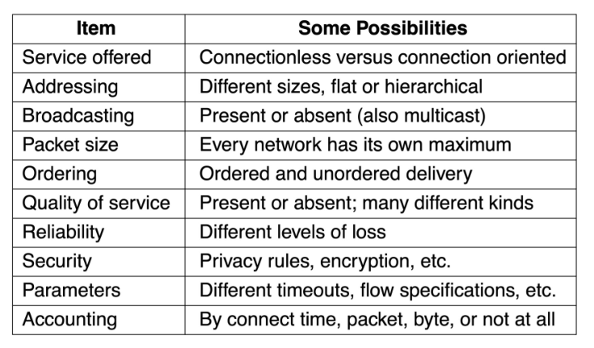

### 5.5.5 Internetwork Routing：Routing Across Multiple Networks

==网间路由==Internet routing: Exterior gateway protocol (EGP), or Interdomain：BGP

==网内路由==Intranet routing: Interior gateway protocol (IGP), or Intradomain：RIP, OSPF

To route a packet：

* 一个数据包从其LAN寻址到本地路由器开始，该路由器将在网络层使用其路由表来决定将数据包转发到下一个路由器，直接转发or隧道，重复此过程，直到数据包到达目标网络为止

### 5.5.6 Supporting Different Packet Sizes: Packet Fragmentation

* 透明分段（每个路由器会组合然后再分段传输到下一个），非透明分段（分段直至目的地）

## 5.6 Software-Defined Networking（SDN）

提高网络带宽利用率；
网络运行更加稳定；
管理更加高效简化；
运行费用明显降低

* SDN
* Openflow

* 简单转发，负载均衡，防火墙
* 

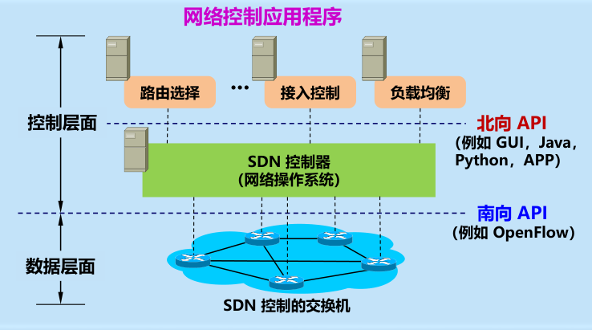

## 5.7 The Network Layer in the Internet

网络构建原则：

1. Make sure it works.保证工作
2. Keep it simple.保持简单
3. Make clear choices.明确选择
4. Exploit modularity.采用模块化思想
5. Expect heterogeneity. 对于异构性有预期
6. Avoid static options and parameters.避免静态选项和参数
7. Look for a good design; it need not be perfect. 寻找好的设计，它不必是完美的
8. Be strict when sending and tolerant when receiving. 严格发送，宽松接收
9. Think about scalability. 考虑可扩展性
10. Consider performance and cost. 考虑性能和成本

* autonomous systems（AS）：一个自治系统就是处于一个管理机构控制之下的路由器和网络群组。

### 5.7.1  The IP Version 4 Protocol

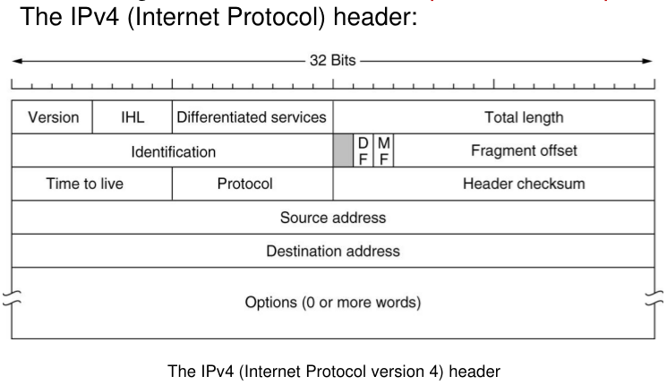

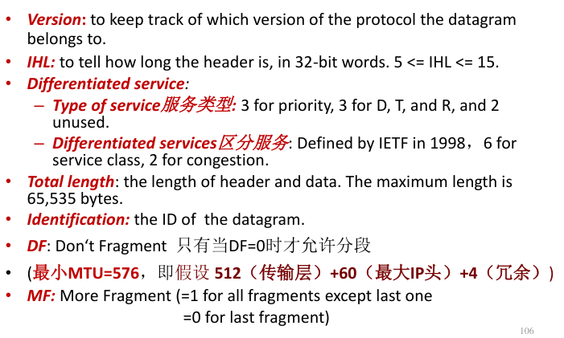

* IP地址：网络号和主机号

* 地址分配

* CIDR –Classless InterDomain Routing 

* 最长匹配原则：按网络号匹配最长的进行转发

ip地址分类

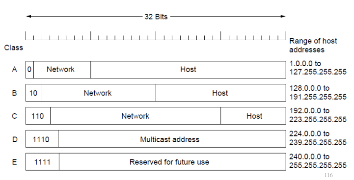

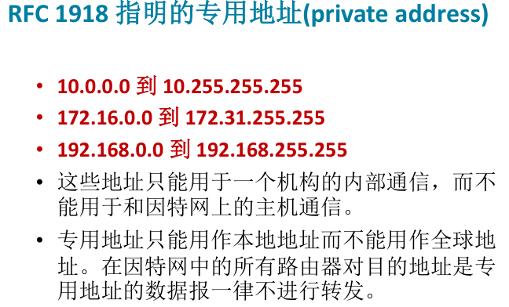

* NAT--Network Address Translation（ solve the problem of running out of IPaddresses）

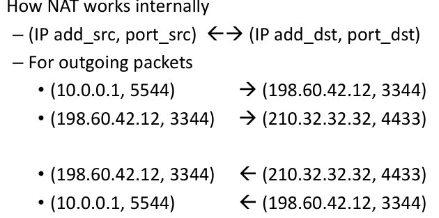

* IPv6地址记法
  * 冒号十六进制：
  * 每个 16 位的值用十六进制值表示，各值之间用冒号分隔68E6:8C64:FFFF:FFFF:0:1180:960A:FFFF
  * 零压缩(zero compression)，即一连串连续的零可以为一对冒号所取代。

### 网络控制协议

*  ICMP—The Internet Control Message Protocol
  * ICMP 报文的种类有两种，即 ICMP 差错报告报文和ICMP 询问报文。
  *  ICMP 报文的前 4 个字节是统一的格式，共有三个字段：即类型、代码和检验和。接着的 4 个字节的内容与 ICMP 的类型有关。
  * 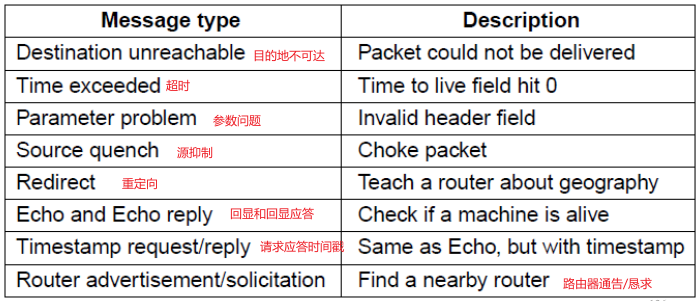
  * 上面五个是差错报文，下面是询问报文
  * 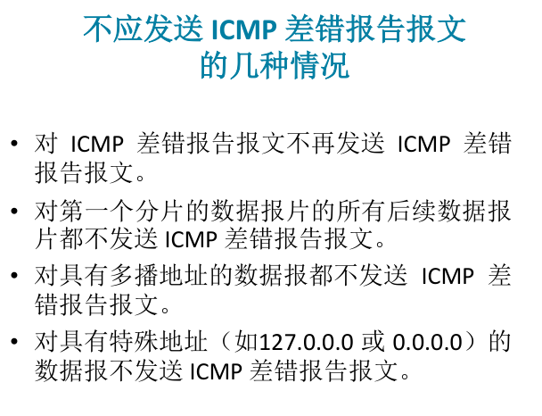
  * 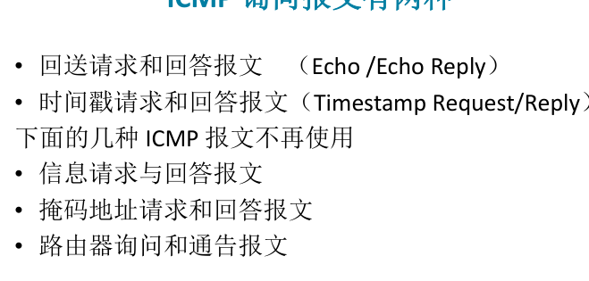
  * ping（测试两个主机之间的连通性。）使用 ICMP 回送请求与回送回答报文。

*  ARP—The Address Resolution Protocol  地址解析协议 
   *  ARP 协议的作用就是将 IP 地址映射成以太网的地址，优点在于简单，既可以算作网络层的协议，也可以算作数据链路层的协议。

*  反向地址解析协议 RARP
   *  其实就是让物理机器从 ARP 表中请求其 IP 地址，维护一个 MAC 地址到 IP 的映射表，将 MAC 地址转换成对应的 IP 地址，可以用于以太网、光纤分布式数据接口以及令牌环。

   *  BOOTP (Bootstrap Protocol) is better than RARP, can be forwarded by a router.

*  DHCP—The Dynamic Host Configuration Protocol
   *  每个网络必须有一个 DHCP 服务器负责地址的配置，为发送请求的主机分配一个空闲的 IP 地址，并通过 DHCP 的 OFFER 包返回给主机。但是动态分配的 IP 地址只能持续一段时间，到期之前主机必须请求 DHCP 续订，否则时间到了之后主机的 IP 地址就会被取消。

* MPLS
  * 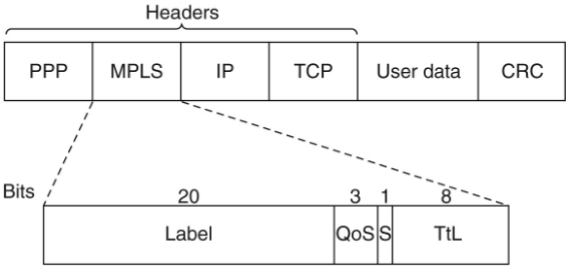
  * 多协议标签交换 (MPLS) 是指在每个数据包前面增加一个标签，路由器根据数据包标签进行转发，用标签作为内部表的一个索引，快速查找出正确的输出路线。通用的 MPLS 有 4 个字节，包含 4 个字段，标签存放的是索引，QoS 表明服务类别，S 表示在层次网络中叠加多个标签的做法，TTL 字段指出该数据包还可以被转发多少次，每经过一个路由器 TTL 减小 1，变成 0 的时候数据包就会被丢弃

* autonomous systems (AS)一个自治系统就是处于一个管理机构控制之下的路由器和网络群组。

*  interior gateway protocol(IGP):A routing algorithm ==within== an AS内部网关路由协议
  * RIP (采用UDP报文)(Routing Information Protocol)
  * Link state protocol (1979)
  * OSPF 直接用 IP 数据报传送(Open Shortest Path First)

*  exterior gateway protocol(EGP):A routing algorithm between ASes
  * BGP (Border Gateway Protocol)， 最新 BGPv4

* RIP
  * 基于距离向量的路由选择协议
  * 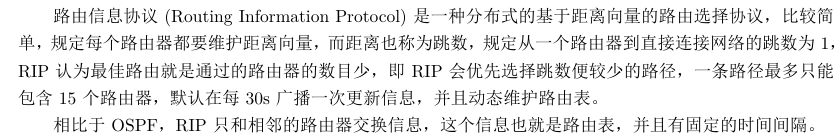

* OSPF

  * 使用了分布式的链路状态协议和最短路径算法
  * OSPF 会记住最短的路径集合，并在报文转发阶段把流量分摊到多条路径上面，实现负载均衡，这种方法称为等价成本多路径 (ECMP)

  * OSPF 没有“坏消息传播得慢”的问题，据统计，其响应网络变化的时间小于 100 ms。

* BGP
  * BGP 协议只能力求寻找到一条可以达到目的网络并且比较好的路由，采用了路径向量路由选择协议。
  * BGP 使用四种报文，分别是打开，更新，保活和通知
  * 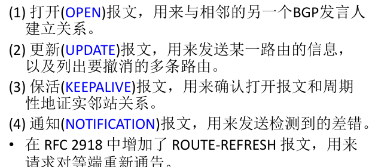

具体协议内容看P36

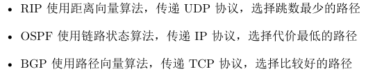

IP 的组播一定只用在 UDP 协议上，普通的 IP 通信只发生在一个发送方和一个接收方之间，而 IP 用
D 类 IP 地址来支持一对多的通信或者组播，每个 D 类地址标识了一组主机

