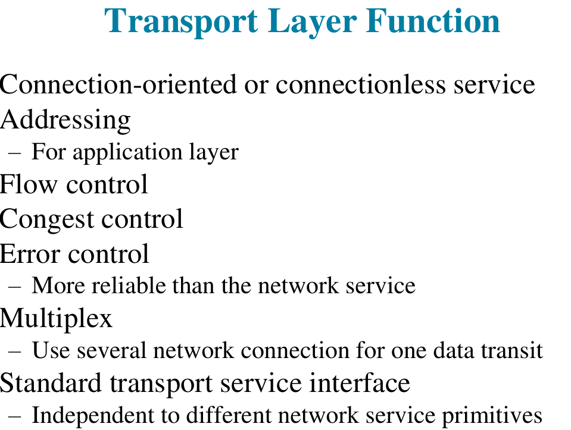
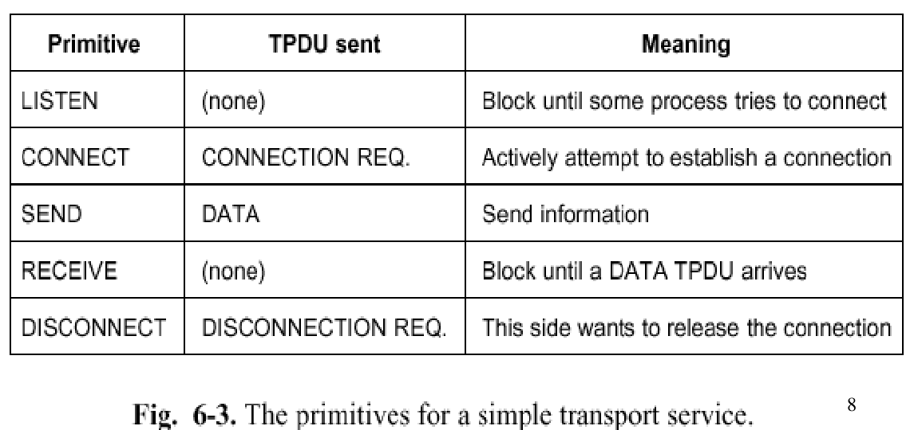
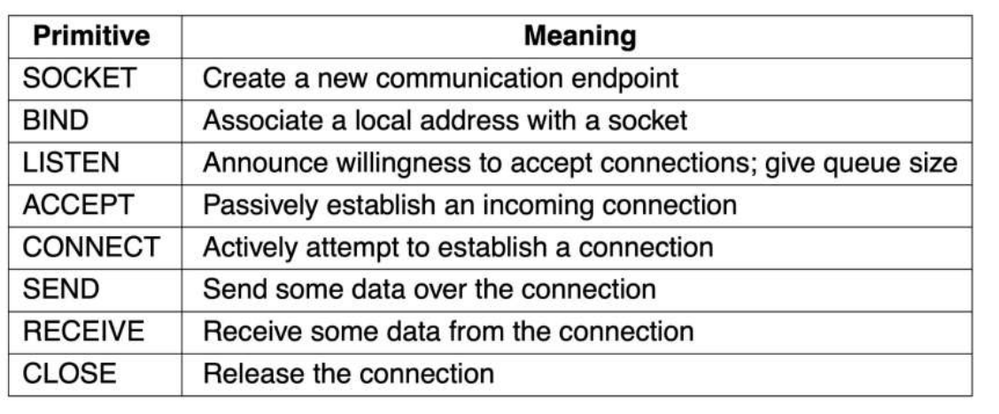
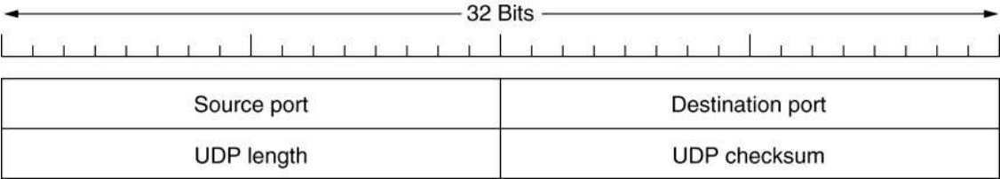
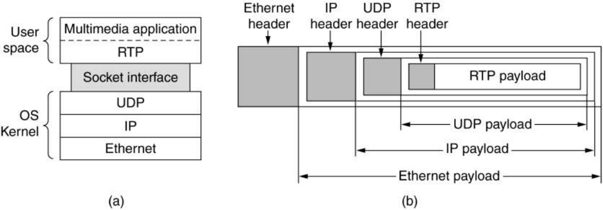
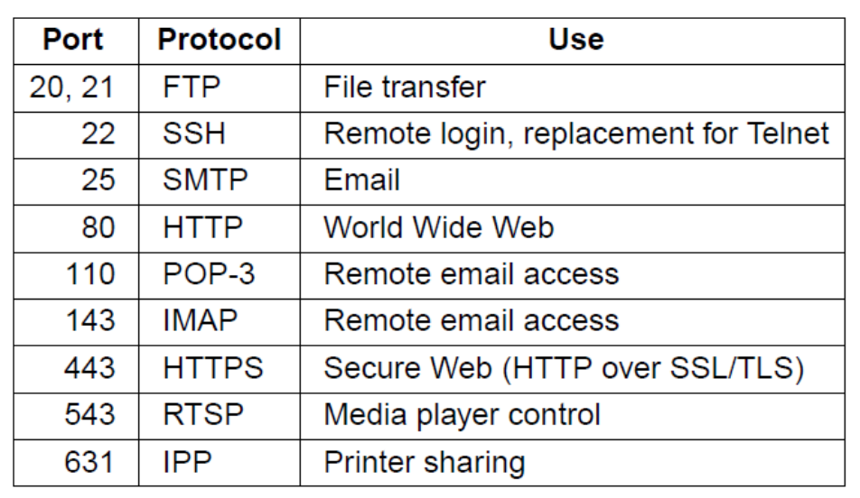
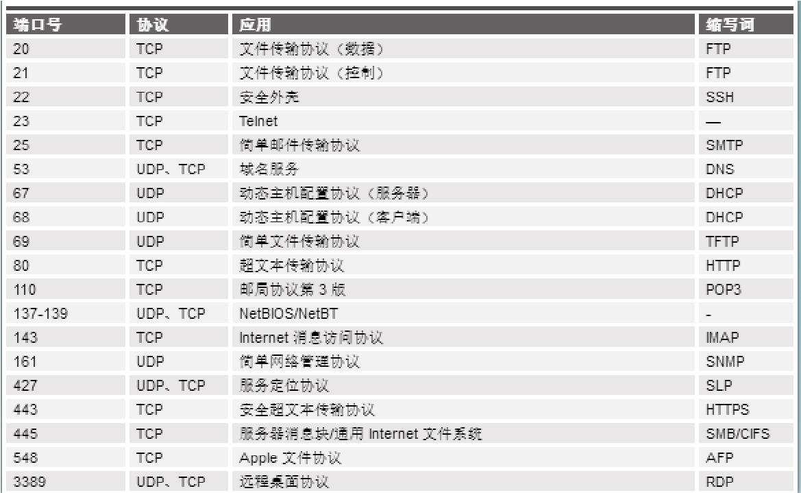
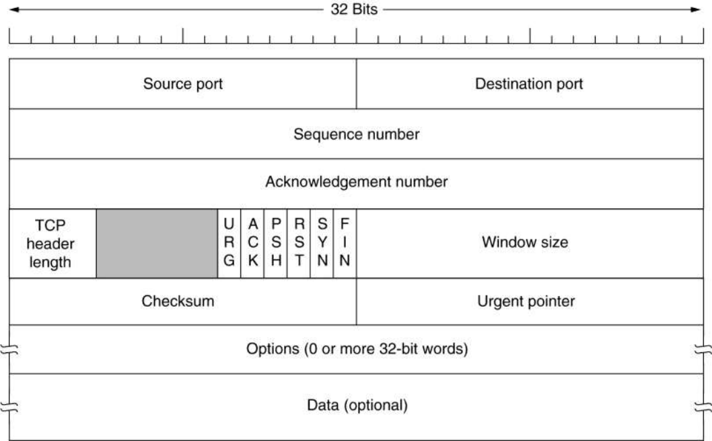
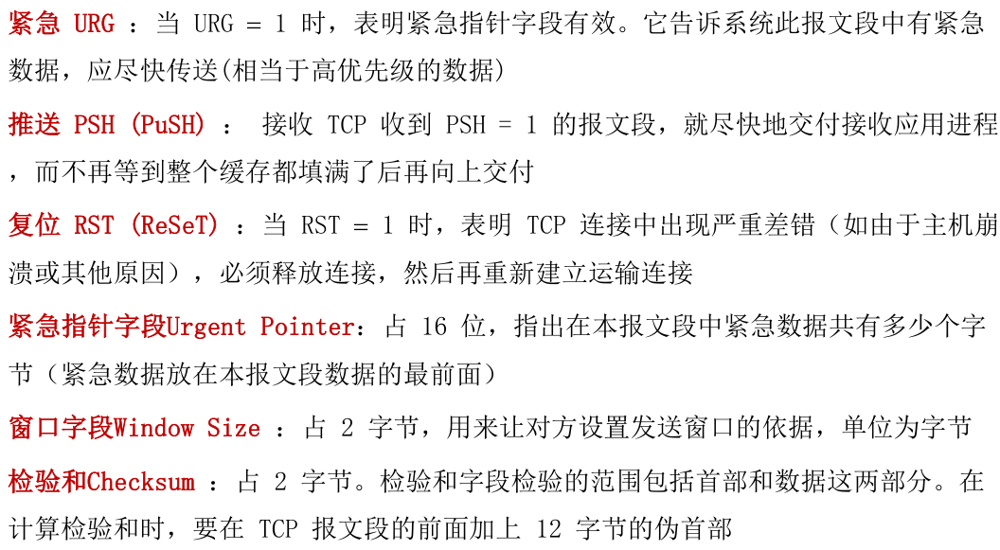

* TCP协议
* 头的组成看小角龙
* 在不可靠的网络上提供可靠服务

* 服务原语
* 
* Berkeley Sockets
* 

* TCP 组成部分
  * 寻址
  * 建立连接
  * 释放连接
  * 流量控制和缓冲
  * 多路复用
  * 崩溃恢复
* 限制包的转发次数（寿命）
  * 网络设计
  * 跳计数
  * 时间戳

* 差错控制

* 流量控制

* 发送方应该有存储未确认数据的缓冲
* 接收方应该有存储未读取数据的缓冲
* 数据可能正确到达，但是没有接受的缓冲
* 发送方应该直到接收方的闲置缓冲数量

* 拥塞控制
  * “加性增，乘性减”，或者叫做“和式增加，积式减少

* UDP协议
* UDP头
  * 
  * 

* Remote Procedure Call
*  RTP—the Real-time Transport Protocol实时传输协议
  * 封装在应用层？
  * 
  * No flow control, no error control, no ack, no retransmission
* RTCP—the Real-time Transport Control Protocol实时传输控制协议
* Playout with buffering and jitter control
* 域名系统 DNS，在防抖动和缓冲的音视频播放中也有一定的应用。
* UDP是不可靠的

* TCP： provide a reliable end-to-end byte stream over an unreliableinternetwork.

* socket由IP地址和端口号组成，即一个ip地址可以形成多个socket；1024以下的端口号通常有用
* 传输层实际上是不同主机进程之间的通信，端口就是进程对外交流的窗口？

* TCP的头部
* 

* TCP的计时器管理
  * Retransmission timer重传计时器 RTO：每次 TCP 发出一个段就启动一个重传计时器，如果超时了就要重传
  * Persistence timer:持续计时器：为了避免出现死锁现象
  * Keepalive timer: 保活计时器：当连接空闲了较长时间之后，保活计时器可能会超时，从而促使一端来查看连接是否还存在，如果另一端没有响应就断开 TCP 连接

* TCP拥塞控制

* 缓慢启动算法：TCP 刚创建连接并发送报文段的时候，先令拥塞窗口 =1，即一个最大报文段的长度 MSS，每次收到对发送出去的报文的确认的时候就将拥塞窗口增大 1，逐渐增大到一个阈值ssthresh，然后使用拥塞控制算法
* 拥塞控制算法：在缓慢启动算法达到阈值的时候就使得拥塞窗口的增长速度变成线性，每次遇到网络拥塞就将阈值变成当前拥塞窗口的一半，然后从头开始继续缓慢启动算法，如此循环往复

* 快速重传算法：使用冗余 ACK 来检测网络拥塞，当连续收到三个冗余 ACK 的时候直接对未收到的报文段进行重传而不等待超时。

* （==Reno==）快速恢复算法：类似于拥塞控制算法，在连续收到三个冗余 ACK 的时候就将阈值设置为当前拥塞窗口的一半，然后将拥塞窗口的值也设置为阈值，然后缓慢地线性增加。
* 拥塞控制算法遇到拥塞时直接从1重新开始；快速回复则从原本的一半重新开始（此时阈值也是同样的值，因此后续直接用加法而不是*2）