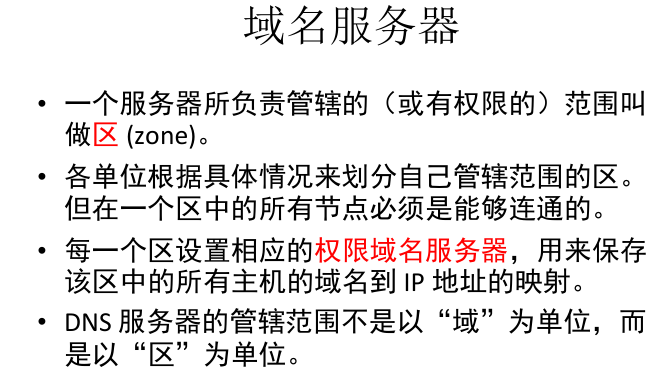
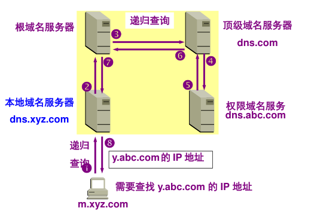
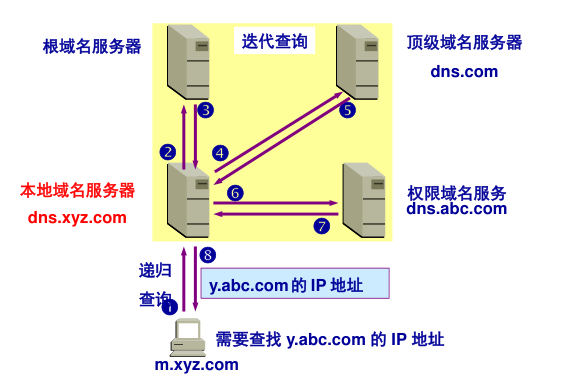
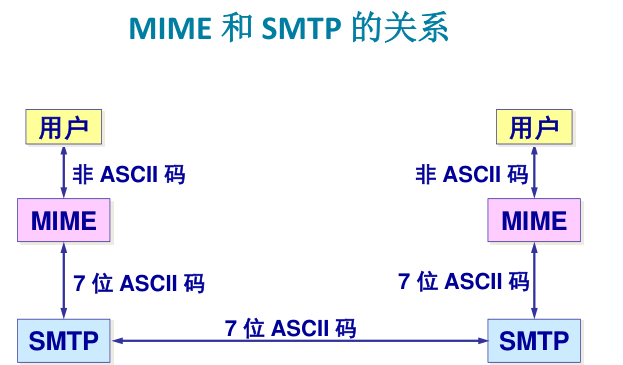
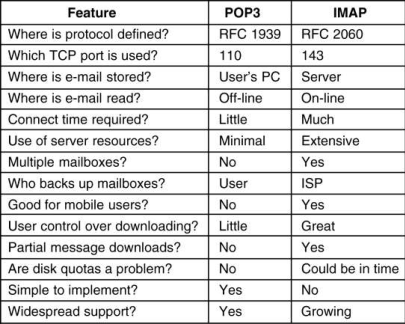
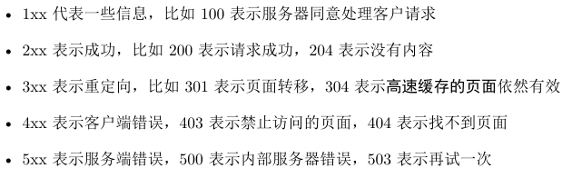

* 网络应用模型
  * C/S客户服务器模型
    * 客户端需要服务器地址，服务器只用被动等待
  * P2P对等模型
    * 每个机器既是C也是S

* DNS(Domain Name System)

* Stub resolver （存根解析器）process to map a name onto an IP address

  * 查询请求local DNSresolver 

  * local 进行递归查询
  * 返回对应IP
  * 使用UDP包进行消息发送

*  FQDN（ Fully Qualified Domain Name，完全限定域名）

* DNS 名字空间
* 

* 根，顶级，权限，本地四种域名服务器
* 本地域名服务器无法解析的地址会直接发送到根域名服务器（不经过中间层）
  * 根域名服务器并不直接把域名直接转换成 IP 地址。
  * 在使用迭代查询时，根域名服务器把下一步应当找的顶级域名服务器的 IP 地址告诉本地域名服务器。
  * 顶级域名服务器就可能给出答案，也可能给出下一步的域名服务器ip

* 根域名服务器是指13套装置，13个ip地址，不是13台机器
* 主机向本地域名服务器的查询一般都是采用递归查询（Recursive Query）
  * 
* 本地域名服务器向根域名服务器的查询通常是采用迭代查询（Iterative
  * 

* 电子邮件系统
* 两个子系统
  * 用户代理To allow people to read and send e-mail 
  * 消息传输代理To move messages from the source to the destination

* 消息格式：

* MIME（Multipurpose Internet Mail Extensions）多用因特网邮件扩展
  * 二进制消息编码方法:64个基本字符编码（Base64）

* SMTP – 简单邮件传输协议（Simple Mail Transfer Protocol）
  * 一个简单的ASCII协议
    • 端口号：25
    • TCP连接

* 邮件发送协议 SMTP 和邮件读取协议 POP3，二者都使用 TCP 来传送邮件

* 邮件收发的过程
  *  用户代理使用 SMTP 向发送方邮件服务器的 SMTP 服务器建立 TCP 连接并发送邮件
  * 发送方的邮件服务器的 SMTP 客户向接收方的邮件服务器建立 TCP 连接，并发送给 SMTP 服务器
  * 接收方的 POP3 服务器读取邮件，向收件人的用户代理 POP3 客户发送邮件的内容

* 邮局协议POP3：从远程邮箱中读取电子邮件的简单协议

* 交互式电子邮件访问协议IMAP

  * 邮件服务器维护一个中心数据库，能够被各种其它机器访问

* 分布式电子邮件系统协议DMSP
  * 将邮件从服务器上下载(download)到机器上，断开连接后再阅读

* IMAP—the Internet Message Access Protocol     POP3的后辈？无继承关系
* POP3读取邮件后就会删除
* IMAP可以在不同的地方使用不同的计算机随时读取邮件。

* 互联网
* 网络服务器工作
  * 接受连接，获取路径，获取文件，发送文件，释放连接（获取文件也可能是执行程序并不断发送信息）

* 服务器设计难点
  * Server design problem: one request processed at a time
    – Solution: make the server multithreaded
  * Server design problem: slow disk access bottleneck
    – Solution: maintain a cache in memory

* 

* URL

* 网络是无状态的，通过cookies跟踪网页访问情况
  * 只是文件或字符串
  * 三方cookies：说明来自和主页面不同的地方
* 网络服务器端产生动态页面的方法
  *  CGI(Common Gateway Interface)
  *  PHP(PHP: Hypertext Preprocessor)
  *  JSP (Java Server Pages)
  * ASP (Active Server Pages)

* HTTP协议
  * 

* FTP
  * 件传送协议 FTP 只提供文件传送的一些基本的服务，它
    使用 TCP 可靠的运输服务。
     FTP 的主要功能是减少或消除在不同操作系统下处理文件
    的不兼容性。

* 两个不同的端口号
  * 当客户进程向服务器进程发出建立连接请求时，要寻
    找连接服务器进程的熟知端口(21)，同时还要告诉服务
    器进程自己的另一个端口号码，用于建立数据传送连接。
     接着，服务器进程用自己传送数据的熟知端口(20)与客
    户进程所提供的端口号码建立数据传送连接。
     由于 FTP 使用了两个不同的端口号，所以数据连接与控
    制连接不会发生混乱

* 浏览器和邮件服务器之间邮件发送使用的是http协议；不同邮件服务器之间发送才使用SMTP

* Base 64     3bit->4bit  添加CR+LF