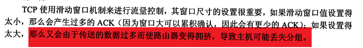

## 1.1

```
B
A
D
C
D
C
A
A
A
B
D
A	局域网和广域网通过路由器连接
C	计算机网络拓扑结构取决于其通信子网
C	广域网的拓扑结构：网状
A
D	广播式网络不存在路由选择问题，可以不要网络层，但是需要服务访问点（数据链路层使用物理层服务必须通过服务访问点实现）
B
B ARPAnet最早
```


* 局域网和广域网覆盖范围不同，协议和网络技术也不同
* Some broadcast systems also support transmission to a subset of the machines, which known as multicasting

## 1.2

```
b	网络分层不包括定义功能执行的具体方法
D	分成数据块传输优点：减少延迟时间，提高错误控制效率，多应用公平共享介质
D
A
C
A
A	
D
a
c
c
B	会话层主要会话管理和同步，会话层使用校验点可使通信会话在通信失效时从校验点恢复通信
B	
B
BDCAB	数据链路层，网络层，传输层提供流量控制；传输层建立维护拆除端到端连接；传输层提供主机进程间通信；数据链路层为网络层实体提供数据发送和接受功能
BCDCA	
A	因特网核心技术为TCPIP
C
A
B
C
A
B
C
C	集线器属于物理层


```


* 典型的数据链路层协议有SDLC、HDLC、PPP、 STP 和帧中继等。
* 只有传输层及以上的层为端到端通信


## 2.2


### 3.5


### 3.7


* 交换机转发时确认转发表；表中没有的表项需要广播
* 

### 4.

ARP 广播 ARP响应单播


* 是否属于同一子网
* 子网最大主机数 最小主机数
* MAC地址是哪个
* 子网数和主机数的协调
* 冲突域和广播域


* 主要是D类地址最高位置0，所以从D->7


### 传输层





* FIN表示单方面释放连接

* 连续收到三个冗余ACK说明是Reno算法


* ==建立连接==seq=x，fin时为y，传输字节数y-x（x不是数据的首字节，首字节是x+1）
