[TOC]

# 画图大头

## UML用例图(use-case)

* 考的好像比较少？
* 实际上就是把用户使用软件某场景下的各种行为进行一个列出？
* 火柴人扮演角色（房主和管理员是不同角色，但可以是同一个自然人），方形场景，椭圆用例，方形参与设备。

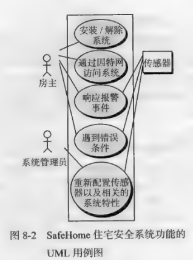

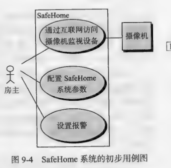

* 07-08年也只要要求列出场景下的用例？没要画图

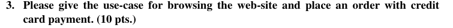

## 类图（class diagram）CRC 模型

* 参与者和系统交互时的一组操作对象。
* 其实就是假想自己构建面向对象程序的工程设计这些类。一些行为应该合理即可
* 箭头（从属？构建？放置？）和无箭头实线（仅关联？）

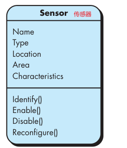

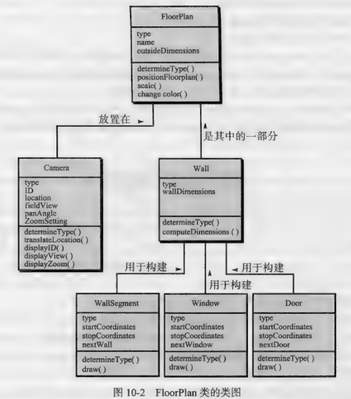

* 类应该不会单独考，而是直接让你画CRC（Class-Responsibility-Collaborator，CRC)） card ，构建类就是中间步骤了

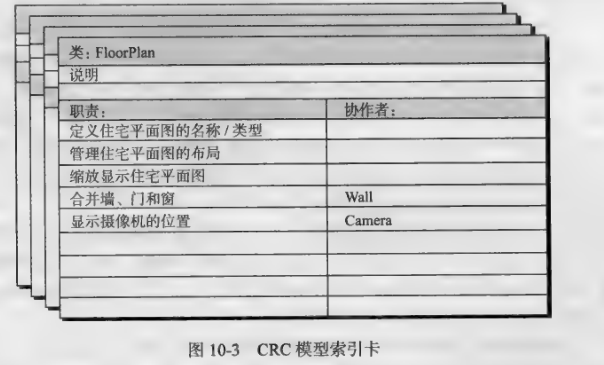

* 组内工程样例

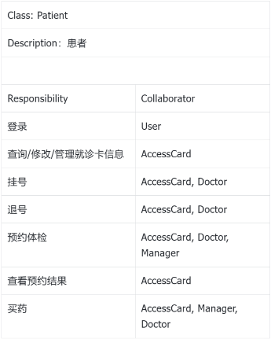

## 状态图（state diagram）顺序图（Sequence diagram）

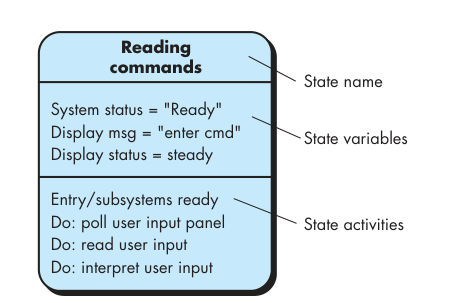

*  UML 状态 图  就 是 一 种 行为 模型 ， 该 图 为 每 个 类 呈现 了 主动 状态 和导致 这 些 主动 状态 发 生变 化 的 事件 (触发器 )
* 感觉和流程图是差不多的？只是没有形状区分，都是行为？

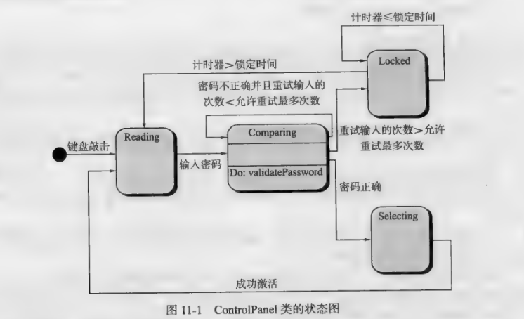

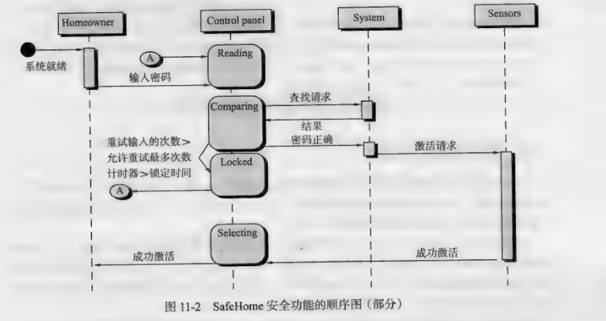

## UML活动图，泳道图（activity， swimlane）

* 根据已有资料貌似没考过
* 前后两种圆形代表开始结束；圆矩形代表行为；菱形表示分支

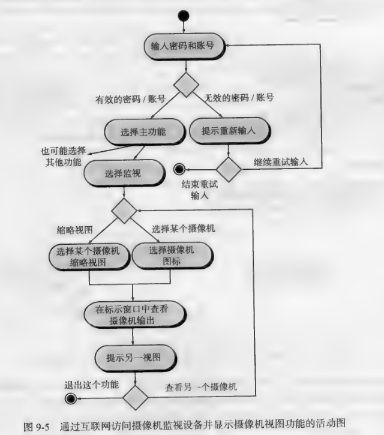

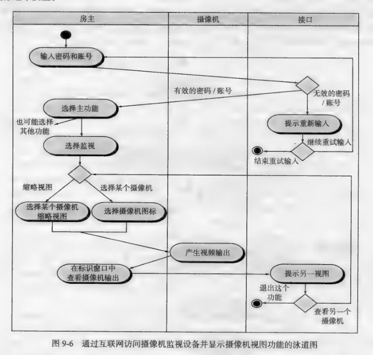

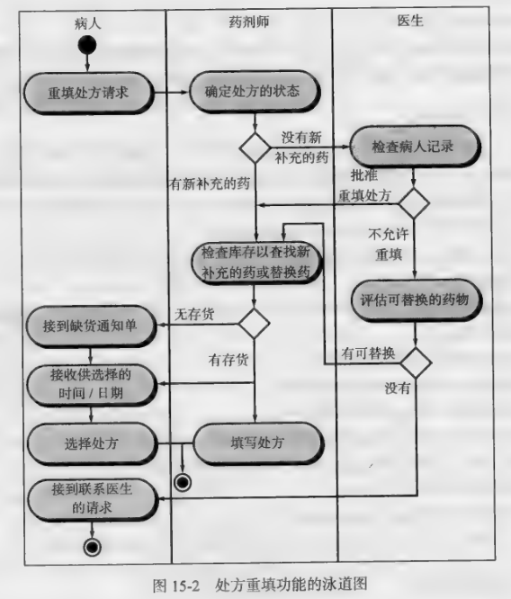

* 也可以使用代码表示场景？

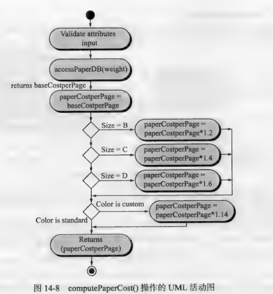

##  导航 语义 单元 (Navigation Semantic Unit，NSU) CRC

* 07-08 年，根据用例画出NSU？

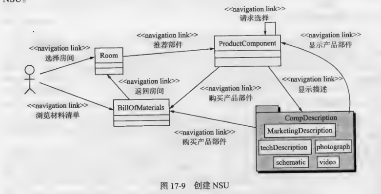

## 数据流图（data-flow）

* 书上没有啊……
* 自己看吧[1. 结构化——数据流图 - 知乎 (zhihu.com)](https://zhuanlan.zhihu.com/p/149291955)

* 其实还是系统行为那一套，只是聚焦在数据的流动上了?
* 标明数据源和流出，中间经过系统模块的操作。

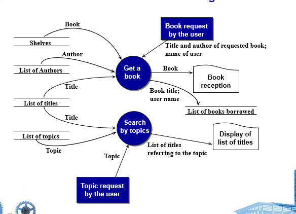

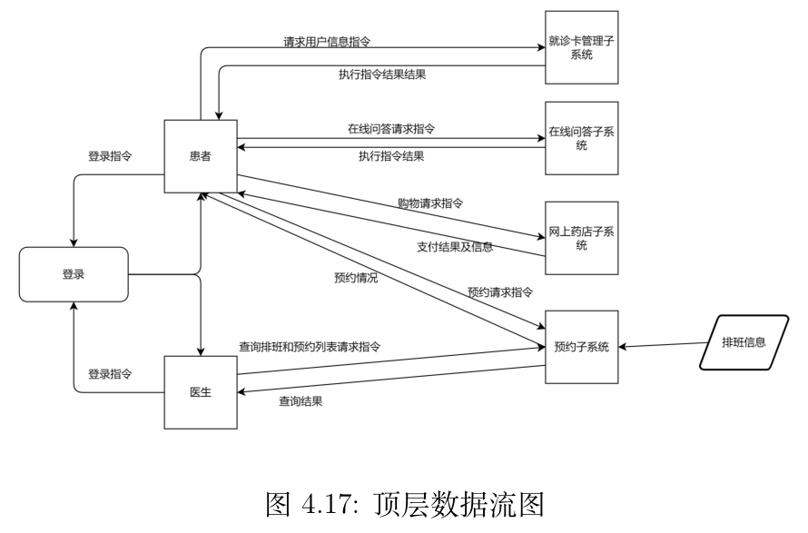

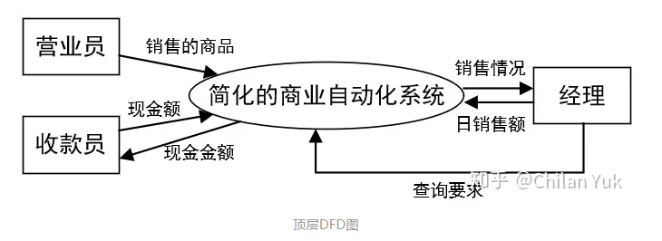

## 关系图（relationship）

* 0405，  06-07 年真题，根据CRC card 绘制对象的关系图
* 没找到确切对应的概念，不过猜测其实和数据库的ER图类似，就是将系统中各个类之间的包含，构建，管理关系列出？

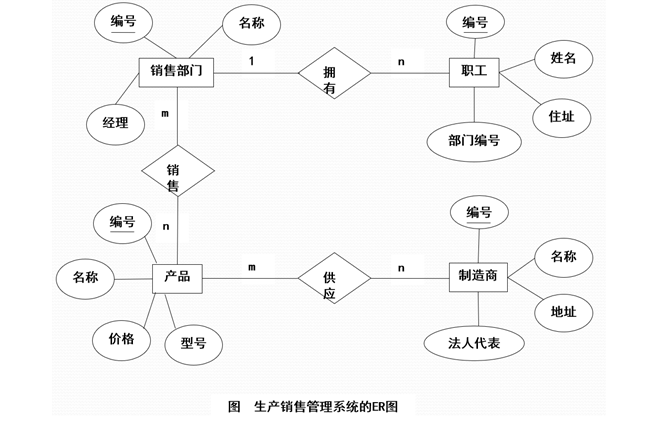

## 系统体系结构图（architecture）

* 四种结构
* 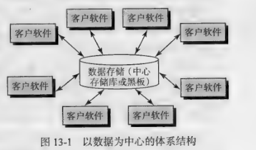
* 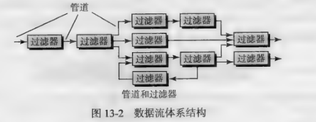
* 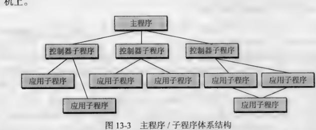
* 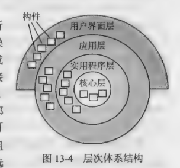

## 构件图（component）

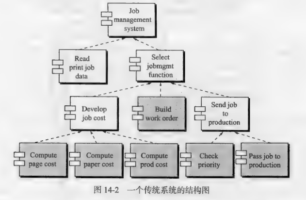

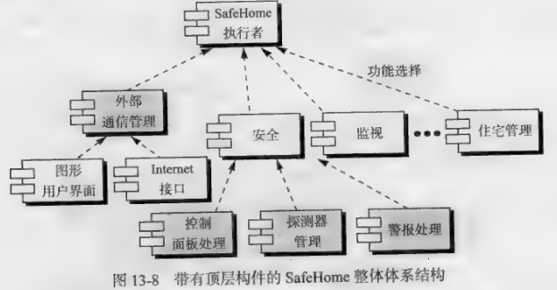

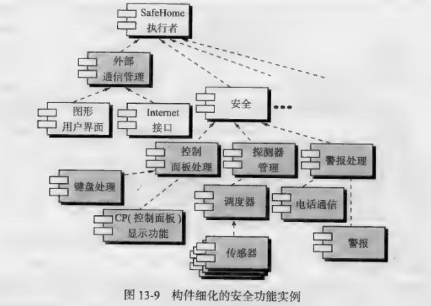
