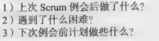

## Ch3 软件过程框架

* 过程流

* )， 沟 通 活动 可 能 会 包含 6 个 不同 的 动作 (具体 参见 第 8 章 ): 起 始 、 需求 获取 、 需求 细 化 、 协商 、 规 格 说明和 确认 。

* 过程评估标准

  * 用 于 过 程 改 进 的 CMMIS标 准 评估方法( Standard CMMI Assessment Method for Process Improvement, SCAMPI

  *  于 组 织 内 部 过 程 改进 的 CMM 评估 (CMM-Based Appraisal for Internal Process Improvement，CBA IPD 

  * SPICE (ISOJIEC 15504)
  * 软件ISO 9001:2000 

## 过程模型

### 惯用过程模型

* 瀑布模型:瀑布 模型 (waterfall model) 又 称 为 经 典 生命 周期 ( classic life cycle)，
  * 生 在 需要 对 一 个 已 经 存在 的 系统进行 明确 定义 的 适应 性 调整 或 是 增强 的 时 候
  * 需求 必须 是 准确 定义 和 相对 稳定 的 

* 瀑布模型的变体:V 模型

* 增量过程模型:A good approach when a working core product is required quickly.  

* 演化过程模型:

  * Are iterative in nature.  
     B. Can easily accommodate product requirements changes.  
     C. Do not generally produce throwaway systems.  

  * 原型开发模型: A useful approach when a customer cannot define requirements clearly. 
  * 客 户 定 义 了 软件 的 一 些 基本 任务 ， 但 是 没有 详
    细 定 义 功能 和 特性 需求 。 另 一 种 情况 下 ， 开 发 人
    员 可 能 对 算法 的 效率 、 操
    作 系 统 的 适用 性 和 人 机 交互 的 形式 等 情况 并 没有 把 握 。
  * 螺旋模型:结合 了 原型 的 迭代 性 质和 瀑布 模型 的可 控 性 和 系统 性 特点，它 具有 快速 开发 越 来 越 完善 的 软件 版 本 的 潜力 ; Includes project risks evaluation during each iteration.  

* 并发模型：并发工程； 发 建 模 定义 了 一 系列 事件 ，这 些 事件 将 触发 软件 工程 活动 、动 作 或者 任务 的 状态 转换 。

### 专用过程模型

* 基于构件的开发
  * 基于 构件 的 开发 模型 (component-based development model) 具有 许多 螺 pp旋 模 型的 特点 。 它 本 质上 是 演化 模型 ，需 要 以 迭代 方式 构建 软件 。不 同 之 处 在 于 ， 基 于 构件 的 开发 模型 采用 预先 打包 的 软件 构件 来 开发 应 用系统 。

* 形式化方法模型formal methods model 
  * A. Define the specification for computer-based systems.  
     B. Develop defect free computer-based systems.  
     C. Verify the correctness of computer-based systems.  
* 面向方面的软件开发
* 

### 统一过程

* 起 始阶段 (inception phase) 
* Elaboration phase     细化阶段 
* Construction phase     构建阶段 
* Transition phase 转化阶段 
* Production phase 生产阶段 

### 个人软件过程（PSP）

### 团队软件过程(TSP)

TSP 定义 了 以 下 框架 活动 : 项 目 启 动 、 高 层 设计 、 实 现 、 集 成 和 测试 以 及 后 

## 敏捷开发

* 敏 捷团 队 是 能 够适当 响应 变更 的 灵活 团队 

### 极限编程  Extreme Programming (XP)

planning, design, coding, testing 

  ### 工业极限编程

 由 XP 的 最 低 限 要 求 、 以 客户 为 中 心 和 测试 驱动 精神 组 成 

### Scrum game

过 程 由 “需求 、 分析 、 设计 、 演化 和 交付 ”等 框架 性 活动组 成

### 动态 系统 开发 方法 ( Dynamic System Development Method, DSDM) 

### 敏捷模型

作为 首选 的 方法 来 表示 分 析 和设计 模型 。 

## 测试策略

* 传统软件 ： 集成测试；单元测试
* 面向对象：同上；（集成测试： 基于线程的测试，基于使用的测试；）
* Web： 内容，数据库，用户接口，可用性，构件级测试，导航栏测试，配置测试，安全测试，性能测试
* 移动：确认测试；系统测试；恢复测试；安全测试；压力测试；性能测试；部署测试
* 

### 白盒测试

* 基本路径测试
  * 环复杂性计算

### 黑盒测试

* 基于图的测试
* 等价类划分
* 边界值分析
* 正交数组测试
* 

### 实时系统测试

## RMMM

对 于 风险 管理 ， 更 好 的 是 主动 风险 策略 。 主 动 ( proactive) 风险 策略 早 在 技术 工作 开始之 前 就 已 经 启动 了。 识 别 出 潜 在 的 风险 ， 评 估 它 们 发 生 的 概率 及 产生 的 影响 ，并 按 其 重要 性进行 排序

项目风险，技术风险，商业风险

风险 管理 策略 可 以 包含在 软件 项 目 计划 中 ， 也 可 以 将 风险 管理 步骤 组 织 成 一 个 独立 的 风险 缓 解 、 监 测 和 管理计划 

