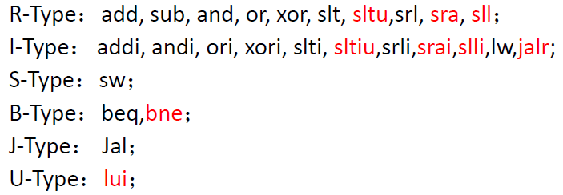

## 计组LAB4-3指令拓展

马德拓展

刘：

R:无额外

I: load系列 **lb,lh,lbu,lhu**

S:**sb,sh,**

B:**blt,bge,bltu,bgeu**

U:**auipc**

ecall

1. 对于R型：**alu新增sltu，sra，sll运算，赋8，9，10；operator 扩展为四位**；     

   >  cpu_ctrl更改信号

2. 立即数计算：**与R型同**，                 

   > cpu_ctrl信号更改

3. load：**新增load_control模块（截取funct3信号），对data_in进行处理再输入datapath**。(cput修改)

>cpu_ctrl信号

1. 对于s指令 ： 新增b,h,w的判断信号（funct3）用于判断写入位数,  原ram_we符号扩展再与最终位数相与（0即不写入，1即写入对应位），拉出到top进行判断？

>

1. jarl:**扩展jump信号，alu结果（rs1+imm）作为pc一个来源**（jump_mux信号源）

>

1. branch信号：**拓展branch至六位**，利用剩余的alu位 （定制运算）？  或者    **slt和sltu**（两个结果为1，另两个使用非）?            aluop使用funct3区分

>

1. U型：**立即数与pc+imm新增mux用于输入memtoreg四选一判断**？（利用opcode[5]）**立即数产生信号扩展，产生类型拓展**

>

> 新增模块的opcode,增加控制信号
>
> 01100  11  R      	1
>
> 00100  11  I 			1  addi
>
> 00000  11  I			1  lw
>
> 01000  11  S			1  sw
>
> 11000  11  B			1 
>
> 11011  11  jal			1
>
> 11001  11  jalr	i型   		
>
> 01101  11  lui		u型 
>
> 00101  11  auipc	u型  

1. 信号位数（branch与）
2. 信号修改的正与非
3. 

